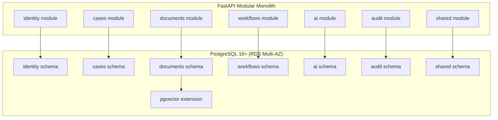
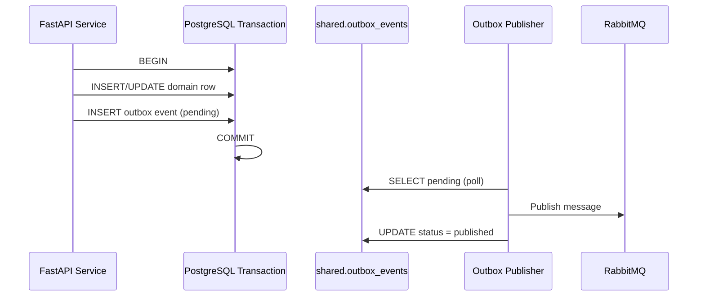
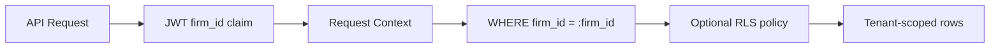

# Database Layer — Documentation Index

**LexFlow AI** — PostgreSQL Schema & Data Operations  
**Version:** 1.0  
**Status:** Draft — Pre-Implementation  
**Last Updated:** 2026-07-06

---

## Purpose

This directory is the **authoritative database reference** for LexFlow AI. It defines PostgreSQL 16+ schema design, indexing strategy, migration conventions, retention policies, and operational procedures for engineers, DBAs, architects, and SRE teams.

PostgreSQL is the **single system of record** for all domain data, audit logs, workflow execution state, and vector embeddings. See [ADR-003](../13-decisions/003-postgresql-single-database.md).

---

## Scope

| In Scope | Out of Scope |
|----------|--------------|
| Schema-per-bounded-context design (`identity`, `cases`, `documents`, `workflows`, `ai`, `audit`, `shared`) | Application ORM model definitions |
| Table-level column contracts and relationships | Terraform RDS module internals |
| Indexing, partitioning, and pgvector strategy | S3 object key naming conventions |
| Alembic migration conventions | Redis cache key design |
| Retention, backup, and PITR alignment | Penetration testing procedures |

---

## Responsibilities

| Audience | Use This Directory To |
|----------|----------------------|
| **Backend engineers** | Implement repositories with correct schema, indexes, and concurrency patterns |
| **DBAs / SRE** | Plan capacity, backups, partition maintenance, and DR procedures |
| **Architects** | Validate bounded-context data ownership and extraction readiness |
| **Security / compliance** | Trace audit immutability, retention, and tenant isolation |
| **AI engineers** | Understand embedding storage, prompt history partitioning, and usage tracking |

---

## Architecture

LexFlow AI uses a **single PostgreSQL database** with **schema separation per bounded context**. Cross-context writes go through application services; cross-schema reads are permitted for reporting and denormalized projections only.

### Design Principles

| Principle | Implementation |
|-----------|----------------|
| UUID primary keys | `gen_random_uuid()` — no sequential IDs in APIs |
| Soft delete | `deleted_at TIMESTAMPTZ` on user-facing entities |
| Optimistic concurrency | `version INTEGER NOT NULL DEFAULT 1` on mutable aggregates |
| Tenant isolation | `firm_id UUID NOT NULL` on all tenant-scoped tables |
| Audit immutability | `audit.audit_logs` — append-only for application roles |
| Event reliability | Transactional outbox in `shared.outbox_events` ([ADR-006](../13-decisions/006-transactional-outbox.md)) |
| Timestamps | `created_at`, `updated_at` (UTC) on all mutable tables |

---

## Flow Diagrams

### Write Path with Outbox

### Tenant Isolation Query Pattern

Every tenant-scoped query **must** include `firm_id` from the authenticated session. Application-level enforcement is mandatory; Row-Level Security (RLS) is a defense-in-depth layer planned for Phase 2.

---

## Document Map

| Document | Description |
|----------|-------------|
| [schema-overview.md](./schema-overview.md) | Cross-schema ER diagram, context map, shared conventions |
| [identity-schema.md](./identity-schema.md) | Firms, users, roles, permissions, refresh tokens |
| [cases-schema.md](./cases-schema.md) | Clients, cases, participants, tasks, deadlines, hearings, notes, timeline |
| [documents-schema.md](./documents-schema.md) | Documents, versions, pgvector embeddings |
| [workflows-schema.md](./workflows-schema.md) | Workflow definitions, executions, steps |
| [ai-schema.md](./ai-schema.md) | Summaries, prompt history, templates, LLM usage |
| [audit-schema.md](./audit-schema.md) | Audit logs, approvals, outbox events |
| [indexing-strategy.md](./indexing-strategy.md) | Composite indexes, HNSW, full-text search |
| [migrations.md](./migrations.md) | Alembic conventions and review process |
| [retention-backup.md](./retention-backup.md) | Retention policies, RDS backup, PITR |

---

## Best Practices

1. **Schema ownership** — Each bounded context owns writes to its schema. Never write across schemas from a single repository without an explicit integration pattern.
2. **Always filter by `firm_id`** — Every tenant-scoped SELECT, UPDATE, and DELETE must include the authenticated firm's ID.
3. **Use optimistic locking** — Increment `version` on every UPDATE; reject stale writes with HTTP 409.
4. **Prefer soft delete** — Set `deleted_at` for user-facing entities; hard delete only via GDPR erasure jobs.
5. **Index concurrently in production** — Use `CREATE INDEX CONCURRENTLY` for large tables; see [indexing-strategy.md](./indexing-strategy.md).
6. **Partition high-volume tables** — `ai.prompt_history` and `audit.audit_logs` use monthly range partitions.
7. **Never store secrets in the database** — Password hashes and token hashes only; API keys live in Secrets Manager.

---

## Tradeoffs

| Decision | Benefit | Cost |
|----------|---------|------|
| Single database vs. database-per-context | ACID transactions, simpler ops, one backup | Must discipline cross-schema access |
| Schema separation vs. single `public` schema | Clear ownership, extraction-ready | Explicit schema prefixes in SQL |
| Soft delete vs. hard delete | Recoverability, audit continuity | Queries must filter `deleted_at IS NULL` |
| Denormalized `firm_id` on documents | Faster firm-wide queries without joins | Must keep in sync on case moves |
| Monthly partitions on audit/AI tables | Fast retention drops, query pruning | Partition maintenance overhead |
| pgvector HNSW vs. IVFFlat | Better recall at query time | Slower index builds, more memory |

---

## Future Improvements

| Phase | Improvement |
|-------|-------------|
| Phase 2 | PostgreSQL Row-Level Security (RLS) policies per schema |
| Phase 2 | Read replica routing for reporting and search workloads |
| Phase 3 | Table-level encryption (TDE) evaluation for `tax_id_encrypted` columns |
| Phase 3 | Citus or logical replication for multi-region read scaling |
| Phase 4 | Schema extraction to separate databases during service decomposition |

---

## References

### Domain & Architecture

- [02-domain/](../02-domain/README.md) — Bounded contexts, aggregates, domain events
- [03-architecture/](../03-architecture/README.md) — C4 views, data flows, event-driven design
- [database-architecture.md](../database-architecture.md) — Executive summary (superseded by this directory for detail)

### ADRs

- [ADR-003: Single PostgreSQL with Schema Separation](../13-decisions/003-postgresql-single-database.md)
- [ADR-006: Transactional Outbox](../13-decisions/006-transactional-outbox.md)

### Operations

- [09-deployment/disaster-recovery.md](../09-deployment/disaster-recovery.md) — HA, backup, failover, RPO/RTO
- [compliance-data-governance.md](../compliance-data-governance.md) — GDPR/CCPA erasure procedures

### External

- [PostgreSQL 16 Documentation](https://www.postgresql.org/docs/16/)
- [pgvector Documentation](https://github.com/pgvector/pgvector)
- [Alembic Documentation](https://alembic.sqlalchemy.org/)
