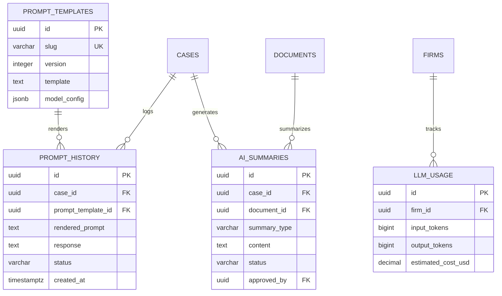
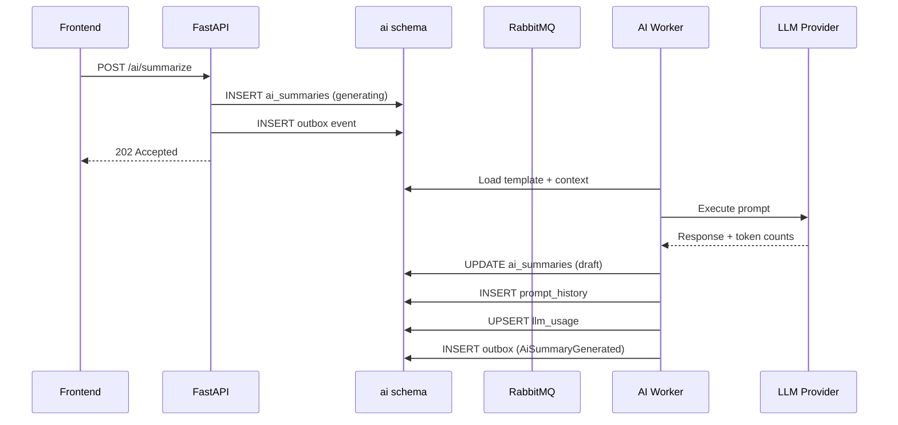
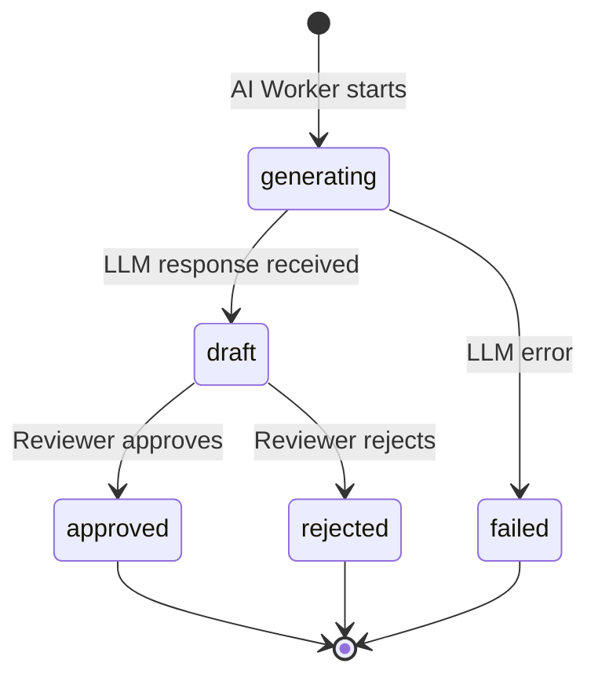

# AI Schema

**LexFlow AI** — `ai` Schema Reference  
**Version:** 1.0  
**Status:** Draft — Pre-Implementation  
**Last Updated:** 2026-07-06

---

## Purpose

The `ai` schema stores **AI-generated content, prompt execution history, prompt templates, and LLM usage metrics** for LexFlow AI. All AI operations run asynchronously via workers ([ADR-004](../13-decisions/004-async-ai-processing.md)); this schema persists results and audit trails.

This schema is owned by the **AI Services** bounded context. See [02-domain/ai-aggregate.md](../02-domain/ai-aggregate.md) and [ai-architecture.md](../ai-architecture.md).

---

## Scope

| In Scope | Out of Scope |
|----------|--------------|
| AI summaries with approval workflow | LLM provider API integration code |
| Prompt template registry | Prompt engineering playground UI |
| Prompt execution history (partitioned) | Real-time streaming responses |
| LLM usage aggregation for cost/compliance | Embedding storage (see `documents` schema) |

---

## Responsibilities

| Table | Responsibility |
|-------|----------------|
| `ai_summaries` | Generated summaries with human-in-the-loop approval |
| `prompt_history` | Full prompt/response log for audit and debugging |
| `prompt_templates` | Versioned Jinja2 templates with model config |
| `llm_usage` | Aggregated token usage and cost tracking |

---

## Architecture

### Entity-Relationship Diagram



### Async AI Processing Flow



---

## Tables

### `ai.ai_summaries`

AI-generated summaries with human-in-the-loop approval gate.

| Column | Type | Constraints | Notes |
|--------|------|-------------|-------|
| `id` | UUID | PK | |
| `case_id` | UUID | NOT NULL, FK → cases.cases | |
| `document_id` | UUID | NULL, FK → documents.documents | NULL for case-level summaries |
| `firm_id` | UUID | NOT NULL, FK → identity.firms | Denormalized |
| `summary_type` | ai.summary_type | NOT NULL | ENUM: case_overview, document_summary, deposition_summary, contract_review |
| `content` | TEXT | NULL | Generated summary (NULL while generating) |
| `model` | VARCHAR(100) | NOT NULL | Model used |
| `prompt_version` | VARCHAR(50) | NOT NULL | Template version identifier |
| `status` | ai.summary_status | NOT NULL DEFAULT 'generating' | ENUM: generating, draft, approved, rejected |
| `approved_by` | UUID | NULL, FK → identity.users | Human reviewer |
| `approved_at` | TIMESTAMPTZ | NULL | |
| `rejection_reason` | TEXT | NULL | |
| `token_count` | INTEGER | NULL | Total tokens consumed |
| `requested_by` | UUID | NOT NULL, FK → identity.users | |
| `created_at` | TIMESTAMPTZ | NOT NULL DEFAULT now() | |
| `updated_at` | TIMESTAMPTZ | NOT NULL DEFAULT now() | |

**Indexes:**
- `(case_id, summary_type, created_at DESC)` — case AI history
- `(document_id) WHERE document_id IS NOT NULL` — document summaries
- `(status) WHERE status IN ('generating', 'draft')` — pending approval queue

---

### `ai.prompt_history`

Full prompt and response log. **Range-partitioned by `created_at` (monthly)** due to high write volume.

| Column | Type | Constraints | Notes |
|--------|------|-------------|-------|
| `id` | UUID | NOT NULL | Part of composite PK with created_at |
| `case_id` | UUID | NULL, FK → cases.cases | |
| `firm_id` | UUID | NOT NULL, FK → identity.firms | |
| `user_id` | UUID | NOT NULL, FK → identity.users | |
| `prompt_template_id` | UUID | NULL, FK → prompt_templates | |
| `rendered_prompt` | TEXT | NOT NULL | PII-redacted copy |
| `response` | TEXT | NULL | LLM response (NULL on error) |
| `model` | VARCHAR(100) | NOT NULL | |
| `provider` | ai.llm_provider | NOT NULL | ENUM: openai, azure_openai, anthropic, ollama |
| `input_tokens` | INTEGER | NOT NULL DEFAULT 0 | |
| `output_tokens` | INTEGER | NOT NULL DEFAULT 0 | |
| `latency_ms` | INTEGER | NULL | End-to-end latency |
| `status` | ai.prompt_status | NOT NULL | ENUM: success, error, filtered |
| `error_message` | TEXT | NULL | |
| `correlation_id` | UUID | NOT NULL | Tracing |
| `created_at` | TIMESTAMPTZ | NOT NULL DEFAULT now() | Partition key |

**Primary key:** `(id, created_at)` — required for partitioned tables

**Partition setup:**

```sql
CREATE TABLE ai.prompt_history (
    -- columns as above
) PARTITION BY RANGE (created_at);

CREATE TABLE ai.prompt_history_2026_07
    PARTITION OF ai.prompt_history
    FOR VALUES FROM ('2026-07-01') TO ('2026-08-01');
```

**Indexes (per partition):**
- `(case_id, created_at DESC)` — case prompt history
- `(user_id, created_at DESC)` — user activity
- `(correlation_id)` — tracing lookup

---

### `ai.prompt_templates`

Versioned Jinja2 prompt templates with model configuration.

| Column | Type | Constraints | Notes |
|--------|------|-------------|-------|
| `id` | UUID | PK | |
| `name` | VARCHAR(255) | NOT NULL | Display name |
| `slug` | VARCHAR(100) | NOT NULL | Unique identifier |
| `version` | INTEGER | NOT NULL DEFAULT 1 | Template version |
| `template` | TEXT | NOT NULL | Jinja2 template body |
| `model_config` | JSONB | NOT NULL DEFAULT '{}' | temperature, max_tokens, top_p, etc. |
| `requires_approval` | BOOLEAN | NOT NULL DEFAULT true | Human review before surfacing |
| `is_active` | BOOLEAN | NOT NULL DEFAULT true | |
| `description` | TEXT | NULL | |
| `created_by` | UUID | NULL, FK → identity.users | |
| `created_at` | TIMESTAMPTZ | NOT NULL DEFAULT now() | |
| `updated_at` | TIMESTAMPTZ | NOT NULL DEFAULT now() | |

**Unique:** `(slug, version)`

**Indexes:**
- `(slug) WHERE is_active = true` — active template lookup

Example `model_config`:

```json
{
  "provider": "azure_openai",
  "model": "gpt-4o",
  "temperature": 0.3,
  "max_tokens": 4096,
  "system_prompt": "You are a legal research assistant..."
}
```

---

### `ai.llm_usage`

Aggregated token usage and cost tracking for compliance reporting and billing.

| Column | Type | Constraints | Notes |
|--------|------|-------------|-------|
| `id` | UUID | PK | |
| `firm_id` | UUID | NOT NULL, FK → identity.firms | |
| `user_id` | UUID | NULL, FK → identity.users | NULL for system-initiated |
| `case_id` | UUID | NULL, FK → cases.cases | |
| `provider` | VARCHAR(50) | NOT NULL | |
| `model` | VARCHAR(100) | NOT NULL | |
| `input_tokens` | BIGINT | NOT NULL DEFAULT 0 | |
| `output_tokens` | BIGINT | NOT NULL DEFAULT 0 | |
| `estimated_cost_usd` | DECIMAL(10,6) | NOT NULL DEFAULT 0 | |
| `period_start` | DATE | NOT NULL | Aggregation period (daily) |
| `created_at` | TIMESTAMPTZ | NOT NULL DEFAULT now() | |
| `updated_at` | TIMESTAMPTZ | NOT NULL DEFAULT now() | |

**Unique:** `(firm_id, user_id, case_id, provider, model, period_start)` — daily rollup

**Indexes:**
- `(firm_id, period_start DESC)` — firm cost dashboard
- `(case_id, period_start DESC) WHERE case_id IS NOT NULL` — case cost attribution

---

## Approval Workflow

Summaries with `requires_approval = true` on the template follow a human-in-the-loop gate.



Approved summaries emit `AiSummaryApproved` domain event → timeline projection + optional notification.

---

## PII Handling in Prompt History

| Data | Storage Policy |
|------|----------------|
| Client names | Redacted in `rendered_prompt` — replaced with `[CLIENT]` |
| SSN / tax IDs | Never included in prompts |
| Case numbers | Retained (needed for audit context) |
| Document content | Truncated to first 500 chars in history; full text in S3 |
| LLM responses | Stored in full (may contain generated content referencing case) |

Redaction occurs in the AI worker before INSERT into `prompt_history`.

---

## Best Practices

1. **All AI calls via async worker** — Never call LLM providers synchronously from API handlers ([ADR-004](../13-decisions/004-async-ai-processing.md)).
2. **Version prompt templates** — Never overwrite; create new version row and deactivate old.
3. **Redact PII before prompt_history INSERT** — Application-layer redaction, not database triggers.
4. **Aggregate llm_usage daily** — UPSERT on `(firm_id, user_id, case_id, provider, model, period_start)`.
5. **Partition prompt_history monthly** — Automate partition creation 3 months ahead; drop after 3-year retention.
6. **Require approval for client-facing summaries** — Template flag `requires_approval = true` for external use.

---

## Tradeoffs

| Decision | Benefit | Cost |
|----------|---------|------|
| Async-only AI processing | No API timeout risk; rate limit buffering | User waits for 202 + poll/webhook |
| Monthly partitions on prompt_history | Fast retention drops; query pruning | Partition maintenance automation needed |
| PII-redacted prompt storage | Compliance-friendly audit trail | Cannot replay exact prompt for debugging |
| Daily llm_usage aggregation | Compact cost reporting | Loses per-request granularity (see prompt_history for detail) |
| Template versioning (slug + version) | Safe rollback and A/B testing | Multiple rows per logical template |
| Human approval gate | Legal defensibility | Latency before summary is usable |

---

## Future Improvements

| Phase | Item |
|-------|------|
| Phase 2 | Prompt A/B testing framework (split traffic by template version) |
| Phase 2 | Automatic cost alerts when firm exceeds monthly LLM budget |
| Phase 3 | Fine-tuned model registry and per-firm model selection |
| Phase 3 | Prompt injection detection and filtering (status = 'filtered') |
| Phase 4 | Federated learning opt-in for anonymized prompt analytics |

---

## References

- [02-domain/ai-aggregate.md](../02-domain/ai-aggregate.md)
- [04-api/endpoints-ai.md](../04-api/endpoints-ai.md)
- [ai-architecture.md](../ai-architecture.md)
- [ADR-004: Async AI Processing](../13-decisions/004-async-ai-processing.md)
- [retention-backup.md](./retention-backup.md)
- [schema-overview.md](./schema-overview.md)
