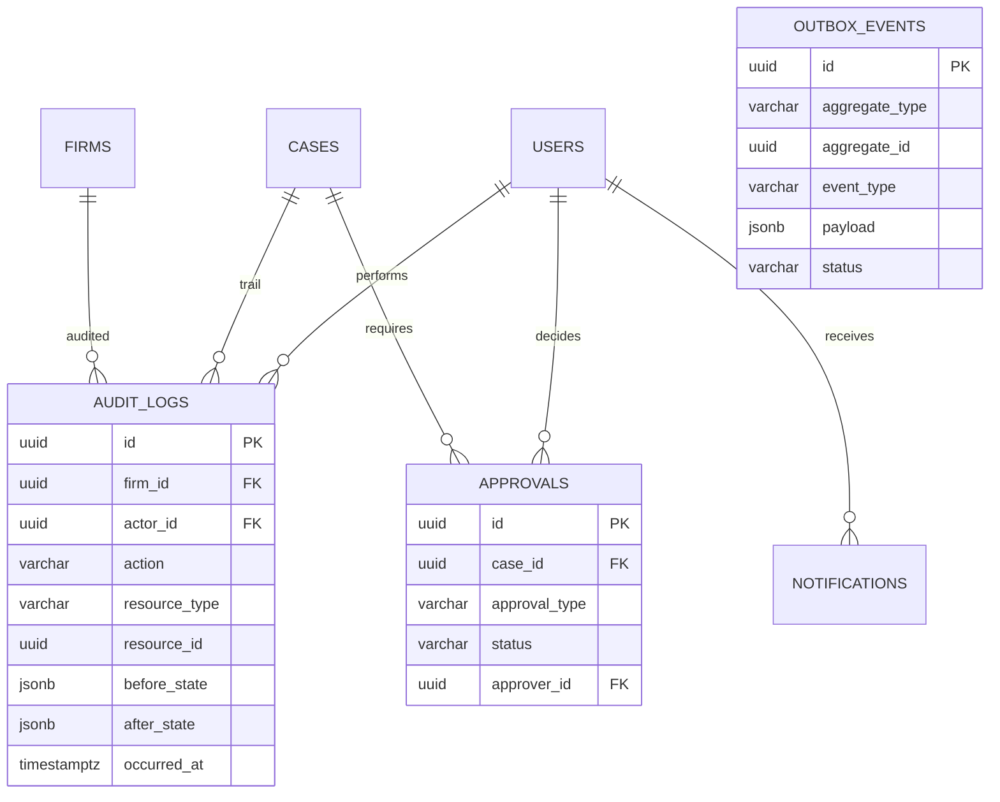
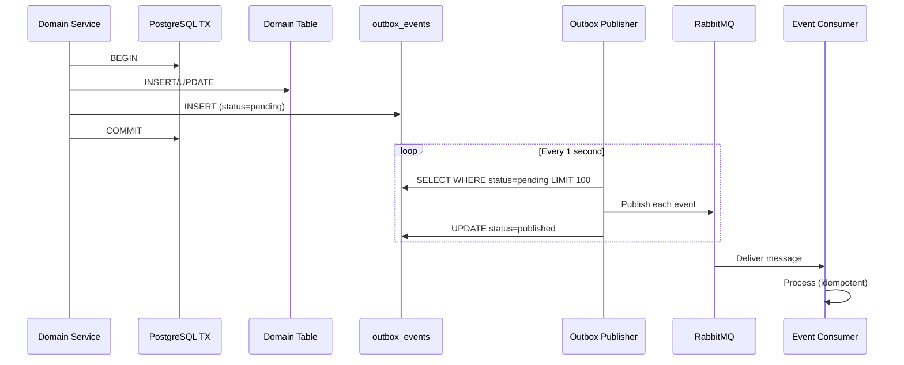
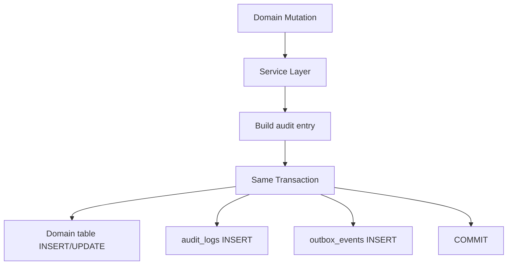
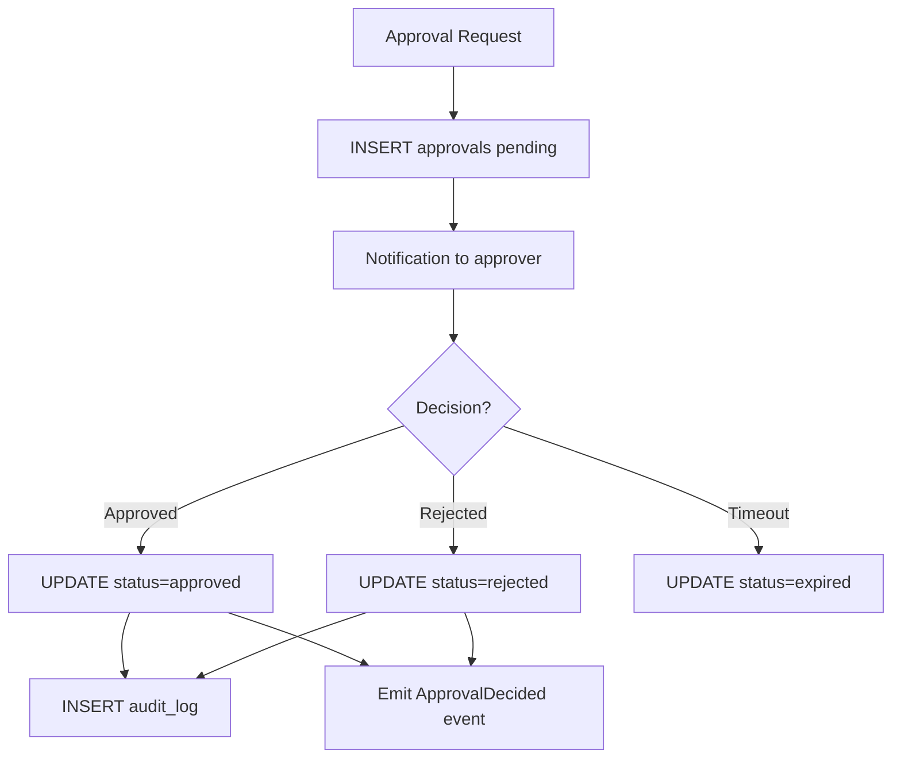

# Audit Schema

**LexFlow AI** — `audit` & `shared` Schema Reference  
**Version:** 1.0  
**Status:** Draft — Pre-Implementation  
**Last Updated:** 2026-07-06

---

## Purpose

The `audit` schema stores **immutable audit logs and approval records** for compliance and legal defensibility. The `shared` schema holds **platform infrastructure tables** — transactional outbox events, notifications, and HTTP idempotency keys.

Together these schemas provide the compliance backbone and reliable event delivery for LexFlow AI. See [compliance-data-governance.md](../compliance-data-governance.md) and [ADR-006](../13-decisions/006-transactional-outbox.md).

---

## Scope

| In Scope | Out of Scope |
|----------|--------------|
| `audit.audit_logs` — append-only activity log | SIEM integration configuration |
| `audit.approvals` — human-in-the-loop decisions | Email delivery implementation |
| `shared.outbox_events` — transactional outbox | RabbitMQ broker configuration |
| `shared.notifications` — user notification queue | Push notification services |
| `shared.idempotency_keys` — HTTP dedup cache | API gateway rate limiting |

---

## Responsibilities

| Table | Schema | Responsibility |
|-------|--------|----------------|
| `audit_logs` | audit | Immutable record of all significant actions |
| `approvals` | audit | Human approval decisions (AI, documents, workflows) |
| `outbox_events` | shared | Transactional outbox for reliable event publishing |
| `notifications` | shared | User notification delivery queue |
| `idempotency_keys` | shared | HTTP request deduplication (24h TTL) |

---

## Architecture

### Entity-Relationship Diagram



### Transactional Outbox Pattern



---

## Tables — `audit` Schema

### `audit.audit_logs`

Append-only audit trail. Application DB role has **INSERT only** — no UPDATE or DELETE permissions.

| Column | Type | Constraints | Notes |
|--------|------|-------------|-------|
| `id` | UUID | NOT NULL | Part of composite PK with occurred_at |
| `firm_id` | UUID | NOT NULL, FK → identity.firms | |
| `actor_id` | UUID | NULL, FK → identity.users | NULL for system actions |
| `actor_type` | audit.actor_type | NOT NULL | ENUM: user, system, worker, n8n |
| `action` | VARCHAR(100) | NOT NULL | case.created, document.viewed, etc. |
| `resource_type` | VARCHAR(100) | NOT NULL | case, document, user, workflow |
| `resource_id` | UUID | NOT NULL | |
| `case_id` | UUID | NULL, FK → cases.cases | Denormalized for case audit trail |
| `ip_address` | INET | NULL | |
| `user_agent` | TEXT | NULL | |
| `before_state` | JSONB | NULL | State before change |
| `after_state` | JSONB | NULL | State after change |
| `metadata` | JSONB | NOT NULL DEFAULT '{}' | correlation_id, request_id |
| `occurred_at` | TIMESTAMPTZ | NOT NULL DEFAULT now() | Partition key |

**Primary key:** `(id, occurred_at)`

**Partitioning:** Range by `occurred_at` (monthly). Retain 7 years minimum per legal compliance default.

```sql
CREATE TABLE audit.audit_logs (
    -- columns as above
) PARTITION BY RANGE (occurred_at);
```

**Indexes (per partition):**
- `(case_id, occurred_at DESC)` — case audit trail
- `(firm_id, occurred_at DESC)` — firm-wide audit
- `(actor_id, occurred_at DESC)` — user activity log
- `(resource_type, resource_id, occurred_at DESC)` — resource history
- `(action, occurred_at DESC)` — action-type filtering

**Standard actions:**

| action | resource_type | Trigger |
|--------|---------------|---------|
| `case.created` | case | Case activation |
| `case.status_changed` | case | Status transition |
| `document.uploaded` | document | Document ready |
| `document.viewed` | document | Document download/view |
| `document.deleted` | document | Soft delete |
| `user.login` | user | Successful authentication |
| `user.login_failed` | user | Failed authentication |
| `ai.summary.approved` | ai_summary | Approval decision |
| `workflow.executed` | workflow_execution | Workflow trigger |
| `approval.decided` | approval | Approval granted/rejected |

---

### `audit.approvals`

Human-in-the-loop approval decisions for AI summaries, document sends, workflows, and invoices.

| Column | Type | Constraints | Notes |
|--------|------|-------------|-------|
| `id` | UUID | PK | |
| `case_id` | UUID | NOT NULL, FK → cases.cases | |
| `firm_id` | UUID | NOT NULL, FK → identity.firms | Denormalized |
| `approval_type` | audit.approval_type | NOT NULL | ENUM: ai_summary, document_send, workflow, invoice, other |
| `reference_type` | VARCHAR(50) | NOT NULL | Polymorphic: ai_summary, document, etc. |
| `reference_id` | UUID | NOT NULL | Polymorphic FK |
| `requested_by` | UUID | NOT NULL, FK → identity.users | |
| `approver_id` | UUID | NULL, FK → identity.users | Assigned approver |
| `status` | audit.approval_status | NOT NULL DEFAULT 'pending' | ENUM: pending, approved, rejected, expired |
| `decision_note` | TEXT | NULL | Approver comment |
| `decided_at` | TIMESTAMPTZ | NULL | |
| `expires_at` | TIMESTAMPTZ | NULL | Auto-expire pending approvals |
| `created_at` | TIMESTAMPTZ | NOT NULL DEFAULT now() | |
| `updated_at` | TIMESTAMPTZ | NOT NULL DEFAULT now() | |

**Indexes:**
- `(case_id, status, created_at DESC)` — case approval queue
- `(approver_id, status) WHERE status = 'pending'` — my pending approvals
- `(reference_type, reference_id)` — lookup by referenced entity
- `(expires_at) WHERE status = 'pending' AND expires_at IS NOT NULL` — expiry job

---

## Tables — `shared` Schema

### `shared.outbox_events`

Transactional outbox for reliable domain event publishing. Written in the same transaction as domain changes.

| Column | Type | Constraints | Notes |
|--------|------|-------------|-------|
| `id` | UUID | PK | |
| `aggregate_type` | VARCHAR(100) | NOT NULL | case, document, workflow, ai_summary |
| `aggregate_id` | UUID | NOT NULL | |
| `event_type` | VARCHAR(100) | NOT NULL | CaseCreated, DocumentUploaded, etc. |
| `payload` | JSONB | NOT NULL | Event data |
| `status` | shared.outbox_status | NOT NULL DEFAULT 'pending' | ENUM: pending, published, failed |
| `retry_count` | INTEGER | NOT NULL DEFAULT 0 | |
| `error_message` | TEXT | NULL | Last publish failure |
| `created_at` | TIMESTAMPTZ | NOT NULL DEFAULT now() | |
| `published_at` | TIMESTAMPTZ | NULL | |

**Indexes:**
- `(status, created_at) WHERE status = 'pending'` — publisher poll
- `(aggregate_type, aggregate_id, created_at DESC)` — debug/event replay
- `(created_at) WHERE status = 'published'` — cleanup job (delete after 7 days)

**Publisher behavior:**
- Poll interval: 1 second
- Batch size: 100 events
- Failed events: retry up to 5 times, then status = 'failed' with alert
- Published events: deleted after 7 days by cleanup job

---

### `shared.notifications`

User notification delivery queue for in-app, email, and Teams channels.

| Column | Type | Constraints | Notes |
|--------|------|-------------|-------|
| `id` | UUID | PK | |
| `user_id` | UUID | NOT NULL, FK → identity.users | |
| `case_id` | UUID | NULL, FK → cases.cases | |
| `firm_id` | UUID | NOT NULL, FK → identity.firms | Denormalized |
| `channel` | shared.notification_channel | NOT NULL | ENUM: in_app, email, teams |
| `title` | VARCHAR(500) | NOT NULL | |
| `body` | TEXT | NOT NULL | |
| `status` | shared.notification_status | NOT NULL DEFAULT 'pending' | ENUM: pending, sent, read, failed |
| `read_at` | TIMESTAMPTZ | NULL | |
| `sent_at` | TIMESTAMPTZ | NULL | |
| `metadata` | JSONB | NOT NULL DEFAULT '{}' | Deep link, action buttons |
| `created_at` | TIMESTAMPTZ | NOT NULL DEFAULT now() | |

**Indexes:**
- `(user_id, status, created_at DESC)` — user notification feed
- `(status, created_at) WHERE status = 'pending'` — delivery worker poll
- `(created_at) WHERE status IN ('sent', 'read')` — 90-day cleanup

---

### `shared.idempotency_keys`

HTTP request deduplication cache. Prevents duplicate mutations from client retries.

| Column | Type | Constraints | Notes |
|--------|------|-------------|-------|
| `key` | VARCHAR(255) | PK | Client-provided Idempotency-Key header |
| `firm_id` | UUID | NOT NULL | Tenant scope |
| `response_status` | INTEGER | NOT NULL | Cached HTTP status code |
| `response_body` | JSONB | NOT NULL | Cached response body |
| `created_at` | TIMESTAMPTZ | NOT NULL DEFAULT now() | |
| `expires_at` | TIMESTAMPTZ | NOT NULL | TTL: 24 hours from creation |

**Indexes:**
- `(expires_at)` — TTL cleanup job

---

## Flow Diagrams

### Audit Log Write Path



Audit writes are **never** fire-and-forget. They participate in the same transaction as the domain change.

### Approval Decision Flow



---

## Database Role Permissions

| Role | audit_logs | approvals | outbox_events | notifications | idempotency_keys |
|------|-----------|-----------|---------------|---------------|------------------|
| `app_api` | INSERT | SELECT, INSERT, UPDATE | SELECT, INSERT, UPDATE | SELECT, INSERT, UPDATE | SELECT, INSERT |
| `app_worker` | INSERT | SELECT, UPDATE | SELECT, UPDATE | SELECT, UPDATE | SELECT |
| `app_readonly` | SELECT | SELECT | SELECT | SELECT | SELECT |
| `app_admin` | SELECT | SELECT | SELECT | SELECT | SELECT, DELETE |

No application role has UPDATE or DELETE on `audit.audit_logs`. GDPR erasure uses a dedicated `app_compliance` role with supervised access.

---

## Best Practices

1. **Audit in the same transaction** — Never write audit logs outside the domain mutation transaction.
2. **Include before_state and after_state for mutations** — Enables forensic reconstruction.
3. **Denormalize case_id on audit_logs** — Avoids joins for the most common query pattern.
4. **Partition audit_logs monthly** — Automate creation; drop partitions after 7-year retention.
5. **Clean up published outbox events** — Delete after 7 days; failed events need manual review.
6. **Expire stale approvals** — Scheduled job sets `status = 'expired'` when `expires_at < now()`.
7. **Never skip audit for security events** — Login, login_failed, permission_denied always logged.

---

## Tradeoffs

| Decision | Benefit | Cost |
|----------|---------|------|
| Append-only audit_logs | Tamper-evident compliance trail | No correction mechanism (by design) |
| Same-TX audit writes | Guaranteed consistency with domain state | Slightly larger transaction scope |
| Outbox vs. direct MQ publish | No dual-write problem | ~1s publisher lag |
| JSONB before/after state | Flexible schema evolution | Storage size for large objects |
| 7-year audit retention | Legal compliance default | Storage cost grows linearly |
| 24h idempotency TTL | Prevents stale dedup blocking legitimate retries | Client must use new key after 24h |

---

## Future Improvements

| Phase | Item |
|-------|------|
| Phase 2 | Audit log export API for compliance officers (CSV/JSON) |
| Phase 2 | SIEM integration (Splunk/Datadog log forwarding) |
| Phase 3 | Cryptographic audit log chaining (hash chain per partition) |
| Phase 3 | Approval delegation and escalation rules |
| Phase 4 | Event replay tooling from outbox_events for disaster recovery |

---

## References

- [compliance-data-governance.md](../compliance-data-governance.md)
- [02-domain/domain-events.md](../02-domain/domain-events.md)
- [03-architecture/event-driven-design.md](../03-architecture/event-driven-design.md)
- [ADR-006: Transactional Outbox](../13-decisions/006-transactional-outbox.md)
- [retention-backup.md](./retention-backup.md)
- [schema-overview.md](./schema-overview.md)
