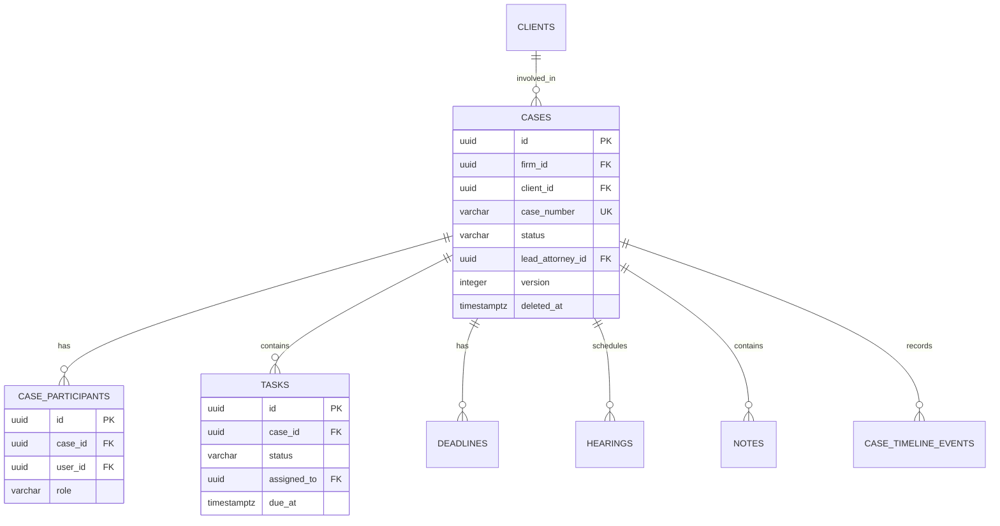
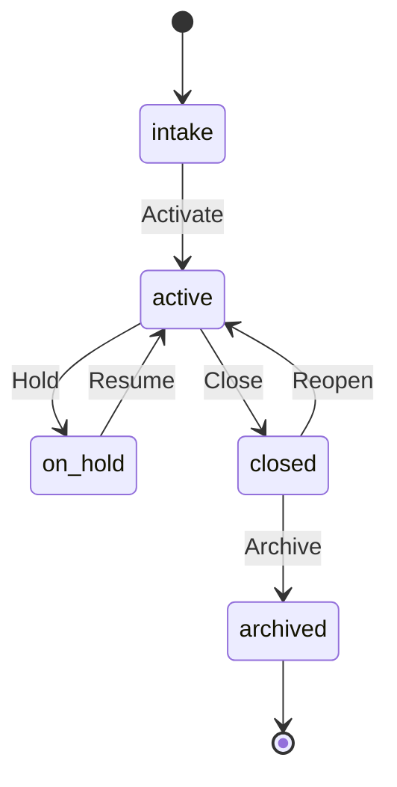
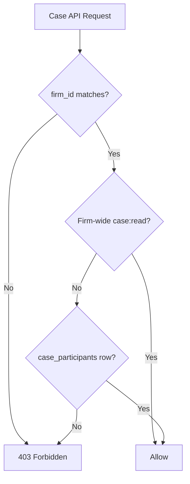
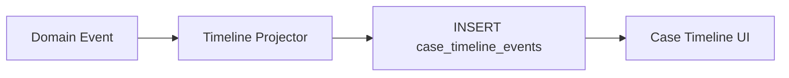

# Cases Schema

**LexFlow AI** — `cases` Schema Reference  
**Version:** 1.0  
**Status:** Draft — Pre-Implementation  
**Last Updated:** 2026-07-06

---

## Purpose

The `cases` schema stores **legal matter (case) management** data — the central domain of LexFlow AI. It includes clients, the Case aggregate root, matter wall participants, work items, deadlines, hearings, notes, and denormalized timeline events.

This schema is owned by the **Case Management** bounded context. See [02-domain/case-aggregate.md](../02-domain/case-aggregate.md) and [02-domain/client-aggregate.md](../02-domain/client-aggregate.md).

---

## Scope

| In Scope | Out of Scope |
|----------|--------------|
| Clients, cases, participants, tasks, deadlines, hearings, notes | Document binaries (see `documents` schema) |
| Matter wall (case_participants) | Workflow execution state (see `workflows` schema) |
| Denormalized timeline events | AI-generated summaries (see `ai` schema) |
| Case status and priority enums | User authentication (see `identity` schema) |

---

## Responsibilities

| Table | Responsibility |
|-------|----------------|
| `clients` | Client master data (individual or organization) |
| `cases` | Central aggregate root — legal matter lifecycle |
| `case_participants` | Matter wall — who can access a case |
| `tasks` | Work items assigned to team members |
| `deadlines` | Legal and internal deadlines with reminder tracking |
| `hearings` | Court appearances and scheduled proceedings |
| `notes` | Internal case communication with visibility controls |
| `case_timeline_events` | Denormalized timeline feed for UI rendering |

---

## Architecture

### Entity-Relationship Diagram

### Case Lifecycle State Machine

Valid transitions are enforced in application domain logic. The database stores the current state only.

---

## Tables

### `cases.clients`

Client master data. Clients exist independently of cases but are always firm-scoped.

| Column | Type | Constraints | Notes |
|--------|------|-------------|-------|
| `id` | UUID | PK | |
| `firm_id` | UUID | NOT NULL, FK → identity.firms | |
| `type` | cases.client_type | NOT NULL | ENUM: individual, organization |
| `name` | VARCHAR(255) | NOT NULL | Display name |
| `email` | VARCHAR(320) | NULL | |
| `phone` | VARCHAR(50) | NULL | |
| `address` | JSONB | NULL | Structured: street, city, state, zip, country |
| `tax_id_encrypted` | BYTEA | NULL | Application-layer encrypted |
| `portal_user_id` | UUID | NULL, FK → identity.users | Client portal access |
| `metadata` | JSONB | NOT NULL DEFAULT '{}' | Custom fields |
| `version` | INTEGER | NOT NULL DEFAULT 1 | |
| `created_at` | TIMESTAMPTZ | NOT NULL DEFAULT now() | |
| `updated_at` | TIMESTAMPTZ | NOT NULL DEFAULT now() | |
| `deleted_at` | TIMESTAMPTZ | NULL | Soft delete |

**Indexes:**
- `(firm_id, name) WHERE deleted_at IS NULL` — client search
- `(firm_id, email) WHERE email IS NOT NULL` — deduplication
- `(portal_user_id) WHERE portal_user_id IS NOT NULL`

---

### `cases.cases`

Central aggregate root. All case-scoped entities reference this table.

| Column | Type | Constraints | Notes |
|--------|------|-------------|-------|
| `id` | UUID | PK | |
| `firm_id` | UUID | NOT NULL, FK → identity.firms | |
| `client_id` | UUID | NOT NULL, FK → clients | |
| `case_number` | VARCHAR(50) | NOT NULL | Firm-internal matter number |
| `title` | VARCHAR(500) | NOT NULL | |
| `practice_area` | VARCHAR(100) | NULL | Litigation, Corporate, IP, etc. |
| `status` | cases.case_status | NOT NULL DEFAULT 'intake' | ENUM: intake, active, on_hold, closed, archived |
| `priority` | cases.priority | NOT NULL DEFAULT 'normal' | ENUM: low, normal, high, urgent |
| `lead_attorney_id` | UUID | NOT NULL, FK → identity.users | |
| `description` | TEXT | NULL | |
| `opened_at` | TIMESTAMPTZ | NULL | Set on activation |
| `closed_at` | TIMESTAMPTZ | NULL | Set on close |
| `billing_code` | VARCHAR(50) | NULL | |
| `metadata` | JSONB | NOT NULL DEFAULT '{}' | Custom fields |
| `version` | INTEGER | NOT NULL DEFAULT 1 | |
| `created_at` | TIMESTAMPTZ | NOT NULL DEFAULT now() | |
| `updated_at` | TIMESTAMPTZ | NOT NULL DEFAULT now() | |
| `deleted_at` | TIMESTAMPTZ | NULL | Soft delete |

**Indexes:**
- `(firm_id, case_number)` UNIQUE — matter number uniqueness per firm
- `(firm_id, status, priority) WHERE deleted_at IS NULL` — dashboard queries
- `(lead_attorney_id, status) WHERE deleted_at IS NULL` — attorney caseload
- `(client_id) WHERE deleted_at IS NULL` — client matter list
- GIN on `metadata` — custom field search

---

### `cases.case_participants`

Matter wall — controls case visibility and access. A user must be a participant (or have firm-wide permission) to access a case.

| Column | Type | Constraints | Notes |
|--------|------|-------------|-------|
| `id` | UUID | PK | |
| `case_id` | UUID | NOT NULL, FK → cases | |
| `user_id` | UUID | NOT NULL, FK → identity.users | |
| `role` | cases.participant_role | NOT NULL | ENUM: lead, associate, paralegal, observer |
| `added_at` | TIMESTAMPTZ | NOT NULL DEFAULT now() | |
| `added_by` | UUID | NOT NULL, FK → identity.users | |

**Unique:** `(case_id, user_id)`

**Indexes:**
- `(user_id, case_id)` — user's case list via matter wall
- `(case_id)` — participants for a case

---

### `cases.tasks`

Work items within a case.

| Column | Type | Constraints | Notes |
|--------|------|-------------|-------|
| `id` | UUID | PK | |
| `case_id` | UUID | NOT NULL, FK → cases | |
| `title` | VARCHAR(500) | NOT NULL | |
| `description` | TEXT | NULL | |
| `status` | cases.task_status | NOT NULL DEFAULT 'pending' | ENUM: pending, in_progress, completed, cancelled |
| `priority` | cases.priority | NOT NULL DEFAULT 'normal' | |
| `assigned_to` | UUID | NULL, FK → identity.users | |
| `due_at` | TIMESTAMPTZ | NULL | |
| `completed_at` | TIMESTAMPTZ | NULL | |
| `created_by` | UUID | NOT NULL, FK → identity.users | |
| `version` | INTEGER | NOT NULL DEFAULT 1 | |
| `created_at` | TIMESTAMPTZ | NOT NULL DEFAULT now() | |
| `updated_at` | TIMESTAMPTZ | NOT NULL DEFAULT now() | |

**Indexes:**
- `(case_id, status, due_at)` — case task board
- `(assigned_to, status, due_at) WHERE status NOT IN ('completed', 'cancelled')` — my tasks

---

### `cases.deadlines`

Legal and internal deadlines with reminder tracking.

| Column | Type | Constraints | Notes |
|--------|------|-------------|-------|
| `id` | UUID | PK | |
| `case_id` | UUID | NOT NULL, FK → cases | |
| `title` | VARCHAR(500) | NOT NULL | |
| `deadline_at` | TIMESTAMPTZ | NOT NULL | |
| `type` | cases.deadline_type | NOT NULL | ENUM: filing, discovery, statute_of_limitations, internal, other |
| `status` | cases.deadline_status | NOT NULL DEFAULT 'upcoming' | ENUM: upcoming, met, missed, extended |
| `reminder_sent` | BOOLEAN | NOT NULL DEFAULT false | |
| `created_by` | UUID | NOT NULL, FK → identity.users | |
| `created_at` | TIMESTAMPTZ | NOT NULL DEFAULT now() | |
| `updated_at` | TIMESTAMPTZ | NOT NULL DEFAULT now() | |

**Indexes:**
- `(case_id, deadline_at, status)` — case deadline list
- `(deadline_at, status) WHERE status = 'upcoming' AND reminder_sent = false` — reminder job

---

### `cases.hearings`

Court appearances and scheduled proceedings.

| Column | Type | Constraints | Notes |
|--------|------|-------------|-------|
| `id` | UUID | PK | |
| `case_id` | UUID | NOT NULL, FK → cases | |
| `title` | VARCHAR(500) | NOT NULL | |
| `hearing_at` | TIMESTAMPTZ | NOT NULL | |
| `location` | VARCHAR(500) | NULL | Physical or virtual |
| `court` | VARCHAR(255) | NULL | |
| `judge` | VARCHAR(255) | NULL | |
| `notes` | TEXT | NULL | |
| `created_by` | UUID | NOT NULL, FK → identity.users | |
| `created_at` | TIMESTAMPTZ | NOT NULL DEFAULT now() | |
| `updated_at` | TIMESTAMPTZ | NOT NULL DEFAULT now() | |

**Indexes:**
- `(case_id, hearing_at)` — case calendar
- `(hearing_at) WHERE hearing_at > now()` — upcoming hearings firm-wide (join cases for firm_id)

---

### `cases.notes`

Internal case communication with visibility controls.

| Column | Type | Constraints | Notes |
|--------|------|-------------|-------|
| `id` | UUID | PK | |
| `case_id` | UUID | NOT NULL, FK → cases | |
| `author_id` | UUID | NOT NULL, FK → identity.users | |
| `content` | TEXT | NOT NULL | |
| `is_pinned` | BOOLEAN | NOT NULL DEFAULT false | |
| `visibility` | cases.note_visibility | NOT NULL DEFAULT 'team' | ENUM: team, attorneys_only, private |
| `created_at` | TIMESTAMPTZ | NOT NULL DEFAULT now() | |
| `updated_at` | TIMESTAMPTZ | NOT NULL DEFAULT now() | |

**Indexes:**
- `(case_id, created_at DESC)` — case notes feed
- `(case_id) WHERE is_pinned = true` — pinned notes

---

### `cases.case_timeline_events`

Denormalized timeline for fast UI rendering. Populated by domain event handlers, not direct user writes.

| Column | Type | Constraints | Notes |
|--------|------|-------------|-------|
| `id` | UUID | PK | |
| `case_id` | UUID | NOT NULL, FK → cases | |
| `event_type` | VARCHAR(100) | NOT NULL | document_uploaded, task_completed, etc. |
| `title` | VARCHAR(500) | NOT NULL | Display title |
| `description` | TEXT | NULL | |
| `actor_id` | UUID | NULL, FK → identity.users | NULL for system events |
| `reference_type` | VARCHAR(50) | NULL | Polymorphic: document, task, etc. |
| `reference_id` | UUID | NULL | Polymorphic FK |
| `occurred_at` | TIMESTAMPTZ | NOT NULL DEFAULT now() | |
| `metadata` | JSONB | NOT NULL DEFAULT '{}' | |

**Indexes:**
- `(case_id, occurred_at DESC)` — primary timeline query (covering index)

---

## Flow Diagrams

### Matter Wall Access Check

### Timeline Event Projection

Event types written to timeline:

| event_type | Source Context | Trigger |
|------------|----------------|---------|
| `case.created` | cases | Case activation |
| `document.uploaded` | documents | Document ready |
| `task.completed` | cases | Task status → completed |
| `deadline.approaching` | cases | Reminder job |
| `workflow.completed` | workflows | Execution success |
| `ai.summary.approved` | ai | Summary approved |

---

## Best Practices

1. **Always check matter wall before case reads** — Firm-wide permission OR participant membership.
2. **Auto-add lead attorney as participant** — On case creation, insert `case_participants` with role `lead`.
3. **Emit timeline events asynchronously** — Via outbox, not in the same request path for non-critical events.
4. **Use optimistic locking on cases and tasks** — Check `version` on every update.
5. **Never hard-delete cases** — Soft delete; archive closed cases after retention period.
6. **Validate case_number uniqueness per firm** — Database unique index is the last line of defense.

---

## Tradeoffs

| Decision | Benefit | Cost |
|----------|---------|------|
| Denormalized timeline table | Sub-10ms timeline queries | Eventual consistency; duplicate event risk |
| Matter wall as junction table | Simple, auditable access model | Must join on every case list for restricted users |
| Client separate from Case | Reuse client across matters | Extra join for case detail views |
| Soft delete on cases | Recovery and audit continuity | All queries need `deleted_at IS NULL` filter |
| ENUM for case status | Type safety, compact | Schema migration to add states |

---

## Future Improvements

| Phase | Item |
|-------|------|
| Phase 2 | Case tagging and saved filters (metadata GIN already in place) |
| Phase 2 | Conflict check rules (same client, opposing counsel) |
| Phase 3 | Case merge and split operations with audit trail |
| Phase 3 | Billing integration fields (time entries reference) |
| Phase 4 | Full-text search on case title + description |

---

## References

- [02-domain/case-aggregate.md](../02-domain/case-aggregate.md)
- [02-domain/client-aggregate.md](../02-domain/client-aggregate.md)
- [02-domain/domain-events.md](../02-domain/domain-events.md)
- [04-api/endpoints-cases.md](../04-api/endpoints-cases.md)
- [schema-overview.md](./schema-overview.md)
