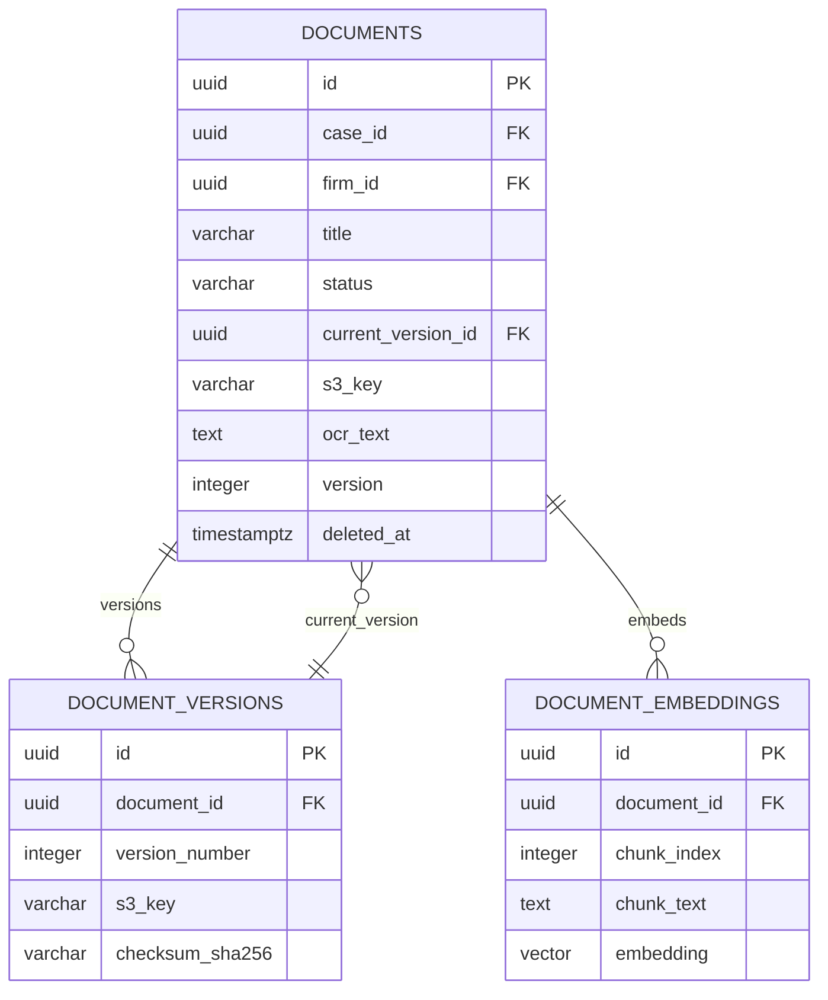
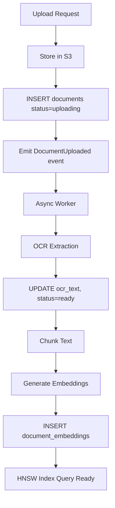
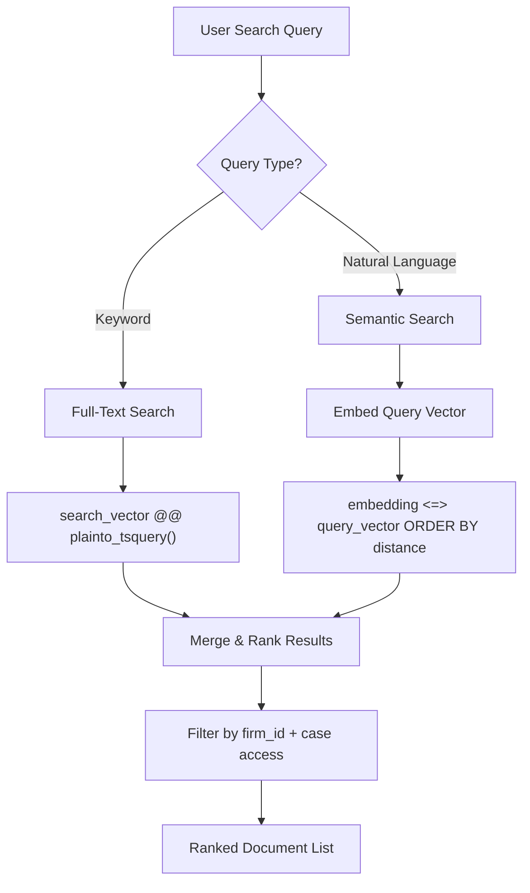

# Documents Schema

**LexFlow AI** — `documents` Schema Reference  
**Version:** 1.0  
**Status:** Draft — Pre-Implementation  
**Last Updated:** 2026-07-06

---

## Purpose

The `documents` schema stores **document metadata, version history, and vector embeddings** for LexFlow AI's document management and RAG (Retrieval-Augmented Generation) capabilities. Binary content lives in S3; this schema holds pointers, extracted text, and semantic search vectors.

This schema is owned by the **Document Management** bounded context. See [02-domain/document-aggregate.md](../02-domain/document-aggregate.md) and [ai-architecture.md](../ai-architecture.md).

---

## Scope

| In Scope | Out of Scope |
|----------|--------------|
| Document metadata, versioning, checksums | S3 bucket configuration |
| OCR extracted text storage | OCR pipeline implementation |
| pgvector embeddings for semantic search | LLM embedding API calls |
| Document status lifecycle | Virus scanning logic |

---

## Responsibilities

| Table | Responsibility |
|-------|----------------|
| `documents` | Document aggregate root — metadata, current version pointer, OCR text |
| `document_versions` | Immutable version history with S3 keys |
| `document_embeddings` | Chunked text embeddings for RAG semantic search |

---

## Architecture

### Entity-Relationship Diagram



### Document Processing Pipeline



---

## Tables

### `documents.documents`

Document aggregate root. Holds metadata and pointer to current version.

| Column | Type | Constraints | Notes |
|--------|------|-------------|-------|
| `id` | UUID | PK | |
| `case_id` | UUID | NOT NULL, FK → cases.cases | |
| `firm_id` | UUID | NOT NULL, FK → identity.firms | Denormalized for firm-wide queries |
| `title` | VARCHAR(500) | NOT NULL | |
| `document_type` | documents.document_type | NOT NULL | ENUM: pleading, contract, evidence, correspondence, invoice, other |
| `status` | documents.document_status | NOT NULL DEFAULT 'uploading' | ENUM: uploading, processing, ready, failed, archived |
| `current_version_id` | UUID | NULL, FK → document_versions | Set after first version committed |
| `s3_key` | VARCHAR(1000) | NOT NULL | Current version S3 path |
| `mime_type` | VARCHAR(100) | NOT NULL | |
| `file_size_bytes` | BIGINT | NOT NULL | |
| `checksum_sha256` | VARCHAR(64) | NOT NULL | Integrity verification |
| `ocr_status` | documents.ocr_status | NOT NULL DEFAULT 'pending' | ENUM: pending, completed, failed, skipped |
| `ocr_text` | TEXT | NULL | Extracted text for search and RAG |
| `search_vector` | TSVECTOR | GENERATED | Full-text index on title + ocr_text |
| `metadata` | JSONB | NOT NULL DEFAULT '{}' | Tags, custom fields |
| `uploaded_by` | UUID | NOT NULL, FK → identity.users | |
| `version` | INTEGER | NOT NULL DEFAULT 1 | Optimistic concurrency |
| `created_at` | TIMESTAMPTZ | NOT NULL DEFAULT now() | |
| `updated_at` | TIMESTAMPTZ | NOT NULL DEFAULT now() | |
| `deleted_at` | TIMESTAMPTZ | NULL | Soft delete |

**Generated column:**

```sql
search_vector TSVECTOR GENERATED ALWAYS AS (
    setweight(to_tsvector('english', coalesce(title, '')), 'A') ||
    setweight(to_tsvector('english', coalesce(ocr_text, '')), 'B')
) STORED
```

**Indexes:**
- `(case_id, document_type, status) WHERE deleted_at IS NULL`
- `(firm_id, created_at DESC) WHERE deleted_at IS NULL` — firm-wide document search
- GIN on `search_vector` — full-text search
- GIN on `metadata` — tag and custom field search

---

### `documents.document_versions`

Immutable version history. Each upload creates a new version row.

| Column | Type | Constraints | Notes |
|--------|------|-------------|-------|
| `id` | UUID | PK | |
| `document_id` | UUID | NOT NULL, FK → documents | |
| `version_number` | INTEGER | NOT NULL | Starts at 1 |
| `s3_key` | VARCHAR(1000) | NOT NULL | Version-specific S3 path |
| `file_size_bytes` | BIGINT | NOT NULL | |
| `checksum_sha256` | VARCHAR(64) | NOT NULL | |
| `change_summary` | TEXT | NULL | User-provided change description |
| `created_by` | UUID | NOT NULL, FK → identity.users | |
| `created_at` | TIMESTAMPTZ | NOT NULL DEFAULT now() | |

**Unique:** `(document_id, version_number)`

**Indexes:**
- `(document_id, version_number DESC)` — version history list

---

### `documents.document_embeddings`

Chunked text embeddings for RAG semantic search. Uses pgvector extension.

| Column | Type | Constraints | Notes |
|--------|------|-------------|-------|
| `id` | UUID | PK | |
| `document_id` | UUID | NOT NULL, FK → documents | |
| `chunk_index` | INTEGER | NOT NULL | Zero-based chunk order |
| `chunk_text` | TEXT | NOT NULL | Source text chunk (~512 tokens) |
| `embedding` | vector(1536) | NOT NULL | OpenAI text-embedding-3-small |
| `model` | VARCHAR(100) | NOT NULL | Embedding model identifier |
| `token_count` | INTEGER | NULL | Tokens in chunk |
| `created_at` | TIMESTAMPTZ | NOT NULL DEFAULT now() | |

**Unique:** `(document_id, chunk_index)`

**Vector index:**

```sql
CREATE INDEX idx_document_embeddings_hnsw
ON documents.document_embeddings
USING hnsw (embedding vector_cosine_ops)
WITH (m = 16, ef_construction = 64);
```

**Supporting indexes:**
- `(document_id)` — delete embeddings on document re-processing

---

## Hybrid Search Flow

LexFlow AI combines **full-text search** (PostgreSQL `tsvector`) and **semantic search** (pgvector) for document discovery.



Example hybrid query pattern:

```sql
-- Semantic search within a case (top 20 by cosine similarity)
SELECT d.id, d.title, de.chunk_text,
       1 - (de.embedding <=> :query_embedding) AS similarity
FROM documents.document_embeddings de
JOIN documents.documents d ON d.id = de.document_id
WHERE d.case_id = :case_id
  AND d.firm_id = :firm_id
  AND d.deleted_at IS NULL
  AND d.status = 'ready'
ORDER BY de.embedding <=> :query_embedding
LIMIT 20;
```

---

## S3 Key Convention

Document binaries are stored in S3, not PostgreSQL. Key pattern:

```
{firm_id}/{case_id}/{document_id}/v{version_number}/{filename}
```

The `s3_key` column on both `documents` and `document_versions` stores the full key. See [03-architecture/integration-patterns.md](../03-architecture/integration-patterns.md) for S3 adapter details.

---

## Best Practices

1. **Never store binary content in PostgreSQL** — S3 only; DB holds metadata and extracted text.
2. **Verify checksum on upload completion** — Compare client-provided SHA-256 with S3 ETag.
3. **Re-generate embeddings on version upload** — Delete old embeddings, insert new chunks.
4. **Scope vector search by case or firm** — Always filter before vector distance sort; never full-table scan.
5. **Set `ef_search` at query time for HNSW** — `SET hnsw.ef_search = 100` for production queries.
6. **Encrypt OCR text at rest** — RDS encryption covers storage; consider column-level encryption for highly sensitive matters (Phase 3).

---

## Tradeoffs

| Decision | Benefit | Cost |
|----------|---------|------|
| S3 for binaries, PG for metadata | Cost-effective, scalable storage | Two systems to keep consistent |
| Denormalized firm_id on documents | Firm-wide search without case join | Must set correctly on insert |
| HNSW over IVFFlat | Better recall, no training step | Higher memory, slower index build |
| 1536-dim vectors (OpenAI) | Standard model output | ~6 KB per embedding row |
| Generated tsvector column | Always in sync with title/ocr_text | Storage overhead (~10% of text size) |
| Chunk-based embeddings | Better RAG precision | More rows per document |

---

## Future Improvements

| Phase | Item |
|-------|------|
| Phase 2 | Multi-modal embeddings (image pages in PDFs) |
| Phase 2 | Embedding model versioning and re-index migration tool |
| Phase 3 | Cross-case firm-wide semantic search with matter wall filtering |
| Phase 3 | Document classification auto-tagging (document_type prediction) |
| Phase 4 | Incremental embedding updates (edit chunk without full re-process) |

---

## References

- [02-domain/document-aggregate.md](../02-domain/document-aggregate.md)
- [04-api/endpoints-documents.md](../04-api/endpoints-documents.md)
- [ai-architecture.md](../ai-architecture.md)
- [indexing-strategy.md](./indexing-strategy.md)
- [ADR-004: Async AI Processing](../13-decisions/004-async-ai-processing.md)
- [schema-overview.md](./schema-overview.md)
