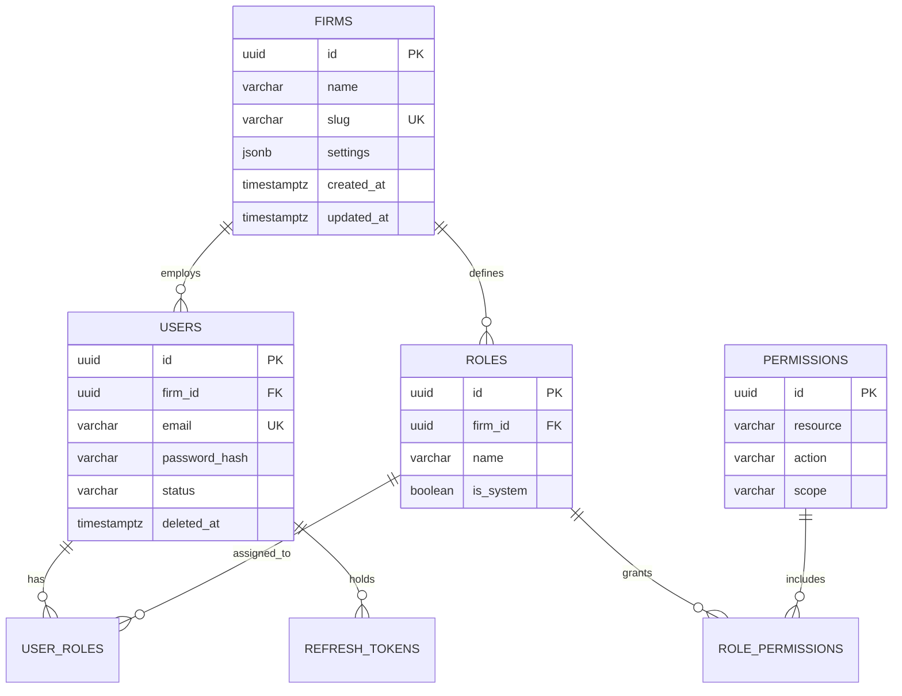
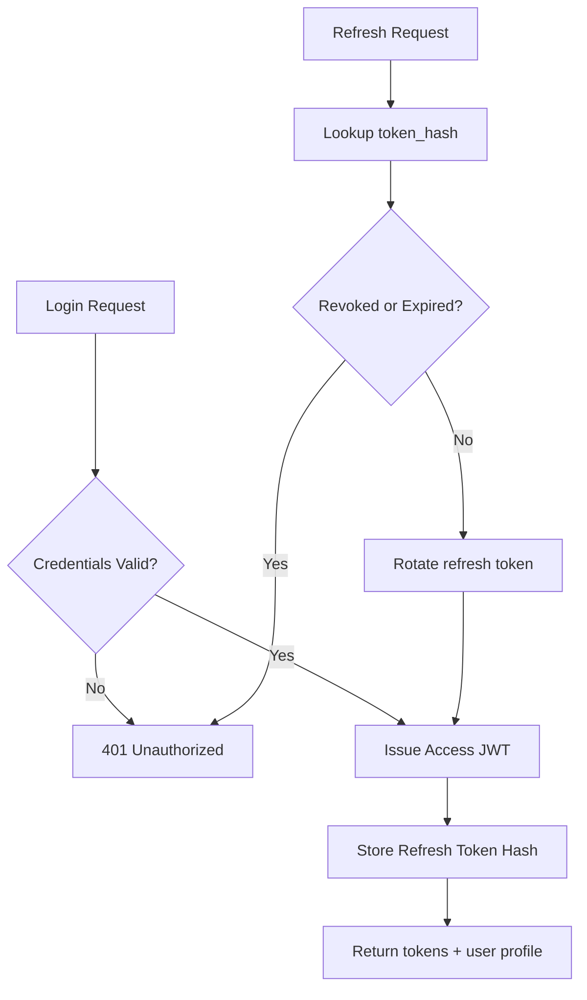
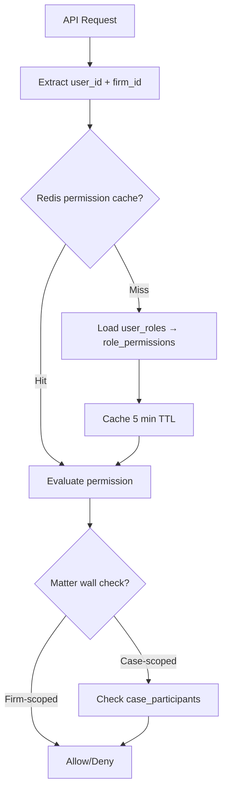

# Identity Schema

**LexFlow AI** — `identity` Schema Reference  
**Version:** 1.0  
**Status:** Draft — Pre-Implementation  
**Last Updated:** 2026-07-06

---

## Purpose

The `identity` schema stores **authentication, authorization, and tenant (firm) configuration** data. It is the foundation for multi-tenant isolation, RBAC enforcement, and session management across LexFlow AI.

This schema is owned by the **Identity & Access** bounded context. See [authentication-authorization.md](../authentication-authorization.md) and [04-api/authorization-rbac.md](../04-api/authorization-rbac.md).

---

## Scope

| In Scope | Out of Scope |
|----------|--------------|
| Firms (tenants), users, roles, permissions | JWT signing keys (Secrets Manager) |
| RBAC junction tables | Microsoft Entra ID token validation logic |
| Refresh token storage | MFA TOTP secrets (Phase 2 — separate vault) |
| User profile and status | Case-level matter wall rules (see `cases` schema) |

---

## Responsibilities

| Table | Responsibility |
|-------|----------------|
| `firms` | Tenant root entity; firm-wide settings |
| `users` | Authenticated principals; profile and credentials |
| `roles` | Named permission bundles (system and firm-custom) |
| `permissions` | Atomic resource + action + scope grants |
| `user_roles` | User-to-role assignment |
| `role_permissions` | Role-to-permission assignment |
| `refresh_tokens` | Hashed refresh token lifecycle |

---

## Architecture

### Entity-Relationship Diagram

### Authentication Flow

---

## Tables

### `identity.firms`

Law firm tenant root. Every other tenant-scoped table references `firms.id`.

| Column | Type | Constraints | Notes |
|--------|------|-------------|-------|
| `id` | UUID | PK, DEFAULT gen_random_uuid() | |
| `name` | VARCHAR(255) | NOT NULL | Display name |
| `slug` | VARCHAR(100) | NOT NULL, UNIQUE | URL-safe identifier |
| `settings` | JSONB | NOT NULL DEFAULT '{}' | Timezone, retention overrides, feature flags |
| `created_at` | TIMESTAMPTZ | NOT NULL DEFAULT now() | |
| `updated_at` | TIMESTAMPTZ | NOT NULL DEFAULT now() | |

**Indexes:** `(slug)` UNIQUE

---

### `identity.users`

Authenticated principals. Email is globally unique (one account per email across the platform).

| Column | Type | Constraints | Notes |
|--------|------|-------------|-------|
| `id` | UUID | PK | |
| `firm_id` | UUID | NOT NULL, FK → firms | Tenant isolation |
| `email` | VARCHAR(320) | NOT NULL, UNIQUE | RFC 5321 max length |
| `password_hash` | VARCHAR(255) | NULL | bcrypt; NULL when SSO-only |
| `first_name` | VARCHAR(100) | NOT NULL | |
| `last_name` | VARCHAR(100) | NOT NULL | |
| `title` | VARCHAR(100) | NULL | Attorney, Paralegal, etc. |
| `bar_number` | VARCHAR(50) | NULL | State bar registration |
| `entra_object_id` | VARCHAR(255) | NULL | Microsoft Entra ID link (Phase 2) |
| `status` | identity.user_status | NOT NULL DEFAULT 'active' | ENUM: active, inactive, locked |
| `last_login_at` | TIMESTAMPTZ | NULL | |
| `mfa_enabled` | BOOLEAN | NOT NULL DEFAULT false | |
| `version` | INTEGER | NOT NULL DEFAULT 1 | Optimistic concurrency |
| `created_at` | TIMESTAMPTZ | NOT NULL DEFAULT now() | |
| `updated_at` | TIMESTAMPTZ | NOT NULL DEFAULT now() | |
| `deleted_at` | TIMESTAMPTZ | NULL | Soft delete |

**Indexes:**
- `(firm_id, email)` — tenant user lookup
- `(firm_id, status) WHERE deleted_at IS NULL` — active user lists
- `(entra_object_id) WHERE entra_object_id IS NOT NULL` — SSO lookup

---

### `identity.roles`

Named permission bundles. System roles have `firm_id = NULL` and `is_system = true`.

| Column | Type | Constraints | Notes |
|--------|------|-------------|-------|
| `id` | UUID | PK | |
| `firm_id` | UUID | NULL, FK → firms | NULL = system role |
| `name` | VARCHAR(100) | NOT NULL | |
| `description` | TEXT | NULL | |
| `is_system` | BOOLEAN | NOT NULL DEFAULT false | Cannot be deleted |
| `created_at` | TIMESTAMPTZ | NOT NULL DEFAULT now() | |
| `updated_at` | TIMESTAMPTZ | NOT NULL DEFAULT now() | |

**Unique:** `(COALESCE(firm_id, '00000000-0000-0000-0000-000000000000'), name)`

**Seed roles:** `SystemAdministrator`, `ManagingPartner`, `Attorney`, `AssociateAttorney`, `Paralegal`, `LegalAssistant`, `OperationsTeam`, `ITAdministrator`, `ComplianceOfficer`, `Client`

---

### `identity.permissions`

Atomic permission grants. Permissions are global (not firm-scoped); roles combine them.

| Column | Type | Constraints | Notes |
|--------|------|-------------|-------|
| `id` | UUID | PK | |
| `resource` | VARCHAR(100) | NOT NULL | case, document, workflow, ai, audit |
| `action` | VARCHAR(50) | NOT NULL | read, write, delete, approve, execute |
| `scope` | VARCHAR(50) | NOT NULL | own, team, firm, assigned |
| `description` | TEXT | NULL | Human-readable |
| `created_at` | TIMESTAMPTZ | NOT NULL DEFAULT now() | |

**Unique:** `(resource, action, scope)`

Example permissions:

| resource | action | scope | Meaning |
|----------|--------|-------|---------|
| case | read | assigned | Read cases where user is participant |
| case | write | assigned | Modify assigned cases |
| document | read | firm | Read any firm document |
| ai | execute | firm | Run AI prompts |
| audit | read | firm | View firm audit trail |

---

### `identity.user_roles`

Junction: users to roles.

| Column | Type | Constraints | Notes |
|--------|------|-------------|-------|
| `id` | UUID | PK | |
| `user_id` | UUID | NOT NULL, FK → users | |
| `role_id` | UUID | NOT NULL, FK → roles | |
| `assigned_at` | TIMESTAMPTZ | NOT NULL DEFAULT now() | |
| `assigned_by` | UUID | NULL, FK → users | |

**Unique:** `(user_id, role_id)`

---

### `identity.role_permissions`

Junction: roles to permissions.

| Column | Type | Constraints | Notes |
|--------|------|-------------|-------|
| `id` | UUID | PK | |
| `role_id` | UUID | NOT NULL, FK → roles | |
| `permission_id` | UUID | NOT NULL, FK → permissions | |

**Unique:** `(role_id, permission_id)`

---

### `identity.refresh_tokens`

Hashed refresh tokens for session rotation. Plaintext tokens never persist.

| Column | Type | Constraints | Notes |
|--------|------|-------------|-------|
| `id` | UUID | PK | |
| `user_id` | UUID | NOT NULL, FK → users | |
| `token_hash` | VARCHAR(255) | NOT NULL | SHA-256 of refresh token |
| `expires_at` | TIMESTAMPTZ | NOT NULL | Typically 7 days |
| `revoked_at` | TIMESTAMPTZ | NULL | Set on logout or rotation |
| `device_info` | JSONB | NULL | User agent, IP, device name |
| `created_at` | TIMESTAMPTZ | NOT NULL DEFAULT now() | |

**Indexes:**
- `(user_id, expires_at) WHERE revoked_at IS NULL` — active token lookup
- `(token_hash) WHERE revoked_at IS NULL` — refresh validation

---

## RBAC Evaluation Flow

Permission sets are cached in Redis with a 5-minute TTL. Cache invalidation occurs on role assignment changes.

---

## Best Practices

1. **Never store plaintext passwords or refresh tokens** — bcrypt for passwords; SHA-256 hash for refresh tokens.
2. **Revoke all refresh tokens on password change** — Set `revoked_at = now()` for all active tokens for the user.
3. **Use system roles for defaults** — Firm-specific roles extend system roles; do not duplicate permission sets.
4. **Lock accounts after failed attempts** — Set `status = 'locked'` after 10 failed logins (application logic).
5. **Soft-delete users, don't hard-delete** — Preserve audit trail references; anonymize on GDPR erasure.
6. **Validate firm_id on every user lookup** — Prevent cross-tenant user enumeration.

---

## Tradeoffs

| Decision | Benefit | Cost |
|----------|---------|------|
| Global email uniqueness | Simple login, no firm disambiguation | Email cannot exist in two firms |
| System roles (firm_id NULL) | Consistent defaults across tenants | Slightly complex unique constraint |
| Redis permission cache | Sub-ms authorization checks | 5-minute staleness window |
| Hashed refresh tokens | DB breach doesn't leak sessions | Cannot inspect token contents |
| Soft delete on users | Audit continuity | Must filter in all queries |

---

## Future Improvements

| Phase | Item |
|-------|------|
| Phase 2 | Microsoft Entra ID SSO via `entra_object_id` |
| Phase 2 | MFA TOTP secrets in dedicated encrypted column or vault |
| Phase 2 | Firm-custom roles UI with permission picker |
| Phase 3 | SCIM provisioning for user lifecycle |
| Phase 3 | Session management dashboard (view/revoke active sessions) |

---

## References

- [04-api/authentication.md](../04-api/authentication.md)
- [04-api/authorization-rbac.md](../04-api/authorization-rbac.md)
- [authentication-authorization.md](../authentication-authorization.md)
- [ADR-005: JWT Authentication](../13-decisions/005-jwt-authentication.md)
- [schema-overview.md](./schema-overview.md)
