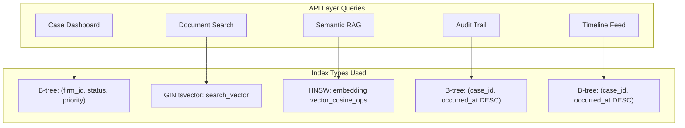
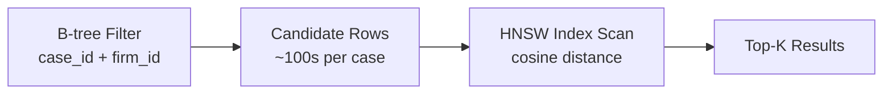
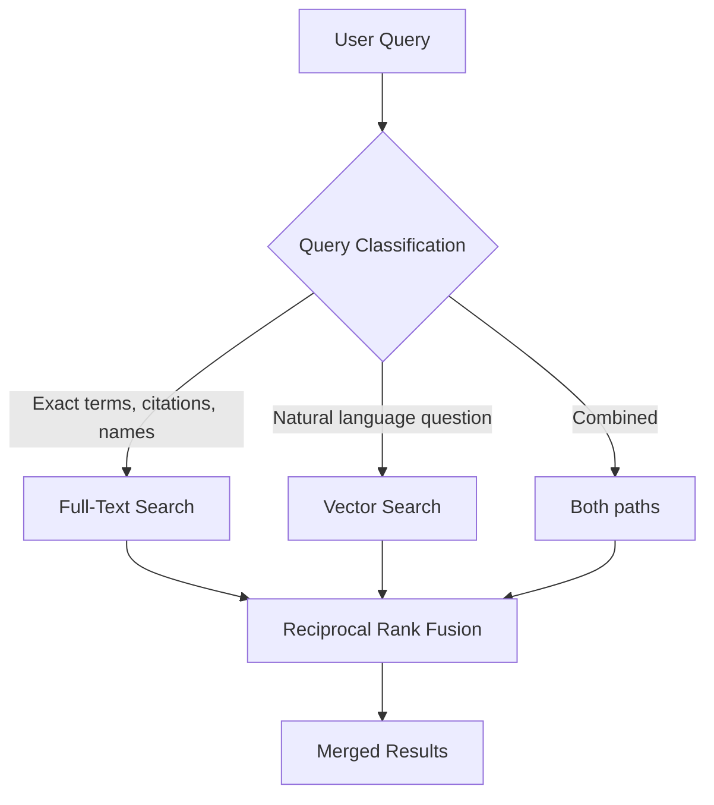

# Indexing Strategy

**LexFlow AI** — PostgreSQL Index Design & Performance  
**Version:** 1.0  
**Status:** Draft — Pre-Implementation  
**Last Updated:** 2026-07-06

---

## Purpose

This document defines the **indexing strategy** for LexFlow AI's PostgreSQL database — composite B-tree indexes, partial indexes, HNSW vector indexes, and full-text search indexes. It ensures query performance meets NFR targets while controlling storage and write amplification.

See [03-architecture/nfr-requirements.md](../03-architecture/nfr-requirements.md) for performance targets.

---

## Scope

| In Scope | Out of Scope |
|----------|--------------|
| B-tree composite and partial indexes | Query planner configuration (postgresql.conf) |
| pgvector HNSW indexes | Application-level caching (Redis) |
| Full-text search (tsvector/GIN) | Connection pooling (PgBouncer) |
| Index maintenance and monitoring | RDS instance sizing |

---

## Responsibilities

| Area | Owner | Review Cadence |
|------|-------|----------------|
| Index design for new tables | Backend engineer (PR author) | Per migration PR |
| Index performance review | DBA / SRE | Monthly |
| Unused index detection | SRE (automated) | Weekly |
| HNSW parameter tuning | AI engineer + DBA | Quarterly |

---

## Architecture

### Index Type Selection Matrix

| Query Pattern | Index Type | Example |
|---------------|-----------|---------|
| Equality + range filter | B-tree composite | `(firm_id, status, created_at DESC)` |
| Active rows only | Partial B-tree | `WHERE deleted_at IS NULL` |
| JSONB key lookup | GIN | `metadata @> '{"tag": "urgent"}'` |
| Full-text keyword search | GIN on tsvector | `search_vector @@ plainto_tsquery('contract')` |
| Semantic similarity | HNSW on vector | `embedding <=> query_vector` |
| Unique constraint | B-tree UNIQUE | `(firm_id, case_number)` |
| TTL cleanup | B-tree on expiry column | `(expires_at) WHERE status = 'pending'` |

### Query Path Overview



---

## Composite B-Tree Indexes

### Identity Schema

| Table | Index | Columns | Purpose |
|-------|-------|---------|---------|
| `users` | `idx_users_firm_email` | `(firm_id, email)` | Login lookup within firm |
| `users` | `idx_users_firm_active` | `(firm_id, status) WHERE deleted_at IS NULL` | Active user list |
| `refresh_tokens` | `idx_refresh_active` | `(user_id, expires_at) WHERE revoked_at IS NULL` | Token validation |

### Cases Schema

| Table | Index | Columns | Purpose |
|-------|-------|---------|---------|
| `cases` | `idx_cases_firm_number` | `(firm_id, case_number)` UNIQUE | Matter number lookup |
| `cases` | `idx_cases_dashboard` | `(firm_id, status, priority) WHERE deleted_at IS NULL` | Dashboard filtering |
| `cases` | `idx_cases_attorney` | `(lead_attorney_id, status) WHERE deleted_at IS NULL` | Attorney caseload |
| `case_participants` | `idx_participants_user` | `(user_id, case_id)` | Matter wall case list |
| `tasks` | `idx_tasks_case_board` | `(case_id, status, due_at)` | Case task board |
| `tasks` | `idx_tasks_assigned` | `(assigned_to, status, due_at) WHERE status NOT IN ('completed','cancelled')` | My tasks |
| `deadlines` | `idx_deadlines_reminder` | `(deadline_at, status) WHERE status = 'upcoming' AND reminder_sent = false` | Reminder job |
| `case_timeline_events` | `idx_timeline_case` | `(case_id, occurred_at DESC)` | Timeline feed |

### Documents Schema

| Table | Index | Columns | Purpose |
|-------|-------|---------|---------|
| `documents` | `idx_docs_case_type` | `(case_id, document_type, status) WHERE deleted_at IS NULL` | Case document list |
| `documents` | `idx_docs_firm_recent` | `(firm_id, created_at DESC) WHERE deleted_at IS NULL` | Firm-wide search |
| `document_versions` | `idx_versions_doc` | `(document_id, version_number DESC)` | Version history |

### Workflows Schema

| Table | Index | Columns | Purpose |
|-------|-------|---------|---------|
| `workflow_executions` | `idx_exec_case` | `(case_id, created_at DESC) WHERE case_id IS NOT NULL` | Case workflow history |
| `workflow_executions` | `idx_exec_poll` | `(status, created_at) WHERE status IN ('queued','running')` | Worker polling |
| `workflow_executions` | `idx_exec_idempotency` | `(idempotency_key)` UNIQUE WHERE NOT NULL | Dedup |

### AI Schema

| Table | Index | Columns | Purpose |
|-------|-------|---------|---------|
| `ai_summaries` | `idx_summary_case` | `(case_id, summary_type, created_at DESC)` | Case AI history |
| `ai_summaries` | `idx_summary_pending` | `(status) WHERE status IN ('generating','draft')` | Approval queue |
| `llm_usage` | `idx_usage_firm_period` | `(firm_id, period_start DESC)` | Cost dashboard |

### Audit & Shared Schemas

| Table | Index | Columns | Purpose |
|-------|-------|---------|---------|
| `audit_logs` | `idx_audit_case` | `(case_id, occurred_at DESC)` | Case audit trail |
| `audit_logs` | `idx_audit_firm` | `(firm_id, occurred_at DESC)` | Firm audit |
| `audit_logs` | `idx_audit_resource` | `(resource_type, resource_id, occurred_at DESC)` | Resource history |
| `approvals` | `idx_approval_pending` | `(approver_id, status) WHERE status = 'pending'` | My approvals |
| `outbox_events` | `idx_outbox_pending` | `(status, created_at) WHERE status = 'pending'` | Publisher poll |
| `notifications` | `idx_notif_user` | `(user_id, status, created_at DESC)` | Notification feed |
| `idempotency_keys` | `idx_idempotency_expiry` | `(expires_at)` | TTL cleanup |

---

## Partial Indexes

Partial indexes exclude rows that are never queried, reducing index size and write cost.

```sql
-- Active cases only (most dashboard queries)
CREATE INDEX idx_cases_dashboard
ON cases.cases (firm_id, status, priority)
WHERE deleted_at IS NULL;

-- Open tasks only (assigned-to-me view)
CREATE INDEX idx_tasks_assigned
ON cases.tasks (assigned_to, status, due_at)
WHERE status NOT IN ('completed', 'cancelled');

-- Pending outbox events only (publisher poll)
CREATE INDEX idx_outbox_pending
ON shared.outbox_events (status, created_at)
WHERE status = 'pending';

-- Active refresh tokens only
CREATE INDEX idx_refresh_active
ON identity.refresh_tokens (user_id, expires_at)
WHERE revoked_at IS NULL;
```

### When to Use Partial Indexes

| Condition | Use Partial Index? |
|-----------|-------------------|
| Query always filters `deleted_at IS NULL` | Yes |
| Query filters on specific status values | Yes |
| Query scans all rows regardless of status | No — use full index |
| Column is NULL for most rows | Yes — `WHERE col IS NOT NULL` |

---

## HNSW Vector Indexes

pgvector HNSW (Hierarchical Navigable Small World) indexes enable approximate nearest-neighbor search for RAG semantic retrieval.

### Configuration

```sql
-- Enable extension (once per database)
CREATE EXTENSION IF NOT EXISTS vector;

-- HNSW index on document embeddings
CREATE INDEX idx_document_embeddings_hnsw
ON documents.document_embeddings
USING hnsw (embedding vector_cosine_ops)
WITH (m = 16, ef_construction = 64);
```

### Parameter Reference

| Parameter | Value | Description |
|-----------|-------|-------------|
| `m` | 16 | Max connections per layer (default 16). Higher = better recall, more memory |
| `ef_construction` | 64 | Build-time search width (default 64). Higher = better index quality, slower build |
| `ef_search` | 100 (runtime) | Query-time search width. Set per session: `SET hnsw.ef_search = 100` |

### HNSW vs. IVFFlat

| Aspect | HNSW | IVFFlat |
|--------|------|---------|
| Build time | Slower | Faster |
| Query recall | Higher | Lower (depends on probes) |
| Memory usage | Higher | Lower |
| Training required | No | Yes (need representative data) |
| Incremental inserts | Supported | Requires periodic rebuild |
| **LexFlow choice** | **HNSW** | Not used |

### Vector Query Pattern

```sql
-- Set search quality for this session
SET hnsw.ef_search = 100;

-- Semantic search within a case (always filter BEFORE vector sort)
SELECT d.id, d.title, de.chunk_text,
       1 - (de.embedding <=> :query_embedding::vector) AS similarity
FROM documents.document_embeddings de
JOIN documents.documents d ON d.id = de.document_id
WHERE d.case_id = :case_id
  AND d.firm_id = :firm_id
  AND d.deleted_at IS NULL
  AND d.status = 'ready'
ORDER BY de.embedding <=> :query_embedding::vector
LIMIT 20;
```

**Critical:** Always apply B-tree filters (`case_id`, `firm_id`) before the vector distance operator. Never run unconstrained vector scans across the full table.



---

## Full-Text Search

PostgreSQL native full-text search complements vector semantic search for keyword-based document discovery.

### Generated tsvector Column

```sql
ALTER TABLE documents.documents
ADD COLUMN search_vector TSVECTOR
GENERATED ALWAYS AS (
    setweight(to_tsvector('english', coalesce(title, '')), 'A') ||
    setweight(to_tsvector('english', coalesce(ocr_text, '')), 'B')
) STORED;

CREATE INDEX idx_documents_fts
ON documents.documents
USING GIN (search_vector);
```

Weight `A` (title) ranks higher than weight `B` (OCR text) in relevance scoring.

### Full-Text Query Pattern

```sql
-- Keyword search within a firm
SELECT id, title,
       ts_rank(search_vector, query) AS rank
FROM documents.documents,
     plainto_tsquery('english', :search_term) query
WHERE firm_id = :firm_id
  AND deleted_at IS NULL
  AND status = 'ready'
  AND search_vector @@ query
ORDER BY rank DESC
LIMIT 50;
```

### Hybrid Search Strategy



For hybrid queries, use **Reciprocal Rank Fusion (RRF)** to merge full-text and vector results:

```
score(d) = Σ 1 / (k + rank_i(d))    where k = 60
```

---

## Partition-Aware Indexing

Monthly-partitioned tables (`audit.audit_logs`, `ai.prompt_history`) require indexes **per partition**, not on the parent table.

```sql
-- Parent table (partitioned)
CREATE TABLE audit.audit_logs (...) PARTITION BY RANGE (occurred_at);

-- Each partition gets its own indexes
CREATE TABLE audit.audit_logs_2026_07 PARTITION OF audit.audit_logs
    FOR VALUES FROM ('2026-07-01') TO ('2026-08-01');

CREATE INDEX idx_audit_logs_2026_07_case
ON audit.audit_logs_2026_07 (case_id, occurred_at DESC);
```

Partition pruning eliminates irrelevant partitions at query planning time when `occurred_at` range is specified.

---

## Index Maintenance

### Production Index Creation

Always use concurrent index creation to avoid table locks:

```sql
CREATE INDEX CONCURRENTLY idx_cases_dashboard
ON cases.cases (firm_id, status, priority)
WHERE deleted_at IS NULL;
```

Alembic migrations must set `postgresql_concurrently=True` and run outside transactions. See [migrations.md](./migrations.md).

### Monitoring Queries

```sql
-- Unused indexes (candidates for removal)
SELECT schemaname, relname, indexrelname, idx_scan, pg_size_pretty(pg_relation_size(indexrelid))
FROM pg_stat_user_indexes
WHERE idx_scan = 0 AND schemaname NOT IN ('pg_catalog')
ORDER BY pg_relation_size(indexrelid) DESC;

-- Index bloat estimate
SELECT indexrelname, pg_size_pretty(pg_relation_size(indexrelid))
FROM pg_stat_user_indexes
WHERE schemaname IN ('cases', 'documents', 'audit')
ORDER BY pg_relation_size(indexrelid) DESC
LIMIT 20;
```

### Maintenance Schedule

| Task | Frequency | Tool |
|------|-----------|------|
| `VACUUM ANALYZE` on high-churn tables | Daily (auto) | RDS autovacuum |
| Unused index review | Weekly | pg_stat_user_indexes query |
| HNSW recall benchmark | Quarterly | Test query set with known results |
| Partition index verification | Monthly (with partition creation) | Automated migration |

---

## Best Practices

1. **Lead with equality columns, end with range** — `(firm_id, status, created_at DESC)` not `(created_at, firm_id)`.
2. **Always include firm_id in composite indexes** for tenant-scoped tables — enables partition-like pruning.
3. **Use partial indexes for soft-deleted tables** — `WHERE deleted_at IS NULL` on every user-facing index.
4. **Create indexes concurrently in production** — Never block writes with `CREATE INDEX` (non-concurrent).
5. **Filter before vector search** — B-tree filters on case_id/firm_id, then HNSW distance sort.
6. **Monitor index usage monthly** — Drop indexes with zero scans after 30 days.
7. **Keep indexed columns narrow** — Index `(firm_id, status)` not `(firm_id, status, title, description)`.

---

## Tradeoffs

| Decision | Benefit | Cost |
|----------|---------|------|
| HNSW over IVFFlat | No training, better recall, incremental inserts | 2-3x memory vs IVFFlat |
| Partial indexes | Smaller, faster writes | Must match query WHERE clauses exactly |
| Generated tsvector | Always consistent | Cannot index expressions not in column |
| Composite over single-column | Covers multi-filter queries | Larger index size |
| Per-partition indexes | Partition pruning + index scan | Index proliferation (manageable via automation) |
| CONCURRENTLY in prod | Zero downtime | Migration takes 2-5x longer |

---

## Future Improvements

| Phase | Item |
|-------|------|
| Phase 2 | pg_stat_statements analysis dashboard for slow query detection |
| Phase 2 | Automated index recommendation based on query log |
| Phase 3 | Covering indexes (INCLUDE columns) for index-only scans on timeline |
| Phase 3 | BRIN indexes on `created_at` for append-only audit partitions |
| Phase 4 | Read replica-specific index tuning for reporting workloads |

---

## References

- [schema-overview.md](./schema-overview.md)
- [documents-schema.md](./documents-schema.md)
- [migrations.md](./migrations.md)
- [03-architecture/nfr-requirements.md](../03-architecture/nfr-requirements.md)
- [pgvector HNSW Documentation](https://github.com/pgvector/pgvector#hnsw)
- [PostgreSQL Index Types](https://www.postgresql.org/docs/16/indexes-types.html)
