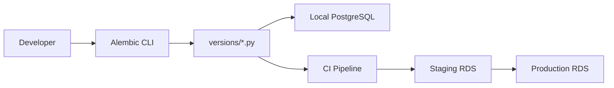
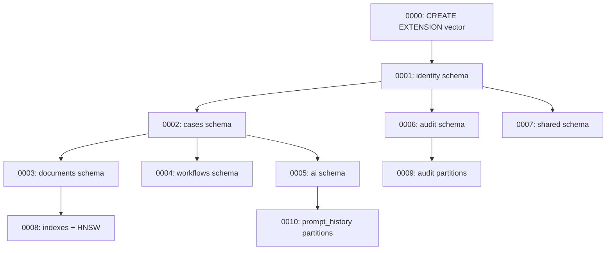
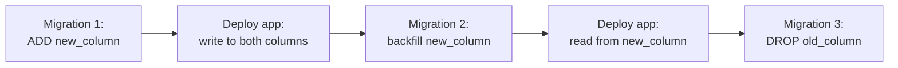
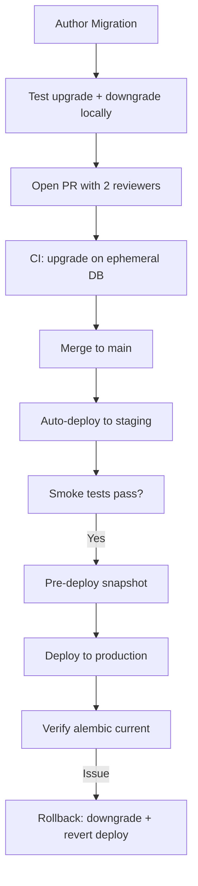
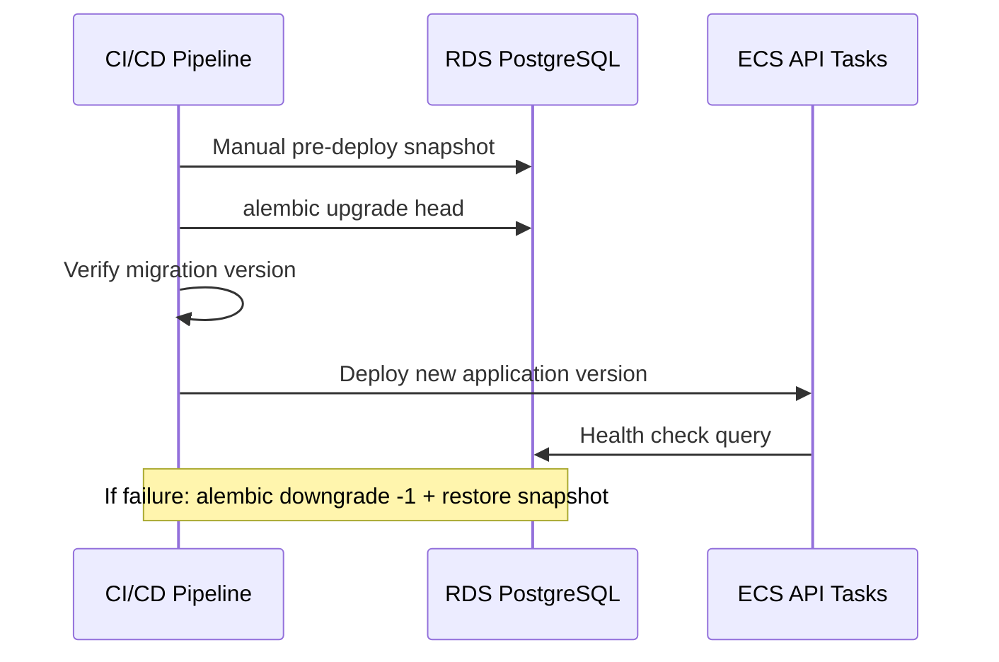

# Database Migrations

**LexFlow AI** — Alembic Migration Conventions  
**Version:** 1.0  
**Status:** Draft — Pre-Implementation  
**Last Updated:** 2026-07-06

---

## Purpose

This document defines **Alembic migration conventions** for LexFlow AI's PostgreSQL schema evolution. Consistent migration practices ensure safe, reversible, reviewable schema changes across development, staging, and production environments.

---

## Scope

| In Scope | Out of Scope |
|----------|--------------|
| Alembic configuration and file conventions | SQLAlchemy ORM model definitions |
| Migration authoring rules and review process | CI/CD pipeline configuration |
| Zero-downtime migration patterns | Database seeding scripts |
| Rollback procedures | Data migration ETL tooling |

---

## Responsibilities

| Role | Responsibility |
|------|---------------|
| Migration author | Write reversible migration, test upgrade + downgrade locally |
| PR reviewer #1 | Review SQL correctness and naming conventions |
| PR reviewer #2 | Review production safety (locking, data loss risk) |
| DBA / SRE | Approve production-destructive migrations |
| On-call engineer | Execute rollback if post-deploy issues detected |

---

## Architecture

### Migration Toolchain



### Directory Structure

```
apps/api/
├── alembic/
│   ├── alembic.ini
│   ├── env.py
│   ├── script.py.mako
│   └── versions/
│       ├── 20260706_0001_create_identity_schema.py
│       ├── 20260706_0002_create_cases_schema.py
│       ├── 20260706_0003_create_documents_schema.py
│       └── ...
├── src/
│   └── models/          # SQLAlchemy models (source of truth for autogenerate)
└── pyproject.toml
```

### Schema Creation Order

Migrations must respect foreign key dependencies across schemas:



---

## Naming Conventions

### File Names

```
{YYYYMMDD}_{sequence}_{description}.py
```

| Component | Rule | Example |
|-----------|------|---------|
| Date | UTC date of creation | `20260706` |
| Sequence | 4-digit daily sequence | `0001` |
| Description | Snake_case, verb-first | `create_identity_schema` |

Examples:
- `20260706_0001_create_identity_schema.py`
- `20260706_0008_add_documents_hnsw_index.py`
- `20260715_0001_add_cases_billing_code_column.py`

### Revision IDs

Alembic auto-generates revision hashes. Do not manually set revision IDs.

### Migration Docstring

Every migration file must include a module-level docstring:

```python
"""Create identity schema with firms, users, roles, permissions.

Revision ID: a1b2c3d4e5f6
Revises: None
Create Date: 2026-07-06 10:00:00.000000
"""
```

---

## Migration Rules

### Mandatory Requirements

| Rule | Rationale |
|------|-----------|
| Every migration must have a working `downgrade()` | Enables rollback |
| No destructive migrations without dual-write period | Prevents data loss |
| Use `CREATE INDEX CONCURRENTLY` in production | Avoids table locks |
| Schema-qualify all table references | `cases.cases` not `cases` |
| Include `firm_id` on all new tenant-scoped tables | Tenant isolation from day one |
| Two engineer reviews for production migrations | Safety gate |

### Allowed Operations

| Operation | Local Dev | Staging | Production |
|-----------|-----------|---------|------------|
| CREATE SCHEMA | Yes | Yes | Yes |
| CREATE TABLE | Yes | Yes | Yes |
| ADD COLUMN (nullable) | Yes | Yes | Yes |
| ADD COLUMN (NOT NULL, with default) | Yes | Yes | Yes |
| CREATE INDEX CONCURRENTLY | Yes | Yes | Yes |
| ADD ENUM value | Yes | Yes | Yes (append only) |
| INSERT seed data | Yes | Yes | Yes (idempotent) |

### Restricted Operations

| Operation | Requirement |
|-----------|-------------|
| DROP COLUMN | Dual-write period + 2 reviews + pre-deploy snapshot |
| DROP TABLE | 2 reviews + explicit approval + pre-deploy snapshot |
| ALTER COLUMN type | Dual-write period with new column |
| REMOVE ENUM value | Prohibited — create new ENUM instead |
| TRUNCATE | Prohibited in migrations — use application cleanup jobs |
| RENAME COLUMN | Dual-write period (add new, migrate, drop old) |

---

## Zero-Downtime Migration Patterns

### Adding a Column

Safe — nullable columns or columns with defaults do not lock:

```python
def upgrade() -> None:
    op.add_column(
        'cases',
        sa.Column('billing_code', sa.String(50), nullable=True),
        schema='cases',
    )

def downgrade() -> None:
    op.drop_column('cases', 'billing_code', schema='cases')
```

### Adding an Index (Production)

Use concurrent creation outside a transaction:

```python
def upgrade() -> None:
    op.create_index(
        'idx_cases_dashboard',
        'cases',
        ['firm_id', 'status', 'priority'],
        schema='cases',
        postgresql_where=sa.text('deleted_at IS NULL'),
        postgresql_concurrently=True,
    )

def downgrade() -> None:
    op.drop_index(
        'idx_cases_dashboard',
        'cases',
        schema='cases',
        postgresql_concurrently=True,
    )
```

In `env.py`, enable non-transactional DDL:

```python
def run_migrations_online():
    with connectable.connect() as connection:
        context.configure(
            connection=connection,
            target_metadata=target_metadata,
            include_schemas=True,
            transaction_per_migration=True,
        )
        with context.begin_transaction():
            context.run_migrations()
```

### Renaming a Column (Dual-Write)



Three migrations, two application deploys. Never rename in a single step.

### Adding an ENUM Value

Append-only — safe in all environments:

```python
def upgrade() -> None:
    op.execute("ALTER TYPE cases.case_status ADD VALUE IF NOT EXISTS 'pending_review'")

def downgrade() -> None:
    # ENUM values cannot be removed in PostgreSQL
    pass
```

---

## Flow Diagrams

### Migration Lifecycle



### Production Deploy Sequence



---

## Partition Management Migrations

Monthly partitions for `audit.audit_logs` and `ai.prompt_history` are created by a scheduled migration template:

```python
def upgrade() -> None:
    # Create partitions 3 months ahead
    for year, month in [(2026, 8), (2026, 9), (2026, 10)]:
        partition_name = f"audit_logs_{year}_{month:02d}"
        start = f"{year}-{month:02d}-01"
        end_month = month + 1 if month < 12 else 1
        end_year = year if month < 12 else year + 1
        end = f"{end_year}-{end_month:02d}-01"

        op.execute(f"""
            CREATE TABLE IF NOT EXISTS audit.{partition_name}
            PARTITION OF audit.audit_logs
            FOR VALUES FROM ('{start}') TO ('{end}')
        """)
        op.execute(f"""
            CREATE INDEX IF NOT EXISTS idx_{partition_name}_case
            ON audit.{partition_name} (case_id, occurred_at DESC)
        """)
```

A Celery beat task triggers this migration quarterly, or it runs as part of the monthly maintenance window.

---

## Rollback Procedures

### Standard Rollback (Recent Migration)

```bash
# Rollback one migration
alembic downgrade -1

# Rollback to specific revision
alembic downgrade a1b2c3d4e5f6

# Verify current state
alembic current
```

### Emergency Rollback (Data Concerns)

1. Stop application traffic (scale ECS tasks to 0)
2. Restore from pre-deploy RDS snapshot
3. Revert application deployment to previous version
4. Verify data integrity with smoke tests
5. Resume traffic

See [retention-backup.md](./retention-backup.md) and [09-deployment/disaster-recovery.md](../09-deployment/disaster-recovery.md).

---

## Review Checklist

PR reviewers must verify:

- [ ] Migration has working `upgrade()` and `downgrade()`
- [ ] Tested locally: `alembic upgrade head && alembic downgrade -1 && alembic upgrade head`
- [ ] All tables schema-qualified (`schema='cases'`)
- [ ] New tenant-scoped tables include `firm_id`
- [ ] New mutable tables include `version`, `created_at`, `updated_at`
- [ ] Indexes use `postgresql_concurrently=True` for production
- [ ] No DROP COLUMN/TABLE without dual-write plan documented
- [ ] ENUM changes are append-only
- [ ] Partition migrations create indexes on new partitions
- [ ] Seed data uses `INSERT ... ON CONFLICT DO NOTHING`

---

## Best Practices

1. **One concern per migration** — Don't mix schema creation with data backfill.
2. **Test the downgrade** — If downgrade fails, the migration is not production-ready.
3. **Keep migrations small** — Large migrations are hard to review and risky to rollback.
4. **Use autogenerate as a starting point** — Always review and edit autogenerated migrations.
5. **Never edit merged migrations** — Create a new migration to fix issues.
6. **Snapshot before production deploy** — Manual RDS snapshot is mandatory.
7. **Include seed data in migrations** — System roles, permissions, and prompt templates via idempotent INSERT.

---

## Tradeoffs

| Decision | Benefit | Cost |
|----------|---------|------|
| Alembic over raw SQL | Version tracking, autogenerate, rollback | Learning curve, abstraction overhead |
| One migration per PR (preferred) | Easy review and rollback | More migration files |
| CONCURRENTLY indexes | Zero-downtime index creation | Cannot run inside transaction |
| Append-only ENUM changes | Safe in production | Cannot rename/remove enum values |
| Dual-write for column changes | Zero-downtime renames | 3 migrations + 2 deploys |
| Automated partition migrations | No manual DBA intervention | Must stay 3 months ahead |

---

## Future Improvements

| Phase | Item |
|-------|------|
| Phase 2 | CI ephemeral database with full migration cycle test |
| Phase 2 | Migration lint tool (naming, missing downgrade, locking risk) |
| Phase 3 | Squash baseline migration for fresh installs |
| Phase 3 | Blue-green migration support for large table changes |
| Phase 4 | Schema drift detection between environments |

---

## References

- [schema-overview.md](./schema-overview.md)
- [indexing-strategy.md](./indexing-strategy.md)
- [retention-backup.md](./retention-backup.md)
- [09-deployment/disaster-recovery.md](../09-deployment/disaster-recovery.md)
- [development-standards.md](../development-standards.md)
- [Alembic Documentation](https://alembic.sqlalchemy.org/)
- [ADR-003: Single PostgreSQL](../13-decisions/003-postgresql-single-database.md)
