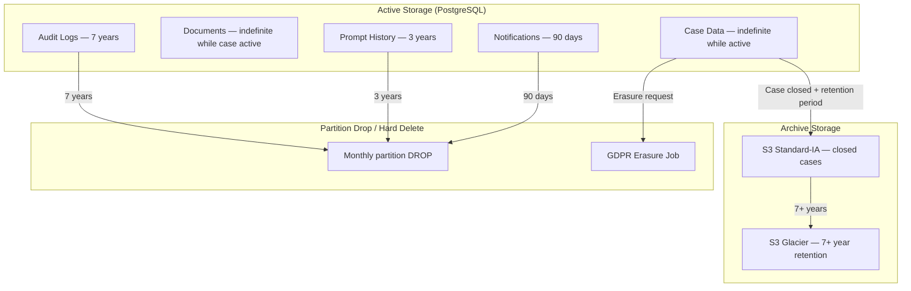
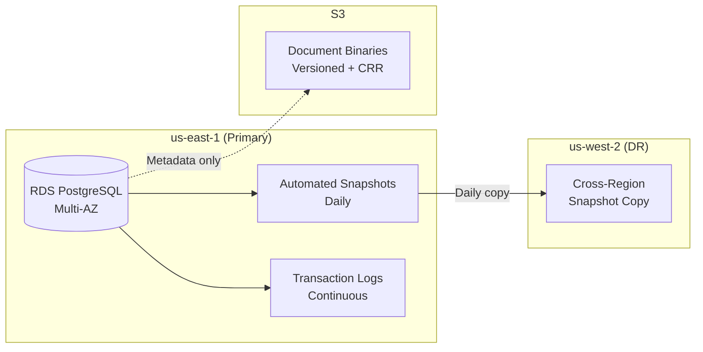
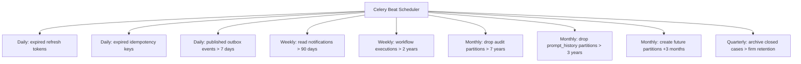
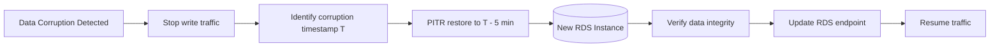
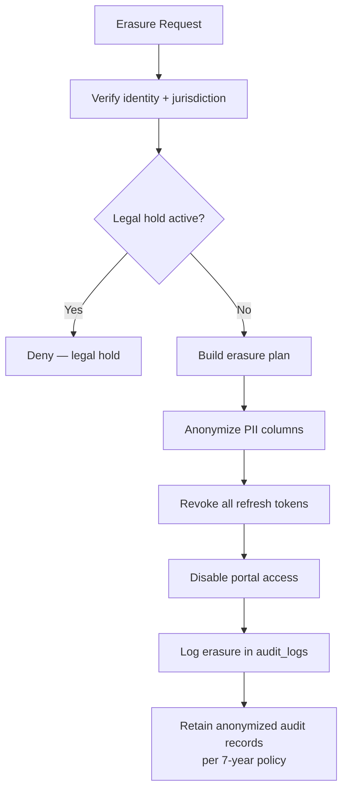

# Data Retention & Backup

**LexFlow AI** — Retention Policies, RDS Backup, and Point-in-Time Recovery  
**Version:** 1.0  
**Status:** Draft — Pre-Implementation  
**Last Updated:** 2026-07-06

---

## Purpose

This document defines **data retention policies**, **RDS backup configuration**, and **point-in-time recovery (PITR)** procedures for LexFlow AI's PostgreSQL database and associated object storage. It ensures legal compliance, cost control, and recoverability.

See [compliance-data-governance.md](../compliance-data-governance.md) for GDPR/CCPA erasure procedures and [09-deployment/disaster-recovery.md](../09-deployment/disaster-recovery.md) for HA, failover, and RPO/RTO targets.

---

## Scope

| In Scope | Out of Scope |
|----------|--------------|
| Per-table retention periods and cleanup mechanisms | S3 bucket Terraform configuration |
| RDS automated backups and PITR | Application-level cache eviction |
| Cross-region snapshot replication | RabbitMQ message retention |
| Partition drop procedures for audit and AI tables | Legal hold workflow UI |
| GDPR erasure interaction with retention | |

---

## Responsibilities

| Role | Responsibility |
|------|---------------|
| Compliance Officer | Approve retention period changes |
| DBA / SRE | Execute partition drops and backup verification |
| Backend engineer | Implement cleanup jobs (Celery beat tasks) |
| On-call engineer | Execute PITR during data corruption incidents |

---

## Architecture

### Data Lifecycle Overview



### Backup Architecture



---

## Retention Policies

### Database Tables

| Data Type | Schema.Table | Retention | Mechanism | Configurable |
|-----------|-------------|-----------|-----------|--------------|
| Active case data | `cases.*` | Indefinite while case active | — | No |
| Closed case data | `cases.*` | 7+ years after close | Archive to S3 Glacier | Yes (per firm in `firms.settings`) |
| Client data | `cases.clients` | Same as case retention | Soft delete → archive | Yes |
| Document metadata | `documents.documents` | Same as case retention | Soft delete → archive with case | Yes |
| Document versions | `documents.document_versions` | All versions retained while case active | S3 lifecycle after case archive | No |
| Document embeddings | `documents.document_embeddings` | Same as document | CASCADE delete on document re-process; archive with case | No |
| Audit logs | `audit.audit_logs` | 7 years minimum | Monthly partition DROP | Yes (firm override ≥ 7 years) |
| Prompt history | `ai.prompt_history` | 3 years | Monthly partition DROP | No |
| LLM usage aggregates | `ai.llm_usage` | 5 years | Scheduled DELETE | No |
| AI summaries | `ai.ai_summaries` | Same as case retention | Archive with case | No |
| Workflow executions | `workflows.workflow_executions` | 2 years | Scheduled DELETE | No |
| Notifications | `shared.notifications` | 90 days | Scheduled DELETE | No |
| Outbox events (published) | `shared.outbox_events` | 7 days after publish | Scheduled DELETE | No |
| Idempotency keys | `shared.idempotency_keys` | 24 hours | TTL cleanup job | No |
| Refresh tokens | `identity.refresh_tokens` | Until expiry + 7 days | Scheduled DELETE | No |

### Object Storage (S3)

| Data Type | Retention | Mechanism |
|-----------|-----------|-----------|
| Active document binaries | Indefinite while case active | S3 Standard |
| Closed case documents | 7+ years | Lifecycle → Standard-IA (90 days) → Glacier (365 days) |
| Non-current versions | 90 days Standard, then IA | S3 versioning lifecycle |
| Cross-region replica | Indefinite | CRR us-east-1 → us-west-2 |

### Legal Hold Override

When a legal hold is placed on a case, **all retention policies are suspended** for that case's data:

- No partition drops containing the case's audit records
- No S3 lifecycle transitions for the case's documents
- No GDPR erasure until hold is released

Legal hold status is stored in `cases.cases.metadata`:

```json
{
  "legal_hold": {
    "active": true,
    "placed_at": "2026-07-01T00:00:00Z",
    "placed_by": "user-uuid",
    "reason": "Pending litigation hold"
  }
}
```

---

## Cleanup Jobs

Automated cleanup runs via Celery beat scheduled tasks:



### Partition Drop Procedure

```sql
-- Example: drop audit partition older than 7 years
-- Run only after verifying no legal holds reference data in partition

-- Step 1: Verify partition age
SELECT tablename, pg_size_pretty(pg_total_relation_size(schemaname || '.' || tablename))
FROM pg_tables
WHERE schemaname = 'audit' AND tablename LIKE 'audit_logs_%'
ORDER BY tablename;

-- Step 2: Verify no legal holds (application check)

-- Step 3: Detach and drop
ALTER TABLE audit.audit_logs DETACH PARTITION audit.audit_logs_2019_01;
DROP TABLE audit.audit_logs_2019_01;
```

Partition drops are **irreversible**. Always verify:
1. Partition is beyond retention period
2. No active legal holds reference data in the partition
3. Cross-region snapshot exists as safety net

---

## RDS Backup Configuration

### Automated Backups

| Setting | Value | Rationale |
|---------|-------|-----------|
| Backup retention period | 35 days | Exceeds 7-year compliance via snapshots + PITR |
| Backup window | 03:00–04:00 UTC | Low-traffic window |
| Multi-AZ | Enabled | Synchronous standby for automatic failover |
| Encryption | AES-256 (KMS) | At-rest encryption |
| Performance Insights | Enabled | Query performance monitoring |
| Enhanced monitoring | 60-second granularity | OS-level metrics |

### Point-in-Time Recovery (PITR)

| Setting | Value |
|---------|-------|
| Transaction log retention | 35 days (matches backup retention) |
| Recovery granularity | 5 minutes |
| Recovery method | Restore to new RDS instance |



### PITR Procedure

1. **Identify corruption point** — Use audit logs and application logs to determine last known-good timestamp
2. **Stop write traffic** — Scale ECS API and worker tasks to 0
3. **Restore to new instance** — AWS Console or CLI:
   ```bash
   aws rds restore-db-instance-to-point-in-time \
     --source-db-instance-identifier lexflow-prod \
     --target-db-instance-identifier lexflow-prod-pitr \
     --restore-time 2026-07-06T10:30:00Z
   ```
4. **Verify data** — Run smoke tests against restored instance
5. **Swap endpoint** — Update Secrets Manager RDS endpoint to new instance
6. **Resume traffic** — Scale ECS tasks back up
7. **Post-incident** — Delete old instance after 7-day verification period

### Manual Pre-Deploy Snapshots

| Trigger | Retention | Naming |
|---------|-----------|--------|
| Every production deployment | 7 days | `lexflow-prod-pre-deploy-{YYYYMMDD}-{HHMM}` |
| Before destructive migration | 7 days | `lexflow-prod-pre-migration-{revision}` |
| Before partition drop | 35 days | `lexflow-prod-pre-partition-drop-{YYYYMM}` |

---

## Cross-Region Backup

| Control | Setting |
|---------|---------|
| Source region | us-east-1 |
| Destination region | us-west-2 |
| Copy frequency | Daily (after automated snapshot) |
| Retention | 35 days |
| Encryption | KMS key in destination region |

Cross-region snapshots enable full region failure recovery. See [09-deployment/disaster-recovery.md](../09-deployment/disaster-recovery.md) for DR failover procedure (RTO ≤ 4 hours).

---

## Recovery Objectives

| Metric | Target | Mechanism |
|--------|--------|-----------|
| **RPO** (Recovery Point Objective) | ≤ 15 minutes | Continuous WAL archiving + PITR |
| **RTO** (Recovery Time Objective) | ≤ 4 hours | Cross-region snapshot restore |
| **Data durability** | 99.999999999% (11 nines) | RDS Multi-AZ + S3 versioning + CRR |
| **Backup verification** | Monthly | Restore snapshot to test instance, run smoke tests |

### Recovery Scenario Matrix

| Scenario | RTO | Procedure |
|----------|-----|-----------|
| Single AZ failure | ~2 min | Multi-AZ automatic failover |
| RDS primary failure | ~2 min | Multi-AZ automatic failover |
| Data corruption (recent) | ~1 hour | PITR to point before corruption |
| Full region failure | ~4 hours | Restore cross-region snapshot in us-west-2 |
| Accidental table DROP | ~1 hour | PITR or pre-deploy snapshot restore |
| Ransomware / security breach | ~4 hours | Restore from clean cross-region snapshot; rotate all secrets |

---

## GDPR & Data Erasure

GDPR and CCPA erasure requests interact with retention policies:



Erasure does **not** delete audit logs — it anonymizes PII fields (`actor_id`, `ip_address`, `user_agent`, `before_state`/`after_state` PII). See [compliance-data-governance.md](../compliance-data-governance.md) for full procedures.

---

## Monitoring & Alerting

| Alert | Condition | Action |
|-------|-----------|--------|
| Backup failure | RDS automated backup failed | Page on-call; manual snapshot |
| Storage > 80% | RDS allocated storage threshold | Scale storage; review retention |
| Partition missing | No partition for next month | Run partition creation migration |
| Cleanup job failure | Celery task failed 3 consecutive times | Page on-call; manual cleanup |
| Snapshot age > 36 hours | No successful snapshot in 36 hours | Page on-call |
| PITR window shrinking | WAL archive lag > 1 hour | Investigate replication lag |

---

## Best Practices

1. **Never drop partitions without a recent snapshot** — Pre-partition-drop snapshot is mandatory.
2. **Test PITR quarterly** — Restore to test instance and run smoke tests.
3. **Check legal holds before any destructive operation** — Application-level guard in cleanup jobs.
4. **Archive before delete** — Closed cases move to S3 Glacier before database rows are hard-deleted.
5. **Monitor backup storage costs** — 35-day retention × daily snapshots × database size.
6. **Document every PITR event** — Post-incident report with corruption root cause.
7. **Keep pre-deploy snapshots for 7 days minimum** — Enables fast rollback after bad deploys.

---

## Tradeoffs

| Decision | Benefit | Cost |
|----------|---------|------|
| 35-day RDS backup retention | PITR within 35 days | Storage cost (~2x database size) |
| 7-year audit retention | Legal compliance default | Growing partition count (84 partitions) |
| Partition DROP vs. DELETE | Instant, no vacuum overhead | Irreversible; requires snapshot safety net |
| S3 Glacier for archived cases | ~90% storage cost reduction | Retrieval latency (minutes to hours) |
| Cross-region snapshot copy | Region failure recovery | Cross-region data transfer costs |
| Soft delete + archive vs. immediate hard delete | Recovery window | Two-phase cleanup complexity |

---

## Future Improvements

| Phase | Item |
|-------|------|
| Phase 2 | Automated PITR test in CI (monthly restore to ephemeral instance) |
| Phase 2 | Firm-configurable retention periods via admin UI |
| Phase 3 | Legal hold management UI with audit trail |
| Phase 3 | Backup cost optimization (snapshot tiering) |
| Phase 4 | Immutable backup vault (AWS Backup Vault Lock) for ransomware protection |

---

## References

- [09-deployment/disaster-recovery.md](../09-deployment/disaster-recovery.md)
- [compliance-data-governance.md](../compliance-data-governance.md)
- [schema-overview.md](./schema-overview.md)
- [audit-schema.md](./audit-schema.md)
- [migrations.md](./migrations.md)
- [03-architecture/nfr-requirements.md](../03-architecture/nfr-requirements.md)
- [AWS RDS Backup Documentation](https://docs.aws.amazon.com/AmazonRDS/latest/UserGuide/CHAP_CommonTasks.BackupRestore.html)
