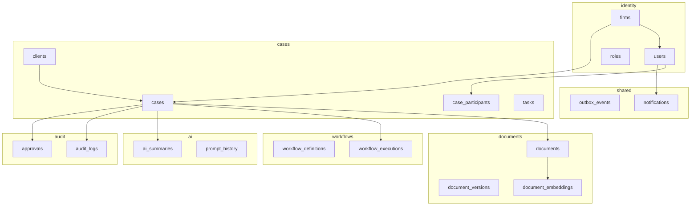
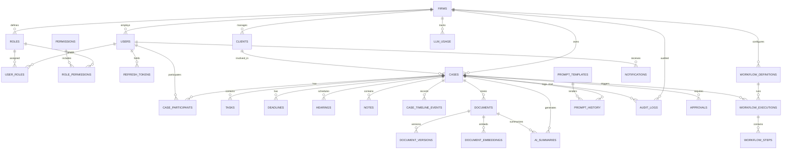
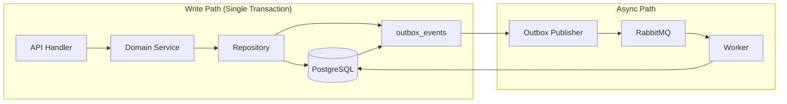
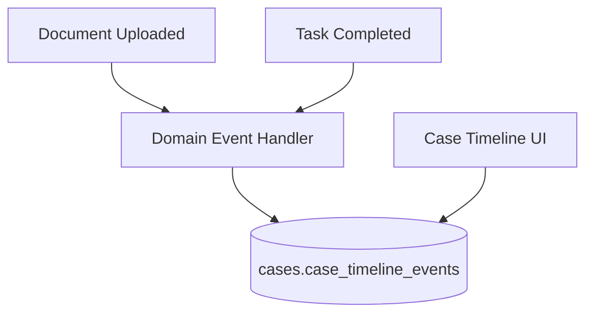

# Schema Overview

**LexFlow AI** — Cross-Schema Database Design  
**Version:** 1.0  
**Status:** Draft — Pre-Implementation  
**Last Updated:** 2026-07-06

---

## Purpose

This document provides a **cross-schema view** of the LexFlow AI PostgreSQL database. It maps bounded contexts to schemas, defines shared conventions, and shows entity relationships across the seven logical schemas.

For table-level detail, see the schema-specific documents in this directory.

---

## Scope

| In Scope | Out of Scope |
|----------|--------------|
| Seven schemas: `identity`, `cases`, `documents`, `workflows`, `ai`, `audit`, `shared` | Individual column definitions (see per-schema docs) |
| Cross-schema relationship map | Application repository implementations |
| Shared column conventions | Migration file contents |
| Context ownership boundaries | n8n workflow storage |

---

## Responsibilities

| Schema | Bounded Context | Owns Writes To |
|--------|-----------------|----------------|
| `identity` | Identity & Access | Firms, users, roles, permissions, refresh tokens |
| `cases` | Case Management | Clients, cases, participants, tasks, deadlines, hearings, notes, timeline |
| `documents` | Document Management | Documents, versions, embeddings |
| `workflows` | Workflow Orchestration | Definitions, executions, steps |
| `ai` | AI Services | Summaries, prompt history, templates, usage |
| `audit` | Compliance & Audit | Audit logs, approvals |
| `shared` | Platform Infrastructure | Outbox events, notifications, idempotency keys |

---

## Architecture

### Context Map



### Full Entity-Relationship Diagram



---

## Shared Conventions

Every schema follows these rules unless explicitly noted otherwise.

### Primary Keys

```sql
id UUID PRIMARY KEY DEFAULT gen_random_uuid()
```

UUIDs are generated in the database. Application code may pre-generate UUIDs for outbox correlation but must not use sequential integers.

### Tenant Isolation

All tenant-scoped tables include:

```sql
firm_id UUID NOT NULL REFERENCES identity.firms(id)
```

Queries **must** filter by `firm_id` from the authenticated JWT. Cross-firm data access is a critical security violation.

### Timestamps

```sql
created_at TIMESTAMPTZ NOT NULL DEFAULT now(),
updated_at TIMESTAMPTZ NOT NULL DEFAULT now()
```

Application services set `updated_at` on every mutation. Database triggers may enforce this as a safety net.

### Soft Delete

User-facing entities include:

```sql
deleted_at TIMESTAMPTZ  -- NULL = active
```

Partial indexes exclude soft-deleted rows where appropriate:

```sql
CREATE INDEX idx_cases_active
ON cases.cases (firm_id, status)
WHERE deleted_at IS NULL;
```

### Optimistic Concurrency

Mutable aggregates include:

```sql
version INTEGER NOT NULL DEFAULT 1
```

Update pattern:

```sql
UPDATE cases.cases
SET title = :title, version = version + 1, updated_at = now()
WHERE id = :id AND version = :expected_version AND firm_id = :firm_id;
-- affected_rows = 0 → HTTP 409 Conflict
```

### Enumerated Types

PostgreSQL native ENUMs are defined per schema. Naming convention: `{schema}.{entity}_{field}` (e.g., `cases.case_status`).

### JSONB Metadata

Extensible fields use `metadata JSONB DEFAULT '{}'` with GIN indexes where search is required.

---

## Schema Inventory

| Schema | Tables | Partitioned | Extensions |
|--------|--------|-------------|------------|
| `identity` | 7 | No | — |
| `cases` | 8 | No | — |
| `documents` | 3 | No | pgvector |
| `workflows` | 3 | No | — |
| `ai` | 4 | `prompt_history` (monthly) | — |
| `audit` | 2 | `audit_logs` (monthly) | — |
| `shared` | 3 | No | — |

**Total:** 30 tables across 7 schemas.

---

## Flow Diagrams

### Cross-Context Data Flow



Cross-schema writes within a single transaction are permitted when the application service orchestrates them (e.g., create case + emit outbox event). Direct cross-schema writes from unrelated modules are prohibited.

### Read Path with Denormalization



Timeline events are **denormalized projections** written by event handlers. The timeline table is owned by the `cases` schema but populated from events originating in other contexts.

---

## Cross-Schema Reference Rules

| From | To | Allowed | Pattern |
|------|-----|---------|---------|
| `cases` | `identity.users` | Read (FK) | FK reference only; no writes |
| `documents` | `cases.cases` | Read (FK) | FK + denormalized `firm_id` |
| `workflows` | `cases.cases` | Read (FK) | Nullable FK for firm-wide workflows |
| `ai` | `cases.cases`, `documents.documents` | Read (FK) | FK references |
| `audit` | All schemas | Read (FK) | Denormalized `case_id`, `firm_id` |
| `shared` | All schemas | Write (outbox) | Aggregate type + ID only |
| Any | Any (cross-write) | **Prohibited** | Use application service + outbox |

---

## Best Practices

1. **Prefix all SQL with schema name** — `SELECT * FROM cases.cases`, never bare table names.
2. **Define FKs across schemas explicitly** — Cross-schema foreign keys enforce referential integrity at the database level.
3. **Denormalize sparingly** — Only `firm_id` on documents and `case_id` on audit logs; document the sync contract.
4. **Keep ENUMs in owning schema** — Do not share ENUM types across schemas; use VARCHAR + CHECK if cross-schema enum is needed.
5. **Grant schema-level permissions** — Application role gets INSERT/UPDATE/SELECT on domain schemas; INSERT-only on `audit.audit_logs`.

---

## Tradeoffs

| Decision | Rationale | Alternative Considered |
|----------|-----------|-------------------------|
| 7 schemas vs. fewer | Matches bounded contexts exactly; extraction-ready | 3 schemas (core, platform, audit) — rejected for weaker boundaries |
| Cross-schema FKs | Database-enforced integrity | Application-only references — rejected for orphan risk |
| Denormalized timeline | Sub-10ms timeline queries | Live joins across 5 tables — rejected for latency |
| Native ENUMs vs. lookup tables | Type safety, compact storage | Lookup tables — deferred; may migrate for dynamic enums |
| `shared` schema for outbox | Platform concern, not domain | Outbox in each schema — rejected for publisher complexity |

---

## Future Improvements

| Item | Description |
|------|-------------|
| Schema-level RLS | `SET app.current_firm_id` session variable + policies |
| Materialized views | Firm dashboard aggregates refreshed every 5 minutes |
| Read-only reporting role | Cross-schema SELECT grants for BI tools |
| Event store table | Full event sourcing for Case aggregate (currently partial via outbox) |
| Schema versioning | Tag schemas with migration version for extraction tooling |

---

## References

- [identity-schema.md](./identity-schema.md)
- [cases-schema.md](./cases-schema.md)
- [documents-schema.md](./documents-schema.md)
- [workflows-schema.md](./workflows-schema.md)
- [ai-schema.md](./ai-schema.md)
- [audit-schema.md](./audit-schema.md)
- [02-domain/bounded-contexts.md](../02-domain/bounded-contexts.md)
- [03-architecture/data-flow.md](../03-architecture/data-flow.md)
- [ADR-003: Single PostgreSQL](../13-decisions/003-postgresql-single-database.md)
