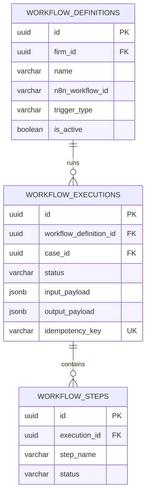
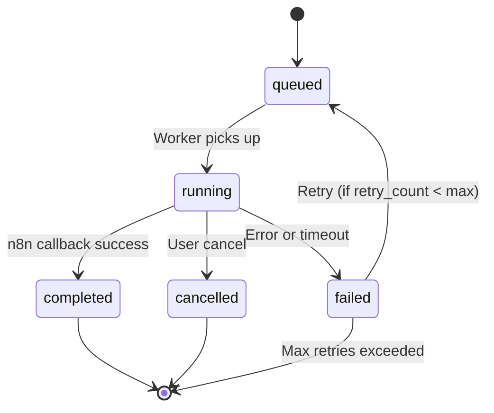
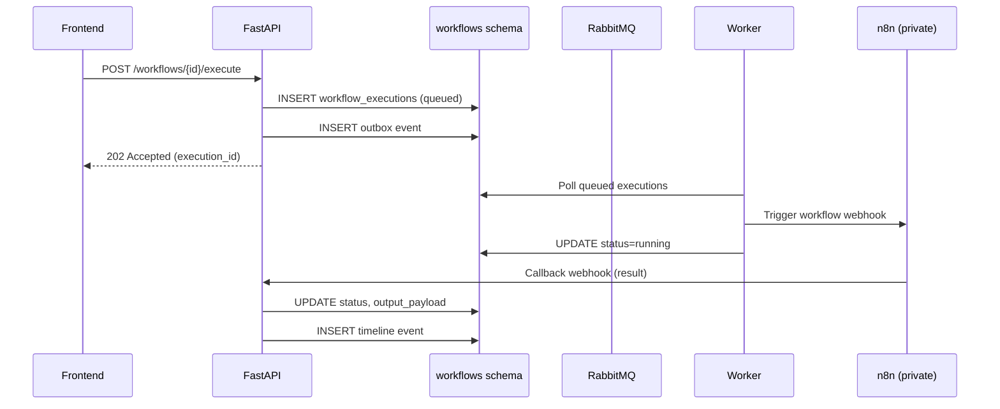
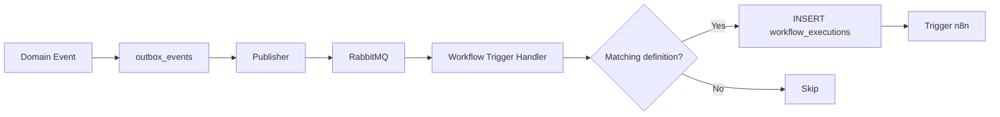
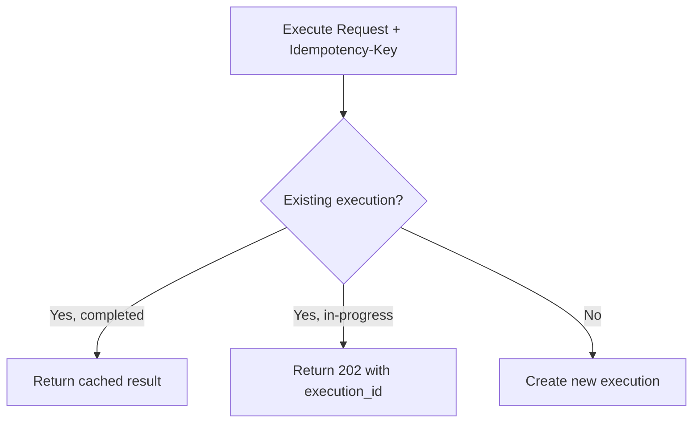

# Workflows Schema

**LexFlow AI** — `workflows` Schema Reference  
**Version:** 1.0  
**Status:** Draft — Pre-Implementation  
**Last Updated:** 2026-07-06

---

## Purpose

The `workflows` schema stores **workflow definition metadata and execution state** for LexFlow AI's n8n-orchestrated automation. n8n executes workflow graphs; this schema tracks what ran, when, with what input/output, and the step-level progress.

Business logic remains in FastAPI — n8n is orchestration-only. See [ADR-002](../13-decisions/002-n8n-orchestration-only.md) and [02-domain/workflow-aggregate.md](../02-domain/workflow-aggregate.md).

---

## Scope

| In Scope | Out of Scope |
|----------|--------------|
| Workflow definition registry (metadata + n8n reference) | n8n workflow JSON storage (Git repo is source of truth) |
| Execution records with status, payloads, correlation | n8n internal execution logs |
| Step-level progress tracking | n8n credential management |
| Idempotency and retry tracking | Workflow design UI |

---

## Responsibilities

| Table | Responsibility |
|-------|----------------|
| `workflow_definitions` | Registered workflows — name, trigger type, n8n reference |
| `workflow_executions` | Execution instances with input/output and status |
| `workflow_steps` | Step-level progress within an execution |

---

## Architecture

### Entity-Relationship Diagram

### Execution Lifecycle

---

## Tables

### `workflows.workflow_definitions`

Registered workflow templates. Links to n8n workflow by ID; n8n JSON lives in Git.

| Column | Type | Constraints | Notes |
|--------|------|-------------|-------|
| `id` | UUID | PK | |
| `firm_id` | UUID | NULL, FK → identity.firms | NULL = system template |
| `name` | VARCHAR(255) | NOT NULL | Display name |
| `slug` | VARCHAR(100) | NOT NULL | URL-safe identifier |
| `description` | TEXT | NULL | |
| `n8n_workflow_id` | VARCHAR(100) | NOT NULL | n8n workflow ID on sandbox/production |
| `trigger_type` | workflows.trigger_type | NOT NULL | ENUM: manual, event, schedule |
| `is_active` | BOOLEAN | NOT NULL DEFAULT true | |
| `config_schema` | JSONB | NULL | JSON Schema for user-configurable parameters |
| `version` | INTEGER | NOT NULL DEFAULT 1 | Definition version |
| `created_at` | TIMESTAMPTZ | NOT NULL DEFAULT now() | |
| `updated_at` | TIMESTAMPTZ | NOT NULL DEFAULT now() | |

**Unique:** `(COALESCE(firm_id, '00000000-0000-0000-0000-000000000000'), slug)`

**Indexes:**
- `(firm_id, is_active) WHERE is_active = true` — active workflow list
- `(n8n_workflow_id)` — reverse lookup from n8n callback

---

### `workflows.workflow_executions`

Execution instances. Created when a workflow is triggered; updated by n8n callback.

| Column | Type | Constraints | Notes |
|--------|------|-------------|-------|
| `id` | UUID | PK | |
| `workflow_definition_id` | UUID | NOT NULL, FK → workflow_definitions | |
| `case_id` | UUID | NULL, FK → cases.cases | Nullable for firm-wide workflows |
| `firm_id` | UUID | NOT NULL, FK → identity.firms | Denormalized |
| `triggered_by` | UUID | NULL, FK → identity.users | NULL for event/schedule triggers |
| `status` | workflows.execution_status | NOT NULL DEFAULT 'queued' | ENUM: queued, running, completed, failed, cancelled |
| `input_payload` | JSONB | NOT NULL DEFAULT '{}' | Sanitized input sent to n8n |
| `output_payload` | JSONB | NULL | Result from n8n callback |
| `correlation_id` | UUID | NOT NULL | Distributed tracing ID |
| `idempotency_key` | VARCHAR(255) | NULL | Dedup key from client |
| `n8n_execution_id` | VARCHAR(100) | NULL | n8n internal execution ID |
| `started_at` | TIMESTAMPTZ | NULL | |
| `completed_at` | TIMESTAMPTZ | NULL | |
| `error_message` | TEXT | NULL | Last error detail |
| `retry_count` | INTEGER | NOT NULL DEFAULT 0 | |
| `max_retries` | INTEGER | NOT NULL DEFAULT 3 | |
| `created_at` | TIMESTAMPTZ | NOT NULL DEFAULT now() | |
| `updated_at` | TIMESTAMPTZ | NOT NULL DEFAULT now() | |

**Indexes:**
- `(case_id, created_at DESC) WHERE case_id IS NOT NULL` — case workflow history
- `(firm_id, status, created_at DESC)` — firm execution dashboard
- `(status, created_at) WHERE status IN ('queued', 'running')` — worker polling
- `(idempotency_key) UNIQUE WHERE idempotency_key IS NOT NULL`
- `(correlation_id)` — tracing lookup
- `(n8n_execution_id) WHERE n8n_execution_id IS NOT NULL` — callback matching

---

### `workflows.workflow_steps`

Step-level progress within an execution. Updated by n8n webhook callbacks or worker polling.

| Column | Type | Constraints | Notes |
|--------|------|-------------|-------|
| `id` | UUID | PK | |
| `execution_id` | UUID | NOT NULL, FK → workflow_executions | |
| `step_name` | VARCHAR(255) | NOT NULL | n8n node name |
| `step_order` | INTEGER | NOT NULL | Execution order |
| `status` | workflows.step_status | NOT NULL DEFAULT 'pending' | ENUM: pending, running, completed, failed, skipped |
| `started_at` | TIMESTAMPTZ | NULL | |
| `completed_at` | TIMESTAMPTZ | NULL | |
| `metadata` | JSONB | NOT NULL DEFAULT '{}' | Step-specific data |
| `error_message` | TEXT | NULL | |

**Indexes:**
- `(execution_id, step_order)` — step progress list

---

## Flow Diagrams

### Manual Workflow Trigger

### Event-Triggered Workflow

Event-to-workflow mapping is configured in `workflow_definitions.config_schema` and evaluated by the trigger handler.

---

## Idempotency

Clients may supply an `Idempotency-Key` header. The API stores it on `workflow_executions.idempotency_key` with a unique partial index.

Shared idempotency for HTTP endpoints also uses `shared.idempotency_keys` (24-hour TTL). Workflow executions maintain their own key for long-running dedup.

---

## Best Practices

1. **Sanitize input_payload before storage** — Strip PII not needed for audit; n8n receives full payload via secure channel.
2. **Set correlation_id on every execution** — Propagate through n8n webhook headers for end-to-end tracing.
3. **Never store n8n credentials in this schema** — n8n manages its own credential vault.
4. **Use idempotency_key for event-triggered workflows** — Derive from `{event_type}:{aggregate_id}:{event_id}`.
5. **Cap retry_count** — Default max 3; dead-letter after exhaustion with alert.
6. **Record n8n_execution_id on callback** — Enables cross-reference with n8n execution logs.

---

## Tradeoffs

| Decision | Benefit | Cost |
|----------|---------|------|
| Metadata-only in PG, JSON in Git | Single source of truth for workflow logic | Must sync n8n_workflow_id on deploy |
| Async execution (202 Accepted) | Non-blocking API; handles long workflows | Client must poll or use webhooks for status |
| Step-level tracking | Granular progress UI | Extra writes on each n8n callback |
| Denormalized firm_id | Firm dashboard without definition join | Must set on insert |
| Idempotency on executions | Safe retries from event handlers | Unique index maintenance |

---

## Future Improvements

| Phase | Item |
|-------|------|
| Phase 2 | Workflow execution timeout and auto-cancel job |
| Phase 2 | Execution cost tracking (n8n API call counts) |
| Phase 3 | Workflow version pinning (execute against specific definition version) |
| Phase 3 | Parallel step tracking for n8n split/merge nodes |
| Phase 4 | Workflow analytics materialized view (success rate, avg duration) |

---

## References

- [02-domain/workflow-aggregate.md](../02-domain/workflow-aggregate.md)
- [04-api/endpoints-workflows.md](../04-api/endpoints-workflows.md)
- [workflow-orchestration.md](../workflow-orchestration.md)
- [ADR-002: n8n Orchestration Only](../13-decisions/002-n8n-orchestration-only.md)
- [schema-overview.md](./schema-overview.md)
