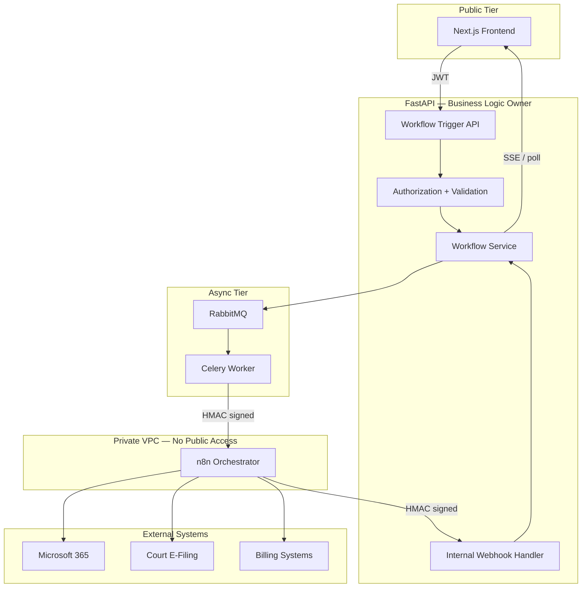
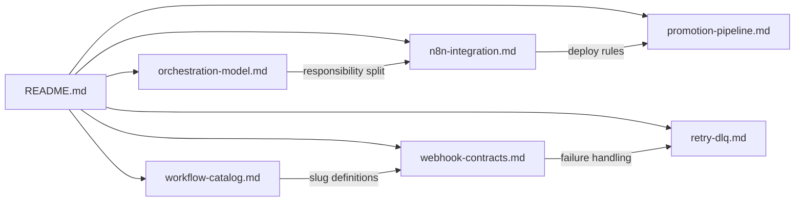

# Workflow Orchestration Documentation — LexFlow AI

**LexFlow AI** — n8n Integration & Workflow Operations  
**Version:** 1.0  
**Status:** Draft — Pre-Implementation  
**Last Updated:** 2026-07-06

---

## Purpose

This folder is the **canonical reference for workflow orchestration** in LexFlow AI. It defines how FastAPI owns all business logic, authorization, and state while n8n acts as a **private, orchestration-only** integration engine.

Engineers, architects, security reviewers, and SRE teams use these documents to implement workflow triggers, n8n callbacks, retry policies, and environment promotion without moving legal or authorization logic into n8n.

---

## Core Principles

| Principle | Enforcement |
|-----------|---------------|
| **FastAPI owns logic** | Authorization, validation, state transitions, audit — all in Python |
| **n8n orchestrates only** | HTTP calls, retries, payload transforms, scheduling |
| **n8n is never public** | Private subnet, internal DNS, no public ALB route |
| **n8n never writes to PostgreSQL** | No DB credentials; no PostgreSQL nodes |
| **All communication is HMAC-signed** | Trigger and callback payloads verified |

See [ADR-002: n8n as Orchestration Engine Only](../13-decisions/002-n8n-orchestration-only.md).

---

## Scope

| In Scope | Out of Scope |
|----------|--------------|
| Orchestration model and responsibility split | n8n workflow JSON node-by-node configuration |
| n8n network security and node restrictions | FastAPI domain handler implementation |
| Workflow catalog and trigger types | Public REST API endpoint specs (see [../04-api/](../04-api/)) |
| FastAPI ↔ n8n webhook payload schemas | Database DDL (see [../database-architecture.md](../database-architecture.md)) |
| Retry policies and dead letter queues | Terraform module internals |
| Dev → staging → prod promotion pipeline | n8n UI administration procedures |

---

## Responsibilities

| Audience | Use This Folder To |
|----------|-------------------|
| **Backend Engineers** | Implement workflow service, callbacks, and worker triggers |
| **Integration Engineers** | Author n8n workflows within node restrictions |
| **DevOps / SRE** | Deploy n8n, manage promotion pipeline, monitor DLQs |
| **Security Reviewers** | Validate network isolation, HMAC auth, node prohibitions |
| **Solution Architects** | Confirm orchestration boundaries align with ADR-002 |

---

## Architecture

### Canonical Data Path

```
Frontend → FastAPI → Queue → Worker → n8n → External Systems
                              ↑                    ↓
                              └──── HMAC Callback ─┘
```



### Document Map



---

## Document Index

| Document | Description |
|----------|-------------|
| [orchestration-model.md](./orchestration-model.md) | Responsibility split — FastAPI owns logic, n8n orchestrates |
| [n8n-integration.md](./n8n-integration.md) | Private n8n deployment, security controls, node restrictions |
| [workflow-catalog.md](./workflow-catalog.md) | Initial workflow catalog with triggers, inputs, and outputs |
| [webhook-contracts.md](./webhook-contracts.md) | FastAPI ↔ n8n trigger and callback payload schemas |
| [retry-dlq.md](./retry-dlq.md) | Retry policies, dead letter queues, failure recovery |
| [promotion-pipeline.md](./promotion-pipeline.md) | Dev → staging → prod workflow promotion pipeline |

---

## Cross-References

| Related Document | Relationship |
|------------------|--------------|
| [../03-architecture/data-flow.md](../03-architecture/data-flow.md) | Canonical async path including n8n |
| [../04-api/webhooks-internal.md](../04-api/webhooks-internal.md) | Internal webhook API specification |
| [../04-api/endpoints-workflows.md](../04-api/endpoints-workflows.md) | Public workflow trigger and status API |
| [../02-domain/workflow-aggregate.md](../02-domain/workflow-aggregate.md) | WorkflowDefinition and WorkflowExecution domain model |
| [../13-decisions/002-n8n-orchestration-only.md](../13-decisions/002-n8n-orchestration-only.md) | Architectural decision — n8n orchestration only |
| [../03-architecture/integration-patterns.md](../03-architecture/integration-patterns.md) | Adapter pattern and Microsoft 365 integration |
| [../workflow-orchestration.md](../workflow-orchestration.md) | Executive summary (superseded by this folder for detail) |

---

## Quick Reference

### Workflow Lifecycle States

| Status | Description |
|--------|-------------|
| `queued` | Created by FastAPI; awaiting Celery worker |
| `running` | Worker invoked n8n; external calls in progress |
| `completed` | n8n callback received with success |
| `failed` | n8n callback error, timeout, or DLQ exhaustion |
| `cancelled` | User cancelled before completion |

### Initial Workflow Slugs

| Slug | Trigger |
|------|---------|
| `intake-new-client-v1` | Event: `CaseCreated` |
| `document-upload-notify-v1` | Event: `DocumentUploaded` |
| `deadline-reminder-v1` | Schedule: daily |
| `ai-summary-notify-v1` | Event: `SummaryGenerated` |
| `case-close-archive-v1` | Event: `CaseStatusChanged(closed)` |
| `discovery-request-v1` | Manual |
| `conflict-check-v1` | Event: `CaseCreated` |

Full catalog: [workflow-catalog.md](./workflow-catalog.md).

---

## Best Practices

1. **Read ADR-002 before authoring n8n workflows** — Business logic in n8n is an architectural violation.
2. **Start with orchestration-model.md** — Understand the responsibility split before writing integration code.
3. **Register new slugs in workflow-catalog.md and webhook-contracts.md** — Schema and catalog must stay synchronized.
4. **Never expose n8n URLs outside the VPC** — Internal DNS only; no public DNS records.
5. **Promote workflows through the pipeline** — No manual JSON import to production without CI validation.
6. **Update this folder in the same PR as workflow JSON changes** — Documentation and workflow definitions ship together.

---

## Tradeoffs

| Decision | Benefit | Cost |
|----------|---------|------|
| Dedicated `06-workflows/` folder | Clear ownership; deep operational detail | Some overlap with `workflow-orchestration.md` summary |
| n8n as separate orchestrator | Rich connector library; visual debugging | Additional service to operate and secure |
| HMAC over mTLS for n8n comms | Works with n8n HTTP nodes; simple rotation | Shared secret blast radius |
| Slug-versioned workflows (`-v1`) | Safe parallel deployments | Schema and catalog maintenance per version |

---

## Future Improvements

| Phase | Enhancement |
|-------|-------------|
| Phase 2 | Workflow execution analytics dashboard |
| Phase 2 | Dry-run / simulation mode against staging n8n |
| Phase 3 | Per-workflow HMAC secrets with automatic rotation |
| Phase 3 | mTLS supplement to HMAC between n8n and FastAPI |
| Phase 4 | Workflow dependency DAG for multi-step automations |

---

## References

- [../README.md](../README.md) — Documentation index
- [../03-architecture/README.md](../03-architecture/README.md) — C4 architecture
- [../04-api/README.md](../04-api/README.md) — REST API reference
- [../13-decisions/README.md](../13-decisions/README.md) — Architecture Decision Records
