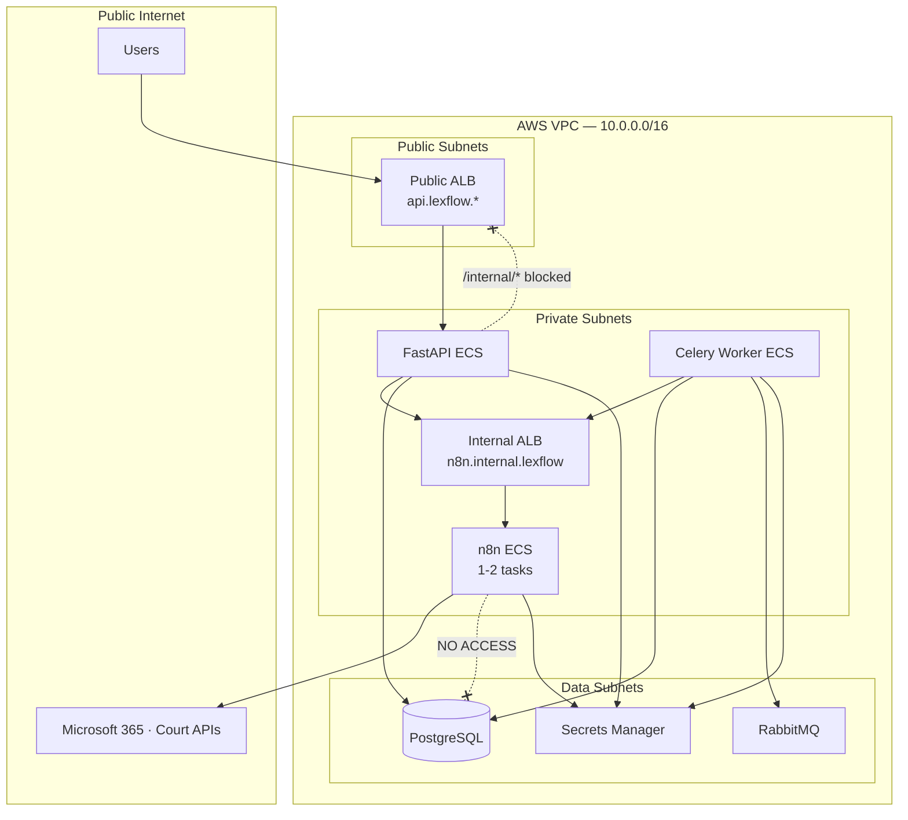
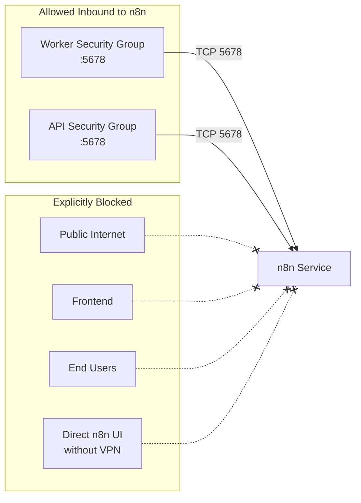
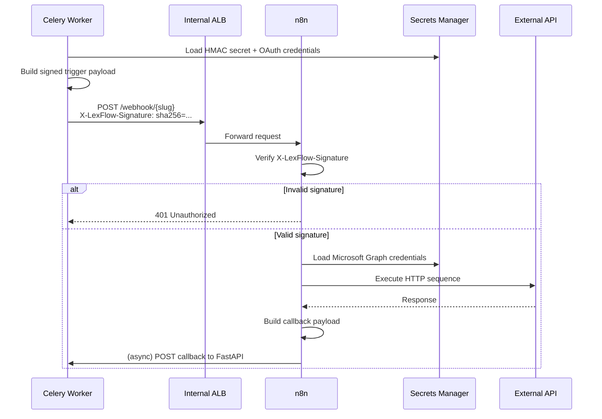
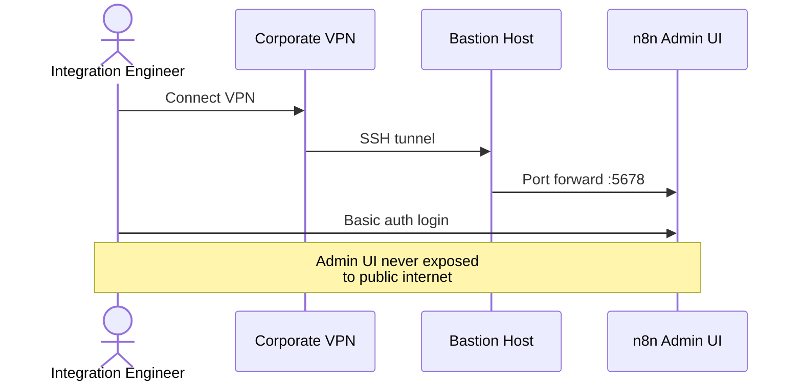
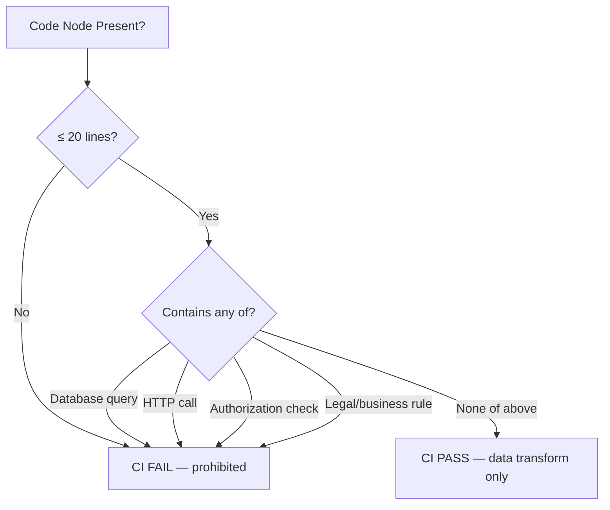
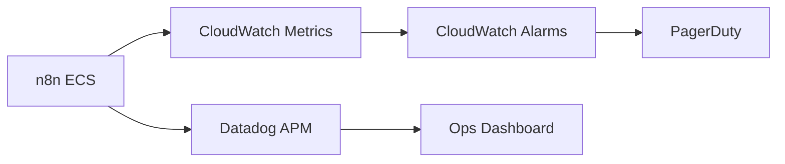

# n8n Integration

**LexFlow AI** — Private Deployment, Security & Node Restrictions  
**Version:** 1.0  
**Status:** Draft — Pre-Implementation  
**Last Updated:** 2026-07-06

---

## Purpose

This document specifies how n8n is deployed, secured, and constrained within LexFlow AI. n8n is a **private orchestration service** — never publicly accessible, never authoritative for business decisions, and restricted to an approved set of node types.

All integration engineers and security reviewers must validate n8n workflows against this document before promotion to staging or production.

---

## Scope

| In Scope | Out of Scope |
|----------|--------------|
| n8n deployment topology (ECS Fargate) | n8n open-source contribution or fork |
| Network isolation and access controls | FastAPI internal webhook handler code |
| Authentication and credential management | Microsoft Graph API reference |
| Approved and prohibited node types | Individual workflow business steps |
| n8n versioning and patching | n8n Enterprise license negotiation |
| Monitoring and audit integration | VPN/bastion setup procedures |

---

## Responsibilities

| Component | Responsibility |
|-----------|----------------|
| **n8n ECS Service** | Execute workflow graphs; call external HTTP APIs |
| **Internal ALB** | Route worker/API traffic to n8n; no public listener |
| **AWS Secrets Manager** | Store n8n credentials, HMAC secrets, OAuth tokens |
| **Security Groups** | Restrict inbound to Worker SG + API SG only |
| **CI Pipeline** | Validate workflow JSON; scan for prohibited nodes |
| **FastAPI Callback Handler** | Receive execution results; persist audit trail |
| **CloudWatch + Datadog** | Monitor n8n health, execution duration, error rates |

---

## Architecture

### Deployment Topology



### Network Security Model



### DNS and URL Scheme

| Environment | n8n Internal URL | Public URL |
|-------------|------------------|------------|
| Local | `http://n8n:5678` (docker-compose) | None |
| Dev | `https://dev-n8n.internal.lexflow` | None |
| Staging | `https://staging-n8n.internal.lexflow` | None |
| Production | `https://prod-n8n.internal.lexflow` | None |

**Rules:**
- No public DNS A/CNAME records for n8n
- Internal hosted zone (`internal.lexflow`) only
- Webhook paths: `https://{env}-n8n.internal.lexflow/webhook/{slug}`
- Admin UI: VPN or bastion host access only

---

## Flow Diagrams

### Authenticated Trigger Flow



### Admin Access Flow



---

## Security Requirements

### Mandatory Controls

| Requirement | Implementation | Verification |
|-------------|----------------|--------------|
| **No public access** | Private subnet; internal ALB only; no public DNS | Security group audit; DNS scan |
| **Trigger authentication** | HMAC-SHA256 (`X-LexFlow-Signature`) on all inbound webhooks | Integration test per workflow |
| **Callback authentication** | HMAC-SHA256 (`X-N8N-Signature`) on all outbound callbacks | Webhook handler unit tests |
| **Credential isolation** | AWS Secrets Manager; injected at ECS task start | No secrets in workflow JSON exports |
| **No database access** | PostgreSQL nodes prohibited; no DB env vars in n8n task | CI node-type scanner |
| **Admin UI protection** | VPN/bastion only; basic auth + IP allowlist | Penetration test checklist |
| **Version pinning** | n8n Docker image tag pinned in Dockerfile | Dependabot PR for n8n updates |
| **TLS in transit** | Internal ALB terminates TLS; TLS 1.2+ to external APIs | ALB policy audit |
| **Execution audit** | All completions logged via FastAPI callback → audit_log | Audit log query |
| **Least privilege IAM** | n8n task role: Secrets Manager read only for `lexflow/n8n/*` | IAM policy review |

### Authentication Layers

| Layer | Mechanism | Scope |
|-------|-----------|-------|
| Network | Security groups + private subnet | All traffic |
| Transport | TLS 1.2+ on internal ALB | Worker/API → n8n |
| Webhook | HMAC-SHA256 shared secret | Trigger + callback payloads |
| Admin UI | HTTP basic auth + VPN | n8n editor access |
| External APIs | OAuth 2.0 / API keys via Secrets Manager | Microsoft Graph, court APIs |

### Secret Management

| Secret | Path | Rotation |
|--------|------|----------|
| n8n webhook HMAC (inbound) | `lexflow/n8n/webhook-secret` | Quarterly |
| n8n callback HMAC (outbound) | `lexflow/n8n/webhook-secret` | Quarterly (same secret) |
| n8n admin credentials | `lexflow/n8n/admin-credentials` | Quarterly |
| Microsoft Graph OAuth | `lexflow/n8n/ms-graph-oauth` | On token expiry |
| AWS SES credentials | `lexflow/n8n/ses-smtp` | Quarterly |

**Rules:**
- Secrets never appear in repo, n8n JSON exports, or CI logs
- Rotation requires coordinated update: Secrets Manager → n8n credentials → FastAPI config
- Workflow JSON uses n8n credential references (by ID), not inline values

---

## Node Restrictions

### Approved Node Types

| Node Type | Allowed Use | Restrictions |
|-----------|-------------|--------------|
| **Webhook** | Receive signed triggers from Celery worker | Must verify `X-LexFlow-Signature` |
| **HTTP Request** | Call external REST APIs | Timeout ≤ 60s; retry ≤ 3 |
| **Microsoft Graph** | Outlook, SharePoint, Teams operations | OAuth via Secrets Manager credential |
| **Send Email (SES)** | Transactional email delivery | Templates pre-approved; no content decisions |
| **Set / Edit Fields** | Payload field mapping and renaming | No conditional business logic |
| **IF / Switch** | Route based on boolean flags from FastAPI input | Flags set by FastAPI only — never derived in n8n |
| **Wait / Delay** | Rate limiting between external API calls | Max delay 5 minutes per node |
| **Code** | Simple data transformation (format dates, parse JSON) | Max 20 lines; no DB calls; no HTTP calls; no business rules |
| **Merge** | Combine parallel branch results | Structural only |
| **Respond to Webhook** | Synchronous test responses (dev only) | Not used in production workflows |

### Prohibited Node Types

| Node Type | Reason |
|-----------|--------|
| **PostgreSQL / MySQL / MongoDB** | n8n must not access system of record |
| **Redis** | No shared state outside execution context |
| **Execute Command** | Shell access prohibited |
| **SSH / FTP** | Unapproved transport protocols |
| **n8n API (self-modify)** | Workflows must not modify themselves at runtime |
| **Complex Code nodes** | Business rules belong in FastAPI |
| **AI / LLM nodes** | All AI processing via FastAPI async worker path |
| **Any node storing data externally** | No S3 writes, no external DB writes from n8n |

### Code Node Policy



**Allowed Code node examples:**
- Parse ISO date string to formatted display string
- Extract domain from email address
- Flatten nested JSON array for HTTP request body

**Prohibited Code node examples:**
- Check if case status is `active` before sending email
- Calculate statute of limitations deadline
- Query conflict database and flag matches

---

## Container Configuration

### ECS Task Definition

| Setting | Value |
|---------|-------|
| Image | `n8nio/n8n:{pinned_version}` |
| CPU | 512 (0.5 vCPU) |
| Memory | 1024 MB |
| Port | 5678 |
| Min tasks | 1 |
| Max tasks | 2 |
| Health check | `GET /healthz` every 30s |

### Environment Variables

| Variable | Source | Purpose |
|----------|--------|---------|
| `N8N_HOST` | Task definition | Internal hostname |
| `N8N_PROTOCOL` | Task definition | `https` |
| `N8N_PORT` | Task definition | `5678` |
| `WEBHOOK_URL` | Task definition | `https://{env}-n8n.internal.lexflow` |
| `N8N_BASIC_AUTH_ACTIVE` | Task definition | `true` |
| `N8N_BASIC_AUTH_USER` | Secrets Manager | Admin username |
| `N8N_BASIC_AUTH_PASSWORD` | Secrets Manager | Admin password |
| `EXECUTIONS_DATA_SAVE_ON_SUCCESS` | Task definition | `all` |
| `EXECUTIONS_DATA_SAVE_ON_ERROR` | Task definition | `all` |
| `EXECUTIONS_DATA_MAX_AGE` | Task definition | `168` (7 days) |

### Execution Data Retention

| Data | Retention | Storage |
|------|-----------|---------|
| n8n execution logs | 7 days | n8n internal SQLite/PostgreSQL |
| FastAPI workflow_executions | Case lifecycle + 7 years | PostgreSQL |
| Audit log entries | 7 years minimum | PostgreSQL (append-only) |

FastAPI is the **authoritative execution record**. n8n execution logs are operational debugging only.

---

## Monitoring & Alerting

| Metric | Threshold | Action |
|--------|-----------|--------|
| n8n task health | Unhealthy > 2 min | PagerDuty alert; ECS restart |
| Workflow execution p95 duration | > 10 minutes | Warning; investigate external API |
| HMAC verification failures | > 5 in 5 min | Critical — secret mismatch or attack |
| n8n error rate | > 10% over 15 min | Warning; check external dependencies |
| ECS CPU utilization | > 80% sustained | Scale to max tasks (2) |



---

## Repository Structure

```
n8n/
├── Dockerfile                    # Pinned n8n version
├── workflows/
│   ├── intake/
│   │   └── intake-new-client-v1.json
│   ├── documents/
│   │   └── document-upload-notify-v1.json
│   ├── notifications/
│   │   ├── deadline-reminder-v1.json
│   │   └── ai-summary-notify-v1.json
│   ├── cases/
│   │   └── case-close-archive-v1.json
│   ├── discovery/
│   │   └── discovery-request-v1.json
│   ├── compliance/
│   │   └── conflict-check-v1.json
│   └── _templates/
│       └── basic-webhook-callback.json
├── schemas/
│   ├── trigger/                  # Input payload JSON schemas
│   └── output/                   # Callback output JSON schemas
└── scripts/
    ├── validate-workflow.py      # CI: node restrictions, required nodes
    └── import-workflow.py        # Deploy to target n8n instance
```

---

## Best Practices

1. **Never export workflows with credentials** — Strip credential IDs before committing JSON to repo.
2. **Use the `_templates/basic-webhook-callback.json` template** — Ensures HMAC callback node is present.
3. **Pin n8n version in Dockerfile** — Upgrade via PR with integration test run on staging.
4. **Test workflows on staging n8n before production** — See [promotion-pipeline.md](./promotion-pipeline.md).
5. **Keep Code nodes under 20 lines** — If longer, the logic belongs in FastAPI.
6. **Name HTTP Request nodes after external operations** — e.g., `create-sharepoint-folder`, not `HTTP Request 3`.
7. **Set explicit timeouts on all HTTP nodes** — Default 60 seconds; never unlimited.
8. **Alert on HMAC 401 spikes immediately** — Indicates secret rotation failure or misconfiguration.

---

## Tradeoffs

| Decision | Benefit | Cost |
|----------|---------|------|
| n8n on ECS Fargate (not SaaS) | Full network control; data stays in VPC | Self-managed patching and scaling |
| Node allowlist vs blocklist | Clear guidance for engineers | Must update list when n8n adds new nodes |
| Shared HMAC secret | Simple rotation; one secret to manage | Blast radius if compromised |
| 7-day n8n execution retention | Keeps n8n storage bounded | Must use FastAPI for long-term audit |
| VPN for admin UI | Strong access control | Extra step for integration engineers |
| Code nodes allowed (limited) | Practical data transforms | Risk of logic creep — requires CI enforcement |

---

## Future Improvements

| Phase | Enhancement |
|-------|-------------|
| Phase 2 | mTLS between n8n and FastAPI (supplement HMAC) |
| Phase 2 | Per-workflow HMAC secrets |
| Phase 3 | n8n execution export to S3 for long-term debug archive |
| Phase 3 | Automated credential rotation without downtime |
| Phase 4 | Evaluate n8n Enterprise for SSO and advanced RBAC |

---

## References

- [ADR-002: n8n as Orchestration Engine Only](../13-decisions/002-n8n-orchestration-only.md)
- [orchestration-model.md](./orchestration-model.md) — Responsibility split
- [webhook-contracts.md](./webhook-contracts.md) — HMAC signing specification
- [promotion-pipeline.md](./promotion-pipeline.md) — Deploy procedures
- [../04-api/webhooks-internal.md](../04-api/webhooks-internal.md) — Callback API
- [../03-architecture/data-flow.md](../03-architecture/data-flow.md) — Async path
- [../security-architecture.md](../security-architecture.md) — Threat model
- [../deployment-architecture.md](../deployment-architecture.md) — ECS topology
