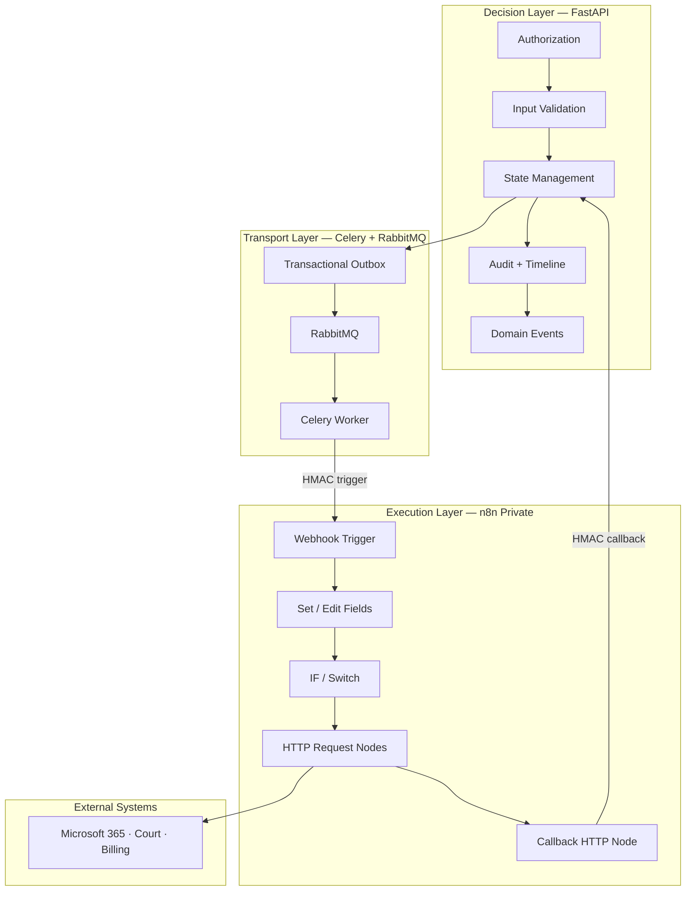
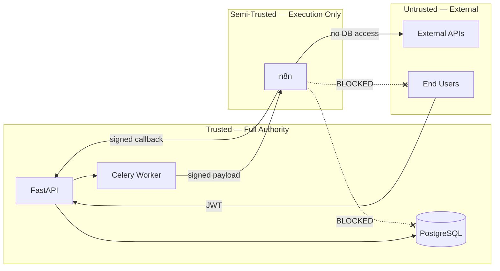
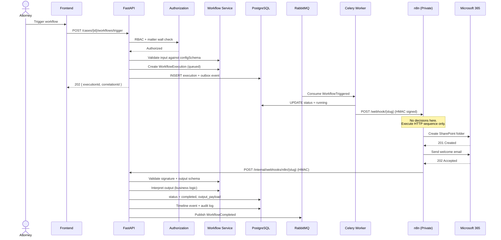
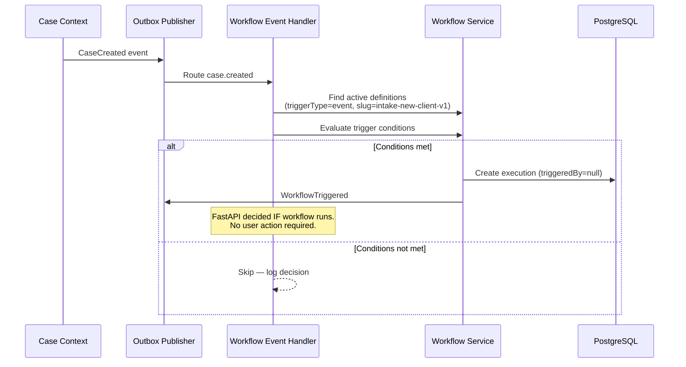
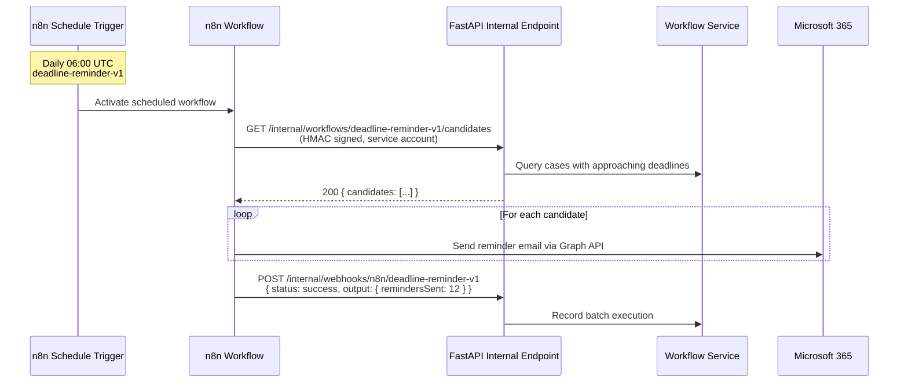
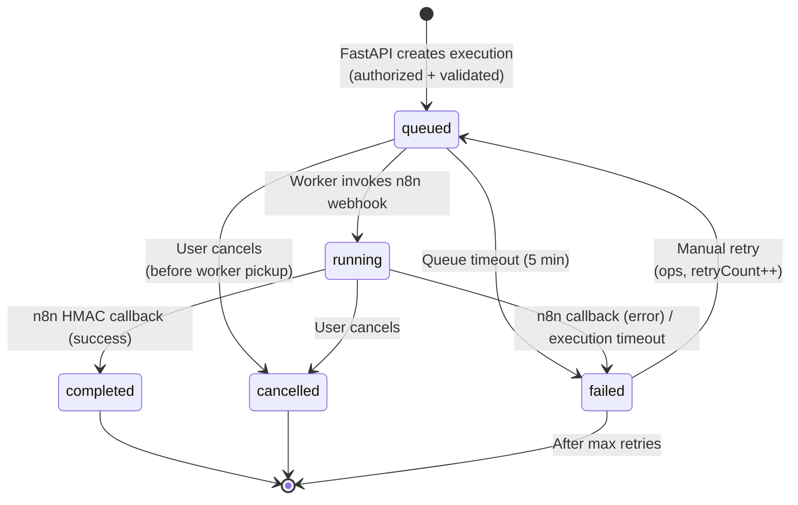
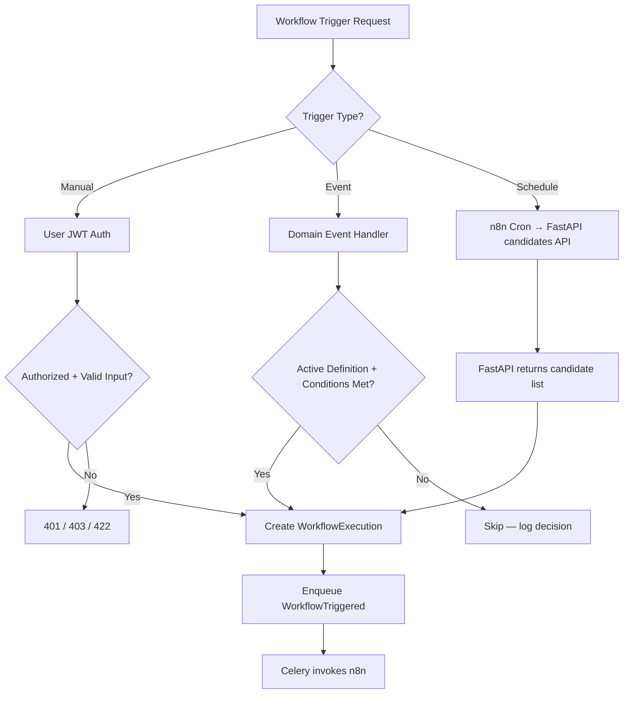

# Orchestration Model

**LexFlow AI** — FastAPI Owns Logic, n8n Orchestrates  
**Version:** 1.0  
**Status:** Draft — Pre-Implementation  
**Last Updated:** 2026-07-06

---

## Purpose

This document defines the **orchestration model** for LexFlow AI: a strict separation where FastAPI owns all business logic, authorization, validation, and state management, while n8n acts as a private integration engine that executes HTTP sequences and returns raw results.

This model is mandated by [ADR-002: n8n as Orchestration Engine Only](../13-decisions/002-n8n-orchestration-only.md) and enforced through code review, node restrictions, and network isolation.

---

## Scope

| In Scope | Out of Scope |
|----------|--------------|
| Responsibility split between FastAPI and n8n | Individual n8n node configuration |
| Workflow execution lifecycle | Domain event routing internals |
| Trigger types (manual, event, schedule) | Frontend workflow UI components |
| State machine and invariants | Celery task implementation |
| Anti-patterns and enforcement | External API vendor documentation |

---

## Responsibilities

### Ownership Matrix

| Responsibility | Owner | Rationale |
|----------------|-------|-----------|
| Decide **if** a workflow should run | **FastAPI** | Requires authorization, matter walls, case state checks |
| Validate input data | **FastAPI** | JSON Schema validation; legal field constraints |
| Check user authorization | **FastAPI** | RBAC + matter wall enforcement |
| Persist execution state | **FastAPI** | PostgreSQL is system of record |
| Interpret workflow output meaning | **FastAPI** | Legal significance of external responses |
| Write audit logs and timeline events | **FastAPI** | Compliance-grade immutable audit trail |
| Emit domain events (`WorkflowCompleted`) | **FastAPI** | Outbox pattern; transactional consistency |
| Build sanitized input payload | **FastAPI** | Strip secrets; minimize PII in transit |
| Call external HTTP APIs | **n8n** | Connector library; retry configuration |
| Retry failed HTTP calls | **n8n** | Node-level retry with backoff |
| Transform payload format for external systems | **n8n** | Field mapping, header injection |
| Schedule time-based triggers | **n8n** | Cron-based workflow activation |
| Route to different external endpoints | **n8n** | IF/Switch based on flags from FastAPI |
| Sign and deliver callbacks | **n8n** | HMAC-signed POST to internal webhook |

### What n8n Must Never Do

| Prohibited Action | Why |
|-------------------|-----|
| Query or write PostgreSQL | No audit trail; bypasses authorization |
| Make authorization decisions | No RBAC engine; no matter wall support |
| Apply legal business rules | Not version-controlled in Python; not pytest-testable |
| Store persistent state outside execution context | No durable state management |
| Expose webhooks to the public internet | Security boundary violation |
| Interpret case or document lifecycle | Domain logic belongs in FastAPI |

---

## Architecture

### Layered Orchestration Model

### Trust Boundaries

---

## Flow Diagrams

### End-to-End Orchestration Sequence

### Event-Triggered Orchestration

### Scheduled Orchestration

> **Note:** Even scheduled workflows fetch candidate data from FastAPI. n8n does not query the database directly.

---

## Workflow Execution Lifecycle

### State Machine

### State Transition Rules

| From | To | Trigger | Authority |
|------|----|---------|-----------|
| — | `queued` | API trigger or event handler | FastAPI |
| `queued` | `running` | Worker picks up task | Celery Worker |
| `running` | `completed` | n8n success callback | FastAPI (validates + interprets) |
| `running` | `failed` | n8n error callback or timeout | FastAPI |
| `queued` / `running` | `cancelled` | User cancel command | FastAPI |
| `failed` | `queued` | Manual retry | FastAPI (ops/admin) |

### Terminal State Invariants

| State | Immutable Fields |
|-------|------------------|
| `completed` | `outputPayload`, `completedAt`, all step records |
| `failed` | `errorMessage`, `completedAt` |
| `cancelled` | `cancellationReason`, `cancelledAt` |

---

## Trigger Types

| Type | Initiator | Authorization | Example |
|------|-----------|---------------|---------|
| **Manual** | User via API | JWT + RBAC + matter wall | `discovery-request-v1` |
| **Event** | Domain event handler | System (no user); case-scoped checks | `intake-new-client-v1` on `CaseCreated` |
| **Schedule** | n8n cron trigger | Service account HMAC; FastAPI provides candidates | `deadline-reminder-v1` daily |

---

## Anti-Patterns

| Anti-Pattern | Correct Approach |
|--------------|------------------|
| IF node checking case status in n8n | FastAPI evaluates case state before creating execution |
| Code node applying conflict-check logic | FastAPI conflict service; n8n only calls external API |
| PostgreSQL node reading deadline dates | FastAPI candidates endpoint for scheduled workflows |
| n8n deciding which email template to use | FastAPI includes `templateId` in input payload |
| Public n8n webhook URL | Internal DNS only; HMAC verification on all triggers |
| Storing OAuth tokens in n8n workflow JSON | AWS Secrets Manager; injected at container start |

---

## Enforcement

| Mechanism | Implementation |
|-----------|----------------|
| Code review checklist | "No business logic in n8n" required for workflow PRs |
| CI validation | Workflow JSON scanned for prohibited node types |
| Network policy | n8n SG allows inbound only from Worker + API SGs |
| Credential policy | No PostgreSQL credentials in n8n environment |
| ADR gate | New ADR required to change orchestration model |

---

## Best Practices

1. **Treat n8n as a dumb pipe** — Input in, HTTP calls out, raw results back.
2. **Pass explicit flags in input payload** — e.g., `sendWelcomeEmail: true` rather than n8n deciding.
3. **Return 202 immediately on trigger** — Never block HTTP on n8n execution time.
4. **Propagate `correlationId` end-to-end** — API → worker → n8n → callback → logs.
5. **Version workflows via slug suffix** — `intake-new-client-v2` for breaking changes; never mutate active slugs.
6. **Log the FastAPI decision to skip** — Event handlers that decline to trigger should audit the reason.
7. **Interpret output in FastAPI only** — n8n returns URLs and IDs; FastAPI decides what they mean for the case.

---

## Tradeoffs

| Decision | Benefit | Cost |
|----------|---------|------|
| FastAPI owns all logic | Testable, auditable, authorization in one place | More Python code for workflow state |
| n8n as orchestrator (not custom engine) | Rich connectors; faster integration delivery | Operational overhead; security hardening required |
| Async path for all workflows | Non-blocking API; handles long external calls | Status polling or SSE required in UI |
| Immutable terminal executions | Audit-grade history | Cannot amend completed output |
| Event triggers without user action | Seamless automation on case creation | Must carefully gate trigger conditions in FastAPI |

---

## Future Improvements

| Phase | Enhancement |
|-------|-------------|
| Phase 2 | Workflow simulation mode — dry-run against staging n8n |
| Phase 2 | Compensation workflows for partial failure rollback |
| Phase 3 | Multi-definition DAG — chained workflows with dependencies |
| Phase 3 | Workflow approval gate before firm-wide activation |
| Phase 4 | Replace n8n with custom orchestrator (if connector gap closes) |

---

## References

- [ADR-002: n8n as Orchestration Engine Only](../13-decisions/002-n8n-orchestration-only.md)
- [../03-architecture/data-flow.md](../03-architecture/data-flow.md) — Canonical async path
- [../02-domain/workflow-aggregate.md](../02-domain/workflow-aggregate.md) — Domain model
- [n8n-integration.md](./n8n-integration.md) — Security and node restrictions
- [webhook-contracts.md](./webhook-contracts.md) — Payload schemas
- [workflow-catalog.md](./workflow-catalog.md) — Initial workflow definitions
- [../04-api/endpoints-workflows.md](../04-api/endpoints-workflows.md) — Public trigger API
