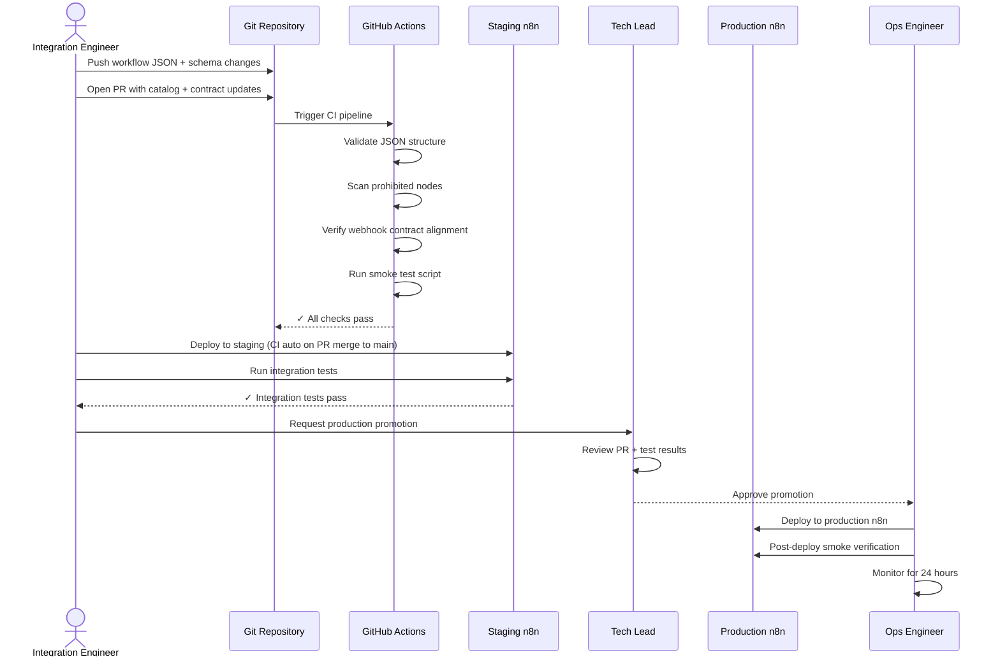
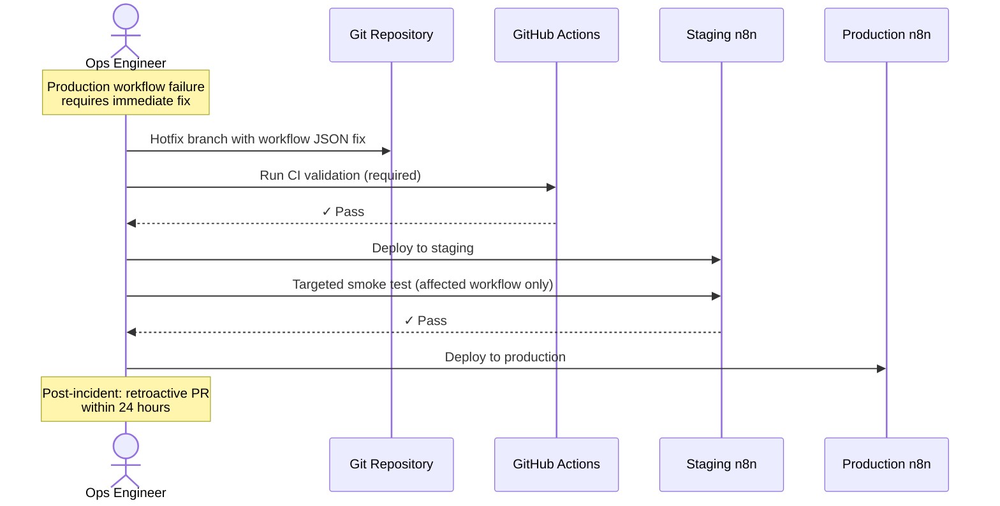
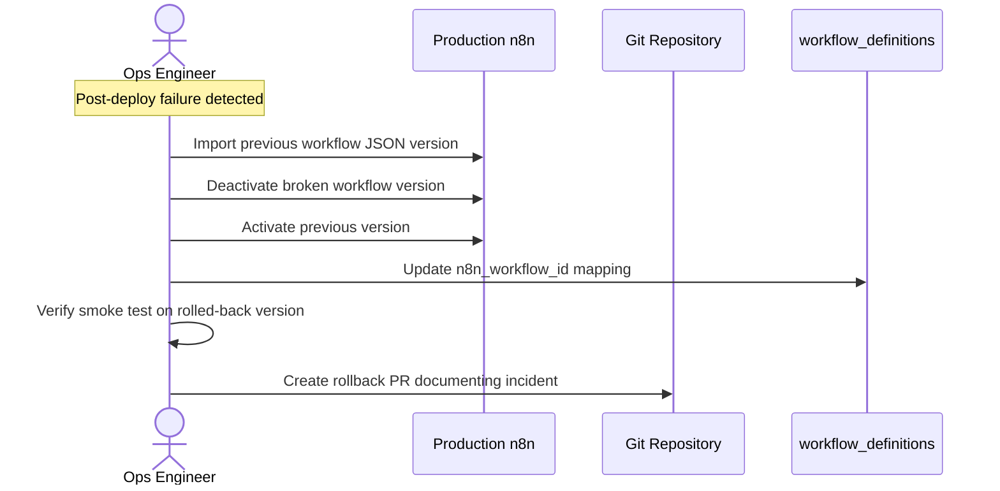
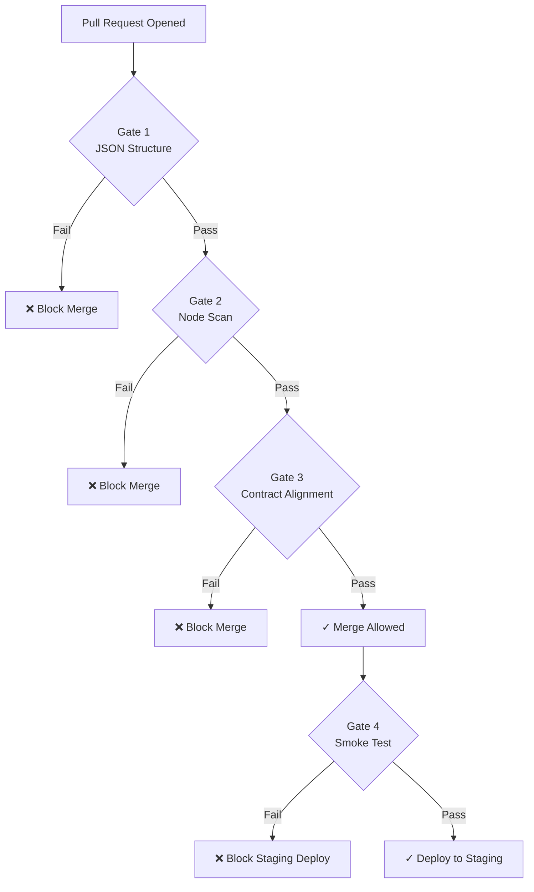
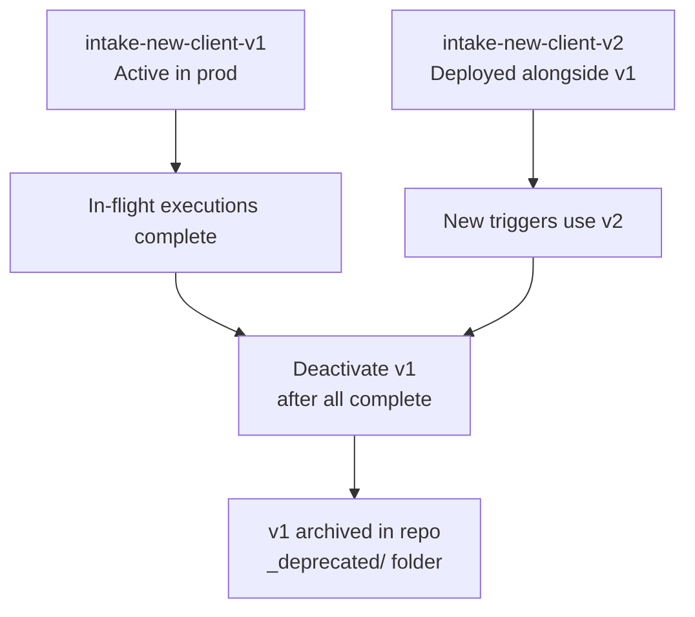

# Promotion Pipeline

**LexFlow AI** — Dev → Staging → Production Workflow Promotion  
**Version:** 1.0  
**Status:** Draft — Pre-Implementation  
**Last Updated:** 2026-07-06

---

## Purpose

This document defines the **workflow promotion pipeline** for LexFlow AI n8n workflows — how workflow JSON moves from developer workstations through CI validation to staging and production n8n instances. No workflow reaches production without passing automated checks and manual approval gates.

This pipeline enforces ADR-002 (no business logic in n8n), node restrictions, and contract alignment with FastAPI webhook schemas.

---

## Scope

| In Scope | Out of Scope |
|----------|--------------|
| Dev → staging → prod promotion stages | FastAPI application deployment pipeline |
| CI validation gates for workflow JSON | Terraform infrastructure provisioning |
| n8n import/deploy procedures per environment | n8n version upgrade procedures |
| Approval gates and change management | Production incident response |
| Rollback procedures | Feature flag management for workflows |
| Environment-specific configuration | n8n admin UI user management |

---

## Responsibilities

| Role | Responsibility |
|------|----------------|
| **Integration Engineer** | Author workflow JSON; submit PR |
| **Backend Engineer** | Review contract alignment with FastAPI schemas |
| **CI Pipeline** | Validate JSON, node restrictions, schema compliance |
| **Tech Lead** | Approve PR for staging deployment |
| **Ops / SRE** | Execute production promotion; manage rollback |
| **Security Reviewer** | Audit node restrictions and credential handling |

---

## Architecture

### Promotion Pipeline Overview

```mermaid
flowchart LR
    subgraph Dev["Development"]
        LOCAL[Local n8n<br/>docker-compose]
        EDIT[Edit workflow JSON]
    end

    subgraph CI["CI Pipeline"]
        PR[Pull Request]
        LINT[Validate JSON Schema]
        NODES[Scan Prohibited Nodes]
        CONTRACT[Verify Webhook Contract]
        SMOKE[Smoke Test Script]
    end

    subgraph Staging["Staging"]
        DEPLOY_S[Deploy to staging-n8n]
        INT_TEST[Integration Tests]
        APPROVE[Manual Approval Gate]
    end

    subgraph Prod["Production"]
        DEPLOY_P[Deploy to prod-n8n]
        VERIFY[Post-deploy Verification]
        MONITOR[Monitor 24h]
    end

    EDIT --> LOCAL
    LOCAL --> PR
    PR --> LINT --> NODES --> CONTRACT --> SMOKE
    SMOKE -->|Pass| DEPLOY_S
    DEPLOY_S --> INT_TEST
    INT_TEST -->|Pass| APPROVE
    APPROVE -->|Approved| DEPLOY_P
    DEPLOY_P --> VERIFY --> MONITOR
```



### Environment Topology

```mermaid
flowchart TB
    subgraph Environments["n8n Instances"]
        LOCAL_ENV["Local<br/>localhost:5678<br/>docker-compose"]
        DEV_ENV["Dev<br/>dev-n8n.internal.lexflow<br/>Synthetic data"]
        STG_ENV["Staging<br/>staging-n8n.internal.lexflow<br/>Anonymized prod copy"]
        PRD_ENV["Production<br/>prod-n8n.internal.lexflow<br/>Live firm data"]
    end

    LOCAL_ENV -->|PR + CI| DEV_ENV
    DEV_ENV -->|PR merge| STG_ENV
    STG_ENV -->|Manual approval| PRD_ENV

    subgraph FastAPI["FastAPI workflow_definitions"]
        DEF_LOCAL[Local seed data]
        DEF_DEV[Dev n8n workflow IDs]
        DEF_STG[Staging n8n workflow IDs]
        DEF_PRD[Production n8n workflow IDs]
    end

    LOCAL_ENV -.-> DEF_LOCAL
    DEV_ENV -.-> DEF_DEV
    STG_ENV -.-> DEF_STG
    PRD_ENV -.-> DEF_PRD
```



---

## Flow Diagrams

### Standard Promotion Sequence



### Hotfix Promotion (Expedited)



### Rollback Sequence



---

## Environment Configuration

| Environment | n8n URL | Data | Approval | Deploy Trigger |
|-------------|---------|------|----------|----------------|
| **Local** | `http://n8n:5678` | Docker Compose seed | None | Manual import |
| **Dev** | `https://dev-n8n.internal.lexflow` | Synthetic test data | PR merge to `develop` | CI auto-deploy |
| **Staging** | `https://staging-n8n.internal.lexflow` | Anonymized production copy | PR merge to `main` | CI auto-deploy |
| **Production** | `https://prod-n8n.internal.lexflow` | Live firm data | Manual approval + change ticket | Ops manual trigger |

### Environment Isolation Rules

| Rule | Implementation |
|------|----------------|
| Separate n8n instances per environment | Independent ECS services |
| Separate HMAC secrets per environment | `lexflow/n8n/{env}/webhook-secret` |
| Separate Microsoft Graph credentials | Dev/staging use test tenant |
| No production data in dev/staging n8n | Network + credential isolation |
| `workflow_definitions` maps slug → n8n ID per env | Database seed/migration per environment |

---

## CI Validation Gates

All gates must pass before staging deployment. Production requires all gates plus manual approval.

### Gate 1 — JSON Structure Validation

| Check | Tool | Failure Action |
|-------|------|----------------|
| Valid n8n workflow JSON format | `n8n/scripts/validate-workflow.py` | Block PR merge |
| Required nodes present (Webhook, Callback) | Custom validator | Block PR merge |
| No inline credentials in JSON | Regex scan for secrets | Block PR merge |
| Slug in filename matches catalog | Cross-reference `workflow-catalog.md` | Block PR merge |

### Gate 2 — Prohibited Node Scan

| Check | Failure Action |
|-------|----------------|
| No PostgreSQL / MySQL / MongoDB nodes | Block PR merge |
| No Redis nodes | Block PR merge |
| No Execute Command nodes | Block PR merge |
| No AI / LLM nodes | Block PR merge |
| Code nodes ≤ 20 lines | Block PR merge |
| All nodes on approved list | Block PR merge |

### Gate 3 — Webhook Contract Alignment

| Check | Failure Action |
|-------|----------------|
| Trigger payload fields match `n8n/schemas/trigger/{slug}.json` | Block PR merge |
| Callback output fields match `n8n/schemas/output/{slug}.json` | Block PR merge |
| HMAC verification node present in webhook trigger | Block PR merge |
| Callback URL uses `{{$json.callbackUrl}}` from trigger | Block PR merge |
| `X-N8N-Signature` header set on callback HTTP node | Block PR merge |

### Gate 4 — Smoke Test

| Check | Failure Action |
|-------|----------------|
| Workflow activates without error on target n8n | Block staging deploy |
| Webhook trigger accepts signed test payload | Block staging deploy |
| Callback reaches staging FastAPI internal endpoint | Block staging deploy |
| Output passes schema validation | Block staging deploy |



---

## Deployment Procedures

### Local Development

```bash
# Start local n8n via docker-compose
docker compose up n8n

# Import workflow JSON to local instance
python n8n/scripts/import-workflow.py \
  --target local \
  --workflow n8n/workflows/intake/intake-new-client-v1.json

# Run local smoke test
python n8n/scripts/smoke-test.py \
  --target local \
  --slug intake-new-client-v1
```

### Staging Deployment (Automated on PR Merge)

```bash
# Triggered by GitHub Actions on merge to main
python n8n/scripts/import-workflow.py \
  --target staging \
  --workflow n8n/workflows/intake/intake-new-client-v1.json \
  --activate

# Update workflow_definitions mapping
python n8n/scripts/update-definition-mapping.py \
  --env staging \
  --slug intake-new-client-v1 \
  --n8n-workflow-id {returned_id}

# Run integration tests
pytest tests/integration/workflows/test_intake_new_client.py --env staging
```

### Production Deployment (Manual — Requires Approval)

| Step | Action | Owner |
|------|--------|-------|
| 1 | Confirm staging integration tests passed | Integration Engineer |
| 2 | Create change ticket with workflow slug and version | Integration Engineer |
| 3 | Tech Lead approves change ticket | Tech Lead |
| 4 | Ops runs production import script | Ops / SRE |
| 5 | Ops updates `workflow_definitions` mapping | Ops / SRE |
| 6 | Ops runs post-deploy smoke test | Ops / SRE |
| 7 | Ops monitors execution metrics for 24 hours | Ops / SRE |
| 8 | Close change ticket | Ops / SRE |

```bash
# Production deploy (ops only — requires approval token)
python n8n/scripts/import-workflow.py \
  --target production \
  --workflow n8n/workflows/intake/intake-new-client-v1.json \
  --activate \
  --approval-token ${DEPLOY_APPROVAL_TOKEN}

# Post-deploy smoke test
python n8n/scripts/smoke-test.py \
  --target production \
  --slug intake-new-client-v1 \
  --dry-run
```

---

## Versioning Strategy

### Slug Versioning

| Rule | Example |
|------|---------|
| Slug format | `{name}-v{N}` |
| Breaking input change | `intake-new-client-v1` → `intake-new-client-v2` |
| Breaking output change | New slug version required |
| Add optional field | No version change — update schema only |
| Node graph change (same contract) | No version change — deploy in place |

### Parallel Version Deployment



| Phase | v1 State | v2 State | New Triggers Route To |
|-------|----------|----------|----------------------|
| Deploy v2 | Active | Deployed (inactive) | v1 |
| Cutover | Active | Activated | v2 |
| Drain | Active (no new triggers) | Active | v2 only |
| Retire | Deactivated | Active | v2 only |

### workflow_definitions Mapping

| Column | Purpose |
|--------|---------|
| `slug` | Workflow identifier (e.g., `intake-new-client-v1`) |
| `n8n_workflow_id` | n8n internal workflow ID (per environment) |
| `environment` | `dev`, `staging`, `production` |
| `is_active` | Whether new executions can be created |
| `webhook_url` | Full n8n webhook URL for this environment |

---

## Rollback Procedures

### Rollback Triggers

| Condition | Action |
|-----------|--------|
| Post-deploy smoke test fails | Immediate rollback before monitoring period |
| Error rate > 10% within 1 hour | Rollback + incident |
| HMAC 401 spike after deploy | Rollback + secret verification |
| External API integration broken | Rollback or hotfix (ops discretion) |

### Rollback Steps

| Step | Action |
|------|--------|
| 1 | Deactivate newly deployed workflow version in n8n |
| 2 | Activate previous workflow version in n8n |
| 3 | Update `workflow_definitions.n8n_workflow_id` to previous ID |
| 4 | Run smoke test against rolled-back version |
| 5 | Investigate root cause on staging |
| 6 | Create incident report and rollback PR |

### Rollback Time Targets

| Environment | Target Rollback Time |
|-------------|---------------------|
| Staging | < 15 minutes |
| Production | < 30 minutes |

---

## Change Management

### Standard Change (New Workflow or Version)

| Requirement | Detail |
|-------------|--------|
| PR with workflow JSON + docs | Required |
| CI gates pass | Required |
| Staging integration tests pass | Required |
| Tech Lead approval | Required |
| Change ticket | Required for production |
| Monitoring period | 24 hours post-deploy |

### Emergency Change (Hotfix)

| Requirement | Detail |
|-------------|--------|
| CI gates pass | Required (no bypass) |
| Staging smoke test (targeted) | Required |
| Verbal approval from Tech Lead | Acceptable |
| Retroactive PR within 24 hours | Required |
| Change ticket | Created post-deploy |

---

## Repository Conventions

### Workflow JSON Location

```
n8n/workflows/
├── intake/
│   ├── intake-new-client-v1.json
│   └── intake-new-client-v2.json          # When versioned
├── documents/
│   └── document-upload-notify-v1.json
├── notifications/
│   ├── deadline-reminder-v1.json
│   └── ai-summary-notify-v1.json
├── cases/
│   └── case-close-archive-v1.json
├── discovery/
│   └── discovery-request-v1.json
├── compliance/
│   └── conflict-check-v1.json
├── _templates/
│   └── basic-webhook-callback.json
└── _deprecated/                          # Retired versions
    └── intake-new-client-v1.json
```

### PR Checklist

- [ ] Workflow JSON added/updated in `n8n/workflows/`
- [ ] Trigger schema updated in `n8n/schemas/trigger/{slug}.json`
- [ ] Output schema updated in `n8n/schemas/output/{slug}.json`
- [ ] [workflow-catalog.md](./workflow-catalog.md) updated with new/changed workflow
- [ ] [webhook-contracts.md](./webhook-contracts.md) updated if contract changed
- [ ] No credentials in workflow JSON export
- [ ] No prohibited node types
- [ ] Code nodes ≤ 20 lines (if present)
- [ ] Tested locally via docker-compose n8n
- [ ] Integration test added/updated in `tests/integration/workflows/`

---

## Best Practices

1. **Never import workflow JSON directly to production n8n UI** — Always use the import script with CI validation.
2. **Test on local n8n before opening PR** — Catch node wiring errors early.
3. **Deploy to staging before requesting production approval** — Staging integration tests are mandatory evidence.
4. **Keep old versions active until in-flight executions drain** — Prevents orphaned `running` executions.
5. **Use `_templates/basic-webhook-callback.json` for new workflows** — Ensures HMAC callback is always present.
6. **Document rollback plan in change ticket** — Ops must know previous version ID before deploying.
7. **Strip credential IDs from JSON before committing** — Use n8n credential references only.
8. **Monitor for 24 hours post-production deploy** — Error rate, duration, and DLQ depth.

---

## Tradeoffs

| Decision | Benefit | Cost |
|----------|---------|------|
| Manual production approval | Prevents accidental prod deploys | Slower time-to-production |
| CI gates block merge (not just deploy) | Catches issues before staging | Slower PR cycle for workflow changes |
| Slug versioning (not in-place mutation) | Safe parallel deployments | Multiple workflow versions to manage |
| Separate n8n per environment | Full isolation | 4 n8n instances to operate |
| Script-based import (not n8n API UI) | Repeatable, auditable deploys | Script maintenance |
| 24-hour post-deploy monitoring | Catches delayed failures | Ops attention required |

---

## Future Improvements

| Phase | Enhancement |
|-------|-------------|
| Phase 2 | GitOps-style auto-sync — repo change auto-deploys to staging |
| Phase 2 | Workflow diff visualization in PR review |
| Phase 3 | Canary deployment — route 10% of triggers to new version |
| Phase 3 | Automated rollback on error rate threshold |
| Phase 4 | n8n workflow registry API for programmatic discovery |

---

## References

- [ADR-002: n8n as Orchestration Engine Only](../13-decisions/002-n8n-orchestration-only.md)
- [n8n-integration.md](./n8n-integration.md) — Node restrictions and security
- [workflow-catalog.md](./workflow-catalog.md) — Workflow registry
- [webhook-contracts.md](./webhook-contracts.md) — Contract alignment
- [retry-dlq.md](./retry-dlq.md) — Post-deploy failure handling
- [../deployment-architecture.md](../deployment-architecture.md) — ECS and environment strategy
- [../development-standards.md](../development-standards.md) — PR process and branching
- [../testing-strategy.md](../testing-strategy.md) — Integration test requirements
