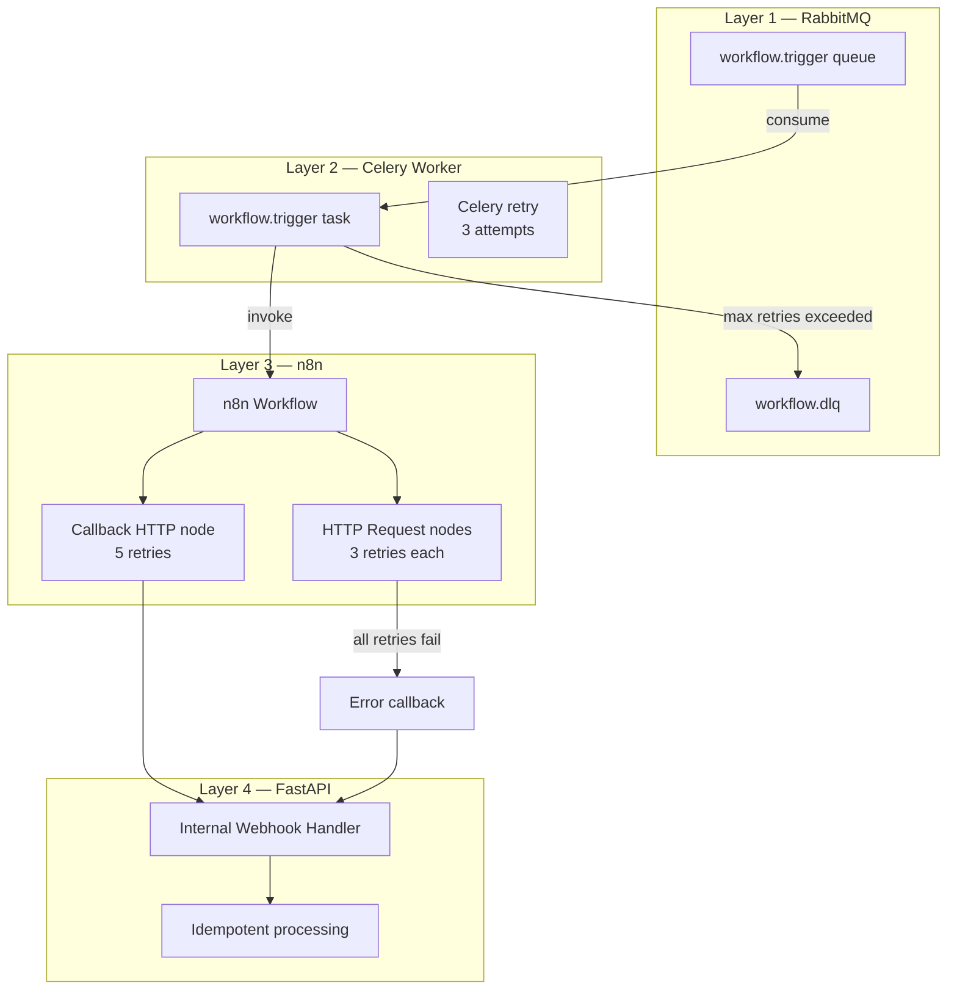
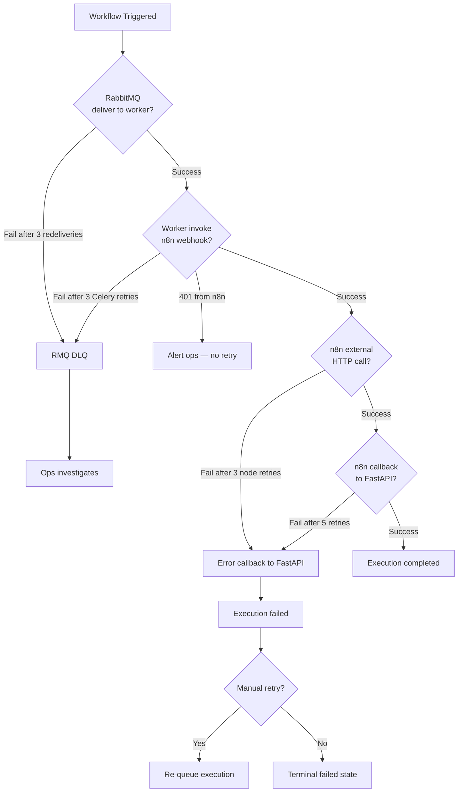
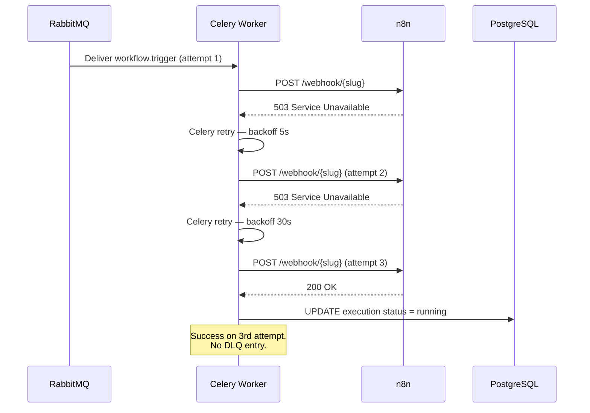
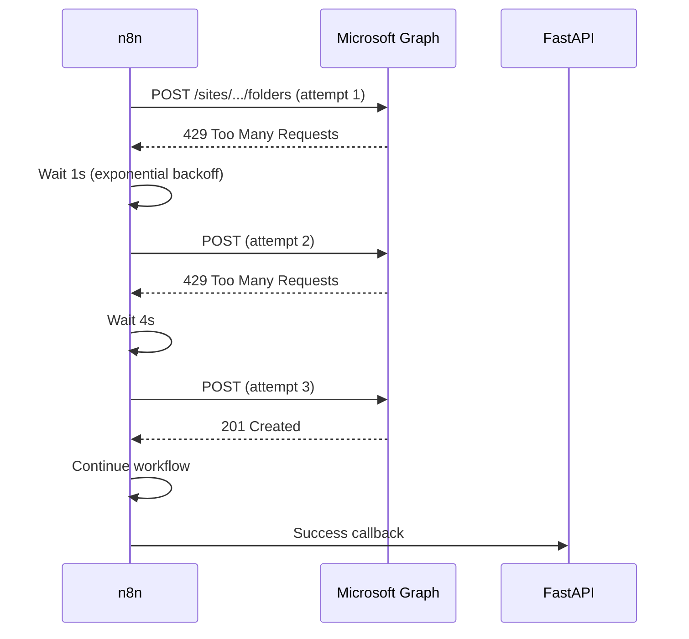
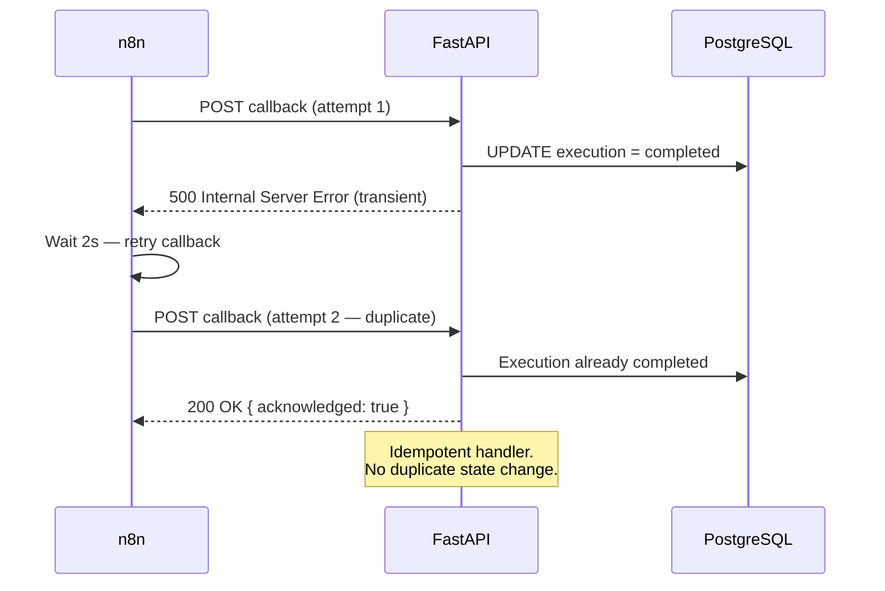
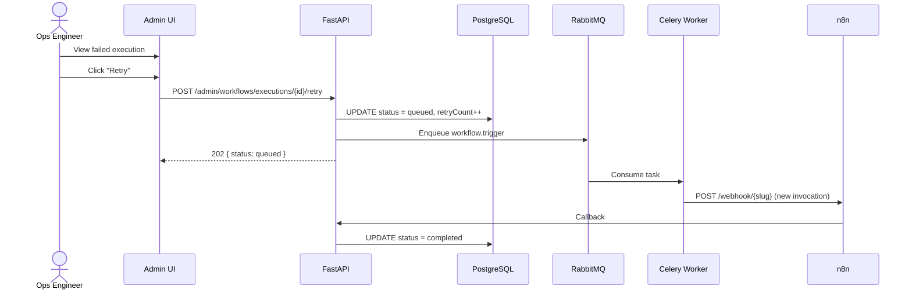
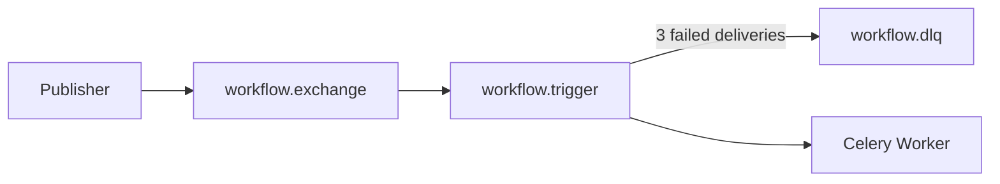
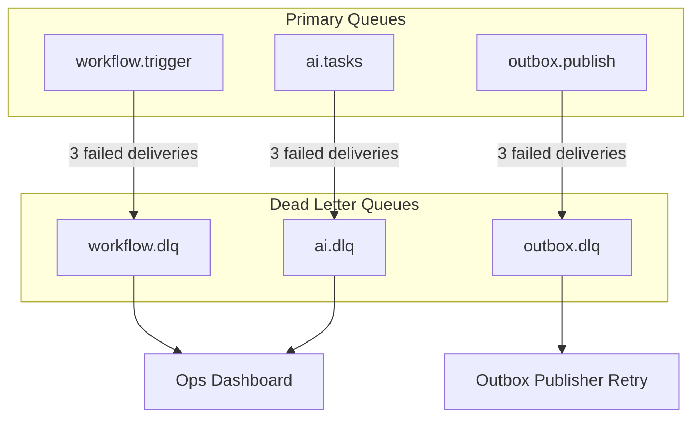
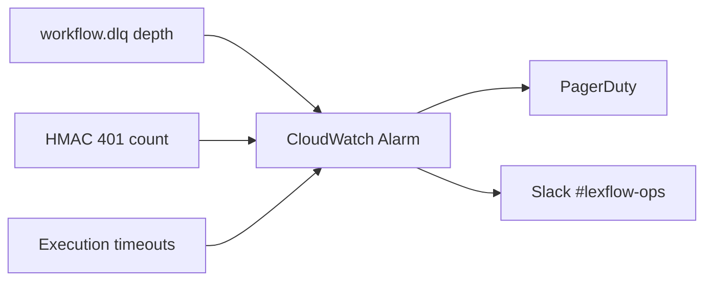

# Retry & Dead Letter Queues

**LexFlow AI** — Retry Policies, DLQ Handling & Failure Recovery  
**Version:** 1.0  
**Status:** Draft — Pre-Implementation  
**Last Updated:** 2026-07-06

---

## Purpose

This document defines **retry policies and dead letter queue (DLQ) handling** across all layers of the LexFlow AI workflow stack — RabbitMQ, Celery workers, n8n HTTP nodes, and n8n-to-FastAPI callbacks. It establishes when retries occur, when messages move to DLQ, and how operations teams recover failed workflow executions.

Consistent retry behavior prevents duplicate SharePoint folders, duplicate emails, and orphaned execution states.

---

## Scope

| In Scope | Out of Scope |
|----------|--------------|
| Platform-wide retry policies per layer | Individual n8n node expression configuration |
| RabbitMQ DLQ configuration | Amazon MQ broker provisioning (see deployment docs) |
| Celery task retry and backoff | FastAPI application code for retry commands |
| n8n HTTP node retry settings | External API vendor SLA negotiations |
| n8n callback retry to FastAPI | Frontend error display for failed workflows |
| Manual retry and recovery procedures | Automated compensation/saga rollback |
| Alerting thresholds for DLQ depth | PagerDuty on-call rotation |

---

## Responsibilities

| Layer | Owns Retry For | DLQ Destination |
|-------|----------------|-----------------|
| **RabbitMQ** | Message delivery to Celery workers | `lexflow.workflow.dlq` |
| **Celery Worker** | n8n webhook invocation failures | RabbitMQ DLQ via task rejection |
| **n8n HTTP Nodes** | External API call failures | n8n internal error path → error callback |
| **n8n Callback Node** | FastAPI webhook delivery failures | n8n node retry → error callback on exhaustion |
| **FastAPI** | Callback processing (idempotent) | No retry — n8n retries delivery |
| **Ops Team** | Manual retry of failed executions | Admin UI → re-queue execution |

---

## Architecture

### Retry Layer Stack



### Failure Propagation Model



---

## Flow Diagrams

### Celery Worker Retry Sequence



### n8n External API Retry Sequence



### Callback Retry with Idempotency



### Manual Retry Flow



---

## Retry Policies

### Layer 1 — RabbitMQ Message Delivery

| Setting | Value |
|---------|-------|
| Queue | `lexflow.workflow.trigger` |
| Delivery guarantee | At-least-once |
| Consumer ack | Manual ack after Celery task completion |
| Redelivery on nack | Yes — up to 3 times |
| DLQ | `lexflow.workflow.dlq` |
| DLQ routing | After 3 failed deliveries |
| Message TTL | 7 days |
| DLQ retention | 14 days |



### Layer 2 — Celery Worker Task

| Setting | Value |
|---------|-------|
| Task name | `workflow.trigger` |
| Max retries | 3 |
| Backoff | Exponential: 5s → 30s → 120s |
| Retry on | 5xx from n8n, connection timeout, DNS failure |
| No retry on | 401 (HMAC failure), 404 (unknown slug), 422 (validation) |
| Task timeout | 30 seconds (webhook invocation only) |
| Ack late | `True` — ack after task completes |

| Attempt | Delay Before Retry |
|---------|-------------------|
| 1 | Immediate |
| 2 | 5 seconds |
| 3 | 30 seconds |
| 4 (final) | 120 seconds → DLQ on failure |

### Layer 3 — n8n HTTP Request Nodes

| Setting | Value |
|---------|-------|
| Max retries per node | 3 |
| Backoff | Exponential: 1s → 4s → 16s |
| Timeout per attempt | 60 seconds (120s for `case-close-archive-v1`, `discovery-request-v1`) |
| Retry on | 429, 500, 502, 503, 504, connection errors |
| No retry on | 400, 401, 403, 404, 422 |
| On exhaustion | Route to error callback path |

### Layer 4 — n8n Callback to FastAPI

| Setting | Value |
|---------|-------|
| Max retries | 5 |
| Backoff | Exponential: 2s → 8s → 32s → 128s → 512s |
| Timeout per attempt | 30 seconds |
| Retry on | 5xx, connection timeout |
| No retry on | 401 (HMAC failure — alert ops), 404, 422 |
| On exhaustion | n8n marks execution error; FastAPI may remain `running` until timeout |

### Layer 5 — FastAPI Callback Handler

| Setting | Value |
|---------|-------|
| Retries | None — n8n retries delivery |
| Idempotency | Required — duplicate callbacks return 200 |
| Processing timeout | 10 seconds (return 200 before heavy async work) |
| On 5xx | n8n retries; no state change until 200 received |

---

## Execution Timeout Policy

| Stage | Timeout | Action on Timeout |
|-------|---------|-------------------|
| Queue wait | 5 minutes | Mark execution `failed`; alert ops |
| Celery task (n8n invoke) | 30 seconds per attempt | Celery retry |
| n8n workflow execution | 30 minutes (configurable per slug) | n8n error callback → `failed` |
| n8n external API node | 60s per attempt (120s for archive/discovery) | n8n node retry |
| n8n callback to FastAPI | 30 seconds per attempt | n8n callback retry |
| FastAPI callback processing | 10 seconds (response) | Return 200; async processing continues |

### Per-Workflow Execution Timeouts

| Slug | n8n Execution Timeout |
|------|-----------------------|
| `intake-new-client-v1` | 30 minutes |
| `document-upload-notify-v1` | 15 minutes |
| `deadline-reminder-v1` | 60 minutes |
| `ai-summary-notify-v1` | 10 minutes |
| `case-close-archive-v1` | 60 minutes |
| `discovery-request-v1` | 30 minutes |
| `conflict-check-v1` | 10 minutes |

---

## Dead Letter Queues

### RabbitMQ DLQ Configuration

| Queue | Purpose | Retention | Consumer |
|-------|---------|-----------|----------|
| `lexflow.workflow.dlq` | Failed workflow.trigger messages | 14 days | Ops tooling (manual) |
| `lexflow.outbox.dlq` | Failed outbox publish messages | 14 days | Outbox publisher retry |
| `lexflow.ai.dlq` | Failed AI task messages | 14 days | Ops tooling (manual) |



### DLQ Message Envelope

```json
{
  "originalQueue": "lexflow.workflow.trigger",
  "originalRoutingKey": "workflow.trigger",
  "failureReason": "celery_max_retries_exceeded",
  "failureTimestamp": "2026-07-06T08:05:00Z",
  "retryCount": 3,
  "payload": {
    "executionId": "ex1a2b3c4-d5e6-7890-abcd-ef1234567890",
    "workflowSlug": "intake-new-client-v1",
    "caseId": "c1d2e3f4-a5b6-7890-cdef-123456789012"
  },
  "lastError": {
    "message": "Connection refused to staging-n8n.internal.lexflow:5678",
    "code": "connection_refused"
  }
}
```

### n8n Execution Failure (No RMQ DLQ)

When n8n exhausts all retries on external APIs or callbacks, it does not use RabbitMQ DLQ. Instead:

1. n8n sends error callback to FastAPI (if callback path reachable)
2. FastAPI marks execution `failed` with error details
3. If callback also fails, execution remains `running` until execution timeout
4. Execution timeout job marks `failed` with `errorMessage: "n8n execution timeout"`

---

## Alerting

| Alert | Condition | Severity | Action |
|-------|-----------|----------|--------|
| DLQ depth > 0 | Any message in `workflow.dlq` | Warning | Ops investigates within 1 hour |
| DLQ depth > 10 | Sustained failures | Critical | PagerDuty — likely systemic issue |
| HMAC 401 spike | > 5 in 5 minutes | Critical | Secret rotation failure or attack |
| Execution timeout rate | > 5% over 15 minutes | Warning | Check n8n health / external APIs |
| Queue wait timeout | Any execution queued > 5 min | Warning | Worker scaling issue |
| n8n unhealthy | ECS health check fail > 2 min | Critical | Auto-restart + PagerDuty |



---

## Recovery Procedures

### Procedure 1 — RMQ DLQ Message Reprocessing

| Step | Action |
|------|--------|
| 1 | Inspect DLQ message in ops dashboard |
| 2 | Identify root cause (n8n down, secret mismatch, bad payload) |
| 3 | Fix root cause |
| 4 | Verify execution is in `queued` or `failed` state (not `completed`) |
| 5 | Re-publish message to `workflow.trigger` or use admin retry API |
| 6 | Purge DLQ message after successful reprocessing |
| 7 | Document incident in ops log |

### Procedure 2 — Failed Execution Manual Retry

| Step | Action |
|------|--------|
| 1 | Ops views failed execution in admin dashboard |
| 2 | Reviews `errorMessage`, `steps[]`, and n8n execution log |
| 3 | Confirms root cause is resolved (e.g., Graph API restored) |
| 4 | Clicks "Retry" — FastAPI resets to `queued`, increments `retryCount` |
| 5 | Monitors execution through completion |
| 6 | If retry fails again, escalate to integration engineer |

### Procedure 3 — Stuck `running` Execution

| Step | Action |
|------|--------|
| 1 | Identify executions in `running` state > execution timeout |
| 2 | Check n8n execution log for last completed step |
| 3 | If n8n execution completed but callback failed: replay callback from n8n log |
| 4 | If n8n execution still running: wait or cancel in n8n admin |
| 5 | If unresolvable: mark `failed` manually with audit note |

### Procedure 4 — HMAC Secret Mismatch

| Step | Action |
|------|--------|
| 1 | Alert fires on 401 spike |
| 2 | Verify Secrets Manager value matches n8n credential |
| 3 | If rotation in progress: complete rotation on both sides |
| 4 | Restart n8n ECS task to pick up new secret |
| 5 | Retry failed executions from admin dashboard |
| 6 | Confirm 401 count returns to zero |

---

## Idempotency & Duplicate Prevention

| Layer | Idempotency Mechanism |
|-------|----------------------|
| API trigger | `Idempotency-Key` header — 24-hour dedup window |
| Celery task | Check execution status before n8n invoke — skip if already `running` |
| n8n external calls | FastAPI includes `executionId` in input — external systems use for dedup where supported |
| FastAPI callback | Check execution terminal state — return 200 on duplicate |
| Manual retry | Creates new n8n invocation with same `executionId` — n8n must handle re-execution safely |

### Safe Re-Execution Guidelines

| Workflow | Re-execution Risk | Mitigation |
|----------|-------------------|------------|
| `intake-new-client-v1` | Duplicate SharePoint folder | Graph API: check folder exists before create |
| `document-upload-notify-v1` | Duplicate notifications | FastAPI dedup on document + notification type |
| `deadline-reminder-v1` | Duplicate reminders | FastAPI candidates API excludes already-reminded |
| `discovery-request-v1` | Duplicate email to opposing counsel | **High risk** — manual retry requires ops approval |
| `conflict-check-v1` | Duplicate conflict query | Low risk — read-only external query |

---

## Best Practices

1. **Design for idempotency at every layer** — Retries are inevitable in distributed systems.
2. **Never retry 401 errors automatically** — Indicates configuration failure; alert ops.
3. **Return 200 quickly on callback** — n8n has a 30-second timeout per attempt.
4. **Monitor DLQ depth continuously** — Any message in DLQ warrants investigation.
5. **Document manual retry approval for high-risk workflows** — Discovery send requires ops sign-off.
6. **Set explicit timeouts on all n8n HTTP nodes** — Never use unlimited timeout.
7. **Include `executionId` in all external API calls where possible** — Enables vendor-side dedup.
8. **Test retry behavior on staging** — Simulate 503 responses before production promotion.

---

## Tradeoffs

| Decision | Benefit | Cost |
|----------|---------|------|
| Celery retry before DLQ | Recovers transient n8n outages | Up to 155s delay before DLQ |
| n8n callback 5 retries | High delivery reliability | Execution may appear stuck during retries |
| No FastAPI callback retry | Simple handler; n8n owns delivery | Depends on n8n retry configuration |
| 5-minute queue wait timeout | Prevents infinite queued state | May fail during worker scaling events |
| Manual retry for high-risk workflows | Prevents duplicate legal communications | Slower recovery for discovery failures |
| 14-day DLQ retention | Adequate investigation window | Storage cost (minimal for low volume) |

---

## Future Improvements

| Phase | Enhancement |
|-------|-------------|
| Phase 2 | Admin API: `POST /executions/{id}/retry` for attorneys (low-risk workflows) |
| Phase 2 | Automated DLQ reprocessing after root cause resolution |
| Phase 3 | Callback replay from stored n8n execution log |
| Phase 3 | Circuit breaker on external APIs (stop retrying during outage) |
| Phase 4 | Compensation workflows for partial failure rollback |

---

## References

- [webhook-contracts.md](./webhook-contracts.md) — HMAC and callback schemas
- [orchestration-model.md](./orchestration-model.md) — Execution lifecycle states
- [workflow-catalog.md](./workflow-catalog.md) — Per-workflow timeout overrides
- [n8n-integration.md](./n8n-integration.md) — n8n HTTP node configuration
- [../03-architecture/event-driven-design.md](../03-architecture/event-driven-design.md) — Outbox and RabbitMQ
- [../03-architecture/data-flow.md](../03-architecture/data-flow.md) — Async path
- [../04-api/webhooks-internal.md](../04-api/webhooks-internal.md) — Idempotency rules
- [../observability.md](../observability.md) — Alerting configuration
