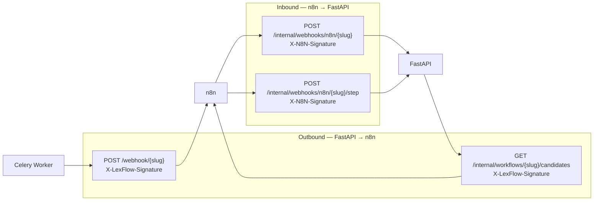
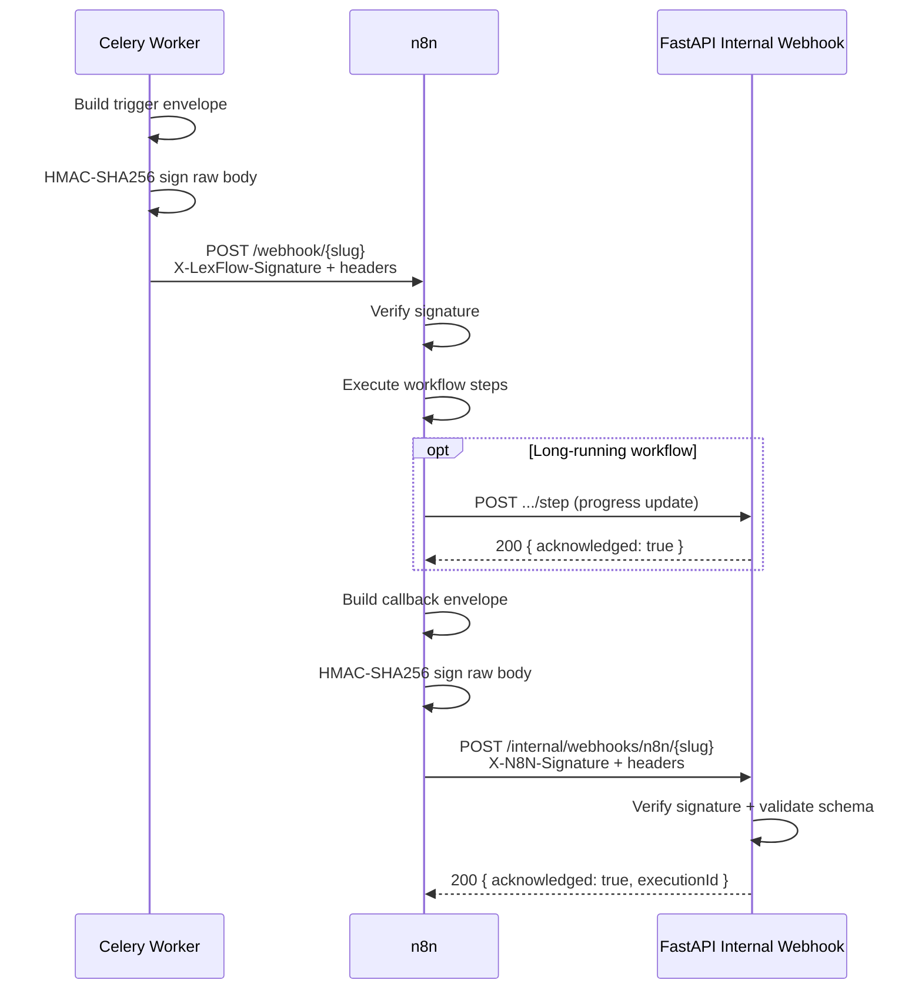
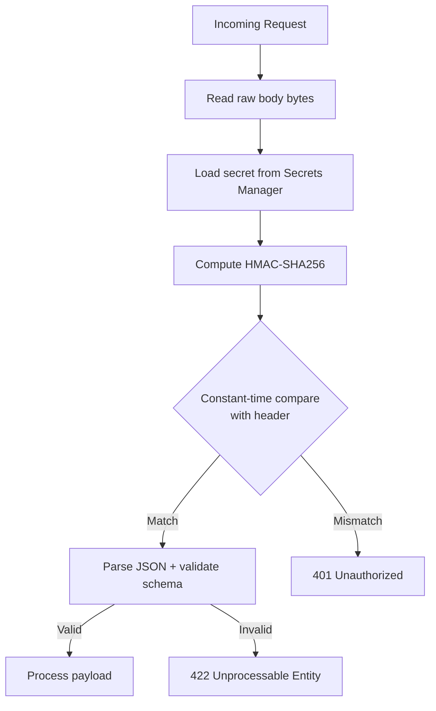
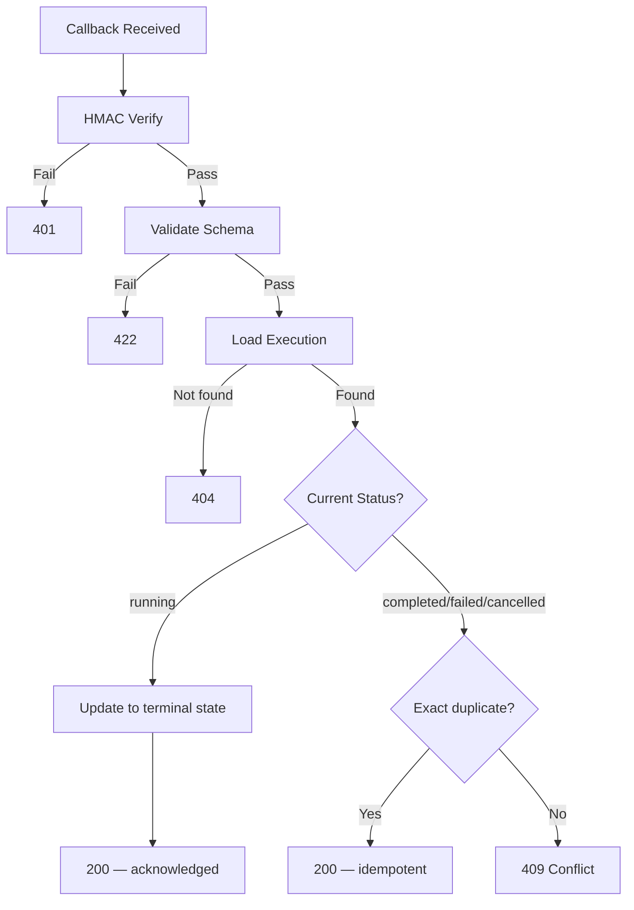

# Webhook Contracts

**LexFlow AI** — FastAPI ↔ n8n Payload Schemas  
**Version:** 1.0  
**Status:** Draft — Pre-Implementation  
**Last Updated:** 2026-07-06

---

## Purpose

This document defines the **bidirectional webhook contracts** between FastAPI (via Celery worker) and n8n. It specifies trigger payloads (FastAPI → n8n), callback payloads (n8n → FastAPI), HMAC signing, required headers, and per-workflow schema variations.

These contracts are the integration boundary. Changes require coordinated updates in FastAPI, n8n workflow JSON, and JSON schema files in the repo.

---

## Scope

| In Scope | Out of Scope |
|----------|--------------|
| Trigger payload schema (worker → n8n) | Public REST API request/response formats |
| Callback payload schema (n8n → FastAPI) | n8n node wiring and expressions |
| Step progress callback schema | Frontend SSE event formats |
| HMAC signing specification | JWT authentication (public routes) |
| Per-workflow input/output variations | Database column definitions |
| Error callback format | RabbitMQ message schemas |

---

## Responsibilities

| Direction | Sender | Receiver | Validates |
|-----------|--------|----------|-----------|
| **Trigger** | Celery Worker | n8n Webhook node | `X-LexFlow-Signature` (n8n) |
| **Callback (final)** | n8n HTTP node | FastAPI internal webhook | `X-N8N-Signature` (FastAPI) |
| **Callback (step)** | n8n HTTP node | FastAPI step endpoint | `X-N8N-Signature` (FastAPI) |
| **Candidates (schedule)** | FastAPI internal API | n8n HTTP node | `X-LexFlow-Signature` (n8n) |

---

## Architecture

### Bidirectional Contract Overview



### Message Flow



---

## Common Envelope

All trigger and callback payloads share a common envelope structure. Workflow-specific fields live in `input` (trigger) or `output` (callback).

### Required Headers (All Directions)

| Header | Required | Description |
|--------|----------|-------------|
| `Content-Type` | Yes | `application/json` |
| `X-Correlation-Id` | Yes | UUID — distributed tracing |
| `X-Execution-Id` | Yes | UUID — matches `workflow_executions.id` |
| `X-LexFlow-Signature` | Trigger only | `sha256={hex_digest}` |
| `X-N8N-Signature` | Callback only | `sha256={hex_digest}` |

---

## HMAC Signature Specification

### Algorithm

```
signature = HMAC-SHA256(
  key = shared_secret,          # AWS Secrets Manager: lexflow/n8n/webhook-secret
  message = raw_request_body    # bytes before JSON parsing
)

header_value = "sha256=" + hex(signature)
```

### Signing Rules

| Rule | Detail |
|------|--------|
| Sign raw body bytes | Before JSON parsing; UTF-8 encoding |
| Constant-time comparison | Prevent timing attacks on verification |
| Same secret both directions | `lexflow/n8n/webhook-secret` for trigger and callback |
| No signature on empty body | Reject requests with missing body |
| Rotation | Quarterly; coordinated update in Secrets Manager + n8n + FastAPI |

### Verification Flow



---

## Trigger Contract (FastAPI → n8n)

### Endpoint

```
POST https://{env}-n8n.internal.lexflow/webhook/{workflowSlug}
```

### Base Trigger Schema

```json
{
  "$schema": "http://json-schema.org/draft-07/schema#",
  "type": "object",
  "required": ["executionId", "caseId", "workflowSlug", "triggeredBy", "input", "callbackUrl"],
  "properties": {
    "executionId": {
      "type": "string",
      "format": "uuid",
      "description": "WorkflowExecution.id — primary correlation key"
    },
    "caseId": {
      "type": ["string", "null"],
      "format": "uuid",
      "description": "Associated case; null for firm-wide scheduled workflows"
    },
    "workflowSlug": {
      "type": "string",
      "pattern": "^[a-z0-9-]+-v[0-9]+$",
      "description": "Workflow definition slug"
    },
    "triggeredBy": {
      "type": ["string", "null"],
      "format": "uuid",
      "description": "User who triggered; null for event/schedule triggers"
    },
    "correlationId": {
      "type": "string",
      "format": "uuid",
      "description": "Distributed tracing ID"
    },
    "input": {
      "type": "object",
      "description": "Workflow-specific input — see per-slug schemas below"
    },
    "callbackUrl": {
      "type": "string",
      "format": "uri",
      "description": "FastAPI internal webhook URL for this slug"
    }
  },
  "additionalProperties": false
}
```

### Trigger Example — `intake-new-client-v1`

```http
POST https://staging-n8n.internal.lexflow/webhook/intake-new-client-v1
Content-Type: application/json
X-LexFlow-Signature: sha256=a3f2b8c1d4e5f6a7b8c9d0e1f2a3b4c5d6e7f8a9b0c1d2e3f4a5b6c7d8e9f0
X-Correlation-Id: 550e8400-e29b-41d4-a716-446655440000
X-Execution-Id: ex1a2b3c4-d5e6-7890-abcd-ef1234567890
```

```json
{
  "executionId": "ex1a2b3c4-d5e6-7890-abcd-ef1234567890",
  "caseId": "c1d2e3f4-a5b6-7890-cdef-123456789012",
  "workflowSlug": "intake-new-client-v1",
  "triggeredBy": null,
  "correlationId": "550e8400-e29b-41d4-a716-446655440000",
  "input": {
    "clientName": "Acme Corp",
    "clientEmail": "contact@acme.com",
    "practiceArea": "corporate",
    "leadAttorneyEmail": "jane.attorney@firm.com",
    "caseTitle": "Acme Corp — General Counsel Engagement",
    "sendWelcomeEmail": true,
    "createSharePointFolder": true,
    "documents": [
      {
        "documentId": "d1e2f3a4-b5c6-7890-def1-234567890abc",
        "s3PresignedUrl": "https://lexflow-docs-staging.s3.amazonaws.com/..."
      }
    ]
  },
  "callbackUrl": "https://api.internal.lexflow/api/v1/internal/webhooks/n8n/intake-new-client-v1"
}
```

### Per-Slug Input Schemas

| Slug | Schema File | Key Required Fields |
|------|-------------|---------------------|
| `intake-new-client-v1` | `n8n/schemas/trigger/intake-new-client-v1.json` | `clientName`, `clientEmail`, `practiceArea`, `leadAttorneyEmail` |
| `document-upload-notify-v1` | `n8n/schemas/trigger/document-upload-notify-v1.json` | `documentId`, `documentTitle`, `teamEmails`, `s3PresignedUrl` |
| `deadline-reminder-v1` | `n8n/schemas/trigger/deadline-reminder-v1.json` | `candidates` (array) |
| `ai-summary-notify-v1` | `n8n/schemas/trigger/ai-summary-notify-v1.json` | `summaryId`, `leadAttorneyEmail`, `approvalUrl` |
| `case-close-archive-v1` | `n8n/schemas/trigger/case-close-archive-v1.json` | `caseId`, `documentIds`, `archiveSharepointSite` |
| `discovery-request-v1` | `n8n/schemas/trigger/discovery-request-v1.json` | `documentIds`, `recipientEmail`, `documents` |
| `conflict-check-v1` | `n8n/schemas/trigger/conflict-check-v1.json` | `clientName`, `practiceArea` |

### Trigger Error Responses (n8n → Worker)

| Status | When | Worker Action |
|--------|------|-----------------|
| 401 | Invalid `X-LexFlow-Signature` | Celery retry; alert ops on 3rd failure |
| 404 | Unknown webhook slug | Mark execution failed; no retry |
| 422 | Payload fails n8n validation | Mark execution failed; ops investigates |
| 500 | n8n internal error | Celery retry with backoff |

---

## Callback Contract (n8n → FastAPI)

### Endpoints

| Endpoint | Purpose |
|----------|---------|
| `POST /api/v1/internal/webhooks/n8n/{workflowSlug}` | Final completion or error callback |
| `POST /api/v1/internal/webhooks/n8n/{workflowSlug}/step` | Intermediate step progress (optional) |

See [../04-api/webhooks-internal.md](../04-api/webhooks-internal.md) for full API specification.

### Base Success Callback Schema

```json
{
  "$schema": "http://json-schema.org/draft-07/schema#",
  "type": "object",
  "required": ["executionId", "status", "output", "steps"],
  "properties": {
    "executionId": {
      "type": "string",
      "format": "uuid"
    },
    "status": {
      "type": "string",
      "enum": ["success"]
    },
    "output": {
      "type": "object",
      "description": "Workflow-specific output — see per-slug schemas"
    },
    "steps": {
      "type": "array",
      "items": {
        "type": "object",
        "required": ["name", "status"],
        "properties": {
          "name": { "type": "string" },
          "status": { "type": "string", "enum": ["completed", "failed", "skipped"] },
          "durationMs": { "type": ["integer", "null"] },
          "startedAt": { "type": ["string", "null"], "format": "date-time" },
          "completedAt": { "type": ["string", "null"], "format": "date-time" }
        }
      }
    }
  },
  "additionalProperties": false
}
```

### Base Error Callback Schema

```json
{
  "$schema": "http://json-schema.org/draft-07/schema#",
  "type": "object",
  "required": ["executionId", "status", "error", "steps"],
  "properties": {
    "executionId": {
      "type": "string",
      "format": "uuid"
    },
    "status": {
      "type": "string",
      "enum": ["error"]
    },
    "error": {
      "type": "object",
      "required": ["step", "message", "retryable"],
      "properties": {
        "step": { "type": "string", "description": "Failed n8n step name" },
        "message": { "type": "string", "description": "Human-readable error" },
        "code": { "type": "string", "description": "Machine-readable error code" },
        "retryable": { "type": "boolean", "description": "Whether manual retry may succeed" }
      }
    },
    "steps": {
      "type": "array",
      "items": { "$ref": "#/properties/steps/items" }
    }
  }
}
```

### Success Callback Example — `intake-new-client-v1`

```json
{
  "executionId": "ex1a2b3c4-d5e6-7890-abcd-ef1234567890",
  "status": "success",
  "output": {
    "sharepointFolderUrl": "https://firm.sharepoint.com/sites/Cases/Acme-Corp-GC",
    "emailSent": true,
    "attorneyNotified": true,
    "externalReferenceId": "sp-item-abc123"
  },
  "steps": [
    { "name": "create-sharepoint-folder", "status": "completed", "durationMs": 1200 },
    { "name": "send-welcome-email", "status": "completed", "durationMs": 800 },
    { "name": "notify-lead-attorney", "status": "completed", "durationMs": 400 }
  ]
}
```

### Error Callback Example — `discovery-request-v1`

```json
{
  "executionId": "ex2b3c4d5-e6f7-8901-bcde-f12345678901",
  "status": "error",
  "error": {
    "step": "send-via-outlook",
    "message": "Microsoft Graph API returned 503 Service Unavailable",
    "code": "graph_service_unavailable",
    "retryable": true
  },
  "steps": [
    { "name": "generate-package", "status": "completed", "durationMs": 45000 },
    { "name": "send-via-outlook", "status": "failed", "durationMs": 60000 }
  ]
}
```

### Per-Slug Output Schemas

| Slug | Schema File | Key Output Fields |
|------|-------------|-------------------|
| `intake-new-client-v1` | `n8n/schemas/output/intake-new-client-v1.json` | `sharepointFolderUrl`, `emailSent`, `attorneyNotified` |
| `document-upload-notify-v1` | `n8n/schemas/output/document-upload-notify-v1.json` | `notificationsSent`, `sharepointSynced` |
| `deadline-reminder-v1` | `n8n/schemas/output/deadline-reminder-v1.json` | `remindersSent`, `candidatesProcessed`, `failures` |
| `ai-summary-notify-v1` | `n8n/schemas/output/ai-summary-notify-v1.json` | `attorneyNotified`, `approvalRequestCreated` |
| `case-close-archive-v1` | `n8n/schemas/output/case-close-archive-v1.json` | `documentsArchived`, `auditTrailExported`, `billingNotified` |
| `discovery-request-v1` | `n8n/schemas/output/discovery-request-v1.json` | `packageGenerated`, `emailSent`, `trackingId` |
| `conflict-check-v1` | `n8n/schemas/output/conflict-check-v1.json` | `matchesFound`, `matchCount`, `matchSummary` |

### Callback Response (FastAPI → n8n)

```json
{
  "acknowledged": true,
  "executionId": "ex1a2b3c4-d5e6-7890-abcd-ef1234567890"
}
```

| Status | When |
|--------|------|
| 200 | Acknowledged (including idempotent duplicate) |
| 401 | Invalid `X-N8N-Signature` |
| 400 | Malformed JSON |
| 422 | Payload fails schema validation for slug |
| 404 | Unknown `executionId` |
| 409 | Terminal state conflict (returns 200 if exact duplicate) |

---

## Step Progress Callback (Optional)

For long-running workflows (> 2 minutes), n8n may send intermediate step updates.

### Endpoint

```
POST /api/v1/internal/webhooks/n8n/{workflowSlug}/step
```

### Step Progress Schema

```json
{
  "executionId": "ex1a2b3c4-d5e6-7890-abcd-ef1234567890",
  "step": {
    "name": "create-sharepoint-folder",
    "status": "running",
    "startedAt": "2026-07-06T08:00:05Z",
    "durationMs": null
  }
}
```

| Field | Description |
|-------|-------------|
| `step.status` | `running`, `completed`, `failed` |
| `step.durationMs` | Null while `running`; set on completion |

Step updates are **informational** — execution status remains `running` until the final callback.

### Workflows Using Step Progress

| Slug | Step Progress | Reason |
|------|-----------------|--------|
| `case-close-archive-v1` | Yes | Multi-document archive takes minutes |
| `discovery-request-v1` | Yes | Package generation is long-running |
| `deadline-reminder-v1` | Yes | Batch processing with many candidates |
| All others | No | Complete within 2 minutes |

---

## Scheduled Workflow Candidates API

For schedule-triggered workflows, n8n fetches candidates from FastAPI before processing.

### Endpoint

```
GET /api/v1/internal/workflows/{workflowSlug}/candidates
```

### Request Headers

```http
X-LexFlow-Signature: sha256={hex_digest}
X-Correlation-Id: {uuid}
```

> GET requests sign an empty body or canonical query string per implementation convention (documented in FastAPI internal router).

### Response — `deadline-reminder-v1`

```json
{
  "candidates": [
    {
      "caseId": "c1d2e3f4-a5b6-7890-cdef-123456789012",
      "caseTitle": "Smith v. Acme Corp",
      "deadlineDate": "2026-07-13",
      "deadlineType": "filing",
      "recipientEmails": ["jane.attorney@firm.com", "paralegal@firm.com"]
    }
  ],
  "meta": {
    "reminderWindowDays": 7,
    "totalCandidates": 1,
    "generatedAt": "2026-07-06T06:00:00Z"
  }
}
```

---

## Idempotency Rules

| Scenario | Behavior |
|----------|----------|
| Duplicate success callback (same `executionId`, status already `completed`) | Return 200; no state change |
| Duplicate error callback (status already `failed`) | Return 200; no state change |
| Callback for unknown `executionId` | Return 404 |
| Callback for execution not in `running` state | Return 409 (or 200 if exact duplicate) |
| n8n retry on 5xx from FastAPI | Safe — handler is idempotent |
| n8n retry on 401 from FastAPI | Alert ops — secret mismatch |



---

## Schema Versioning

| Change Type | Action |
|-------------|--------|
| Add optional output field | Update schema; no slug version change |
| Add required output field | New slug version (`-v2`) |
| Remove output field | New slug version (`-v2`) |
| Change field type | New slug version (`-v2`) |
| Rename field | New slug version (`-v2`) |

Both old and new slug versions may run concurrently during migration. FastAPI `workflow_definitions` maps both slugs to their respective n8n workflow IDs.

---

## Best Practices

1. **Sign raw body bytes before JSON parsing** — Encoding differences break signatures.
2. **Use constant-time comparison for HMAC** — Prevent timing side-channel attacks.
3. **Validate callback output against per-slug schema** — Catch n8n mapping errors early.
4. **Include `correlationId` in all payloads** — Essential for cross-service debugging.
5. **Return 200 quickly on callback** — Offload heavy processing if needed; n8n has 30s timeout.
6. **Never include secrets in trigger `input`** — Use presigned URLs with short TTL instead.
7. **Keep `steps[]` names stable** — FastAPI and ops dashboards reference step names.
8. **Alert on 401 spikes** — Indicates secret rotation failure or misconfiguration.

---

## Tradeoffs

| Decision | Benefit | Cost |
|----------|---------|------|
| Shared HMAC secret (both directions) | Simple rotation | Blast radius if compromised |
| Per-slug output schemas | Early error detection | Schema maintenance per workflow |
| Optional step progress callbacks | UX for long workflows | Additional endpoint traffic |
| 200 on idempotent duplicate | n8n retry-safe | Must detect exact duplicates |
| Flat output objects (not nested) | Simple validation | Less expressive for complex results |
| `callbackUrl` in trigger payload | n8n doesn't hardcode URLs | Slightly larger payload |

---

## Future Improvements

| Phase | Enhancement |
|-------|-------------|
| Phase 2 | Per-workflow HMAC secrets |
| Phase 2 | Callback payload encryption for sensitive output fields |
| Phase 3 | mTLS supplement to HMAC |
| Phase 3 | Webhook delivery receipt log with replay capability |
| Phase 4 | AsyncAPI spec generation from JSON schemas |

---

## References

- [../04-api/webhooks-internal.md](../04-api/webhooks-internal.md) — Internal webhook API specification
- [workflow-catalog.md](./workflow-catalog.md) — Per-workflow input/output field definitions
- [orchestration-model.md](./orchestration-model.md) — Responsibility split
- [n8n-integration.md](./n8n-integration.md) — Security and node restrictions
- [retry-dlq.md](./retry-dlq.md) — Retry behavior on webhook failures
- [../03-architecture/data-flow.md](../03-architecture/data-flow.md) — Async path
- [../13-decisions/002-n8n-orchestration-only.md](../13-decisions/002-n8n-orchestration-only.md)
