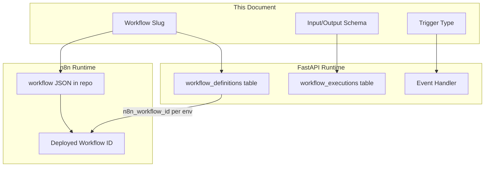
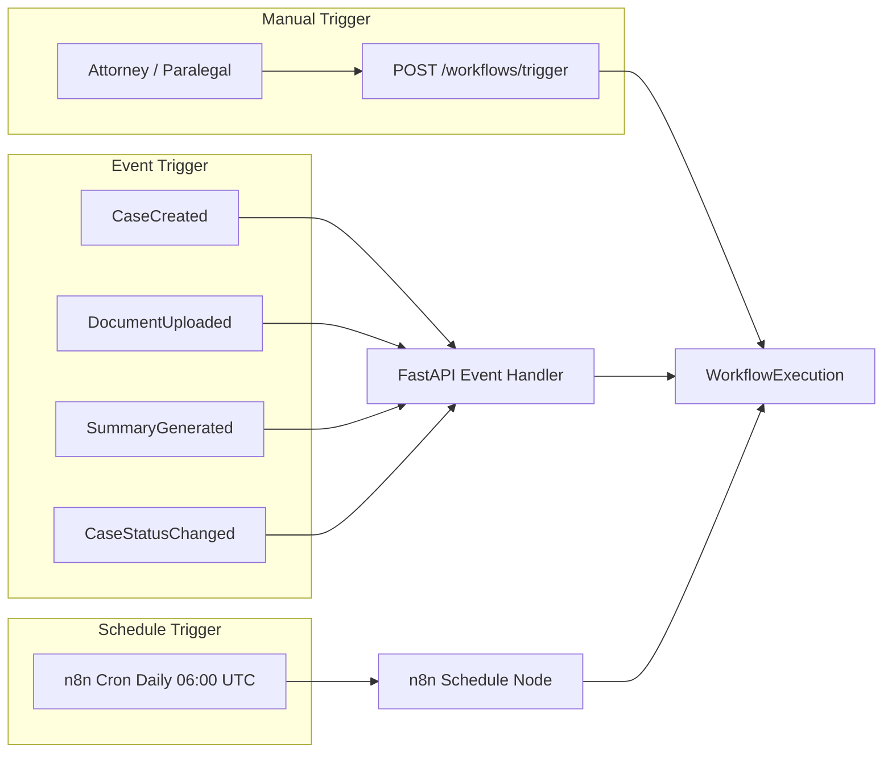
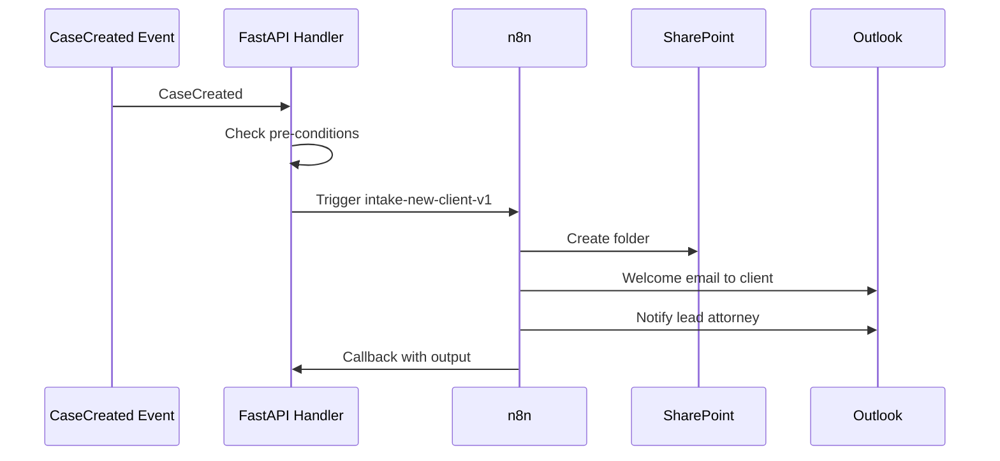
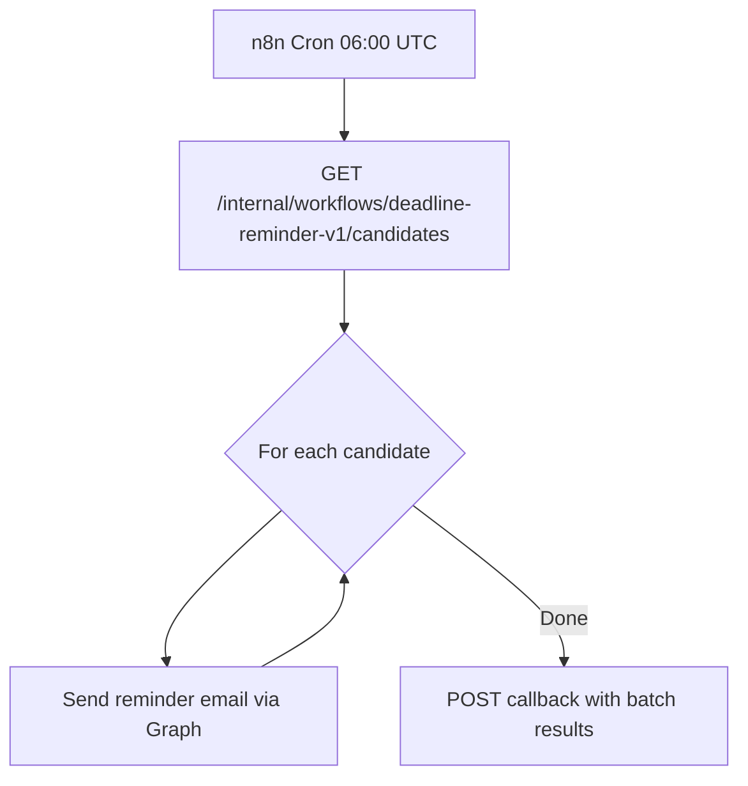
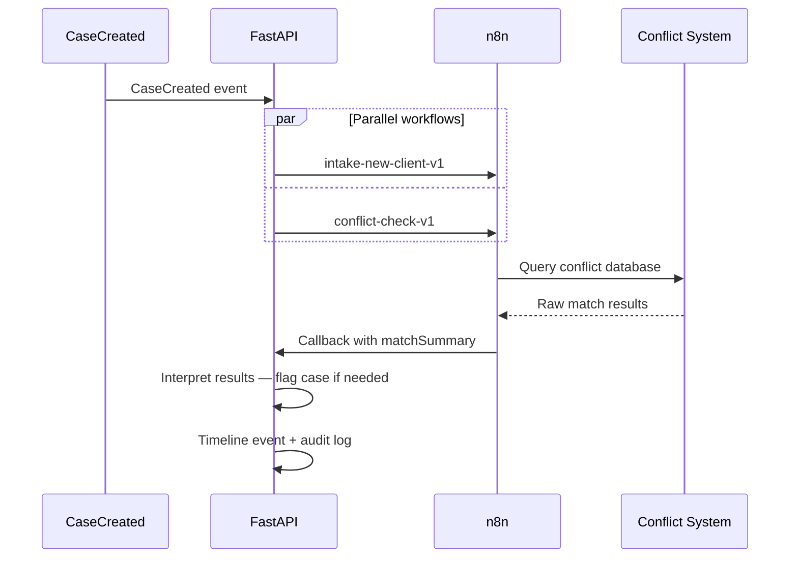
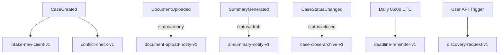

# Workflow Catalog

**LexFlow AI** — Initial Workflow Definitions & Triggers  
**Version:** 1.0  
**Status:** Draft — Pre-Implementation  
**Last Updated:** 2026-07-06

---

## Purpose

This document catalogs all **initial workflow definitions** for LexFlow AI — their slugs, trigger types, input/output contracts, external dependencies, and estimated durations. It serves as the authoritative registry that FastAPI `workflow_definitions` and n8n deployed workflows must align with.

New workflows must be added here before implementation. Slug changes require a new version suffix (`-v2`).

---

## Scope

| In Scope | Out of Scope |
|----------|--------------|
| Initial v1 workflow catalog (7 workflows) | Firm-custom workflow templates (Phase 2) |
| Trigger types and domain event mappings | n8n node-level graphs |
| Input/output field definitions | FastAPI handler implementation |
| External system dependencies per workflow | Workflow analytics and reporting |
| Timeout and retry overrides per workflow | User-configurable parameter UI |

---

## Responsibilities

| Component | Responsibility |
|-----------|----------------|
| **WorkflowDefinition table** | Maps slug → n8n workflow ID per environment |
| **Domain event handlers** | Match events to workflow definitions; create executions |
| **Workflow service** | Validate input against `configSchema`; build sanitized payload |
| **n8n workflows** | Execute HTTP sequences per catalog specification |
| **CI pipeline** | Verify repo JSON slug matches catalog entry |

---

## Architecture

### Catalog to Runtime Mapping

### Trigger Type Overview

---

## Workflow Index

| # | Slug | Name | Trigger | Case Required | Priority |
|---|------|------|---------|---------------|----------|
| 1 | `intake-new-client-v1` | New Client Intake | Event: `CaseCreated` | Yes | High |
| 2 | `document-upload-notify-v1` | Document Upload Notify | Event: `DocumentUploaded` | Yes | Medium |
| 3 | `deadline-reminder-v1` | Deadline Reminder | Schedule: daily 06:00 UTC | Yes | Medium |
| 4 | `ai-summary-notify-v1` | AI Summary Notify | Event: `SummaryGenerated` | Yes | Medium |
| 5 | `case-close-archive-v1` | Case Close Archive | Event: `CaseStatusChanged(closed)` | Yes | High |
| 6 | `discovery-request-v1` | Discovery Request Package | Manual | Yes | High |
| 7 | `conflict-check-v1` | Conflict Check | Event: `CaseCreated` | Yes | Critical |

---

## Workflow Definitions

### 1. `intake-new-client-v1` — New Client Intake

| Attribute | Value |
|-----------|-------|
| **Trigger** | Event: `CaseCreated` (automatic) |
| **Case Required** | Yes |
| **Estimated Duration** | 2 minutes |
| **Execution Timeout** | 30 minutes |
| **External Systems** | Microsoft SharePoint, Microsoft Outlook (Graph API) |
| **Repo Path** | `n8n/workflows/intake/intake-new-client-v1.json` |

**Purpose:** On new case creation, provision SharePoint folder structure, send client welcome email, and notify the lead attorney.

**FastAPI Pre-Conditions (evaluated before trigger):**
- Case status is `active`
- Case has at least one client contact with email
- No prior successful execution for this case + slug (idempotent per case)

**Input Payload (FastAPI → n8n):**

| Field | Type | Required | Source |
|-------|------|----------|--------|
| `clientName` | string | Yes | Case client record |
| `clientEmail` | string (email) | Yes | Case client record |
| `practiceArea` | string | Yes | Case metadata |
| `leadAttorneyEmail` | string (email) | Yes | Case participant |
| `caseTitle` | string | Yes | Case record |
| `sendWelcomeEmail` | boolean | No (default: `true`) | Firm config |
| `createSharePointFolder` | boolean | No (default: `true`) | Firm config |
| `documents` | array | No | `[{ documentId, s3PresignedUrl }]` |

**Output Payload (n8n → FastAPI):**

| Field | Type | Description |
|-------|------|-------------|
| `sharepointFolderUrl` | string (URL) | Created SharePoint folder |
| `emailSent` | boolean | Welcome email delivery status |
| `attorneyNotified` | boolean | Lead attorney notification sent |
| `externalReferenceId` | string | SharePoint item ID |

**n8n Steps:**

| Step Name | External Action |
|-----------|-----------------|
| `create-sharepoint-folder` | Graph API: create folder in case site |
| `send-welcome-email` | Graph API: send email from firm template |
| `notify-lead-attorney` | Graph API: send internal notification |

---

### 2. `document-upload-notify-v1` — Document Upload Notify

| Attribute | Value |
|-----------|-------|
| **Trigger** | Event: `DocumentUploaded` (automatic) |
| **Case Required** | Yes |
| **Estimated Duration** | 1 minute |
| **Execution Timeout** | 15 minutes |
| **External Systems** | Microsoft SharePoint, Microsoft Outlook |
| **Repo Path** | `n8n/workflows/documents/document-upload-notify-v1.json` |

**Purpose:** When a document is uploaded and processing completes, notify case team members and sync document metadata to SharePoint.

**FastAPI Pre-Conditions:**
- Document status is `ready` (OCR/metadata complete)
- Case is not `archived`
- Document is not marked `privileged` with restricted notification list

**Input Payload:**

| Field | Type | Required | Source |
|-------|------|----------|--------|
| `documentId` | UUID | Yes | Document record |
| `documentTitle` | string | Yes | Document metadata |
| `documentType` | string | Yes | Document classification |
| `uploadedBy` | string | Yes | User display name |
| `caseTitle` | string | Yes | Case record |
| `teamEmails` | string[] | Yes | FastAPI-resolved notification list |
| `sharepointSyncEnabled` | boolean | No (default: `true`) | Firm config |
| `s3PresignedUrl` | string (URL) | Yes | For SharePoint upload node |

**Output Payload:**

| Field | Type | Description |
|-------|------|-------------|
| `notificationsSent` | integer | Count of team emails sent |
| `sharepointSynced` | boolean | Document synced to SharePoint |
| `sharepointItemUrl` | string (URL) | SharePoint document URL |

**n8n Steps:**

| Step Name | External Action |
|-----------|-----------------|
| `sync-to-sharepoint` | Graph API: upload document to case folder |
| `notify-case-team` | Graph API: send notification to team members |

---

### 3. `deadline-reminder-v1` — Deadline Reminder

| Attribute | Value |
|-----------|-------|
| **Trigger** | Schedule: daily at 06:00 UTC |
| **Case Required** | Yes (per candidate) |
| **Estimated Duration** | 5–30 minutes (batch) |
| **Execution Timeout** | 60 minutes |
| **External Systems** | Microsoft Outlook (Graph API) |
| **Repo Path** | `n8n/workflows/notifications/deadline-reminder-v1.json` |

**Purpose:** Send email reminders to assigned attorneys and paralegals for case deadlines approaching within the configured window (default: 7 days).

**FastAPI Pre-Conditions (candidates endpoint):**
- Case status is `active`
- Deadline date within reminder window
- Reminder not already sent for this deadline + window

**Input Payload (per batch execution):**

| Field | Type | Required | Source |
|-------|------|----------|--------|
| `reminderWindowDays` | integer | No (default: `7`) | Firm config |
| `candidates` | array | Yes | FastAPI candidates API |
| `candidates[].caseId` | UUID | Yes | — |
| `candidates[].caseTitle` | string | Yes | — |
| `candidates[].deadlineDate` | string (ISO 8601) | Yes | — |
| `candidates[].deadlineType` | string | Yes | — |
| `candidates[].recipientEmails` | string[] | Yes | FastAPI-resolved |

**Output Payload:**

| Field | Type | Description |
|-------|------|-------------|
| `remindersSent` | integer | Total emails sent |
| `candidatesProcessed` | integer | Cases evaluated |
| `failures` | array | `[{ caseId, error }]` for partial failures |

**n8n Steps:**

| Step Name | External Action |
|-----------|-----------------|
| `fetch-candidates` | HTTP: GET FastAPI internal candidates endpoint |
| `send-reminders` | Graph API: loop send reminder emails |
| `report-results` | HTTP: POST callback with batch output |

---

### 4. `ai-summary-notify-v1` — AI Summary Notify

| Attribute | Value |
|-----------|-------|
| **Trigger** | Event: `SummaryGenerated` (automatic) |
| **Case Required** | Yes |
| **Estimated Duration** | 30 seconds |
| **Execution Timeout** | 10 minutes |
| **External Systems** | Microsoft Outlook, LexFlow internal notification |
| **Repo Path** | `n8n/workflows/notifications/ai-summary-notify-v1.json` |

**Purpose:** When an AI document summary reaches `draft` status, notify the lead attorney and create an in-app approval request.

**FastAPI Pre-Conditions:**
- AI summary status is `draft`
- Document is associated with an active case
- Lead attorney is assigned to case

**Input Payload:**

| Field | Type | Required | Source |
|-------|------|----------|--------|
| `summaryId` | UUID | Yes | AI summary record |
| `documentTitle` | string | Yes | Document metadata |
| `caseTitle` | string | Yes | Case record |
| `leadAttorneyEmail` | string (email) | Yes | Case participant |
| `summaryPreview` | string | Yes | First 200 chars of summary |
| `approvalUrl` | string (URL) | Yes | FastAPI-generated review link |

**Output Payload:**

| Field | Type | Description |
|-------|------|-------------|
| `attorneyNotified` | boolean | Email notification sent |
| `approvalRequestCreated` | boolean | In-app approval request created |

---

### 5. `case-close-archive-v1` — Case Close Archive

| Attribute | Value |
|-----------|-------|
| **Trigger** | Event: `CaseStatusChanged(closed)` (automatic) |
| **Case Required** | Yes |
| **Estimated Duration** | 10 minutes |
| **Execution Timeout** | 60 minutes |
| **External Systems** | Microsoft SharePoint, Billing system webhook |
| **Repo Path** | `n8n/workflows/cases/case-close-archive-v1.json` |

**Purpose:** On case closure, archive documents to long-term SharePoint storage, export audit trail, and notify billing for final invoice.

**FastAPI Pre-Conditions:**
- Case status transitioned to `closed`
- All pending workflows for case are completed or cancelled
- No open tasks with blocking status

**Input Payload:**

| Field | Type | Required | Source |
|-------|------|----------|--------|
| `caseId` | UUID | Yes | Case record |
| `caseTitle` | string | Yes | Case record |
| `closedBy` | string | Yes | User display name |
| `closedAt` | string (ISO 8601) | Yes | Case metadata |
| `documentIds` | UUID[] | Yes | All case documents |
| `billingContactEmail` | string (email) | Yes | Firm config |
| `archiveSharepointSite` | string (URL) | Yes | Firm archive site |

**Output Payload:**

| Field | Type | Description |
|-------|------|-------------|
| `documentsArchived` | integer | Count of documents moved |
| `auditTrailExported` | boolean | Audit export completed |
| `billingNotified` | boolean | Billing notification sent |
| `archiveFolderUrl` | string (URL) | Archive folder in SharePoint |

**n8n Steps:**

| Step Name | External Action |
|-----------|-----------------|
| `archive-documents` | Graph API: move documents to archive site |
| `export-audit-trail` | HTTP: POST to FastAPI audit export endpoint |
| `notify-billing` | HTTP: POST to billing system webhook |

---

### 6. `discovery-request-v1` — Discovery Request Package

| Attribute | Value |
|-----------|-------|
| **Trigger** | Manual (attorney-initiated via API) |
| **Case Required** | Yes |
| **Estimated Duration** | 5 minutes |
| **Execution Timeout** | 30 minutes |
| **External Systems** | Microsoft Outlook (Graph API), S3 (document fetch) |
| **Repo Path** | `n8n/workflows/discovery/discovery-request-v1.json` |

**Purpose:** Generate a discovery document package from selected case documents and send to opposing counsel via Outlook.

**FastAPI Pre-Conditions:**
- User has `workflow:trigger:assigned` + matter wall access
- All `documentIds` belong to the case and are `ready`
- Case is not `archived`
- Recipient email validated against case party list

**Input Payload:**

| Field | Type | Required | Source |
|-------|------|----------|--------|
| `documentIds` | UUID[] | Yes | User selection (validated) |
| `recipientEmail` | string (email) | Yes | User input (validated) |
| `recipientName` | string | Yes | User input |
| `coverLetterTemplateId` | string | No | Firm template config |
| `documents` | array | Yes | `[{ documentId, title, s3PresignedUrl }]` |
| `senderEmail` | string (email) | Yes | Triggering attorney |
| `caseTitle` | string | Yes | Case record |

**Output Payload:**

| Field | Type | Description |
|-------|------|-------------|
| `packageGenerated` | boolean | ZIP package created |
| `emailSent` | boolean | Discovery package emailed |
| `sentAt` | string (ISO 8601) | Send timestamp |
| `trackingId` | string | Outlook message ID |

**n8n Steps:**

| Step Name | External Action |
|-----------|-----------------|
| `generate-package` | HTTP: fetch documents from S3 presigned URLs; assemble ZIP |
| `send-via-outlook` | Graph API: send email with attachment |

---

### 7. `conflict-check-v1` — Conflict Check

| Attribute | Value |
|-----------|-------|
| **Trigger** | Event: `CaseCreated` (automatic, parallel with intake) |
| **Case Required** | Yes |
| **Estimated Duration** | 30 seconds |
| **Execution Timeout** | 10 minutes |
| **External Systems** | External conflict check system API |
| **Repo Path** | `n8n/workflows/compliance/conflict-check-v1.json` |

**Purpose:** Query the firm's external conflict-check system for potential conflicts when a new case is created. FastAPI interprets results and flags the case if matches are found.

**FastAPI Pre-Conditions:**
- Case has client name and opposing party (if applicable)
- Conflict check not already performed for this case
- External conflict system is configured for firm

**Input Payload:**

| Field | Type | Required | Source |
|-------|------|----------|--------|
| `clientName` | string | Yes | Case client record |
| `clientIdentifiers` | object | No | `{ taxId, entityType }` |
| `opposingParties` | string[] | No | Case parties |
| `practiceArea` | string | Yes | Case metadata |
| `matterDescription` | string | No | Case description (truncated) |

**Output Payload:**

| Field | Type | Description |
|-------|------|-------------|
| `conflictCheckId` | string | External system reference |
| `matchesFound` | boolean | Raw result from external system |
| `matchCount` | integer | Number of potential matches |
| `matchSummary` | array | `[{ partyName, matchType, confidence }]` |
| `checkedAt` | string (ISO 8601) | Check timestamp |

> **Critical:** n8n returns raw match data. FastAPI determines whether the case should be flagged, blocked, or escalated to the conflicts committee. This is business logic — never in n8n.

---

## Event-to-Workflow Mapping

| Domain Event | Workflow Slug(s) | Handler Logic |
|--------------|------------------|---------------|
| `CaseCreated` | `intake-new-client-v1`, `conflict-check-v1` | Both triggered in parallel; independent executions |
| `DocumentUploaded` | `document-upload-notify-v1` | Only when document status reaches `ready` |
| `SummaryGenerated` | `ai-summary-notify-v1` | Only when summary status is `draft` |
| `CaseStatusChanged(closed)` | `case-close-archive-v1` | Only on transition to `closed` |
| — (schedule) | `deadline-reminder-v1` | n8n cron; FastAPI provides candidates |
| — (manual) | `discovery-request-v1` | User-initiated via API |

---

## Timeout & Retry Overrides

| Slug | Execution Timeout | HTTP Node Timeout | HTTP Retries |
|------|-------------------|-------------------|--------------|
| `intake-new-client-v1` | 30 min | 60s | 3 |
| `document-upload-notify-v1` | 15 min | 60s | 3 |
| `deadline-reminder-v1` | 60 min | 30s | 2 |
| `ai-summary-notify-v1` | 10 min | 30s | 3 |
| `case-close-archive-v1` | 60 min | 120s | 3 |
| `discovery-request-v1` | 30 min | 120s | 3 |
| `conflict-check-v1` | 10 min | 30s | 3 |

See [retry-dlq.md](./retry-dlq.md) for platform-wide retry policies.

---

## Best Practices

1. **Register new workflows here before writing n8n JSON** — Catalog is the source of truth for slugs.
2. **Never reuse a slug for different behavior** — Increment version suffix instead.
3. **Document FastAPI pre-conditions explicitly** — Event handlers must match catalog spec.
4. **Keep output payloads flat and typed** — FastAPI validates against per-slug JSON schema.
5. **Parallel workflows on same event must be independent** — No execution ordering assumptions.
6. **Scheduled workflows must use FastAPI candidates API** — n8n never queries deadlines directly.

---

## Tradeoffs

| Decision | Benefit | Cost |
|----------|---------|------|
| 7 initial workflows (not more) | Focused MVP; manageable promotion | Some firm requests deferred to Phase 2 |
| Event + manual triggers for discovery | Flexible attorney control | Two trigger code paths |
| Parallel intake + conflict check | Faster case onboarding | Two executions per CaseCreated |
| Batch schedule for deadlines | Efficient; single n8n execution | Partial failure handling complexity |
| FastAPI interprets conflict results | Business logic in testable Python | n8n returns more data than strictly needed |

---

## Future Improvements

| Phase | Workflow |
|-------|----------|
| Phase 2 | `court-filing-v1` — E-filing submission |
| Phase 2 | `billing-invoice-v1` — Generate and send invoice |
| Phase 2 | `client-portal-invite-v1` — Send client portal access |
| Phase 3 | Firm-custom workflow templates via admin UI |
| Phase 3 | `deposition-schedule-v1` — Calendar integration |

---

## References

- [orchestration-model.md](./orchestration-model.md) — Trigger types and lifecycle
- [webhook-contracts.md](./webhook-contracts.md) — Per-slug payload schemas
- [../02-domain/workflow-aggregate.md](../02-domain/workflow-aggregate.md) — Domain model
- [../04-api/endpoints-workflows.md](../04-api/endpoints-workflows.md) — Public trigger API
- [../02-domain/domain-events.md](../02-domain/domain-events.md) — Event definitions
- [n8n-integration.md](./n8n-integration.md) — Node restrictions
