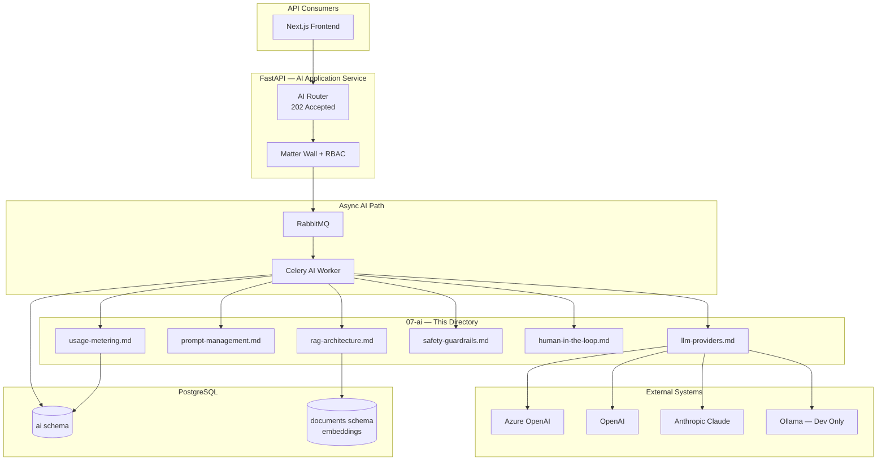
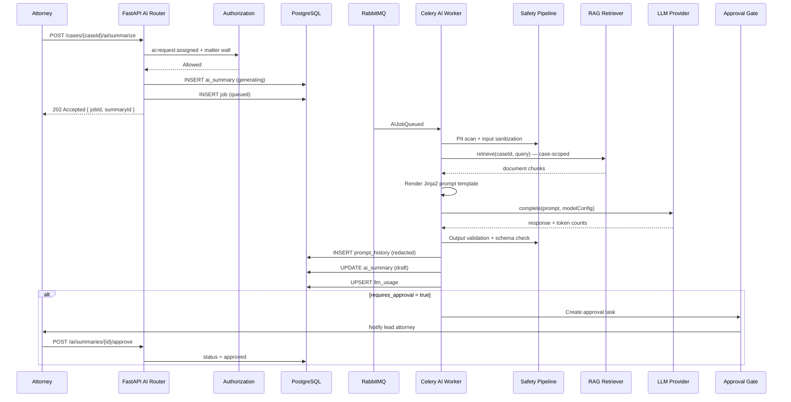
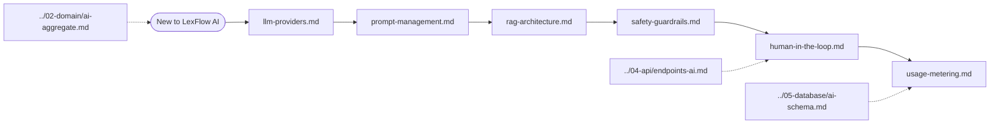
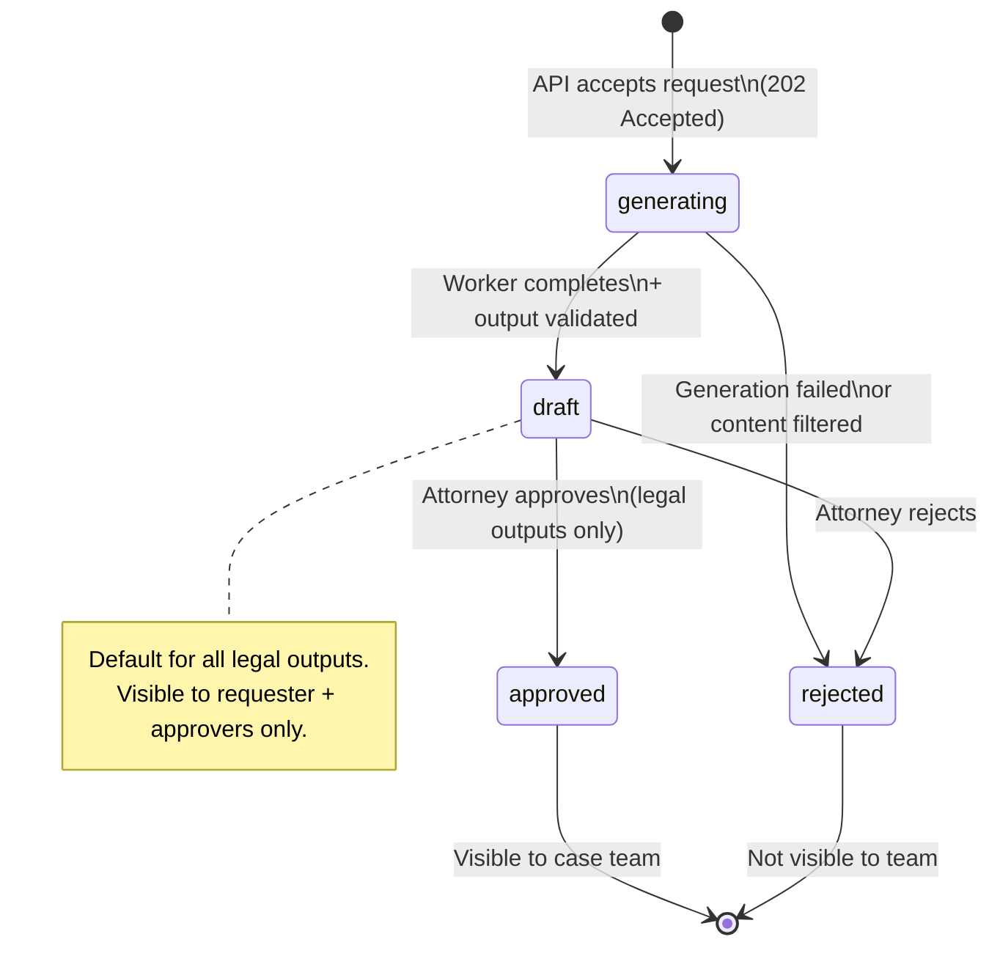

# AI & Knowledge — Documentation Index

**LexFlow AI** — LLM Integration, RAG, Safety & Governance  
**Version:** 1.0  
**Status:** Draft — Pre-Implementation  
**Last Updated:** 2026-07-06

---

## Purpose

This directory is the **authoritative technical reference** for LexFlow AI's AI & Knowledge bounded context. It defines how the platform integrates with LLM providers, manages versioned prompts, performs case-scoped retrieval-augmented generation (RAG), enforces safety guardrails, gates legal outputs through human-in-the-loop approval, and meters token usage for cost governance.

Engineers, AI/ML specialists, security reviewers, and compliance officers use these documents to implement and audit the async AI pipeline without embedding business logic in n8n or the frontend.

---

## Scope

| In Scope | Out of Scope |
|----------|--------------|
| Provider abstraction and adapter pattern | Frontend chat UI components |
| Prompt template registry and Jinja2 rendering | OCR and document ingestion pipeline |
| RAG embedding, chunking, and hybrid search | n8n workflow node configuration |
| PII redaction, prompt injection defense, output validation | LLM fine-tuning and model training |
| Human-in-the-loop approval for legal outputs | Client portal AI features (Phase 3) |
| Token metering, budgets, and cost controls | Infrastructure Terraform for AI workers |

### Platform Invariants

These constraints apply across every document in this directory:

1. **Async only** — All LLM inference runs on the Celery worker path; the API returns `202 Accepted` per [ADR-004](../13-decisions/004-async-ai-processing.md).
2. **Case-scoped RAG** — Vector and full-text retrieval always filter by `case_id`; matter wall authorization precedes any retrieval.
3. **Human approval for legal outputs** — Summaries, research memos, and contract reviews require attorney approval before team visibility; see [human-in-the-loop.md](./human-in-the-loop.md).

---

## Responsibilities

| Audience | Use This Directory To |
|----------|----------------------|
| **Backend / AI engineers** | Implement provider adapters, prompt registry, RAG pipeline, and worker tasks |
| **Security reviewers** | Validate PII handling, injection defenses, and audit completeness |
| **Compliance officers** | Review approval gates, data retention, and provider data policies |
| **Frontend engineers** | Understand async job polling, approval UX contracts, and disclaimer requirements |
| **DevOps / SRE** | Plan AI worker scaling, provider rate limits, and cost alert thresholds |
| **Product / legal ops** | Validate summary types, approval workflows, and disclaimer language |

---

## Architecture

LexFlow AI's AI layer sits inside the **AI & Knowledge** bounded context (`services/ai_knowledge/`) and communicates with other contexts exclusively via domain events and shared PostgreSQL schemas.

### Document Map

| Document | Description | Primary Diagrams |
|----------|-------------|------------------|
| [llm-providers.md](./llm-providers.md) | Provider adapter pattern — OpenAI, Azure OpenAI, Claude, Ollama | Flowchart, sequence, state |
| [prompt-management.md](./prompt-management.md) | Versioned Jinja2 templates, registry, activation lifecycle | State, sequence, flowchart |
| [rag-architecture.md](./rag-architecture.md) | Chunking, embeddings, pgvector, hybrid search | Flowchart, sequence, state |
| [safety-guardrails.md](./safety-guardrails.md) | PII redaction, prompt injection, output validation | Flowchart, sequence, state |
| [human-in-the-loop.md](./human-in-the-loop.md) | Approval workflow for AI-generated legal outputs | State, sequence, flowchart |
| [usage-metering.md](./usage-metering.md) | Token tracking, cost controls, firm/case budgets | Flowchart, sequence, state |

---

## Flow Diagrams

### End-to-End AI Request Lifecycle

### Reading Order for AI Engineers

### AI Output Governance State (Summary)

---

## Best Practices

1. **Read domain first** — Start with [ai-aggregate.md](../02-domain/ai-aggregate.md) for aggregate invariants before implementing worker tasks.
2. **Never call LLMs synchronously** — All inference goes through RabbitMQ → Celery; the API returns `202` per [ADR-004](../13-decisions/004-async-ai-processing.md).
3. **Scope retrieval to case** — Every RAG query includes `case_id` filter and matter wall check before embedding search.
4. **Version prompts, not strings** — Reference `prompt_version` slug in `ai_summaries` for reproducibility and audit.
5. **Redact before send** — PII is removed from prompts before they leave the firm boundary; see [safety-guardrails.md](./safety-guardrails.md).
6. **Meter every call** — Token counts flow to `llm_usage` before the worker task completes; see [usage-metering.md](./usage-metering.md).
7. **Gate legal outputs** — Summaries, research, and contract review require attorney approval; chat is internal-only and never auto-shared.
8. **Use Azure OpenAI in production** — Firm data stays in the firm's Azure subscription; Ollama is dev-only.

---

## Tradeoffs

| Decision | Benefit | Cost |
|----------|---------|------|
| Dedicated `07-ai/` directory | Deep AI docs without bloating architecture index | Some overlap with legacy [ai-architecture.md](../ai-architecture.md) |
| Provider adapter pattern | Swap providers without changing worker logic | Adapter maintenance across four providers |
| Case-scoped RAG only | Matter wall enforced at retrieval; no cross-case leakage | Cannot cross-reference other matters in research |
| Human-in-the-loop for legal outputs | Attorney accountability; ethical compliance | Slower time-to-value for team-visible AI content |
| Async-only inference | Resilient, retryable, scalable | Frontend polling/SSE complexity |
| pgvector in PostgreSQL | Single database; transactional consistency with documents | Vector search scale limits vs dedicated vector DB |
| Jinja2 prompt templates | Familiar, versionable, auditable | Template injection risk — mitigated by sandboxed rendering |

---

## Future Improvements

| Phase | Enhancement |
|-------|-------------|
| Phase 2 | SSE token streaming for case chat (full response still persisted async) |
| Phase 2 | Prompt A/B testing — route percentage of requests to draft template versions |
| Phase 3 | Firm playbook management API for contract review rules |
| Phase 3 | Multi-model ensemble for high-risk contract reviews |
| Phase 4 | Citation verification — automated check that cited passages exist in case documents |
| Ongoing | Consolidate legacy [ai-architecture.md](../ai-architecture.md) into this directory |

---

## References

### Within This Directory

- [llm-providers.md](./llm-providers.md)
- [prompt-management.md](./prompt-management.md)
- [rag-architecture.md](./rag-architecture.md)
- [safety-guardrails.md](./safety-guardrails.md)
- [human-in-the-loop.md](./human-in-the-loop.md)
- [usage-metering.md](./usage-metering.md)

### Cross-References

| Path | Relevance |
|------|-----------|
| [../02-domain/ai-aggregate.md](../02-domain/ai-aggregate.md) | AISummary, PromptTemplate aggregates and invariants |
| [../04-api/endpoints-ai.md](../04-api/endpoints-ai.md) | REST API — async 202 pattern, approve/reject endpoints |
| [../05-database/ai-schema.md](../05-database/ai-schema.md) | `ai` schema tables — summaries, templates, history, usage |
| [../database-architecture.md](../database-architecture.md) | Consolidated schema reference including `document_embeddings` |
| [../ai-architecture.md](../ai-architecture.md) | Legacy consolidated AI reference (superseded by this directory) |
| [../13-decisions/004-async-ai-processing.md](../13-decisions/004-async-ai-processing.md) | Async AI processing decision |
| [../03-architecture/component-architecture.md](../03-architecture/component-architecture.md) | AI & Knowledge module layout |
| [../compliance-data-governance.md](../compliance-data-governance.md) | Data classification and retention for AI artifacts |
| [../security-architecture.md](../security-architecture.md) | Threat model including LLM data exposure |
