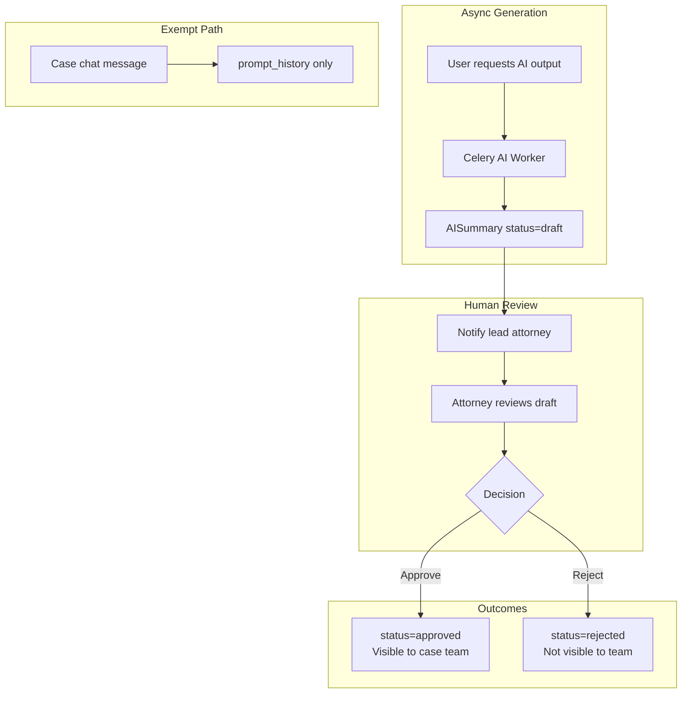
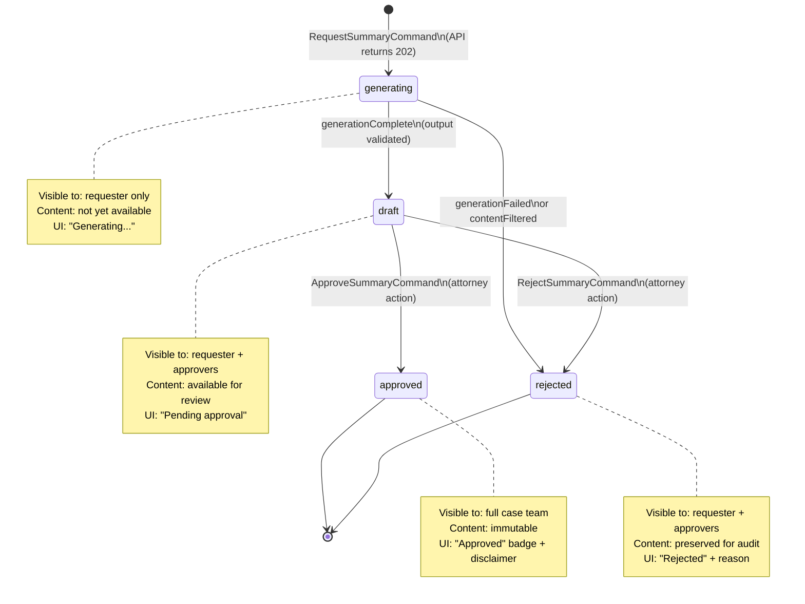
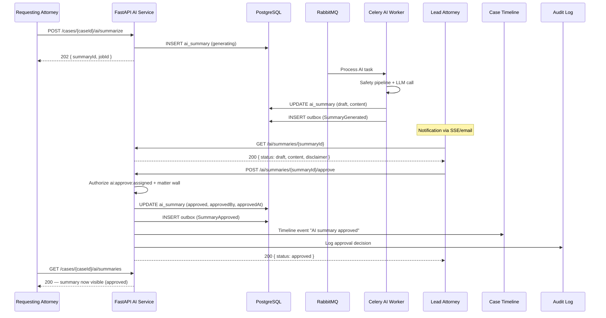
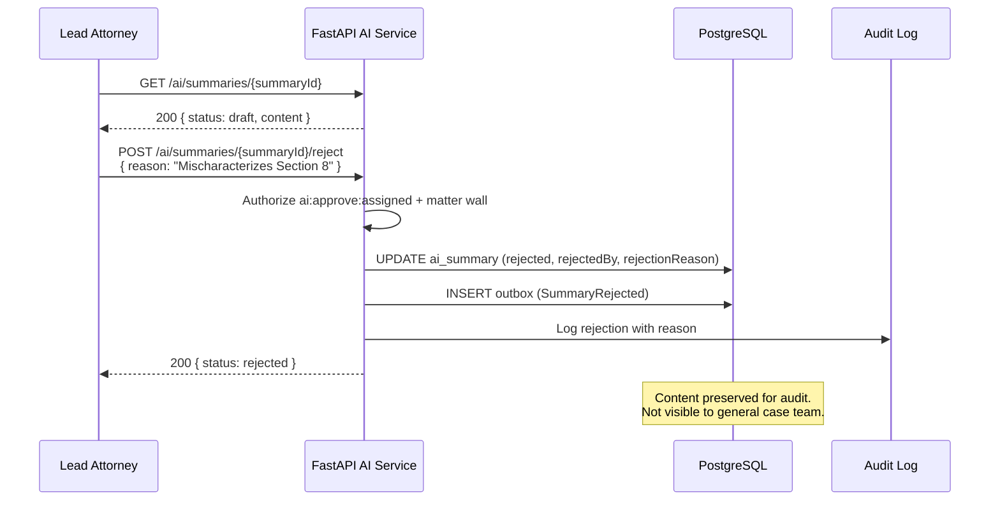

# Human-in-the-Loop

**LexFlow AI** — Approval Workflow for AI-Generated Legal Outputs  
**Version:** 1.0  
**Status:** Draft — Pre-Implementation  
**Last Updated:** 2026-07-06

---

## Purpose

Define LexFlow AI's **human-in-the-loop (HITL)** governance model — the mandatory attorney approval workflow that gates AI-generated legal outputs before they become visible to the broader case team.

Human review is a **legal and ethical requirement**, not an optional feature. All summaries, research memos, and contract reviews require authorized attorney approval. Internal case chat is exempt from the AISummary approval lifecycle but remains case-scoped and never auto-shared externally.

---

## Scope

| In Scope | Out of Scope |
|----------|--------------|
| AISummary approval lifecycle | Frontend approval UI components |
| Approval authorization (`ai:approve:assigned`) | Email notification templates |
| Visibility rules by summary status | Client portal AI output delivery |
| Rejection workflow and reason capture | Attorney edit/diff workflow (Phase 2) |
| Integration with case timeline | Workflow orchestration for approval reminders |
| Chat exemption rules | Multi-level approval chains (Phase 3) |

---

## Responsibilities

| Component | Responsibility |
|-----------|----------------|
| **AISummary aggregate** | Enforce status transitions; immutability after approval |
| **AI application service** | Create summaries; dispatch approve/reject commands |
| **Authorization service** | Verify `ai:approve:assigned` + matter wall |
| **Approval notification** | Notify lead attorney when draft ready (via domain event) |
| **Case timeline** | Record approval/rejection events |
| **Audit service** | Log all approval decisions with actor and timestamp |
| **Frontend** | Display draft content to approvers; hide from general team |

---

## Architecture

### HITL Governance Model



### Output Types and Approval Requirements

| Capability | Creates AISummary | requires_approval | Team Visible After |
|------------|-------------------|-------------------|-------------------|
| Document summary | Yes | true | Attorney approval |
| Case overview | Yes | true | Attorney approval |
| Deposition summary | Yes | true | Attorney approval |
| Legal research | Yes | true | Attorney approval |
| Contract review | Yes | true | Attorney approval |
| Case chat | No | false | N/A — internal only, per-user |

Configuration source: `PromptTemplate.requires_approval` — see [prompt-management.md](./prompt-management.md) and [ai-aggregate.md](../02-domain/ai-aggregate.md).

---

## AISummary Status State Machine



---

## Flow Diagrams

### End-to-End Approval Sequence



### Rejection Sequence



### Visibility Authorization Flowchart

```mermaid
flowchart TD
    START([GET /ai/summaries/{id}]) --> AUTHZ{User authorized on case?<br/>Matter wall check}
    AUTHZ -->|No| DENY[403 Forbidden]
    AUTHZ -->|Yes| STATUS{Summary status?}

    STATUS -->|generating| GEN_VISIBLE{Is requester?}
    GEN_VISIBLE -->|Yes| SHOW_GEN[Return metadata only<br/>no content]
    GEN_VISIBLE -->|No| DENY

    STATUS -->|draft| DRAFT_VISIBLE{Is requester OR<br/>has ai:approve:assigned?}
    DRAFT_VISIBLE -->|Yes| SHOW_DRAFT[Return full content + disclaimer]
    DRAFT_VISIBLE -->|No| DENY

    STATUS -->|approved| APPROVED_VISIBLE{Has case:read:assigned?}
    APPROVED_VISIBLE -->|Yes| SHOW_APPROVED[Return full content]
    APPROVED_VISIBLE -->|No| DENY

    STATUS -->|rejected| REJ_VISIBLE{Is requester OR<br/>has ai:approve:assigned?}
    REJ_VISIBLE -->|Yes| SHOW_REJ[Return content + rejection reason]
    REJ_VISIBLE -->|No| DENY
```

---

## Authorization

### Permissions

| Permission | Capability |
|------------|------------|
| `ai:request:assigned` | Request AI summaries, research, contract review, chat |
| `ai:approve:assigned` | Approve or reject AI summaries on assigned cases |
| `case:read:assigned` | View approved summaries on assigned cases |

All permissions require **matter wall** enforcement — see [authorization-rbac.md](../04-api/authorization-rbac.md).

### Approver Eligibility

| Role | Can Approve |
|------|-------------|
| Lead attorney on case | Yes |
| Partner with case assignment | Yes |
| Associate (without lead role) | No — unless granted `ai:approve:assigned` |
| Paralegal | No |
| Staff | No |

---

## API Contract

Approval endpoints are defined in [endpoints-ai.md](../04-api/endpoints-ai.md):

| Endpoint | Action |
|----------|--------|
| `POST /ai/summaries/{summaryId}/approve` | Approve draft summary |
| `POST /ai/summaries/{summaryId}/reject` | Reject with reason |
| `GET /ai/summaries/{summaryId}` | Retrieve summary (visibility rules apply) |
| `GET /cases/{caseId}/ai/summaries` | List summaries (filtered by visibility) |

### Approve Request

| Field | Required | Description |
|-------|----------|-------------|
| `decisionNote` | No | Optional note from approver |

### Reject Request

| Field | Required | Description |
|-------|----------|-------------|
| `reason` | Yes | Rejection reason (min 10 chars) |

---

## Domain Invariants

From [ai-aggregate.md](../02-domain/ai-aggregate.md):

| # | Invariant | Enforcement |
|---|-----------|-------------|
| 1 | Summary cannot reach `approved` without authorized attorney action | `approve()` method guard |
| 2 | `approvedBy` and `approvedAt` set only on `approved` status | State transition guard |
| 3 | `rejectedBy` and `rejectionReason` set only on `rejected` status | State transition guard |
| 4 | Approved summaries are immutable — no content edits | No update path on approved status |
| 5 | AI inference never synchronous in HTTP path | API returns 202 |
| 6 | Never auto-send AI output to clients | Approval + separate send workflow |

---

## Domain Events

| Event | Trigger | Consumers |
|-------|---------|-----------|
| `SummaryRequested` | API accepts AI request | Metrics, audit |
| `SummaryGenerated` | Worker completes generation | Notification service, timeline |
| `SummaryApproved` | Attorney approves | Timeline, search index, notification |
| `SummaryRejected` | Attorney rejects | Notification to requester, audit |

---

## Chat Exemption

Case-scoped chat (`POST /cases/{caseId}/ai/chat`) operates under different governance:

| Aspect | Chat Behavior |
|--------|---------------|
| AISummary created | No — uses `prompt_history` only |
| Approval required | No — internal assistant use |
| Team visibility | No — responses visible only to requesting user |
| External sharing | Never — no auto-share path exists |
| Disclaimer | Shown in UI: "Verify before use in legal work product" |
| Audit | Full prompt/response in `prompt_history` |

Chat is async (202 + job polling) per [ADR-004](../13-decisions/004-async-ai-processing.md) but bypasses the AISummary approval lifecycle because responses are private to the requesting user.

---

## Best Practices

1. **Never show draft summaries to the full team** — Enforce visibility rules at API layer, not just UI.
2. **Require rejection reason** — Mandatory `reason` field supports quality feedback and audit.
3. **Display disclaimer prominently** — All AI content shows disclaimer before and after approval.
4. **Notify approvers promptly** — `SummaryGenerated` event triggers notification to lead attorney.
5. **Preserve rejected content** — Do not delete rejected summaries; they support audit and prompt improvement.
6. **Immutable after approval** — Approved content cannot be edited; request new summary if corrections needed.
7. **Log all decisions** — Approval and rejection write to `audit.audit_logs` with actor and timestamp.
8. **Never bypass approval via API** — No admin endpoint to force-approve without attorney role.

---

## Tradeoffs

| Decision | Benefit | Cost |
|----------|---------|------|
| Mandatory approval for legal outputs | Attorney accountability; ethical compliance | Slower time-to-value for team |
| Separate chat exemption | Faster internal assistant UX | Less structured governance on chat |
| Immutable approved content | Audit integrity; clear accountability | Must regenerate for corrections |
| Lead attorney as default approver | Clear responsibility | Bottleneck on high-volume cases |
| Rejection reason required | Quality feedback loop | Extra friction for approver |
| Draft visible to requester + approvers | Transparency during review | Requester may act on unapproved content internally |

---

## Future Improvements

| Phase | Enhancement |
|-------|-------------|
| Phase 2 | Summary diff view — attorney edits between draft and approved |
| Phase 2 | Approval reminders — n8n workflow after 24h pending |
| Phase 3 | Delegated approval — associate approvers with partner oversight |
| Phase 3 | Batch approval for low-risk document summaries |
| Phase 4 | Approval analytics — rejection rates by template version |

---

## References

- [../02-domain/ai-aggregate.md](../02-domain/ai-aggregate.md) — AISummary aggregate, state machine, invariants
- [../04-api/endpoints-ai.md](../04-api/endpoints-ai.md) — Approve/reject endpoints, visibility notes
- [../04-api/authorization-rbac.md](../04-api/authorization-rbac.md) — `ai:approve:assigned` permission
- [../05-database/ai-schema.md](../05-database/ai-schema.md) — `ai_summaries` status columns
- [prompt-management.md](./prompt-management.md) — `requires_approval` flag per template
- [safety-guardrails.md](./safety-guardrails.md) — Pre-approval safety pipeline
- [../13-decisions/004-async-ai-processing.md](../13-decisions/004-async-ai-processing.md) — Async generation path
- [../02-domain/domain-events.md](../02-domain/domain-events.md) — Summary domain events
