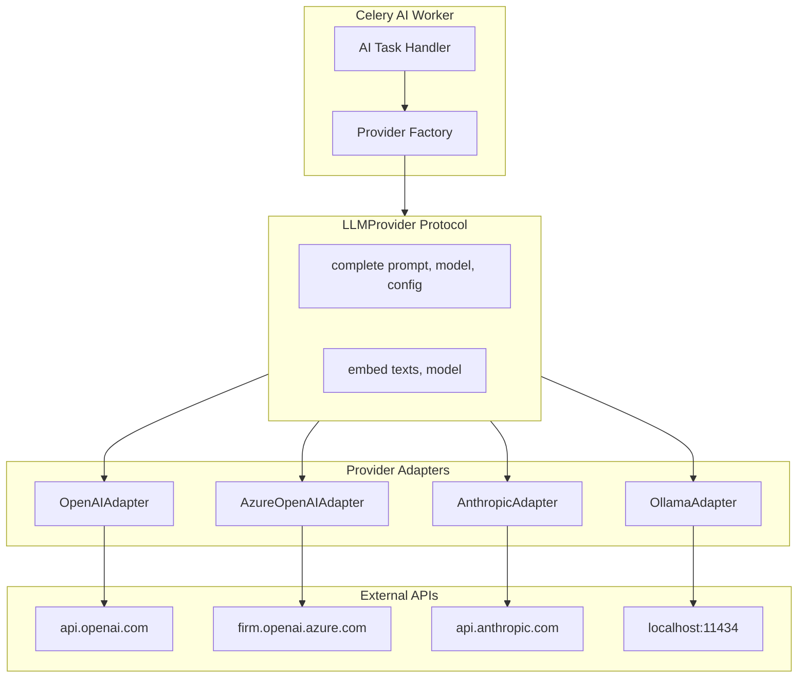
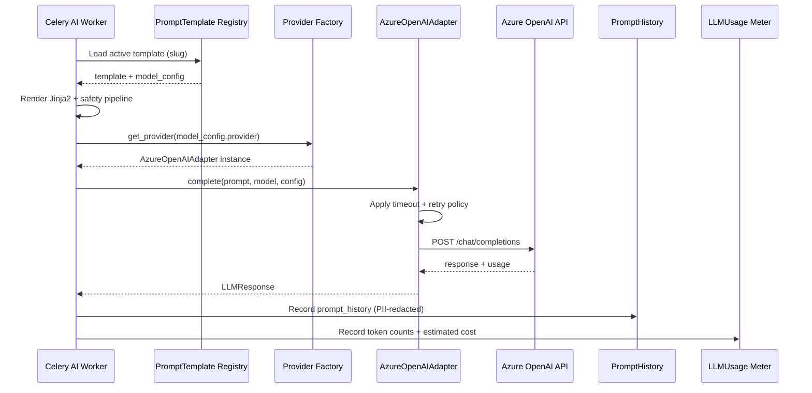
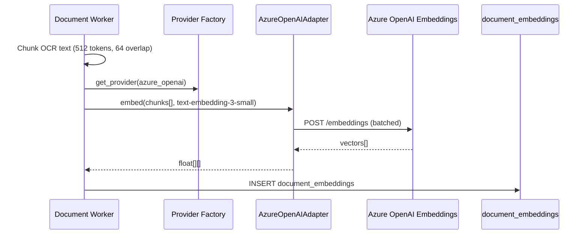
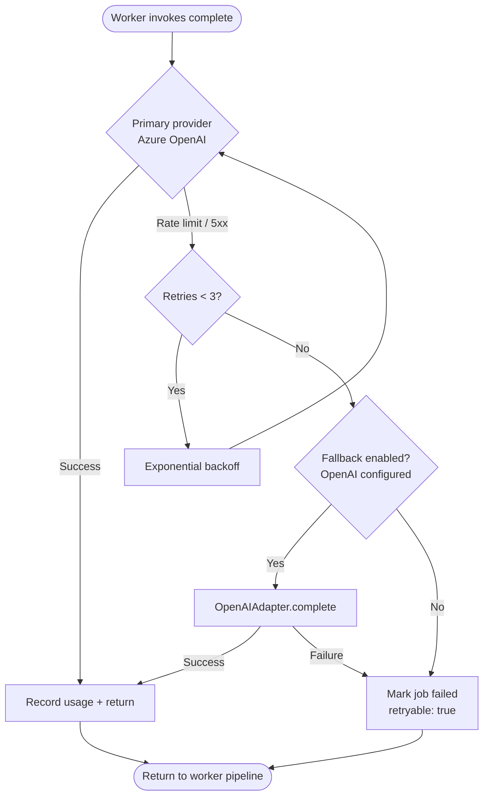
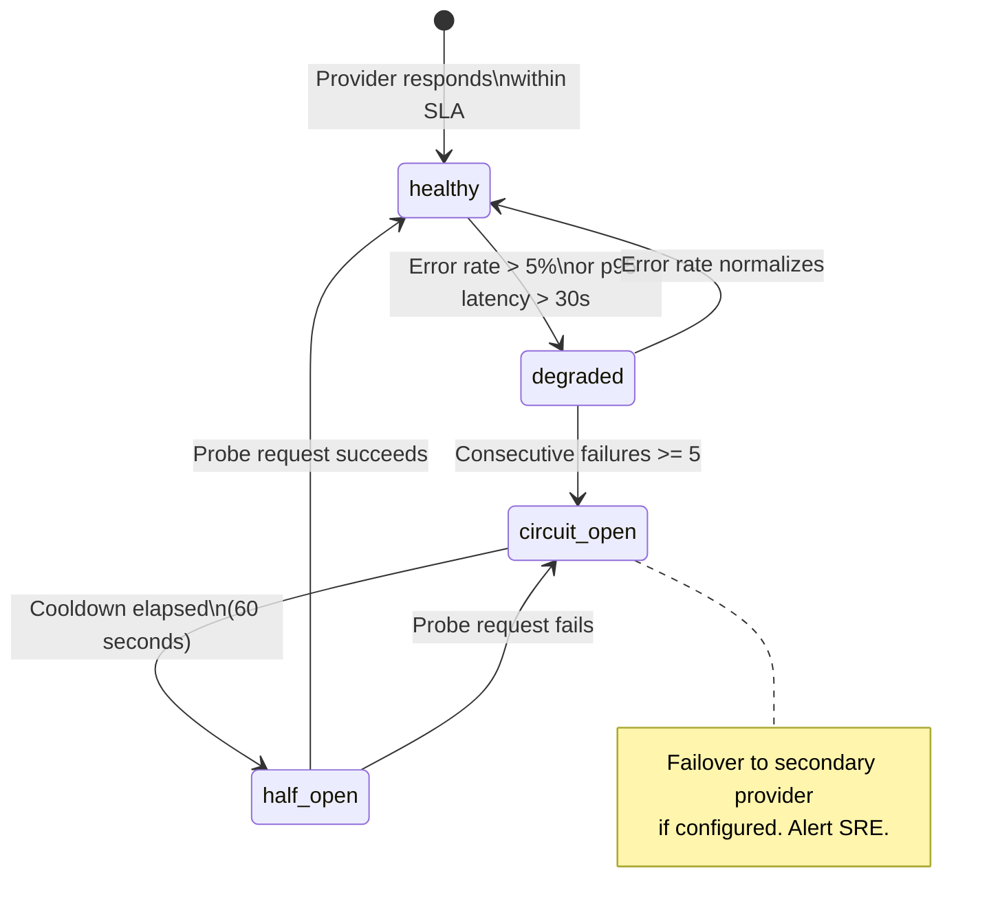

# LLM Providers

**LexFlow AI** — Provider Abstraction & Adapter Pattern  
**Version:** 1.0  
**Status:** Draft — Pre-Implementation  
**Last Updated:** 2026-07-06

---

## Purpose

Define the **provider-agnostic abstraction** for large language model and embedding services in LexFlow AI. This document specifies the adapter pattern that allows the Celery AI worker to call OpenAI, Azure OpenAI, Anthropic Claude, or Ollama (development only) through a uniform interface without changing business logic.

All provider calls occur on the **async worker path** — never in the HTTP request handler. See [ADR-004](../13-decisions/004-async-ai-processing.md) and [endpoints-ai.md](../04-api/endpoints-ai.md).

---

## Scope

| In Scope | Out of Scope |
|----------|--------------|
| `LLMProvider` protocol and adapter implementations | Model fine-tuning or custom training |
| Provider selection via `PromptTemplate.model_config` | Frontend model picker UI |
| Completion and embedding operations | Real-time streaming (Phase 2 enhancement) |
| Retry, timeout, and rate-limit handling | Provider billing portal integration |
| Provider-specific authentication configuration | n8n LLM node usage |

---

## Responsibilities

| Component | Responsibility |
|-----------|----------------|
| **LLMProvider protocol** | Define `complete()` and `embed()` contract |
| **Provider factory** | Resolve adapter from `model_config.provider` enum |
| **OpenAI adapter** | Direct OpenAI API — fallback and development |
| **Azure OpenAI adapter** | Firm Azure tenant deployment — production primary |
| **Anthropic adapter** | Claude models — long-context contract review |
| **Ollama adapter** | Local models — developer workstation only |
| **Celery AI worker** | Invoke provider after safety pipeline; record usage |
| **PromptTemplate** | Store per-template `provider`, `model`, temperature, max_tokens |

---

## Architecture

### Provider Abstraction Layer

### Protocol Contract

| Method | Input | Output | Notes |
|--------|-------|--------|-------|
| `complete()` | `prompt`, `model`, `ModelConfig` | `LLMResponse` | Chat/completion for summaries, research, chat |
| `embed()` | `texts[]`, `model` | `float[][]` | Vector generation for RAG; see [rag-architecture.md](./rag-architecture.md) |

### LLMResponse Fields

| Field | Type | Purpose |
|-------|------|---------|
| `content` | string | Generated text or JSON |
| `input_tokens` | int | Prompt token count for metering |
| `output_tokens` | int | Completion token count for metering |
| `model` | string | Resolved model identifier |
| `provider` | enum | `openai`, `azure_openai`, `anthropic`, `ollama` |
| `latency_ms` | int | End-to-end call duration |
| `finish_reason` | string | `stop`, `length`, `content_filter`, `error` |

### ModelConfig (from PromptTemplate)

| Field | Type | Example |
|-------|------|---------|
| `provider` | enum | `azure_openai` |
| `model` | string | `gpt-4o` |
| `temperature` | float | `0.2` |
| `max_tokens` | int | `4096` |
| `top_p` | float | `1.0` |
| `response_format` | string | `json_object` (structured outputs) |
| `timeout_seconds` | int | `120` |

---

## Provider Matrix

| Provider | Environment | Primary Use Case | Models | Data Residency |
|----------|-------------|------------------|--------|----------------|
| **Azure OpenAI** | Production | Summaries, research, embeddings, chat | GPT-4o, text-embedding-3-small | Firm Azure subscription — no training on customer data |
| **OpenAI** | Staging / fallback | Failover when Azure unavailable | GPT-4o, text-embedding-3-small | OpenAI enterprise agreement required for production |
| **Anthropic** | Production | Contract review (128K context) | Claude 3.5 Sonnet | Anthropic API — no training on API inputs |
| **Ollama** | Local dev only | Offline development, CI smoke tests | Llama 3, Mistral | Never leaves developer machine |

**Production default:** Azure OpenAI. Provider selection is configured per [PromptTemplate](../02-domain/ai-aggregate.md) in `ai.prompt_templates.model_config` — not hardcoded in worker logic.

---

## Flow Diagrams

### Provider Resolution Sequence

### Embedding Provider Flow

### Provider Failover Flowchart

### Provider Health State

---

## Adapter Specifications

### OpenAI Adapter

| Aspect | Detail |
|--------|--------|
| Base URL | `https://api.openai.com/v1` |
| Auth | API key via AWS Secrets Manager |
| Completion endpoint | `/chat/completions` |
| Embedding endpoint | `/embeddings` |
| Rate limit handling | Respect `Retry-After` header; exponential backoff |
| Use case | Staging, fallback when Azure unavailable |

### Azure OpenAI Adapter

| Aspect | Detail |
|--------|--------|
| Base URL | `https://{resource}.openai.azure.com/openai/deployments/{deployment}` |
| Auth | Azure AD service principal or API key |
| Deployment mapping | `gpt-4o` → deployment name configured per firm |
| API version | `2024-02-15-preview` or later |
| Data policy | Customer data not used for model training (Azure enterprise) |
| Use case | **Production primary** for all standard AI capabilities |

### Anthropic Adapter

| Aspect | Detail |
|--------|--------|
| Base URL | `https://api.anthropic.com/v1` |
| Auth | API key via AWS Secrets Manager |
| Completion endpoint | `/messages` (Messages API) |
| Max context | 200K tokens (Claude 3.5 Sonnet) |
| Use case | Contract review — long contracts exceeding GPT-4o practical context |
| Structured output | JSON mode via system prompt + output validation |

### Ollama Adapter

| Aspect | Detail |
|--------|--------|
| Base URL | `http://localhost:11434` (configurable) |
| Auth | None (local) |
| Completion endpoint | `/api/generate` or `/api/chat` |
| Embedding endpoint | `/api/embeddings` |
| **Restriction** | **Blocked in production** — environment guard rejects Ollama if `ENV=production` |
| Use case | Local development, integration test smoke runs |

---

## Configuration & Secrets

| Secret | Storage | Rotation |
|--------|---------|----------|
| `OPENAI_API_KEY` | AWS Secrets Manager | Quarterly |
| `AZURE_OPENAI_API_KEY` | AWS Secrets Manager | Quarterly |
| `AZURE_OPENAI_ENDPOINT` | Environment variable / SSM | On deployment change |
| `AZURE_OPENAI_DEPLOYMENT_GPT4O` | Environment variable | On deployment change |
| `ANTHROPIC_API_KEY` | AWS Secrets Manager | Quarterly |

Provider credentials are loaded once at worker startup and refreshed on secret rotation events. Credentials never appear in logs, `prompt_history`, or error responses.

---

## Retry & Timeout Policy

| Condition | Action | Max Attempts |
|-----------|--------|--------------|
| HTTP 429 (rate limit) | Exponential backoff with `Retry-After` | 3 |
| HTTP 5xx | Exponential backoff (1s, 2s, 4s) | 3 |
| Timeout (> config.timeout_seconds) | Retry once with extended timeout | 2 |
| HTTP 400 (bad request) | Fail immediately — no retry | 1 |
| Content filter triggered | Fail with `status=filtered` — no retry | 1 |
| Circuit breaker open | Failover or fail with `retryable: true` | 0 |

Failed calls still record a `prompt_history` row with `status=error` and zero output tokens for audit completeness.

---

## Best Practices

1. **Select provider via template** — Never hardcode provider in worker tasks; read from `PromptTemplate.model_config`.
2. **Use Azure OpenAI in production** — Ensures data residency within the firm's Azure subscription.
3. **Block Ollama in production** — Environment guard must reject Ollama adapter when `ENV=production`.
4. **Record every call** — Success and failure both write to `prompt_history` before task completion.
5. **Separate embedding provider** — Embedding model may differ from completion model; both configured explicitly.
6. **Use Claude for long contracts** — Contract review templates specify `anthropic` + `claude-3-5-sonnet-20241022`.
7. **Never expose provider errors to clients** — Map to generic `llm_provider_error` with `retryable` flag; see [endpoints-ai.md](../04-api/endpoints-ai.md).

---

## Tradeoffs

| Decision | Benefit | Cost |
|----------|---------|------|
| Protocol + adapter pattern | Swap providers without changing worker logic | Four adapters to maintain and test |
| Azure OpenAI as production default | Data residency; enterprise SLA | Azure-specific deployment mapping |
| Anthropic for contract review only | 128K+ context for long contracts | Two provider relationships to manage |
| Ollama for local dev | Offline development; no API costs | Behavior differs from production models |
| Failover to OpenAI | Resilience when Azure degraded | Data may leave Azure boundary — requires firm policy approval |
| Circuit breaker per provider | Prevents cascade failures | Temporary reduced capacity during cooldown |

---

## Future Improvements

| Phase | Enhancement |
|-------|-------------|
| Phase 2 | Provider health dashboard — error rates, latency p95, circuit state |
| Phase 2 | Automatic provider selection based on input token count |
| Phase 3 | AWS Bedrock adapter for firms preferring AWS-native LLM access |
| Phase 3 | Multi-model ensemble — compare outputs from two providers for high-risk reviews |
| Phase 4 | Provider cost optimization — route to cheapest capable model per task type |

---

## References

- [../02-domain/ai-aggregate.md](../02-domain/ai-aggregate.md) — `Provider` enum, PromptTemplate model_config
- [../04-api/endpoints-ai.md](../04-api/endpoints-ai.md) — Async API; job failure error codes
- [../05-database/ai-schema.md](../05-database/ai-schema.md) — `prompt_history.provider`, `llm_usage.provider`
- [prompt-management.md](./prompt-management.md) — Template-driven provider selection
- [usage-metering.md](./usage-metering.md) — Token recording per provider
- [safety-guardrails.md](./safety-guardrails.md) — Pre-send PII redaction pipeline
- [../13-decisions/004-async-ai-processing.md](../13-decisions/004-async-ai-processing.md) — Async-only constraint
- [../deployment-architecture.md](../deployment-architecture.md) — Secrets management on ECS
