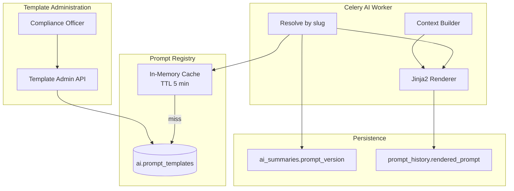
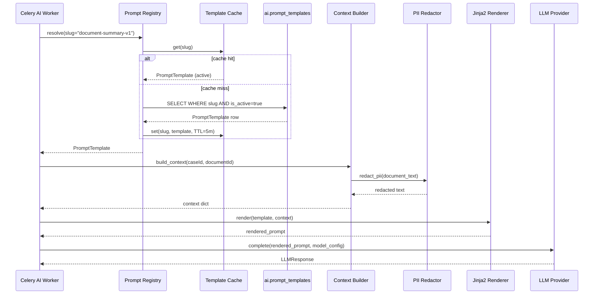
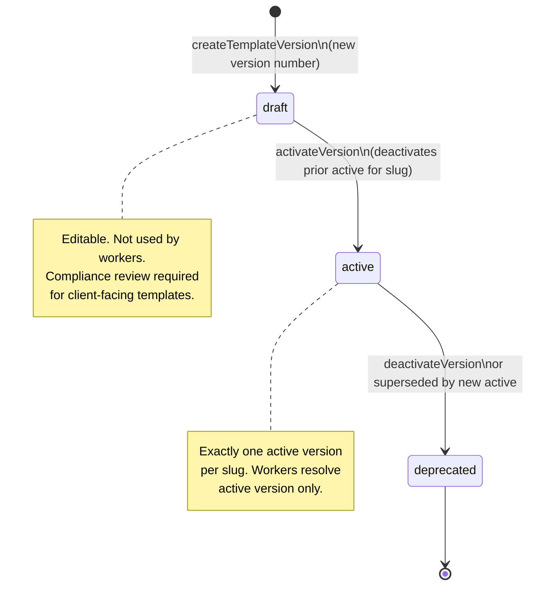
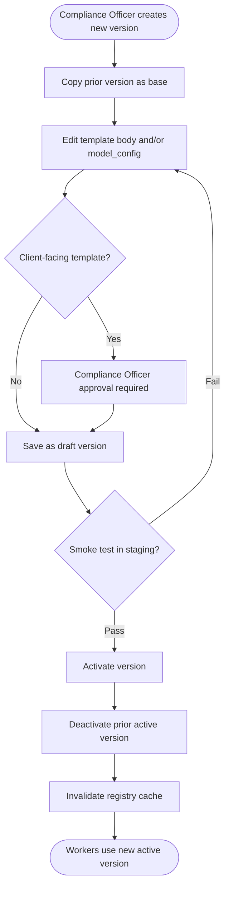
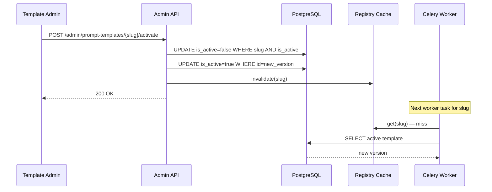

# Prompt Management

**LexFlow AI** — Versioned Templates, Jinja2 Rendering & Registry  
**Version:** 1.0  
**Status:** Draft — Pre-Implementation  
**Last Updated:** 2026-07-06

---

## Purpose

Define how LexFlow AI manages **versioned prompt templates** for all LLM interactions. Prompts are stored in a central registry, rendered with Jinja2 at worker execution time, and linked to `AISummary` records via `prompt_version` for full audit reproducibility.

Prompt content changes never occur at runtime — every modification creates a new version. Active templates are selected by slug; only one active version exists per slug at any time.

---

## Scope

| In Scope | Out of Scope |
|----------|--------------|
| PromptTemplate aggregate lifecycle | LLM provider SDK details — see [llm-providers.md](./llm-providers.md) |
| Jinja2 template syntax and variable contracts | Admin UI for template editing (Phase 2) |
| Registry lookup and activation rules | A/B testing infrastructure (Phase 2) |
| Template-to-capability mapping | Prompt engineering experimentation workflow |
| Compliance review requirements for client-facing templates | n8n prompt nodes |

---

## Responsibilities

| Component | Responsibility |
|-----------|----------------|
| **PromptTemplate aggregate** | Store versioned template body, model config, approval flag |
| **Prompt Registry service** | Resolve active template by slug; cache with TTL |
| **Jinja2 renderer** | Render template with case/document context variables |
| **Template admin API** | Create versions, activate, deactivate (Compliance Officer role) |
| **Celery AI worker** | Load template, render, pass to provider |
| **AISummary** | Store `prompt_version` slug for reproducibility |
| **PromptHistory** | Store rendered prompt (PII-redacted) for audit |

---

## Architecture

### Prompt Registry Topology



### PromptTemplate Data Model

Aligned with [ai-aggregate.md](../02-domain/ai-aggregate.md):

| Field | Type | Description |
|-------|------|-------------|
| `id` | UUID | Primary key |
| `name` | string | Human-readable name (e.g., "Document Summary v1") |
| `slug` | string | Unique identifier (e.g., `document-summary-v1`) |
| `version` | int | Monotonically increasing per slug |
| `template` | text | Jinja2 template body |
| `model_config` | JSONB | Provider, model, temperature, max_tokens, timeout |
| `requires_approval` | boolean | Human review before team visibility |
| `is_active` | boolean | Only one active version per slug |
| `created_by` | UUID FK | User who created this version |
| `created_at` | timestamptz | Creation timestamp |

See [ai-schema.md](../05-database/ai-schema.md) for DDL.

---

## Template Catalog

| Slug | Capability | requires_approval | Default Provider | Default Model |
|------|------------|-------------------|------------------|---------------|
| `document-summary-v1` | Document summary | true | `azure_openai` | `gpt-4o` |
| `case-overview-v1` | Case executive summary | true | `azure_openai` | `gpt-4o` |
| `deposition-summary-v1` | Deposition transcript summary | true | `azure_openai` | `gpt-4o` |
| `legal-research-v1` | Case-scoped legal research | true | `azure_openai` | `gpt-4o` |
| `contract-review-v1` | Contract clause analysis | true | `anthropic` | `claude-3-5-sonnet-20241022` |
| `case-assistant-v1` | Internal case chat | false | `azure_openai` | `gpt-4o` |

All legal output templates set `requires_approval = true`. Chat assistant is internal-only and does not create an `AISummary` — see [human-in-the-loop.md](./human-in-the-loop.md).

---

## Jinja2 Rendering

### Context Variables by Template Type

| Variable | Available In | Source |
|----------|--------------|--------|
| `case_title` | All case-scoped templates | `cases.cases.title` |
| `case_number` | All case-scoped templates | `cases.cases.case_number` |
| `practice_area` | All case-scoped templates | `cases.cases.practice_area` |
| `document_type` | Document templates | `documents.documents.document_type` |
| `document_title` | Document templates | `documents.documents.title` |
| `document_text` | Document templates | OCR text (truncated to 50K tokens) |
| `rag_chunks` | Research, chat | Retrieved chunks from [rag-architecture.md](./rag-architecture.md) |
| `research_query` | Research | User query from API request |
| `playbook_rules` | Contract review | Firm playbook JSON |
| `conversation_history` | Chat | Prior messages in conversation |
| `user_message` | Chat | Current user message |
| `disclaimer` | All legal outputs | Fixed disclaimer string |

### Jinja2 Filters

| Filter | Purpose | Example |
|--------|---------|---------|
| `truncate(n)` | Limit token-heavy fields | `{{ document_text \| truncate(50000) }}` |
| `tojson` | Serialize structured context | `{{ rag_chunks \| tojson }}` |
| `redact_pii` | Apply PII redaction before render | `{{ document_text \| redact_pii }}` |

### Rendering Rules

1. **Sandboxed environment** — Jinja2 `SandboxedEnvironment` blocks attribute access to dangerous objects.
2. **No user-supplied template content** — Templates are admin-managed only; user queries are passed as variables, never as template fragments.
3. **PII redaction before render** — `document_text` and `rag_chunks` pass through PII pipeline before template binding; see [safety-guardrails.md](./safety-guardrails.md).
4. **Structured output instruction** — Legal output templates include JSON schema instructions in the system portion of the template.
5. **Disclaimer injection** — All legal output templates append the standard disclaimer via `{{ disclaimer }}`.

### Example Template Structure (Document Summary)

```
{# document-summary-v1 — version 1 #}
You are a legal document analysis assistant for a US law firm.
Analyze the following document and provide a structured summary.

Document Type: {{ document_type }}
Case: {{ case_title }} ({{ case_number }})

Document Text:
---
{{ document_text | truncate(50000) }}
---

Provide your summary in the following JSON structure:
{
  "executiveSummary": "...",
  "keyParties": [...],
  "keyDates": [{"date": "...", "description": "..."}],
  "obligations": [...],
  "riskFlags": [...]
}

IMPORTANT: This is a draft summary for attorney review. Do not present as final legal analysis.

{{ disclaimer }}
```

---

## Flow Diagrams

### Template Resolution & Render Sequence



### Template Version Lifecycle



### New Version Creation Flowchart



### Registry Cache Invalidation



---

## Versioning Rules

| Rule | Enforcement |
|------|-------------|
| Version numbers monotonically increase per slug | Database constraint + application factory |
| Only one `is_active = true` per slug | Activation transaction deactivates prior |
| Old versions retained indefinitely | No hard delete; soft deprecation only |
| `prompt_version` stored on AISummary | Worker writes slug at generation time |
| Template changes require new version | No in-place edits to active templates |
| Client-facing template changes require Compliance review | Admin API authorization gate |

---

## Model Config Schema

Stored in `ai.prompt_templates.model_config` as JSONB:

| Field | Type | Required | Default |
|-------|------|----------|---------|
| `provider` | enum | yes | `azure_openai` |
| `model` | string | yes | — |
| `temperature` | float | no | `0.2` |
| `max_tokens` | int | no | `4096` |
| `top_p` | float | no | `1.0` |
| `response_format` | string | no | `json_object` for structured outputs |
| `timeout_seconds` | int | no | `120` |

Provider resolution details: [llm-providers.md](./llm-providers.md).

---

## Best Practices

1. **Reference slug, not template text** — `AISummary.prompt_version` stores the slug for reproducibility.
2. **Never edit active templates in place** — Create a new version and activate it.
3. **Test in staging before activation** — Run smoke tests against staging provider before promoting.
4. **Keep templates focused** — One capability per slug; do not combine research and summary logic.
5. **Include JSON schema in template** — Structured outputs are validated post-generation; see [safety-guardrails.md](./safety-guardrails.md).
6. **Use low temperature for legal outputs** — Default `0.2` for summaries and research; `0.0` for contract review.
7. **Invalidate cache on activation** — Registry cache must flush immediately when active version changes.
8. **Audit template changes** — Every create/activate/deactivate writes to `audit.audit_logs`.

---

## Tradeoffs

| Decision | Benefit | Cost |
|----------|---------|------|
| Jinja2 templates | Familiar, powerful, versionable | Sandbox required to prevent injection |
| Slug-based registry | Simple worker lookup | Slug naming discipline required |
| One active version per slug | Unambiguous production behavior | No gradual rollout without A/B infra |
| Retain all versions | Full audit reproducibility | Storage growth over time |
| Cache with 5-minute TTL | Reduced DB load on hot paths | Up to 5-minute stale reads if invalidation fails |
| Compliance review gate | Governance for client-facing prompts | Slower prompt iteration cycle |
| Template-driven model config | Change model without code deploy | Misconfiguration risk — mitigated by staging tests |

---

## Future Improvements

| Phase | Enhancement |
|-------|-------------|
| Phase 2 | A/B testing — route N% of requests to draft version |
| Phase 2 | Admin UI for template editing with diff view |
| Phase 3 | Template linting — validate Jinja2 syntax and required variables in CI |
| Phase 3 | Prompt performance analytics — correlate template version with approval rate |
| Phase 4 | Firm-specific template overrides — per-firm customization of base templates |

---

## References

- [../02-domain/ai-aggregate.md](../02-domain/ai-aggregate.md) — PromptTemplate aggregate, versioning invariants
- [../04-api/endpoints-ai.md](../04-api/endpoints-ai.md) — API passes summaryType → template slug mapping
- [../05-database/ai-schema.md](../05-database/ai-schema.md) — `prompt_templates`, `prompt_history` tables
- [llm-providers.md](./llm-providers.md) — Provider selection from model_config
- [safety-guardrails.md](./safety-guardrails.md) — PII redaction before template render
- [human-in-the-loop.md](./human-in-the-loop.md) — `requires_approval` flag behavior
- [rag-architecture.md](./rag-architecture.md) — `rag_chunks` context variable source
