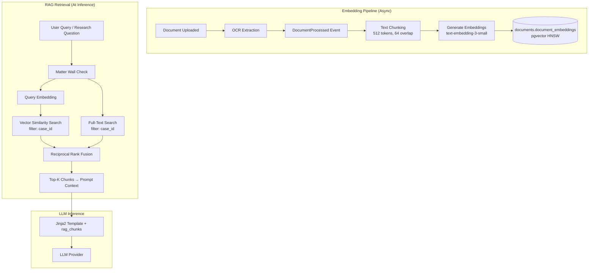
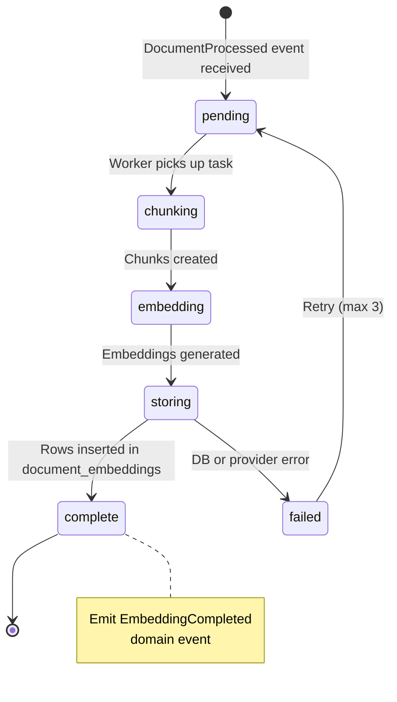
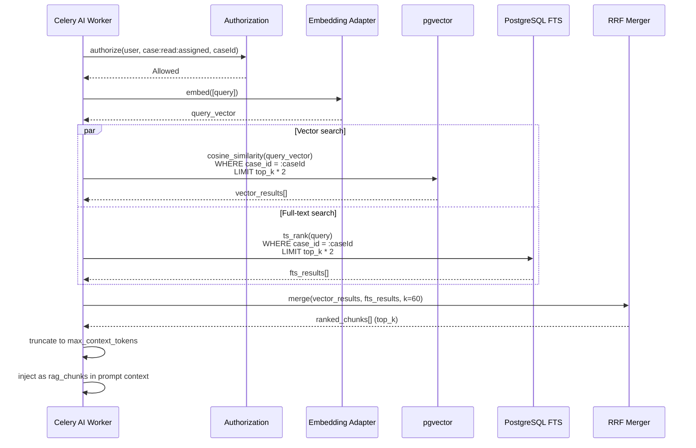
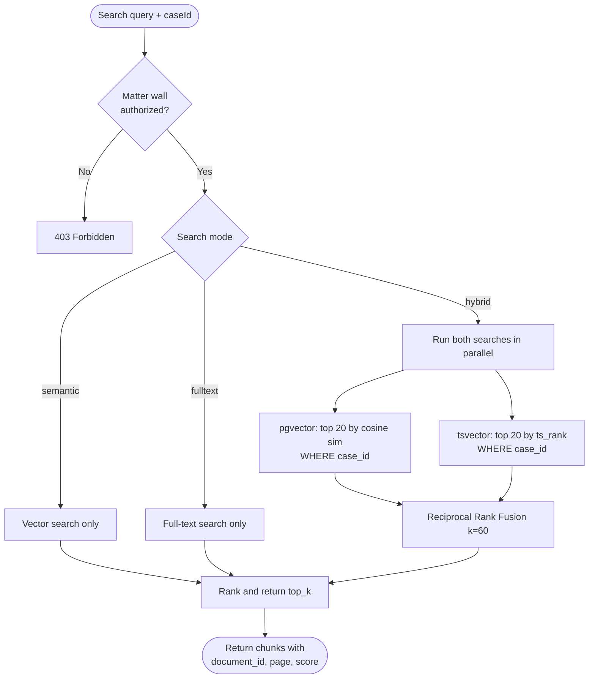

# RAG Architecture

**LexFlow AI** — Chunking, Embeddings, pgvector & Hybrid Search  
**Version:** 1.0  
**Status:** Draft — Pre-Implementation  
**Last Updated:** 2026-07-06

---

## Purpose

Define LexFlow AI's **Retrieval-Augmented Generation (RAG)** pipeline — how document text is chunked, embedded, stored in pgvector, and retrieved at inference time to ground LLM responses in case-specific evidence.

RAG retrieval is **strictly case-scoped**: every vector and full-text query filters by `case_id` and passes matter wall authorization before returning results. Cross-case retrieval is impossible by design.

---

## Scope

| In Scope | Out of Scope |
|----------|--------------|
| Text chunking strategy and overlap | OCR extraction pipeline — see Document aggregate |
| Embedding generation via LLM provider | External knowledge bases (Westlaw, LexisNexis) |
| pgvector storage and HNSW indexing | Dedicated vector databases (Pinecone, Weaviate) |
| Case-scoped vector retrieval | Firm-wide cross-case search |
| Hybrid search (semantic + full-text + RRF) | Real-time embedding on user upload (async only) |
| RAG context injection into prompts | Web search augmentation |

---

## Responsibilities

| Component | Responsibility |
|-----------|----------------|
| **Document worker** | Trigger embedding pipeline on `DocumentProcessed` event |
| **Chunking service** | Split OCR text into overlapping token windows |
| **Embedding adapter** | Call provider `embed()` — see [llm-providers.md](./llm-providers.md) |
| **Vector store** | Persist chunks + embeddings in `documents.document_embeddings` |
| **RAG retriever** | Case-scoped similarity search at inference time |
| **Hybrid search service** | Combine pgvector + PostgreSQL full-text via RRF |
| **Celery AI worker** | Inject retrieved chunks into prompt context |
| **Authorization service** | Matter wall check before any retrieval |

---

## Architecture

### RAG Pipeline Overview

### Data Model

**`documents.document_embeddings`** — see [ai-schema.md](../05-database/ai-schema.md) and [database-architecture.md](../database-architecture.md):

| Column | Type | Notes |
|--------|------|-------|
| `id` | UUID PK | |
| `document_id` | UUID FK | Parent document |
| `case_id` | UUID FK | Denormalized for case-scoped filter — **required on every query** |
| `chunk_index` | integer | Order within document |
| `chunk_text` | text | Source text (may be PII-redacted copy for display) |
| `embedding` | vector(1536) | text-embedding-3-small dimensions |
| `model` | varchar(100) | Embedding model identifier |
| `token_count` | integer | Chunk token count |
| `created_at` | timestamptz | |

**Index:** HNSW on `embedding` using `vector_cosine_ops`; B-tree on `(case_id, document_id)`.

---

## Chunking Strategy

### Parameters

| Parameter | Value | Rationale |
|-----------|-------|-----------|
| Chunk size | 512 tokens | Balances context granularity vs embedding quality |
| Overlap | 64 tokens | Preserves sentence boundaries across chunk boundaries |
| Tokenizer | cl100k_base (OpenAI compatible) | Consistent with embedding model tokenization |
| Min chunk size | 50 tokens | Skip trivially small trailing chunks |
| Max document size | 500 pages | Documents exceeding limit chunked with progress reporting |

### Chunking Rules

1. **Prefer paragraph boundaries** — Split on `\n\n` first; subdivide oversized paragraphs.
2. **Preserve page markers** — Include `[Page N]` prefix when OCR provides page numbers (aids citation).
3. **Legal section awareness** — Prefer splits at section headers (`ARTICLE`, `SECTION`, numbered clauses) when detectable.
4. **Metadata attachment** — Each chunk carries `document_id`, `document_title`, `chunk_index`, `page_number` (if available).
5. **Idempotent re-chunking** — On document re-OCR, delete prior embeddings for `document_id` before re-inserting.

### Chunking State Machine

---

## Embedding Generation

| Aspect | Detail |
|--------|--------|
| Model | `text-embedding-3-small` (1536 dimensions) |
| Provider | Azure OpenAI (production) — see [llm-providers.md](./llm-providers.md) |
| Batch size | 100 chunks per API call |
| Trigger | Async on `DocumentProcessed` domain event |
| Idempotency | Delete-then-insert on re-processing same document |
| Metering | Embedding token counts recorded in `llm_usage` |

---

## Retrieval

### Case-Scoped Vector Search

Every retrieval query enforces two gates before returning results:

1. **Authorization** — `case:read:assigned` + matter wall check for requesting user.
2. **Case filter** — SQL `WHERE case_id = :case_id` on all vector and full-text queries.

| Parameter | Default | Description |
|-----------|---------|-------------|
| `top_k` | 10 | Maximum chunks returned |
| `min_similarity` | 0.70 | Cosine similarity threshold |
| `document_ids` | null (all case docs) | Optional filter to specific documents |
| `max_context_tokens` | 8000 | Truncate total chunk text for prompt budget |

### Retrieval Sequence

---

## Hybrid Search

LexFlow AI combines semantic and lexical retrieval using **Reciprocal Rank Fusion (RRF)** for the knowledge search UI and legal research capability.

### Search Modes

| Mode | Use Case | Implementation |
|------|----------|----------------|
| **Semantic only** | Research queries, chat RAG | pgvector cosine similarity |
| **Full-text only** | Exact phrase, citation lookup | PostgreSQL `tsvector` on title + OCR text |
| **Hybrid (default)** | Knowledge search UI | RRF merge of both result sets |

### Reciprocal Rank Fusion

| Parameter | Value |
|-----------|-------|
| RRF constant `k` | 60 |
| Score formula | `RRF(d) = Σ 1 / (k + rank_i(d))` for each result list |
| Final ranking | Sort by RRF score descending; take top_k |

### Hybrid Search Flowchart

---

## RAG Context in Prompts

Retrieved chunks are injected into Jinja2 templates as `rag_chunks` — see [prompt-management.md](./prompt-management.md).

### Chunk Context Format

Each chunk in `rag_chunks` includes:

| Field | Purpose |
|-------|---------|
| `document_id` | Source document for citation |
| `document_title` | Human-readable reference |
| `chunk_index` | Position within document |
| `page_number` | Page citation (if available) |
| `text` | Chunk content (PII-redacted) |
| `similarity_score` | Retrieval confidence |

Legal research outputs must cite source `document_id` values. Citation verification is a Phase 4 enhancement.

---

## Performance & Indexing

| Index | Type | Purpose |
|-------|------|---------|
| `idx_document_embeddings_vector` | HNSW (`vector_cosine_ops`, m=16, ef_construction=64) | Approximate nearest neighbor search |
| `idx_document_embeddings_case_doc` | B-tree `(case_id, document_id)` | Case-scoped pre-filter |
| `idx_documents_fts` | GIN on `tsvector` | Full-text search on title + OCR text |

### Query Tuning

| Parameter | Development | Production |
|-----------|-------------|------------|
| HNSW `ef_search` | 40 | 100 |
| Expected latency (p95) | < 200ms | < 100ms |
| Max embeddings per case | — | 500,000 (alert threshold) |

---

## Best Practices

1. **Always filter by case_id** — Never run vector search without case scope; matter wall alone is insufficient at the DB layer.
2. **Authorize before retrieve** — Matter wall check precedes embedding generation for queries.
3. **Use hybrid for user-facing search** — Semantic-only misses exact legal citations and statute numbers.
4. **Set min_similarity threshold** — Chunks below 0.70 similarity are excluded to reduce hallucination grounding errors.
5. **Respect prompt token budget** — Truncate `rag_chunks` to `max_context_tokens` before template render.
6. **Re-embed on document re-OCR** — Delete stale embeddings when document text changes.
7. **Include page numbers in chunks** — Enables attorney verification of cited passages.
8. **Meter embedding calls** — Embedding token usage flows to `llm_usage` like completion calls.

---

## Tradeoffs

| Decision | Benefit | Cost |
|----------|---------|------|
| pgvector in PostgreSQL | Single DB; transactional consistency; simpler ops | Scale limits vs dedicated vector DB at very high volume |
| Case-scoped only | Matter wall enforced at retrieval; no cross-case leakage | Cannot reference other matters in research |
| 512-token chunks | Good granularity for legal paragraphs | More embedding API calls per large document |
| HNSW index | Fast approximate search | Slightly lower recall vs exact search |
| Hybrid RRF | Better recall for mixed semantic/lexical queries | Two queries per retrieval; higher latency |
| Async embedding pipeline | Non-blocking document processing | Research unavailable until embeddings complete |
| text-embedding-3-small | Cost-effective; 1536 dims | Lower quality than large embedding models |

---

## Future Improvements

| Phase | Enhancement |
|-------|-------------|
| Phase 2 | Semantic cache — reuse query embeddings within conversation |
| Phase 3 | Parent-child chunking — store section summaries alongside chunks |
| Phase 3 | Citation verification — validate research citations against chunk text |
| Phase 4 | Dedicated vector store if cases exceed 500K embeddings |
| Phase 4 | Multi-modal embeddings for scanned exhibits with poor OCR |

---

## References

- [../02-domain/ai-aggregate.md](../02-domain/ai-aggregate.md) — `legal_research` summary type uses RAG
- [../02-domain/document-aggregate.md](../02-domain/document-aggregate.md) — Document OCR lifecycle, `DocumentProcessed` event
- [../04-api/endpoints-ai.md](../04-api/endpoints-ai.md) — Research and chat endpoints consume RAG
- [../05-database/ai-schema.md](../05-database/ai-schema.md) — `document_embeddings` table
- [llm-providers.md](./llm-providers.md) — Embedding adapter
- [prompt-management.md](./prompt-management.md) — `rag_chunks` template variable
- [safety-guardrails.md](./safety-guardrails.md) — PII handling in chunk text
- [../database-architecture.md](../database-architecture.md) — HNSW index DDL, full-text indexes
