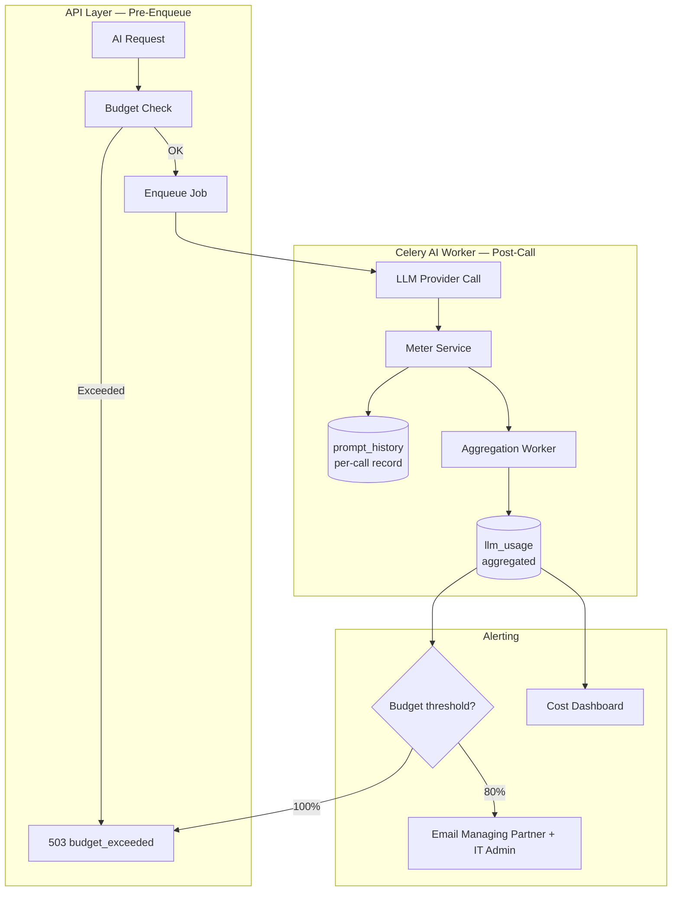
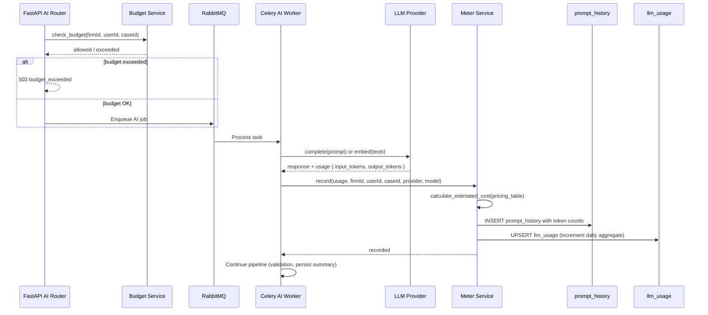
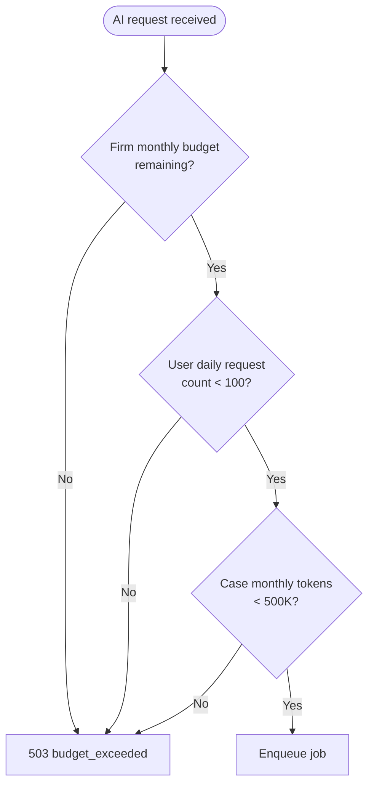
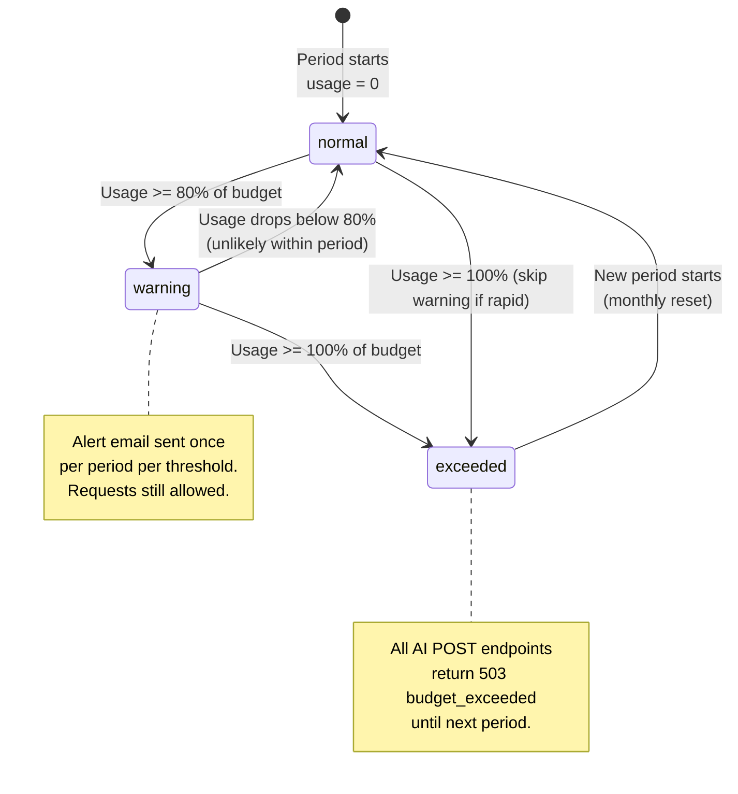
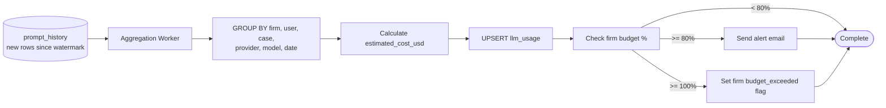

# Usage Metering

**LexFlow AI** — Token Tracking, Cost Controls & Budgets  
**Version:** 1.0  
**Status:** Draft — Pre-Implementation  
**Last Updated:** 2026-07-06

---

## Purpose

Define how LexFlow AI **tracks, attributes, and controls** LLM token usage and estimated costs across firms, users, and cases. Every provider call — completion and embedding — produces a metering record that feeds compliance reporting, budget enforcement, and operational dashboards.

Metering runs synchronously within the Celery AI worker task **after** the provider responds and **before** the task completes. Budget checks occur **before** job enqueue at the API layer.

---

## Scope

| In Scope | Out of Scope |
|----------|--------------|
| Per-call token recording in `prompt_history` | Provider billing portal reconciliation |
| Aggregated usage in `llm_usage` | Invoice generation for client matter billing |
| Firm, user, and case-level budgets | Real-time billing to clients |
| Budget alert thresholds | Token purchase / prepaid credits |
| Cost estimation from published pricing | Custom negotiated pricing per firm (Phase 3) |
| Rate limiting integration | GPU/compute metering for self-hosted models |

---

## Responsibilities

| Component | Responsibility |
|-----------|----------------|
| **Meter service** | Record tokens and estimated cost per provider call |
| **Budget service** | Check firm/user/case budgets before job enqueue |
| **Aggregation worker** | Roll up `prompt_history` into `llm_usage` (hourly) |
| **Alert service** | Email notifications at budget thresholds |
| **Celery AI worker** | Invoke meter service after every provider call |
| **AI router (API)** | Pre-enqueue budget check; return 503 if exceeded |
| **Compliance reporting** | Export `llm_usage` for firm governance reports |

---

## Architecture

### Metering Topology

### Data Model

**Per-call record** — `ai.prompt_history` (see [ai-schema.md](../05-database/ai-schema.md)):

| Field | Purpose |
|-------|---------|
| `input_tokens` | Prompt token count |
| `output_tokens` | Completion token count |
| `provider` | Provider enum |
| `model` | Model identifier |
| `latency_ms` | Performance tracking |
| `case_id`, `user_id` | Attribution |
| `correlation_id` | Trace linking |

**Aggregated record** — `ai.llm_usage`:

| Field | Purpose |
|-------|---------|
| `firm_id` | Firm-level aggregation |
| `user_id` | User attribution |
| `case_id` | Case attribution |
| `provider`, `model` | Provider tracking |
| `input_tokens`, `output_tokens` | Period totals |
| `estimated_cost_usd` | Cost for period |
| `period_start` | Aggregation period (daily) |

---

## Token Tracking

### What Gets Metered

| Operation | Token Type | Source |
|-----------|------------|--------|
| Document summary | Input + output | Completion call |
| Case overview | Input + output | Completion call |
| Legal research | Input + output | Completion + query embedding |
| Contract review | Input + output | Completion call (Claude) |
| Case chat | Input + output | Completion call |
| Document embedding | Input only | Embedding call per chunk batch |
| Research query embedding | Input only | Embedding call per query |

### Metering Sequence

### Cost Estimation

Estimated cost is calculated from a **pricing table** maintained in configuration (not hardcoded in worker logic):

| Provider | Model | Input ($/1M tokens) | Output ($/1M tokens) |
|----------|-------|---------------------|----------------------|
| `azure_openai` | `gpt-4o` | 2.50 | 10.00 |
| `azure_openai` | `text-embedding-3-small` | 0.02 | — |
| `openai` | `gpt-4o` | 2.50 | 10.00 |
| `anthropic` | `claude-3-5-sonnet-20241022` | 3.00 | 15.00 |
| `ollama` | local models | 0.00 | 0.00 |

Formula: `estimated_cost_usd = (input_tokens × input_rate + output_tokens × output_rate) / 1_000_000`

Pricing table updated manually when providers change rates. Phase 3: firm-specific negotiated rates.

---

## Cost Controls

### Budget Hierarchy

Budget checks run in order — first exceeded budget blocks the request:

### Default Budget Limits

| Control | Default | Scope | Enforcement Point |
|---------|---------|-------|-------------------|
| Firm monthly budget | $5,000 USD | Firm-wide | API pre-enqueue |
| Alert at 80% budget | Email notification | Firm-wide | Aggregation worker |
| Hard stop at 100% budget | 503 `budget_exceeded` | Firm-wide | API pre-enqueue |
| Per-user daily request limit | 100 requests/day | User | API pre-enqueue |
| Per-case monthly token limit | 500,000 tokens/month | Case | API pre-enqueue |
| API rate limit | 20 POST/minute | User | API gateway |

### Budget Configuration

Firm administrators configure budgets via firm settings (Phase 2 admin API):

| Setting | Type | Default |
|---------|------|---------|
| `ai.monthly_budget_usd` | decimal | 5000.00 |
| `ai.alert_threshold_percent` | int | 80 |
| `ai.user_daily_request_limit` | int | 100 |
| `ai.case_monthly_token_limit` | int | 500000 |
| `ai.hard_stop_enabled` | boolean | true |

---

## Budget State Machine

---

## Aggregation

### Aggregation Worker

| Aspect | Detail |
|--------|--------|
| Schedule | Hourly via Celery Beat |
| Source | `prompt_history` rows since last aggregation |
| Target | `llm_usage` UPSERT by `(firm_id, user_id, case_id, provider, model, period_start)` |
| Idempotency | Track `last_aggregated_at` watermark |
| Alert trigger | Check firm budget after each aggregation run |

### Aggregation Flowchart

---

## API Error Response

When budget is exceeded, AI POST endpoints return:

| Field | Value |
|-------|-------|
| HTTP status | 503 Service Unavailable |
| Error code | `budget_exceeded` |
| Message | "AI usage budget exceeded for this period. Contact your firm administrator." |
| `retryable` | false |
| `details.budgetType` | `firm_monthly`, `user_daily`, or `case_monthly` |
| `details.resetsAt` | ISO timestamp of next period reset |

---

## Reporting

### Available Reports (Phase 2 Dashboard)

| Report | Dimensions | Period |
|--------|------------|--------|
| Firm AI spend | Provider, model | Monthly |
| User AI usage | User, capability type | Daily / monthly |
| Case AI cost | Case, summary type | Case lifetime |
| Provider breakdown | Provider, model, token counts | Monthly |
| Budget utilization | Firm, threshold status | Current period |

### Compliance Export

`llm_usage` data exported quarterly for firm governance reviews. Includes: firm, user, case, provider, model, token counts, estimated cost, period.

Retention: 3 years — aligned with [compliance-data-governance.md](../compliance-data-governance.md).

---

## Observability

| Metric | Type | Alert Threshold |
|--------|------|-----------------|
| `ai.tokens.input.total` | Counter | — |
| `ai.tokens.output.total` | Counter | — |
| `ai.cost.estimated.usd` | Counter | Firm budget thresholds |
| `ai.requests.blocked.budget` | Counter | > 10/hour |
| `ai.provider.latency.p95` | Histogram | > 30 seconds |
| `ai.provider.errors.rate` | Gauge | > 5% |

See [observability.md](../observability.md) for platform-wide metrics conventions.

---

## Best Practices

1. **Meter before task completion** — Worker task fails if metering write fails (audit completeness).
2. **Check budget before enqueue** — Do not consume worker capacity for requests that will be blocked.
3. **Record embedding costs** — Embedding calls are often overlooked; include in `llm_usage`.
4. **Use correlation_id** — Link `prompt_history` rows to jobs and API requests for traceability.
5. **Alert once per threshold** — Do not spam Managing Partner emails; one alert at 80%, one at 100%.
6. **Zero-cost for Ollama** — Local dev usage recorded with `estimated_cost_usd = 0`.
7. **Partition prompt_history** — Monthly range partitions for high-volume audit table.
8. **Expose resetsAt in error** — Help users understand when budget resets.

---

## Tradeoffs

| Decision | Benefit | Cost |
|----------|---------|------|
| Pre-enqueue budget check | Saves worker capacity; fast rejection | Slightly stale usage (up to 1 hour aggregation lag) |
| Estimated vs actual cost | No provider billing API dependency | Discrepancy vs actual invoices |
| Daily aggregation | Efficient reporting queries | Not real-time budget precision |
| Hard stop at 100% | Prevents cost overruns | Blocks all AI until period reset |
| Per-case token limit | Prevents runaway case costs | May block legitimate high-volume cases |
| prompt_history per-call + llm_usage aggregate | Full audit + efficient reporting | Two tables to maintain |
| Static pricing table | Simple, predictable | Manual updates when providers change rates |

---

## Future Improvements

| Phase | Enhancement |
|-------|-------------|
| Phase 2 | Admin API for budget configuration |
| Phase 2 | AI cost dashboard per case/attorney |
| Phase 3 | Firm-specific negotiated pricing in cost calculation |
| Phase 3 | Client matter billing export (AI cost as line item) |
| Phase 4 | Real-time budget tracking via streaming aggregation |
| Phase 4 | Predictive budget alerts based on usage trends |

---

## References

- [../02-domain/ai-aggregate.md](../02-domain/ai-aggregate.md) — LLMUsage entity, invariant #13
- [../04-api/endpoints-ai.md](../04-api/endpoints-ai.md) — Rate limits; job failure codes
- [../05-database/ai-schema.md](../05-database/ai-schema.md) — `prompt_history`, `llm_usage` tables
- [llm-providers.md](./llm-providers.md) — Token counts from LLMResponse
- [rag-architecture.md](./rag-architecture.md) — Embedding token metering
- [safety-guardrails.md](./safety-guardrails.md) — Rate limit integration
- [../observability.md](../observability.md) — Metrics and alerting
- [../compliance-data-governance.md](../compliance-data-governance.md) — Retention policies
- [../13-decisions/004-async-ai-processing.md](../13-decisions/004-async-ai-processing.md) — Metering in worker path
