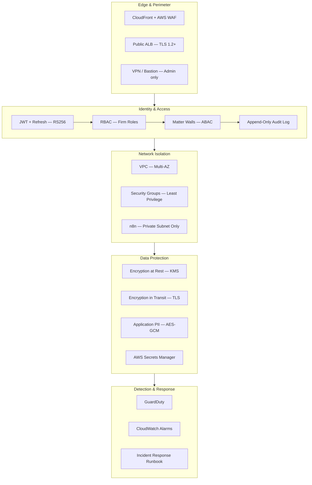
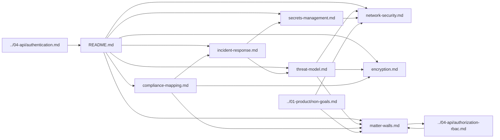
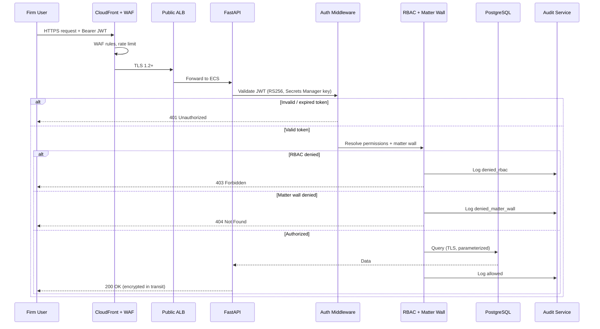
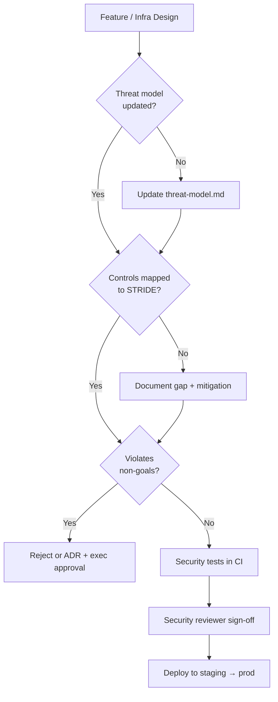

# LexFlow AI — Security Documentation

**LexFlow AI** — Enterprise Security Architecture Index  
**Version:** 1.0  
**Status:** Draft — Pre-Implementation  
**Last Updated:** 2026-07-06

---

## Purpose

This directory is the **authoritative security reference** for LexFlow AI — the enterprise AI automation platform for large US law firms handling attorney-client privileged data. Security reviewers, architects, compliance officers, and engineers use these documents to validate design, implement controls, and satisfy firm procurement and audit requirements.

Security is designed in from the start. LexFlow does not treat confidentiality, ethical walls, or auditability as afterthoughts.

---

## Scope

| In Scope | Out of Scope |
|----------|--------------|
| Threat modeling (STRIDE) | Application source code |
| Network segmentation, VPC, security groups | Terraform module implementation |
| Encryption at rest, in transit, and application-level PII | Penetration test raw findings |
| Secrets management (AWS Secrets Manager) | Vendor SOC 2 report contents |
| Matter walls and ethical boundaries (ABAC) | Firm-specific ethics committee policies |
| Compliance mapping (ABA, GDPR, CCPA, SOC 2) | Legal contract language |
| Incident response lifecycle | Insurance and liability terms |

**Data sensitivity:** LexFlow handles **Restricted — Privileged** and **Restricted — PII** data. See [compliance-mapping.md](./compliance-mapping.md) for classification details.

---

## Responsibilities

| Role | Responsibility |
|------|----------------|
| **Security Architect** | Maintain threat model; approve network and encryption designs |
| **Backend Engineer** | Implement auth, RBAC, matter walls, audit per [../04-api/authentication.md](../04-api/authentication.md) and [../04-api/authorization-rbac.md](../04-api/authorization-rbac.md) |
| **DevOps / SRE** | Provision VPC, security groups, Secrets Manager, WAF, GuardDuty |
| **Compliance Officer** | Validate ABA alignment; approve DSAR/erasure workflows |
| **Managing Partner (Sponsor)** | Approve security exceptions; breach notification decisions |
| **IT Administrator** | Credential rotation, VPN/bastion access to n8n admin |
| **All Contributors** | No secrets in code; cite security docs in design reviews |

Authorization is enforced **exclusively on the FastAPI backend**. The frontend reflects permissions for UX only. n8n is orchestration-only — never a security boundary. See [../01-product/non-goals.md](../01-product/non-goals.md).

---

## Architecture

### Security Control Layers

### Document Relationship Map

---

## Document Map

| Document | Description |
|----------|-------------|
| [threat-model.md](./threat-model.md) | STRIDE analysis, trust boundaries, attack surfaces, mitigations |
| [network-security.md](./network-security.md) | VPC design, security groups, n8n isolation, WAF, admin access |
| [encryption.md](./encryption.md) | At rest, in transit, application-level PII, key management |
| [secrets-management.md](./secrets-management.md) | AWS Secrets Manager hierarchy, rotation, IAM, n8n credential injection |
| [matter-walls.md](./matter-walls.md) | Case-level ABAC, ethical walls, conflict boundaries, 404-on-deny |
| [compliance-mapping.md](./compliance-mapping.md) | ABA Model Rules, GDPR, CCPA, SOC 2 control mapping |
| [incident-response.md](./incident-response.md) | Detect, contain, notify, remediate, post-mortem |

---

## Flow Diagrams

### End-to-End Security Request Path

### Security Review Gate (Pre-Production)

---

## Security Principles

| Principle | Implementation |
|-----------|----------------|
| **Defense in depth** | Edge WAF + auth + RBAC + matter walls + encryption + audit |
| **Least privilege** | IAM roles per ECS task; security groups deny by default |
| **Zero trust internal** | n8n callbacks require HMAC; workers cannot skip API auth |
| **Fail secure** | Auth errors → deny; matter wall → 404 not 403 |
| **Immutable audit** | Append-only audit table; separate DB role |
| **No secrets in artifacts** | Secrets Manager only; `.env.example` has no values |
| **Human-in-the-loop AI** | Unreviewed AI never reaches official record — see non-goals |
| **Dedicated deployment** | Single-firm AWS account; no multi-tenant data mixing at launch |

---

## Best Practices

1. **Start every security review** with [threat-model.md](./threat-model.md) — identify which STRIDE categories apply.
2. **Cross-check non-goals** — Public n8n, frontend-to-n8n, and cross-matter AI are prohibited. See [../01-product/non-goals.md](../01-product/non-goals.md).
3. **Never embed permissions in JWT** — Server-side resolution with Redis cache. See [../04-api/authentication.md](../04-api/authentication.md).
4. **Use 404 for matter wall denials** on case-scoped GET — consistent across all case endpoints.
5. **Rotate secrets on schedule** — Quarterly for API keys and JWT signing keys; see [secrets-management.md](./secrets-management.md).
6. **Log security events** — Failed auth, matter wall denials, admin actions, document downloads.
7. **Update docs in the same PR** as security-relevant code changes (once development begins).

---

## Tradeoffs

| Decision | Benefit | Cost |
|----------|---------|------|
| Dedicated AWS account per firm | Strong data isolation for enterprise procurement | Higher ops overhead vs multi-tenant |
| Matter wall → 404 | Prevents case ID enumeration | Harder support debugging |
| Private n8n only | Reduced attack surface | Admin access requires VPN/bastion |
| Permissions not in JWT | Immediate role revocation | DB/Redis lookup every request |
| Append-only audit | Tamper resistance, compliance | Storage growth; no correction deletes |
| Application-level PII encryption | Defense in depth for SSN/tax ID | Key management complexity |

---

## Future Improvements

| Phase | Enhancement |
|-------|-------------|
| Phase 2 | Optional TOTP MFA; custom firm-defined roles |
| Phase 3 | Microsoft Entra ID OIDC; conditional access integration |
| Phase 3 | Office/department-scoped ABAC |
| Phase 4 | OPA/Cedar policy engine if rules exceed matrix complexity |
| Year 2 | SOC 2 Type II audit completion |
| Year 2+ | Hardware security module (HSM) for CMK if firm requires |

---

## References

### API & Product

| Document | Path |
|----------|------|
| Authentication (JWT, refresh, sessions) | [../04-api/authentication.md](../04-api/authentication.md) |
| Authorization & RBAC | [../04-api/authorization-rbac.md](../04-api/authorization-rbac.md) |
| Non-goals (architectural boundaries) | [../01-product/non-goals.md](../01-product/non-goals.md) |
| Internal n8n webhooks (HMAC) | [../04-api/webhooks-internal.md](../04-api/webhooks-internal.md) |

### Architecture & Operations

| Document | Path |
|----------|------|
| Container architecture (network zones) | [../03-architecture/container-architecture.md](../03-architecture/container-architecture.md) |
| Deployment architecture (AWS, ECS) | [../deployment-architecture.md](../deployment-architecture.md) |
| Database architecture (audit, retention) | [../database-architecture.md](../database-architecture.md) |
| NFR requirements (security NFRs) | [../03-architecture/nfr-requirements.md](../03-architecture/nfr-requirements.md) |
| Observability (logging, alerting) | [../observability.md](../observability.md) |
| Disaster recovery | [../disaster-recovery.md](../disaster-recovery.md) |

### Legacy Flat Docs (Superseded by This Directory)

| Document | Path |
|----------|------|
| Security architecture (summary) | [../security-architecture.md](../security-architecture.md) |
| Compliance & data governance | [../compliance-data-governance.md](../compliance-data-governance.md) |
| Authentication & authorization (summary) | [../authentication-authorization.md](../authentication-authorization.md) |

### Architecture Decision Records

| ADR | Topic |
|-----|-------|
| [ADR-002](../13-decisions/002-n8n-orchestration-only.md) | n8n orchestration only — no business logic |
| [ADR-005](../13-decisions/005-jwt-authentication.md) | JWT + refresh token authentication |

---

## Conventions

- All documents use Markdown with Mermaid diagrams.
- Version and last-updated date appear in each document header.
- Security control IDs follow `SEC-{category}-{number}` (e.g., `SEC-NET-001`).
- Breaking security architecture changes require a new ADR before implementation.
