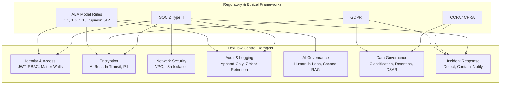
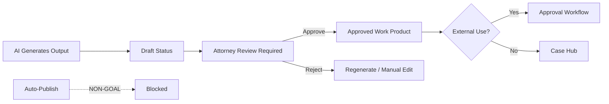
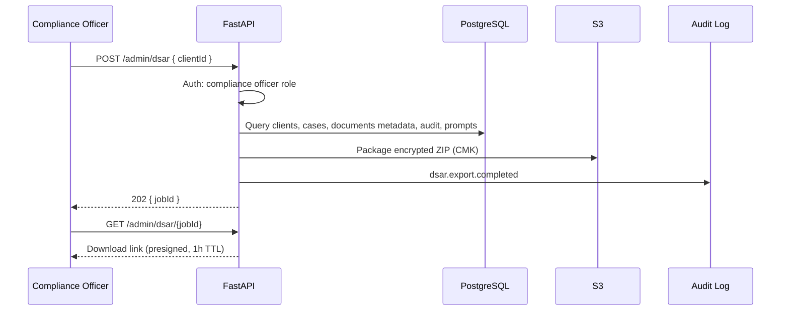
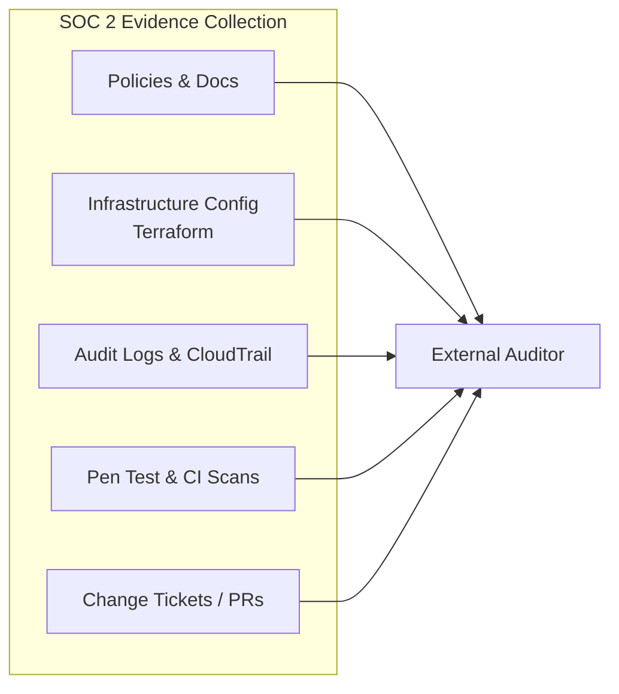

# Compliance Mapping

**LexFlow AI** — ABA, GDPR, CCPA & SOC 2 Control Mapping  
**Version:** 1.0  
**Status:** Draft — Pre-Implementation  
**Last Updated:** 2026-07-06

---

## Purpose

Map LexFlow AI security and data governance controls to **regulatory and ethical frameworks** applicable to large US law firms handling attorney-client privileged information. This document provides auditors, compliance officers, and procurement teams with traceability from requirements to implemented controls.

LexFlow is designed for **ABA ethical compliance**, **GDPR/CCPA privacy rights**, and **SOC 2 Type II** readiness (target Year 2 audit).

---

## Scope

| In Scope | Out of Scope |
|----------|--------------|
| ABA Model Rules and Formal Opinion 512 | State-specific bar rule variations (firm counsel interprets) |
| GDPR Articles 5, 15–22, 32, 33–34 | EU representative appointment (firm responsibility) |
| CCPA/CPRA consumer rights | CPRA employee data exemptions |
| SOC 2 Trust Services Criteria (Security, Availability, Confidentiality) | SOC 2 audit execution and report |
| Control ID cross-references to security docs | Legal contract / DPA language |
| Data classification alignment | HIPAA (unless healthcare practice — see note) |

**HIPAA note:** LexFlow is not primarily a HIPAA platform. If a firm handles protected health information in healthcare law matters, additional controls may be required — flagged as firm responsibility with LexFlow data classification support.

---

## Responsibilities

| Role | Responsibility |
|------|----------------|
| **Compliance Officer** | Validate mapping; initiate DSAR/erasure; breach notification |
| **Managing Partner** | Approve ethics policy alignment; breach communication to clients |
| **Security Architect** | Maintain control implementation evidence |
| **DevOps / SRE** | Operate technical controls (encryption, logging, backup) |
| **Firm Legal Counsel** | Interpret state bar rules; review DPAs; regulatory notification |
| **External Auditor** | SOC 2 Type II assessment (Year 2) |

---

## Architecture

### Compliance Control Stack

---

## ABA Model Rules Mapping

### Rule 1.1 — Competence (Including Technology Competence)

| Requirement | LexFlow Control | Control ID | Evidence |
|-------------|-----------------|------------|----------|
| Understand technology used in practice | AI outputs labeled as drafts; training materials | AI-GOV-001 | UI disclaimers; admin docs |
| Implement reasonable security measures | Defense-in-depth security architecture | SEC-ARCH-001 | [README.md](./README.md) |
| Stay current on AI risks | ABA Opinion 512 alignment in AI governance | AI-GOV-002 | [../01-product/non-goals.md](../01-product/non-goals.md) |
| Verify AI-generated citations | Citation verification flags on AI outputs | AI-GOV-003 | AI architecture docs |

### Rule 1.6 — Confidentiality of Information

| Requirement | LexFlow Control | Control ID | Evidence |
|-------------|-----------------|------------|----------|
| Protect client information | Encryption at rest and in transit | SEC-ENC-001, SEC-TLS-001 | [encryption.md](./encryption.md) |
| Limit access to need-to-know | Matter walls (ABAC) | SEC-ABAC-001 | [matter-walls.md](./matter-walls.md) |
| Prevent unauthorized disclosure | RBAC + audit logging | SEC-AUTH-010, SEC-AUDIT-001 | [../04-api/authorization-rbac.md](../04-api/authorization-rbac.md) |
| Secure communication channels | TLS 1.2+ everywhere | SEC-TLS-001 | [network-security.md](./network-security.md) |
| Confidentiality with third parties | DPAs with AWS, LLM providers; no training on firm data | AI-GOV-004 | Vendor DPA register |
| Reasonable efforts when technology changes | Quarterly security review; annual pen test | SEC-OPS-001 | Security testing schedule |

### Rule 1.15 — Safekeeping Property (Client Documents)

| Requirement | LexFlow Control | Control ID | Evidence |
|-------------|-----------------|------------|----------|
| Safeguard client documents | S3 SSE-KMS, versioning, MFA delete | SEC-ENC-002 | [encryption.md](./encryption.md) |
| Prevent commingling | Dedicated AWS account per firm | SEC-ARCH-002 | Deployment architecture |
| Retain per legal requirements | 7-year retention; litigation hold flag | DATA-RET-001 | Database architecture |
| Secure deletion when appropriate | Erasure workflow with certificate | DATA-ERASE-001 | DSAR process below |

### ABA Formal Opinion 512 (2024) — Generative AI

| Opinion Requirement | LexFlow Implementation | Control ID |
|---------------------|------------------------|------------|
| **Competence** — Understand AI capabilities and limits | AI labeled as draft; attorney review mandatory | AI-GOV-001 |
| **Confidentiality** — Protect client info when using AI | PII redaction; case-scoped RAG; no cross-matter context | AI-GOV-005 |
| **Communication** — Inform clients about AI use | Firm policy field on case; client notification workflow (Phase 2) | AI-GOV-006 |
| **Candor** — Verify AI outputs; disclose AI use to tribunal if required | Citation flags; approval gate before external use | AI-GOV-003 |
| **Supervision** — Attorney supervises AI use | Human-in-the-loop; approval permissions | AI-GOV-007 |
| **Fees** — Transparent AI-related costs | LLM token metering; usage reports | AI-GOV-008 |

**Cross-reference:** [../01-product/non-goals.md](../01-product/non-goals.md) — No autonomous legal advice; no unreviewed AI to official record.

---

## GDPR Mapping

**Applicability:** When LexFlow processes personal data of EU data subjects (EU clients, employees, or matters with EU nexus). Firm acts as **data controller**; LexFlow/AWS/LLM providers act as **processors** under DPAs.

### Lawful Basis & Principles (Article 5)

| Principle | LexFlow Control | Control ID |
|-----------|-----------------|------------|
| Lawfulness, fairness, transparency | Privacy policy; DSAR process; data classification | DATA-GOV-001 |
| Purpose limitation | Data used only for legal matter management | DATA-GOV-002 |
| Data minimization | PII fields minimized; app encryption for SSN/tax ID only | SEC-ENC-APP-001 |
| Accuracy | Client data editable by authorized users; audit trail | DATA-ACC-001 |
| Storage limitation | Retention policy with auto-archive/delete | DATA-RET-001 |
| Integrity and confidentiality | Encryption, access controls, audit | SEC-ENC-001, SEC-ABAC-001 |
| Accountability | Audit logs, compliance reports, DPA register | SEC-AUDIT-001 |

### Data Subject Rights (Articles 15–22)

| Right | LexFlow Workflow | SLA | Control ID |
|-------|------------------|-----|------------|
| **Access** (Art. 15) | DSAR export — encrypted ZIP to Compliance Officer | 30 days | DATA-DSAR-001 |
| **Rectification** (Art. 16) | Client record update via authorized users | 30 days | DATA-ACC-001 |
| **Erasure** (Art. 17) | Erasure job with litigation hold check | 30 days | DATA-ERASE-001 |
| **Restriction** (Art. 18) | Case flag `processing_restricted` | 30 days | DATA-REST-001 |
| **Portability** (Art. 20) | DSAR export in JSON/CSV | 30 days | DATA-DSAR-001 |
| **Object** (Art. 21) | Firm policy; no automated marketing in LexFlow | N/A | — |

### DSAR Export Flow

### Security of Processing (Article 32)

| Article 32 Requirement | LexFlow Control | Document |
|--------------------------|-----------------|----------|
| Pseudonymization and encryption | App-level PII encryption; TLS | [encryption.md](./encryption.md) |
| Ongoing confidentiality, integrity, availability | Multi-AZ, DR, monitoring | [../disaster-recovery.md](../disaster-recovery.md) |
| Ability to restore availability | RPO ≤ 15 min, RTO ≤ 4 hours | NFR requirements |
| Regular testing and evaluation | Pen test, CI security scans | [threat-model.md](./threat-model.md) |

### Breach Notification (Articles 33–34)

| Requirement | Timeline | LexFlow Support |
|-------------|----------|-----------------|
| Notify supervisory authority | 72 hours of awareness | Incident response runbook; audit query tools |
| Notify data subjects | Without undue delay if high risk | DSAR client contact export |
| Document breach | Always | Incident log; post-mortem template |

See [incident-response.md](./incident-response.md).

---

## CCPA / CPRA Mapping

**Applicability:** California residents whose personal information LexFlow processes.

| CPRA Right | LexFlow Control | Control ID |
|------------|-----------------|------------|
| **Right to know** | DSAR export (same as GDPR access) | DATA-DSAR-001 |
| **Right to delete** | Erasure workflow with exceptions (litigation hold, legal retention) | DATA-ERASE-001 |
| **Right to correct** | Client record update | DATA-ACC-001 |
| **Right to opt-out of sale/sharing** | LexFlow does **not** sell or share PI for cross-context behavioral advertising | DATA-GOV-003 |
| **Right to limit use of sensitive PI** | SSN/tax ID app encryption; restricted access | SEC-ENC-APP-001 |
| **Non-discrimination** | No service denial for exercising rights | Policy |

### CCPA Service Provider Requirements

| Requirement | LexFlow Implementation |
|-------------|------------------------|
| Process PI only per contract | Firm MSA + DPA |
| No selling/sharing PI | No advertising integrations; no data broker APIs |
| Assist with consumer requests | DSAR and erasure admin APIs |
| Reasonable security | Full security control stack |

**SLA:** 45 days for consumer requests (CCPA); extendable by 45 days with notice.

---

## SOC 2 Type II Mapping

**Target:** SOC 2 Type II audit in Year 2. Trust Services Criteria: **Security (CC)**, **Availability (A)**, **Confidentiality (C)**.

### Common Criteria (Security)

| TSC ID | Criterion | LexFlow Control | Evidence |
|--------|-----------|-----------------|----------|
| CC1.1 | Integrity and ethical values | Non-goals doc; ethics policy alignment | [../01-product/non-goals.md](../01-product/non-goals.md) |
| CC1.2 | Board/management oversight | Managing Partner sponsor role | Governance docs |
| CC2.1 | Internal communication | Security docs; incident runbook | This directory |
| CC3.2 | Risk assessment | STRIDE threat model | [threat-model.md](./threat-model.md) |
| CC5.1 | Control activities | RBAC, matter walls, encryption | Security docs |
| CC6.1 | Logical access controls | JWT, RBAC, IAM least privilege | [../04-api/authentication.md](../04-api/authentication.md) |
| CC6.2 | Authentication | JWT RS256, refresh rotation, lockout | [../04-api/authentication.md](../04-api/authentication.md) |
| CC6.3 | Authorization | RBAC + ABAC matter walls | [matter-walls.md](./matter-walls.md) |
| CC6.6 | System boundaries | VPC segmentation, n8n isolation | [network-security.md](./network-security.md) |
| CC6.7 | Transmission security | TLS 1.2+ all hops | [encryption.md](./encryption.md) |
| CC6.8 | Malware prevention | ClamAV on upload; container scanning | Security architecture |
| CC7.1 | Vulnerability detection | Dependabot, Trivy, GuardDuty | CI pipeline |
| CC7.2 | Security monitoring | CloudWatch, audit anomaly alerts | [../observability.md](../observability.md) |
| CC7.3 | Incident response | IR runbook | [incident-response.md](./incident-response.md) |
| CC7.4 | Incident recovery | DR plan, backup restore | [../disaster-recovery.md](../disaster-recovery.md) |
| CC8.1 | Change management | PR review, CI/CD, Terraform plan | Development standards |
| CC9.1 | Risk mitigation (vendors) | DPA register; AWS shared responsibility | Third-party table below |

### Availability (A)

| TSC ID | Criterion | LexFlow Control |
|--------|-----------|-----------------|
| A1.1 | Capacity planning | NFR capacity targets; auto-scaling |
| A1.2 | Environmental protections | AWS data center (shared responsibility) |
| A1.3 | Recovery | Multi-AZ; RPO ≤ 15 min; RTO ≤ 4 hours |

### Confidentiality (C)

| TSC ID | Criterion | LexFlow Control |
|--------|-----------|-----------------|
| C1.1 | Confidential information identification | Data classification table |
| C1.2 | Confidential information disposal | Erasure workflow; S3 lifecycle |
| C1.3 | Confidential information protection | Encryption, matter walls, audit |

---

## Data Classification

| Classification | Description | Examples | Controls |
|----------------|-------------|----------|----------|
| **Restricted — Privileged** | Attorney-client privileged | Case documents, AI summaries, internal notes | Matter walls, encryption, audit |
| **Restricted — PII** | Personal identifiable information | SSN, tax ID, addresses, financial data | App encryption (SSN), redaction, access logging |
| **Confidential** | Internal firm data | Workflow configs, credentials, prompt templates | RBAC, Secrets Manager |
| **Internal** | Operational data | Metrics, anonymized analytics | RBAC, log retention |
| **Public** | Non-sensitive | Not stored in LexFlow | N/A |

---

## Data Retention Summary

| Data Type | Retention | After Retention | Legal Basis |
|-----------|-----------|-----------------|-------------|
| Active case data | Case duration + 7 years | Archive → delete | State bar, malpractice defense |
| Audit logs | 7 years minimum | S3 archive → delete | SOC 2, compliance |
| AI prompt history | 3 years | Delete | Operational |
| LLM usage records | 5 years | Aggregate → delete detail | Cost/compliance |
| Session/refresh tokens | Token lifetime + 7 days | Delete | Security |
| System logs | 90 days CloudWatch | S3 archive 7 years | Operations |

**Litigation hold:** Suspends all retention timers on affected cases.

---

## Third-Party Data Processors

| Vendor | Data Shared | DPA Required | Data Location |
|--------|------------|--------------|---------------|
| AWS | All platform data | Yes (AWS DPA) | us-east-1 (configurable) |
| Azure OpenAI | Document text (redacted), prompts | Yes (Microsoft DPA) | Firm's Azure region |
| OpenAI | Fallback — same as above | Yes (OpenAI DPA) | US |
| Anthropic | Contract review text | Yes (Anthropic DPA) | US |
| Microsoft Graph | Email, SharePoint metadata | M365 DPA (firm tenant) | Firm's tenant |

All DPAs reviewed by firm legal counsel before production.

---

## Compliance Reporting

| Report | Audience | Frequency |
|--------|----------|-----------|
| User access log | Compliance Officer | On demand |
| Case access report | Compliance Officer | On demand |
| Matter wall violations | Compliance Officer | On demand |
| AI usage report | Managing Partner, Compliance | Monthly |
| Failed login report | IT Admin, Security | Weekly |
| Data retention status | Compliance Officer | Quarterly |
| LLM cost report | Managing Partner, IT Admin | Monthly |

---

## Best Practices

1. **Map every new feature** to at least one compliance requirement before shipping.
2. **Maintain evidence artifacts** — Terraform state, audit samples, pen test reports for SOC 2.
3. **Firm is data controller** — LexFlow enables compliance; firm policies govern AI client notification.
4. **Review DPAs annually** — Especially LLM providers as capabilities change.
5. **Litigation hold overrides erasure** — System must check hold flag before any delete.
6. **Document non-goals** — Ethics boundaries are compliance evidence.
7. **Engage firm counsel** for state-specific bar rule interpretation.

---

## Tradeoffs

| Decision | Compliance Benefit | Cost |
|----------|-------------------|------|
| 7-year audit retention | Malpractice defense; SOC 2 | Storage cost |
| DSAR async job | Complete export; audit trail | 30-day SLA management |
| No LLM training on firm data | ABA 1.6; GDPR purpose limitation | Cannot fine-tune on firm corpus (non-goal) |
| Dedicated AWS account | Strong confidentiality (1.15) | Ops overhead |
| 404 on matter wall | Prevents enumeration | Audit report must use internal IDs |

---

## Future Improvements

| Phase | Enhancement |
|-------|-------------|
| Phase 2 | Automated compliance report generation |
| Phase 3 | EU data residency option (eu-west-1 deployment) |
| Year 2 | SOC 2 Type II audit completion |
| Year 2 | ISO 27001 alignment assessment |
| Phase 4 | State bar-specific ethics checklist per jurisdiction |

---

## References

- [matter-walls.md](./matter-walls.md) — ABA 1.6 access controls
- [encryption.md](./encryption.md) — GDPR Art. 32, ABA 1.6
- [incident-response.md](./incident-response.md) — GDPR Art. 33–34 breach notification
- [threat-model.md](./threat-model.md) — SOC 2 CC3.2 risk assessment
- [../01-product/non-goals.md](../01-product/non-goals.md) — ABA Opinion 512 human-in-the-loop
- [../04-api/authentication.md](../04-api/authentication.md) — SOC 2 CC6.2
- [../04-api/authorization-rbac.md](../04-api/authorization-rbac.md) — SOC 2 CC6.3
- [../compliance-data-governance.md](../compliance-data-governance.md) — Legacy flat doc
- [ABA Formal Opinion 512 (2024)](https://www.americanbar.org/groups/professional_responsibility/publications/model-rules-of-professional-conduct/)
- [GDPR Full Text](https://gdpr-info.eu/)
- [AICPA SOC 2 Criteria](https://www.aicpa.org/soc)
