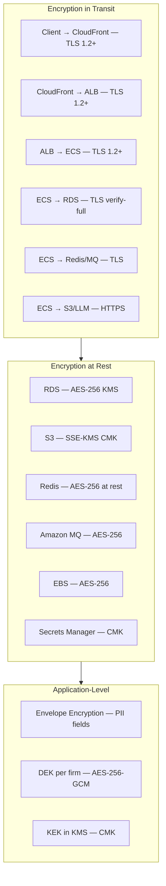
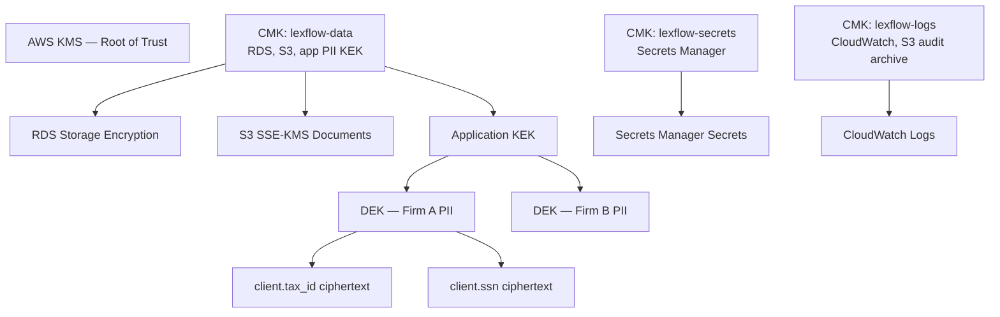
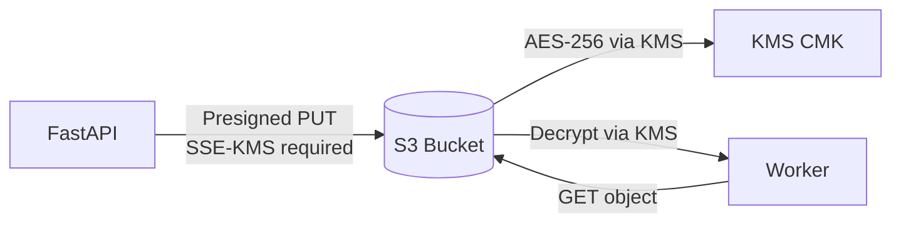
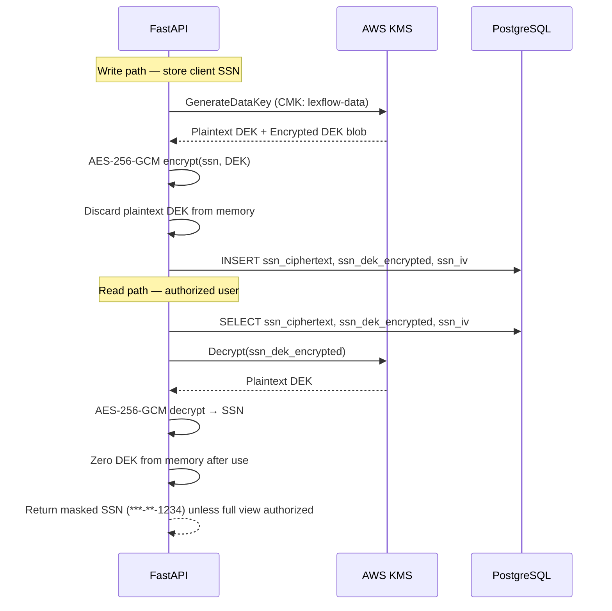
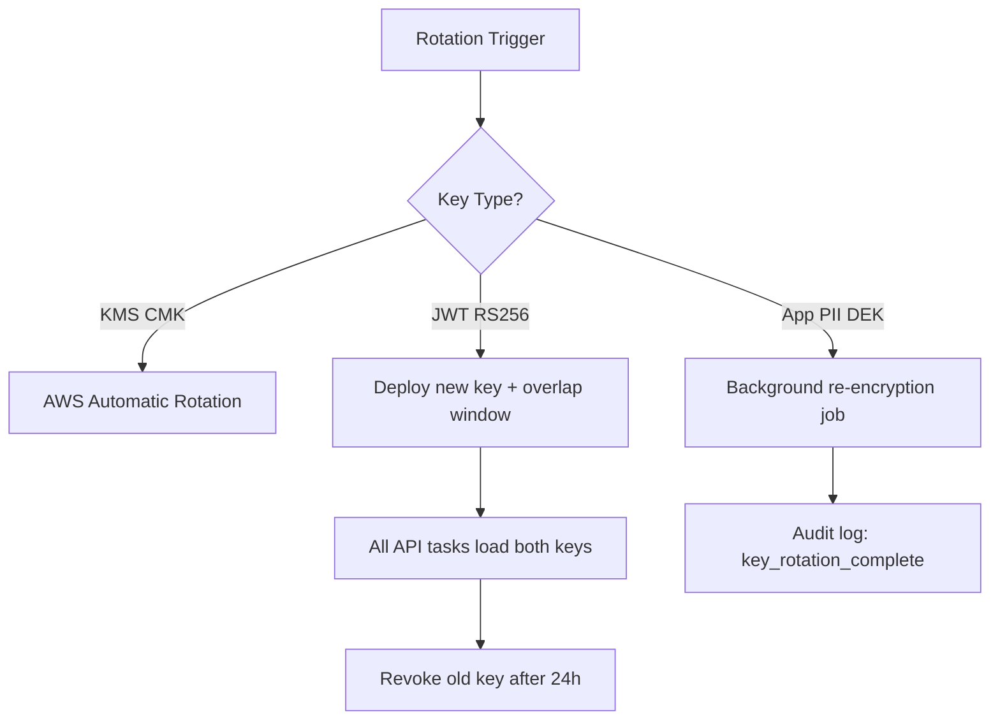
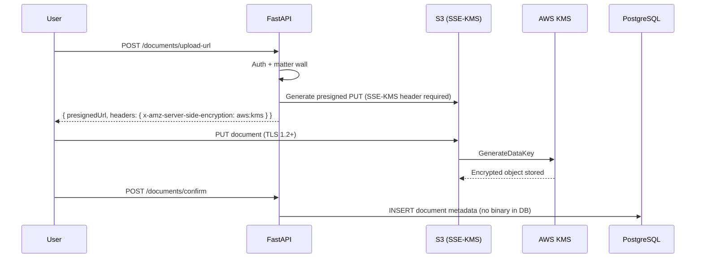
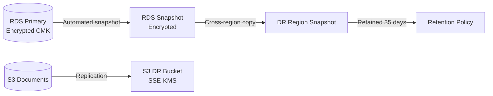

# Encryption

**LexFlow AI** — At Rest, In Transit & Application-Level PII  
**Version:** 1.0  
**Status:** Draft — Pre-Implementation  
**Last Updated:** 2026-07-06

---

## Purpose

Define the **encryption strategy** for LexFlow AI protecting attorney-client privileged data and personally identifiable information (PII). This document covers encryption at rest, encryption in transit, application-level field encryption for sensitive PII, key management, and cryptographic standards required for enterprise law firm deployments.

Encryption is a baseline control — not optional — for all Restricted-classified data.

---

## Scope

| In Scope | Out of Scope |
|----------|--------------|
| AWS-managed and customer-managed keys (CMK) | Firm HSM procurement (future) |
| RDS, S3, Redis, MQ, EBS, Secrets Manager encryption | End-user device encryption |
| TLS configuration for all service hops | Email encryption (Microsoft 365 responsibility) |
| Application-level PII field encryption | Full-database application encryption |
| Key rotation policies | Quantum-resistant algorithms (future standard) |
| Envelope encryption pattern | Client-side encryption before upload |

---

## Responsibilities

| Role | Responsibility |
|------|----------------|
| **Security Architect** | Define key hierarchy and rotation policy |
| **DevOps / SRE** | Enable KMS, RDS encryption, S3 SSE-KMS in Terraform |
| **Backend Engineer** | Implement application PII encryption/decryption |
| **Compliance Officer** | Validate encryption meets ABA 1.6 and regulatory requirements |
| **IT Administrator** | CMK access policy approvals; rotation ceremony |

---

## Architecture

### Encryption Layers



### Key Hierarchy



---

## Encryption at Rest

### Asset Inventory

| Asset | Method | Key Type | Control ID |
|-------|--------|----------|------------|
| RDS PostgreSQL | AES-256 storage encryption | CMK `lexflow-data` | SEC-ENC-001 |
| S3 document bucket | SSE-KMS | CMK `lexflow-data` | SEC-ENC-002 |
| S3 audit archive | SSE-KMS + Object Lock | CMK `lexflow-logs` | SEC-ENC-003 |
| ElastiCache Redis | Encryption at rest | AWS managed or CMK | SEC-ENC-004 |
| Amazon MQ (RabbitMQ) | Encryption at rest | AWS managed | SEC-ENC-005 |
| EBS volumes (ECS) | AES-256 | AWS managed | SEC-ENC-006 |
| AWS Secrets Manager | AES-256 | CMK `lexflow-secrets` | SEC-ENC-007 |
| RDS automated backups | Inherited from RDS encryption | CMK `lexflow-data` | SEC-ENC-008 |
| RDS cross-region replica (DR) | Encrypted replica | CMK in DR region | SEC-ENC-009 |

### RDS Configuration

| Setting | Value |
|---------|-------|
| Storage encryption | Enabled at creation (cannot enable post-hoc without snapshot) |
| KMS key | Customer-managed CMK `alias/lexflow-data` |
| Performance Insights | Encrypted with same CMK |
| Snapshot sharing | Disabled cross-account unless DR procedure |

### S3 Document Bucket

| Setting | Value |
|---------|-------|
| Default encryption | SSE-KMS with `alias/lexflow-data` |
| Bucket policy | Deny unencrypted uploads (`aws:SecureTransport`, `s3:x-amz-server-side-encryption`) |
| Versioning | Enabled |
| MFA delete | Enabled on production bucket |
| Public access | Block all public access |



---

## Encryption in Transit

### TLS Matrix

| Connection | Protocol | Certificate / Validation | Control ID |
|------------|----------|--------------------------|------------|
| Browser → CloudFront | TLS 1.2+ (prefer 1.3) | ACM public cert | SEC-TLS-001 |
| CloudFront → Origin ALB | TLS 1.2+ | ACM cert | SEC-TLS-002 |
| ALB → ECS tasks | TLS 1.2+ | ACM internal cert | SEC-TLS-003 |
| ECS → RDS PostgreSQL | TLS 1.2 | RDS CA, `sslmode=verify-full` | SEC-TLS-004 |
| ECS → ElastiCache Redis | TLS 1.2 | ElastiCache in-transit encryption | SEC-TLS-005 |
| ECS → Amazon MQ | TLS 1.2 | AMQPS (port 5671) | SEC-TLS-006 |
| ECS → S3 | TLS 1.2+ | AWS SDK HTTPS default | SEC-TLS-007 |
| ECS → Secrets Manager | TLS 1.2+ | AWS API HTTPS | SEC-TLS-008 |
| ECS → LLM providers | TLS 1.2+ | Certificate pinning (Phase 3) | SEC-TLS-009 |
| Worker → n8n (internal) | HTTP within VPC* | Private subnet trust | SEC-TLS-010 |
| n8n → API callback | HTTPS | HMAC + TLS | SEC-TLS-011 |

\* Internal ALB may terminate TLS for n8n in Phase 2; until then, traffic stays within private subnet with SG isolation.

### TLS Policy (ALB / CloudFront)

```
Minimum protocol: TLSv1.2_2021
Cipher suites: ECDHE-RSA-AES128-GCM-SHA256, ECDHE-RSA-AES256-GCM-SHA384
HSTS: max-age=31536000; includeSubDomains; preload
```

### Prohibited

- TLS 1.0, TLS 1.1
- Unencrypted RDS connections (application startup fails if SSL unavailable)
- `sslmode=require` without certificate verification (must use `verify-full`)

---

## Application-Level PII Encryption

Certain PII fields require **defense-in-depth encryption** beyond database-at-rest — protecting against DB administrator access, backup exposure, and application-layer bugs.

### Fields Requiring Application Encryption

| Field | Entity | Algorithm | Notes |
|-------|--------|-----------|-------|
| `tax_id` | Client | AES-256-GCM | Envelope encryption |
| `ssn` | Client | AES-256-GCM | Envelope encryption |
| `bank_account_number` | Client (if stored) | AES-256-GCM | Minimize storage — prefer not to store |
| `drivers_license` | Client (if stored) | AES-256-GCM | Minimize storage |

**Not application-encrypted (protected by RDS + access controls):** Names, addresses, emails, phone numbers — still Restricted PII but searchable and required for case operations.

### Envelope Encryption Pattern



### Implementation Rules

| Rule | Rationale |
|------|-----------|
| Unique IV per encryption operation | GCM nonce reuse is catastrophic |
| Encrypted DEK stored alongside ciphertext | Standard envelope pattern |
| Plaintext DEK never persisted | Minimize key exposure window |
| Decrypt only in authorized handler | Matter wall + RBAC before decrypt |
| Audit every decrypt of full SSN/tax_id | Compliance trail |
| Search on hashed token, not plaintext | `ssn_hash = SHA-256(salt + ssn)` for duplicate detection |

### PII in AI Prompts

Before any text is sent to an LLM provider:

1. **Automated PII scan** — Detect SSN, credit card, financial account patterns
2. **Redact or block** — Replace with `[REDACTED-SSN]` or reject prompt with 422
3. **Log redacted copy** — Prompt history stores redacted version only
4. **Case scope** — RAG retrieval limited to authorized case documents

**Cross-reference:** [../01-product/non-goals.md](../01-product/non-goals.md) — Cross-matter AI context prohibited.

---

## Key Management

### CMK Policies

| CMK Alias | Purpose | Key Administrators | Key Users |
|-----------|---------|-------------------|-----------|
| `lexflow-data` | RDS, S3, app PII KEK | Security Architect IAM role | api-task-role, worker-task-role |
| `lexflow-secrets` | Secrets Manager | Security Architect IAM role | api-task-role, worker-task-role, deploy-role |
| `lexflow-logs` | Audit log archives | Security Architect IAM role | log-export-role |

### Rotation Schedule

| Key / Secret Type | Rotation Frequency | Method |
|-------------------|-------------------|--------|
| KMS CMK | Annual (automatic) | AWS KMS automatic key rotation |
| JWT signing key (RS256) | Quarterly | Secrets Manager + dual-key overlap |
| Database password | On deploy + quarterly | Secrets Manager rotation Lambda |
| Application DEK (per firm) | Annual or on compromise | Re-encrypt all PII fields |
| LLM API keys | Quarterly | Secrets Manager manual + CI verify |
| n8n encryption key | Quarterly | Secrets Manager |



---

## Flow Diagrams

### Document Upload Encryption Path



### Backup Encryption



---

## Compliance Alignment

| Requirement | Encryption Control |
|-------------|-------------------|
| ABA Model Rule 1.6 (Confidentiality) | At rest + in transit for all case data |
| ABA Model Rule 1.15 (Safekeeping) | S3 SSE-KMS, versioning, MFA delete |
| GDPR Art. 32 (Security of processing) | Encryption + pseudonymization (app PII) |
| CCPA reasonable security | Industry-standard AES-256 + TLS 1.2+ |
| SOC 2 CC6.1 (Logical access) | KMS IAM policies, least privilege |
| SOC 2 C1.2 (Confidential information) | Application PII encryption, audit on decrypt |

See [compliance-mapping.md](./compliance-mapping.md) for full control mapping.

---

## Best Practices

1. **Enable encryption at resource creation** — RDS and S3 cannot easily add encryption later.
2. **Use CMK over AWS-managed keys** — Required for key policy control and audit.
3. **Never log plaintext PII** — Structured logs use masked values.
4. **Test TLS failure modes** — Application must fail startup if RDS SSL unavailable.
5. **Document key rotation runbooks** — See [secrets-management.md](./secrets-management.md).
6. **Minimize stored PII** — Do not store bank accounts unless legally required.
7. **Verify presigned URLs require SSE-KMS** — Bucket policy denies non-KMS uploads.

---

## Tradeoffs

| Decision | Benefit | Cost |
|----------|---------|------|
| CMK vs AWS-managed key | Key policy, rotation audit, firm compliance | ~$1/key/month + API calls |
| Application PII encryption | Defense against DB admin/backup exposure | Search complexity; re-encryption jobs |
| TLS everywhere including internal (Phase 3) | Strongest in-transit protection | Certificate management overhead |
| Redact PII before LLM | Prevents provider-side exposure | May reduce AI accuracy on redacted fields |
| SSN hash for dedup | Search without decrypt | Salt management; not reversible |

---

## Future Improvements

| Phase | Enhancement |
|-------|-------------|
| Phase 2 | mTLS between all ECS services |
| Phase 3 | Certificate pinning for LLM API endpoints |
| Phase 3 | AWS CloudHSM for CMK (if firm requires FIPS 140-2 Level 3) |
| Phase 4 | Client-side encryption option for ultra-sensitive firms |
| Year 2+ | Post-quantum algorithm evaluation when NIST standards finalize |

---

## References

- [network-security.md](./network-security.md) — TLS hop configuration
- [secrets-management.md](./secrets-management.md) — JWT keys, API keys in Secrets Manager
- [threat-model.md](./threat-model.md) — T-006 AI exfiltration, database breach
- [matter-walls.md](./matter-walls.md) — Decrypt authorization
- [../database-architecture.md](../database-architecture.md) — PII column definitions
- [../04-api/authentication.md](../04-api/authentication.md) — JWT RS256 signing keys
- [../01-product/non-goals.md](../01-product/non-goals.md) — Cross-matter AI prohibited
- [AWS KMS Best Practices](https://docs.aws.amazon.com/kms/latest/developerguide/best-practices.html)
