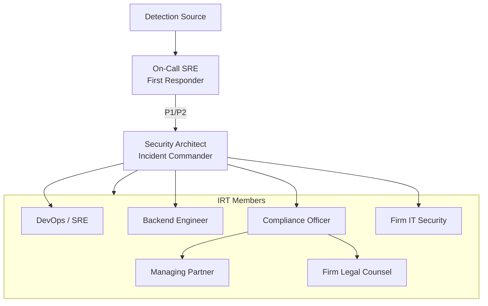
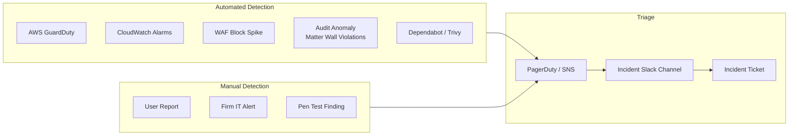
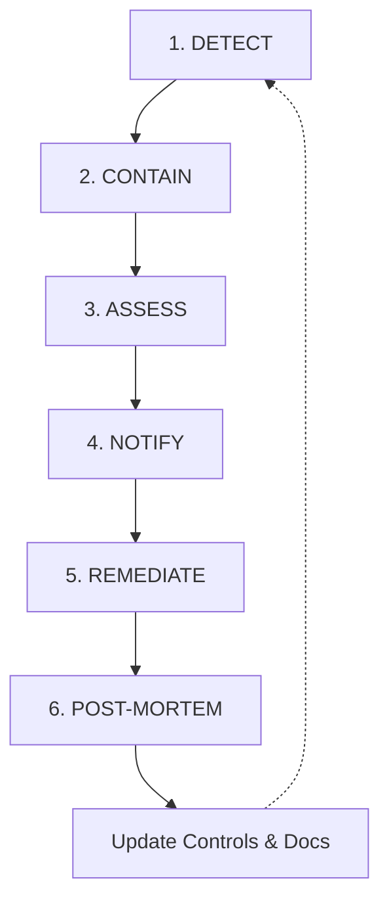
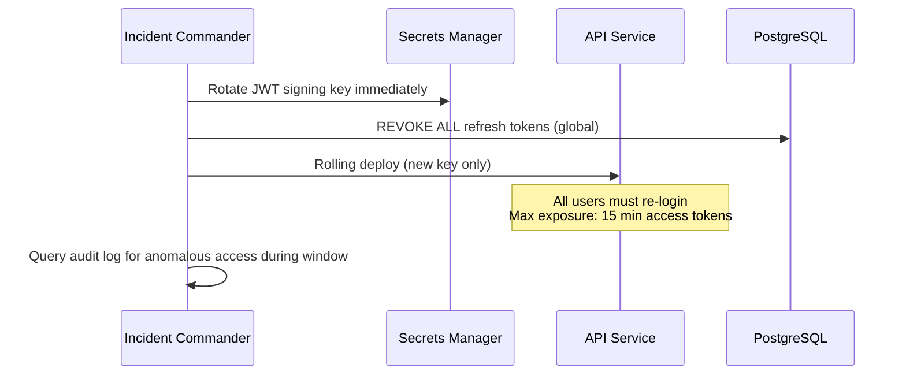
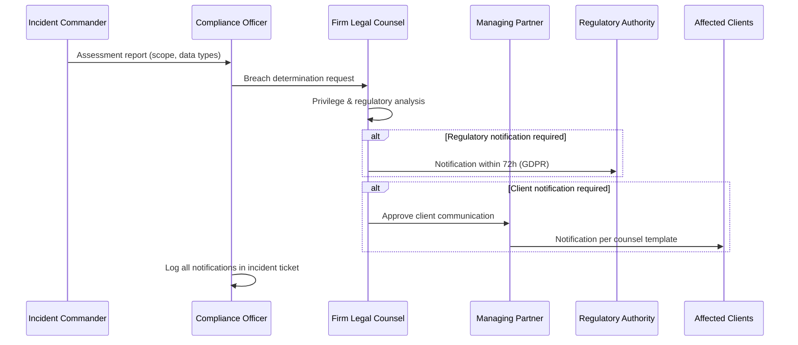
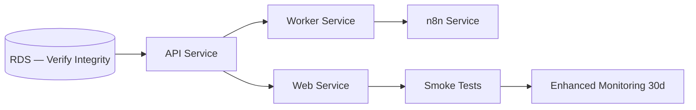
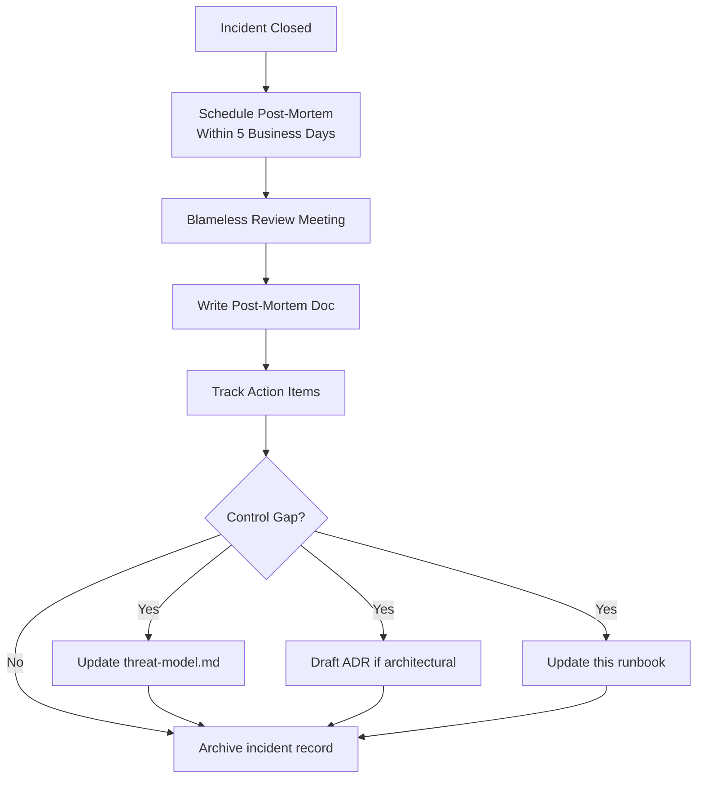

# Incident Response

**LexFlow AI** — Detect, Contain, Notify, Remediate  
**Version:** 1.0  
**Status:** Draft — Pre-Implementation  
**Last Updated:** 2026-07-06

---

## Purpose

Define the **incident response lifecycle** for LexFlow AI security events affecting attorney-client privileged data. This runbook covers detection, containment, assessment, notification, remediation, and post-incident review — aligned with ABA confidentiality obligations, GDPR breach notification (72 hours), CCPA requirements, and SOC 2 CC7.3.

Incidents involving privileged legal data require **heightened urgency** and **firm legal counsel involvement** from the first hour.

---

## Scope

| In Scope | Out of Scope |
|----------|--------------|
| Security incident classification and severity | Firm office physical security |
| Detection sources and alert routing | Cyber insurance claims process |
| Containment procedures (token revoke, isolation) | Law enforcement liaison (firm counsel leads) |
| Breach assessment and scope determination | Public relations strategy |
| Notification timelines (internal, regulatory, clients) | Litigation resulting from breach |
| Remediation and recovery steps | Detailed forensic tool configuration |
| Post-mortem and control improvement | Tabletop exercise facilitation scripts |

**Incident definition:** Any event that compromises or threatens confidentiality, integrity, or availability of Restricted-classified data, authentication systems, or critical infrastructure.

---

## Responsibilities

| Role | Incident Responsibility |
|------|------------------------|
| **On-Call SRE** | First responder; execute containment runbook; escalate P1 |
| **Security Architect** | Lead investigation; coordinate forensics; post-mortem |
| **Compliance Officer** | Assess regulatory notification; DSAR impact; audit queries |
| **Managing Partner** | Client notification decisions; external communication approval |
| **Firm IT Security** | Joint response; network-level containment; endpoint investigation |
| **Firm Legal Counsel** | Privilege assessment; regulatory notification; law enforcement |
| **Backend Engineer** | Code-level remediation; hotfix deployment |
| **DevOps / SRE** | Infrastructure remediation; secret rotation; restore |

### Incident Response Team (IRT)



---

## Architecture

### Detection Sources



### Detection Rules

| Source | Condition | Severity | Auto-Action |
|--------|-----------|----------|-------------|
| GuardDuty | Credential exfiltration, crypto mining | P1 | Page on-call |
| GuardDuty | Reconnaissance, low-severity | P3 | Ticket only |
| CloudWatch | API 5xx > 10% for 5 min | P2 | Page on-call |
| CloudWatch | Failed login > 100/min from single IP | P2 | WAF rate block |
| Audit log | > 50 matter wall denials/user/hour | P2 | Alert Security Architect |
| Audit log | Admin action outside business hours | P3 | Ticket |
| WAF | Block spike > 1000/5 min | P2 | Alert SRE |
| Secrets Manager | DeleteSecret API call | P1 | Page + auto-contain |
| n8n SG | Inbound from unknown source | P1 | Page + isolate n8n |

---

## Incident Severity Classification

| Severity | Definition | Examples | Response Time |
|----------|------------|----------|---------------|
| **P1 — Critical** | Active breach or imminent privileged data exposure | Confirmed data exfiltration; JWT key leak; n8n public exposure | 15 min |
| **P2 — High** | Potential breach; significant service impact | Suspected unauthorized case access; DDoS; compromised user account | 1 hour |
| **P3 — Medium** | Security event without confirmed data impact | Vulnerability disclosed; failed pen test finding; misconfigured SG | 4 hours |
| **P4 — Low** | Minor security issue | Dependabot low severity; policy deviation | Next business day |

---

## Incident Response Lifecycle



---

## Phase 1: Detect

### Objectives
- Identify potential or confirmed security incidents
- Assign severity and incident commander
- Open incident ticket with timestamp

### Actions

| Step | Action | Owner |
|------|--------|-------|
| 1.1 | Alert received via PagerDuty, Slack, or user report | On-Call SRE |
| 1.2 | Acknowledge alert within SLA (15 min P1) | On-Call SRE |
| 1.3 | Create incident ticket: `INC-YYYYMMDD-NNN` | On-Call SRE |
| 1.4 | Assign severity per classification table | On-Call SRE |
| 1.5 | Page Security Architect for P1/P2 | On-Call SRE |
| 1.6 | Open dedicated Slack channel: `#inc-YYYYMMDD-nnn` | On-Call SRE |
| 1.7 | **Do not** delete logs or restart services before snapshot | All |

### Key Queries (Initial Triage)

```sql
-- Matter wall violations last 24h by user
SELECT user_id, COUNT(*) AS denials
FROM audit_log
WHERE outcome = 'denied_matter_wall'
  AND timestamp > NOW() - INTERVAL '24 hours'
GROUP BY user_id
ORDER BY denials DESC
LIMIT 20;

-- Failed logins by IP
SELECT ip_address, COUNT(*) AS failures
FROM audit_log
WHERE event_type = 'auth.login_failed'
  AND timestamp > NOW() - INTERVAL '1 hour'
GROUP BY ip_address
ORDER BY failures DESC;
```

CloudTrail: Filter `GetSecretValue`, `AssumeRole`, `AuthorizeSecurityGroupIngress` during incident window.

---

## Phase 2: Contain

### Objectives
- Stop ongoing damage
- Preserve evidence
- Prevent lateral movement

### Containment Playbooks

#### P1: Suspected JWT / Refresh Token Compromise



| Step | Action | Timeline |
|------|--------|----------|
| C-JWT-1 | Rotate JWT signing key in Secrets Manager | Immediate |
| C-JWT-2 | Revoke all refresh tokens in PostgreSQL | Immediate |
| C-JWT-3 | Rolling deploy API service | < 30 min |
| C-JWT-4 | Invalidate Redis permission cache | Immediate |
| C-JWT-5 | Preserve audit logs for incident window | Immediate |

#### P1: Suspected n8n Public Exposure

| Step | Action | Timeline |
|------|--------|----------|
| C-N8N-1 | Remove any public SG rule on n8n (Terraform revert) | Immediate |
| C-N8N-2 | Scale n8n service to 0 tasks | Immediate |
| C-N8N-3 | Rotate n8n admin credentials and HMAC secret | < 30 min |
| C-N8N-4 | Review n8n execution logs for unauthorized workflows | < 2 hours |
| C-N8N-5 | Review VPC Flow Logs for n8n inbound from internet | < 2 hours |

See [network-security.md](./network-security.md).

#### P2: Compromised User Account

| Step | Action | Timeline |
|------|--------|----------|
| C-USER-1 | Disable user account in PostgreSQL (`active = false`) | Immediate |
| C-USER-2 | Revoke all refresh tokens for user | Immediate |
| C-USER-3 | Query audit log for all actions by user in last 7 days | < 1 hour |
| C-USER-4 | Identify cases accessed; notify case leads if unauthorized | < 4 hours |
| C-USER-5 | Force password reset before re-enable | Before restore |

#### P2: Suspected Data Exfiltration via API

| Step | Action | Timeline |
|------|--------|----------|
| C-EXFIL-1 | Identify actor IP/user from audit log | < 30 min |
| C-EXFIL-2 | Disable account; revoke tokens | Immediate |
| C-EXFIL-3 | WAF block actor IP range | Immediate |
| C-EXFIL-4 | Reduce rate limits temporarily | Immediate |
| C-EXFIL-5 | Preserve S3 access logs and CloudTrail | Immediate |

#### P1: Secrets Manager Compromise

See [secrets-management.md](./secrets-management.md) — Emergency rotation procedure.

---

## Phase 3: Assess

### Objectives
- Determine scope: what data, which cases, which clients
- Establish incident timeline
- Assess privilege and regulatory impact

### Assessment Checklist

| Question | Method |
|----------|--------|
| What systems were affected? | Infrastructure inventory; GuardDuty findings |
| What data types were exposed? | Audit log query; classification mapping |
| Which cases/clients involved? | Audit log join on caseId, clientId |
| Was privileged information accessed? | Document download audit; AI invocation log |
| How long was exposure window? | First malicious event → containment timestamp |
| Was data exfiltrated or only accessed? | S3 logs; outbound NAT flow logs |
| Insider or external? | IP analysis; user behavior |
| Is litigation hold affected? | Case flags query |

### Scope Determination Flow

```mermaid
flowchart TD
    START[Containment Complete] --> TIMELINE[Build Timeline<br/>CloudTrail + Audit Log]
    TIMELINE --> ACTOR[Identify Actor(s)]
    ACTOR --> DATA{What Data<br/>Accessed?}
    DATA -->|Case documents| PRIV[Privileged Data — Elevated Response]
    DATA -->|PII only| PII[PII Breach Assessment]
    DATA -->|Credentials only| CRED[Credential Incident]
    DATA -->|No data access confirmed| LOW[Potential Incident — Monitor]
    
    PRIV --> LEGAL[Firm Legal Counsel Review]
    PII --> LEGAL
    LEGAL --> NOTIFY[Determine Notification Requirements]
```

### Breach vs Security Event

| Classification | Criteria | Notification Required |
|----------------|----------|----------------------|
| **Confirmed breach** | Unauthorized acquisition of Restricted data | Yes — internal, possibly regulatory and clients |
| **Security incident** | Attempted access blocked; no data acquired | Internal only |
| **Near miss** | Misconfiguration discovered before exploitation | Internal; post-mortem |

**Privilege note:** Incident investigation communications may be protected by attorney-client privilege when firm counsel directs the investigation. Coordinate with firm legal counsel before external disclosure.

---

## Phase 4: Notify

### Objectives
- Inform required parties within regulatory timelines
- Preserve trust with firm stakeholders
- Document all notifications

### Internal Notification

| Recipient | Timeline | Channel | Content |
|-----------|----------|---------|---------|
| On-Call SRE | Immediate | PagerDuty | Alert details |
| Security Architect | P1: 15 min; P2: 1 hour | Page + Slack | Severity, initial scope |
| Compliance Officer | P1: 1 hour; P2: 4 hours | Slack + email | Data classification impact |
| Managing Partner | P1: 4 hours | Phone + email | Summary, client impact assessment |
| Firm IT Security | P1: 1 hour | Firm IR channel | Joint response coordination |
| Firm Legal Counsel | P1: 4 hours | Secure channel | Privilege, regulatory, client notification |
| Engineering team | As directed by IC | Slack #inc-* | Technical status |

### External / Regulatory Notification

| Framework | Requirement | Timeline | Owner |
|-----------|-------------|----------|-------|
| **GDPR Art. 33** | Notify supervisory authority | 72 hours of awareness | Firm Legal Counsel |
| **GDPR Art. 34** | Notify data subjects if high risk | Without undue delay | Firm Legal Counsel + Managing Partner |
| **CCPA** | Notify California AG if > 500 residents | As required | Firm Legal Counsel |
| **State breach laws** | Varies by state (e.g., NY SHIELD) | Per jurisdiction | Firm Legal Counsel |
| **Client notification** | Contractual and ethical obligation | As counsel directs | Managing Partner |
| **ABA 1.6** | Inform affected clients if confidentiality compromised | Promptly | Firm Legal Counsel |



### Notification Content Template (Internal)

```
INCIDENT: INC-YYYYMMDD-NNN
SEVERITY: P1 / P2 / P3
STATUS: Contained / Investigating / Remediated
SUMMARY: [2-3 sentences — no speculation]
DATA IMPACT: [Known / Unknown — data types if known]
CASES AFFECTED: [Count or "Under investigation"]
CLIENT IMPACT: [None confirmed / Under assessment]
CONTAINMENT ACTIONS: [List]
NEXT UPDATE: [Time]
INCIDENT COMMANDER: [Name]
```

**Do not** include privileged investigation details in non-privileged channels.

---

## Phase 5: Remediate

### Objectives
- Eliminate root cause
- Restore secure operations
- Verify integrity before full service restoration

### Remediation Checklist

| Step | Action | Owner | Timeline |
|------|--------|-------|----------|
| R-1 | Patch vulnerability or fix misconfiguration | Backend / SRE | < 72 hours P1 |
| R-2 | Rotate all potentially compromised secrets | SRE | < 24 hours P1 |
| R-3 | Restore from clean backup if integrity compromised | SRE | Per DR runbook |
| R-4 | Re-enable contained services with verified config | SRE | After root cause fixed |
| R-5 | Force password reset for affected users | Identity service | Before re-enable |
| R-6 | Enhanced monitoring for 30 days post-incident | SRE | Ongoing |
| R-7 | Update WAF rules / SG if attack vector identified | SRE | < 48 hours |
| R-8 | Deploy hotfix through CI/CD (no manual prod edits) | Backend | Standard pipeline |

### Service Restoration Order



### Verification Before Close

| Check | Method |
|-------|--------|
| Root cause eliminated | Pen test specific vector; code review |
| No ongoing unauthorized access | Audit log clean 24 hours |
| All secrets rotated | Secrets Manager version audit |
| Services healthy | Smoke tests; error rate normal |
| Monitoring enhanced | Alerts configured for recurrence |
| Documentation updated | Threat model, runbook if gap found |

---

## Phase 6: Post-Mortem

### Objectives
- Blameless analysis of what happened and why
- Identify control gaps
- Implement improvements

### Post-Mortem Template

| Section | Content |
|---------|---------|
| **Incident ID** | INC-YYYYMMDD-NNN |
| **Severity** | P1 / P2 / P3 |
| **Duration** | Detect → close timestamps |
| **Summary** | What happened (factual) |
| **Timeline** | Minute-by-minute key events |
| **Root cause** | Technical and procedural |
| **Impact** | Data, cases, clients, downtime |
| **What went well** | Effective responses |
| **What went poorly** | Delays, gaps, communication issues |
| **Action items** | Owner, due date, priority |
| **ADR required?** | Yes if architecture change |

### Post-Mortem Flow



Post-mortem documents stored in firm-accessible secure repository (not public git). Summary action items tracked in engineering backlog.

---

## Incident Timeline SLAs

| Phase | P1 Target | P2 Target |
|-------|-----------|-----------|
| Detect → Acknowledge | 15 min | 1 hour |
| Acknowledge → Contain | 1 hour | 4 hours |
| Contain → Assess (initial) | 4 hours | 24 hours |
| Assess → Internal notify (MP) | 4 hours | 24 hours |
| Regulatory notification (if required) | 72 hours (GDPR) | 72 hours |
| Remediate (root cause) | 72 hours | 1 week |
| Post-mortem | 5 business days | 10 business days |

---

## Communication Rules

| Rule | Rationale |
|------|-----------|
| Single incident commander | Avoid conflicting actions |
| All actions logged in incident ticket | Audit trail |
| No public disclosure without counsel approval | Privilege and regulatory risk |
| Preserve evidence before remediation | Forensic requirements |
| Use `#inc-*` Slack for coordination | Separation from normal ops |
| Do not discuss client names in non-privileged channels | Confidentiality |

---

## Best Practices

1. **Run tabletop exercises** annually with firm IT and legal counsel.
2. **Test containment procedures** in staging — JWT global revoke, n8n scale-to-zero.
3. **Preserve audit logs** — never delete during incident; export to immutable S3.
4. **Involve firm legal counsel early** for any P1 with data access.
5. **Rotate secrets after every P1** — even if compromise unconfirmed.
6. **Update threat model** after every P1/P2 post-mortem.
7. **Maintain on-call runbook** accessible outside LexFlow (firm shared drive).

---

## Tradeoffs

| Decision | Benefit | Cost |
|----------|---------|------|
| Global refresh token revoke on JWT compromise | Maximum containment | All users re-login |
| Scale n8n to zero on exposure | Immediate isolation | Workflow execution halt |
| 72-hour GDPR notification window | Regulatory compliance | Pressure on assessment accuracy |
| Blameless post-mortem | Honest root cause analysis | Requires cultural safety |
| 30-day enhanced monitoring | Detect recurrence | Alert fatigue risk |

---

## Future Improvements

| Phase | Enhancement |
|-------|-------------|
| Phase 2 | Automated incident ticket creation from GuardDuty |
| Phase 2 | Audit anomaly ML model (matter wall violation patterns) |
| Phase 3 | SIEM integration (Splunk/Datadog) for cross-source correlation |
| Phase 3 | Automated containment playbooks (Lambda functions) |
| Year 2 | Annual third-party IR tabletop with firm |
| Year 2 | Forensic image automation for ECS tasks |

---

## References

- [threat-model.md](./threat-model.md) — Threat scenarios and control IDs
- [secrets-management.md](./secrets-management.md) — Emergency secret rotation
- [network-security.md](./network-security.md) — n8n isolation containment
- [matter-walls.md](./matter-walls.md) — Audit queries for unauthorized access
- [compliance-mapping.md](./compliance-mapping.md) — GDPR Art. 33–34, notification requirements
- [../04-api/authentication.md](../04-api/authentication.md) — Token revocation
- [../01-product/non-goals.md](../01-product/non-goals.md) — n8n exposure non-goal
- [../disaster-recovery.md](../disaster-recovery.md) — Restore procedures
- [../observability.md](../observability.md) — Alerting configuration
- [NIST SP 800-61 — Computer Security Incident Handling Guide](https://csrc.nist.gov/publications/detail/sp/800-61/rev-2/final)
