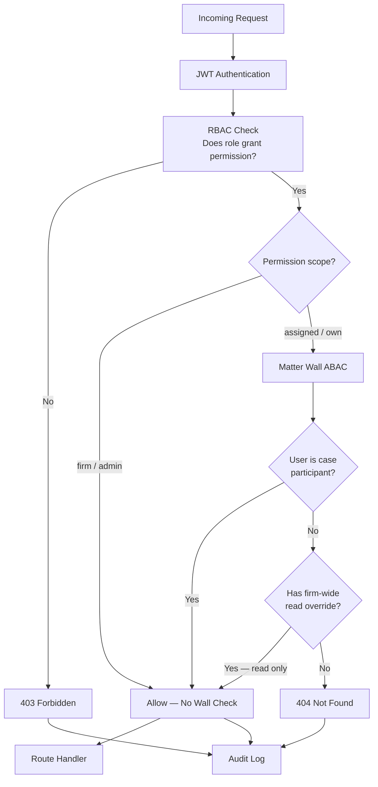
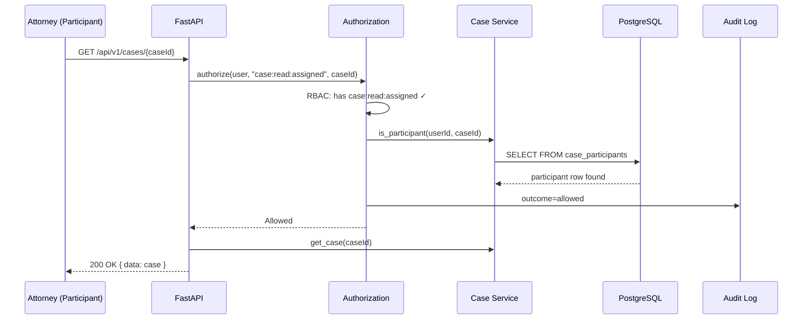
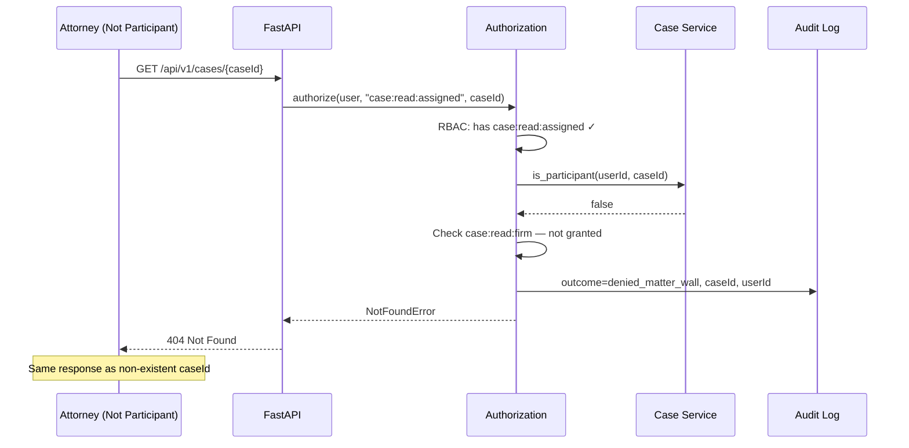
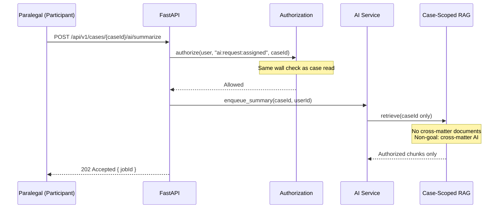
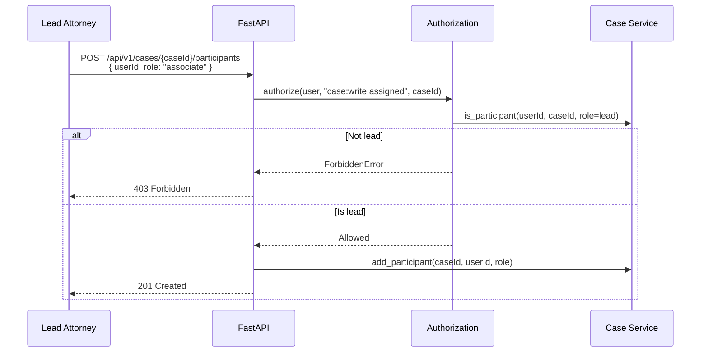
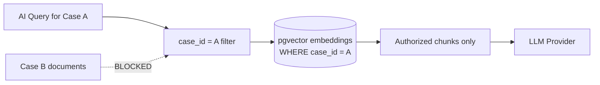

# Matter Walls — Case-Level ABAC & Ethical Walls

**LexFlow AI** — Attribute-Based Access Control for Legal Ethics  
**Version:** 1.0  
**Status:** Draft — Pre-Implementation  
**Last Updated:** 2026-07-06

---

## Purpose

Define **matter walls** — LexFlow AI's implementation of **Attribute-Based Access Control (ABAC)** at the case (matter) level. Matter walls enforce **ethical walls**, **conflict boundaries**, and **need-to-know access** required by large US law firms handling attorney-client privileged information.

Matter walls complement firm-wide **Role-Based Access Control (RBAC)**. A user may hold the `Attorney` role but still be blocked from cases where they are not a participant — unless they hold an explicit firm-wide read override.

---

## Scope

| In Scope | Out of Scope |
|----------|--------------|
| Matter wall rules and decision logic | Conflict check automation (future integration) |
| Case participant model and roles | Court-imposed protective order UI |
| 403 vs 404 denial behavior | External DMS matter wall sync |
| Client portal restrictions | Time-bound override approval workflow (Phase 4) |
| AI and document scoping under walls | Office/department ABAC (Phase 3) |
| Audit requirements for wall violations | Legal ethics opinion interpretation |

**Cross-reference:** RBAC permission matrix in [../04-api/authorization-rbac.md](../04-api/authorization-rbac.md). Authentication in [../04-api/authentication.md](../04-api/authentication.md).

---

## Responsibilities

| Role | Responsibility |
|------|----------------|
| **Backend Engineer** | Enforce matter walls in authorization middleware |
| **Case service owner** | Maintain participant membership invariant |
| **Compliance Officer** | Define firm policy for firm-wide read overrides |
| **Managing Partner** | Approve participant changes on sensitive matters |
| **QA** | Automated tests: every role × case endpoint × participant state |
| **Frontend Engineer** | Reflect permissions for UX — never enforce security |

Authorization is enforced **exclusively on the FastAPI backend**.

---

## Architecture

### RBAC + ABAC Layer Model



### Ethical Wall Concept

In large law firms, **ethical walls** (Chinese walls) prevent information flow between groups representing conflicting interests or between practice groups with sensitivity requirements.

| Wall Type | LexFlow Enforcement |
|-----------|---------------------|
| **Conflict wall** | Separate cases; no cross-case AI retrieval | 
| **Practice group wall** | Participant assignment controls access |
| **M&A / securities wall** | Restricted participant lists on flagged cases |
| **Client portal wall** | Client role sees only own cases; internal notes hidden |

**Cross-reference:** [../01-product/non-goals.md](../01-product/non-goals.md) — Cross-matter AI context is a documented non-goal.

---

## Matter Wall Rules

### Core Rules

| # | Rule | Rationale |
|---|------|-----------|
| MW-001 | User must be a **case participant** to access case-scoped resources with `assigned` scope | Need-to-know |
| MW-002 | `ManagingPartner` and `ComplianceOfficer` bypass walls for **read** via `case:read:firm` | Oversight without per-case assignment |
| MW-003 | `SystemAdministrator` bypasses walls for **admin operations only** — not document content or AI summaries | IT ops vs case data separation |
| MW-004 | Unauthorized case access returns **404 Not Found** (not 403) on GET | Prevents case ID enumeration |
| MW-005 | Adding/removing participants requires `case:write:assigned` **and** participant role `lead` | Prevents self-enrollment |
| MW-006 | AI retrieval scoped to authorized case documents only | Ethical wall for AI |
| MW-007 | Client role cannot access internal notes, AI summaries, or other clients' cases | Portal isolation |
| MW-008 | All wall decisions (allow and deny) logged to audit | Compliance evidence |

### Participant Roles (Case-Level)

Distinct from system RBAC roles — assigned per case.

| Participant Role | Capabilities |
|-----------------|-------------|
| `lead` | Full case management; add/remove participants |
| `associate` | Read/write case data; cannot manage participants |
| `paralegal` | Tasks, documents, notes — no AI approval |
| `observer` | Read-only (e.g., supervising partner) |

### Firm-Wide Read Overrides

| System Role | Permission | Wall Bypass |
|-------------|------------|-------------|
| `ManagingPartner` | `case:read:firm` | Read all cases in firm |
| `ComplianceOfficer` | `case:read:firm`, `audit:read:firm` | Read all cases for audit |
| `OperationsTeam` | `case:read:assigned` only | **No bypass** — must be participant |
| `SystemAdministrator` | Admin endpoints only | **No content bypass** |

---

## Flow Diagrams

### Case Read — Authorized Participant



### Case Read — Matter Wall Denial



### AI Request — Wall + Scope Enforcement



### Participant Management



---

## Decision Tree

```
Request for case-scoped resource (caseId in path or body)
  │
  ├─ Step 1: JWT valid?
  │    └─ No → 401 Unauthorized
  │
  ├─ Step 2: RBAC — user.has_permission(required_permission)?
  │    └─ No → 403 Forbidden + audit(denied_rbac)
  │
  ├─ Step 3: Permission scope?
  │    ├─ firm / admin (non-content) → Allow + audit(allowed)
  │    └─ assigned / own → Continue to Step 4
  │
  └─ Step 4: Matter wall ABAC
       ├─ user.is_participant(caseId) → Allow + audit(allowed)
       ├─ user.has_permission("case:read:firm") AND operation is READ → Allow + audit(allowed)
       └─ Otherwise → 404 Not Found + audit(denied_matter_wall)
```

### HTTP Status Code Matrix

| Scenario | Method | Status | Body Hint |
|----------|--------|--------|-----------|
| Not authenticated | Any | 401 | `UnauthorizedError` |
| RBAC denied (admin endpoint) | Any | 403 | `ForbiddenError` |
| Matter wall denied | GET | 404 | `NotFoundError` |
| Matter wall denied | POST/PATCH/DELETE | 404 | `NotFoundError` |
| Client accessing internal note | GET | 404 | Same as wall deny |
| Client triggering workflow | POST | 403 | Explicit capability denial |

**Consistency rule:** All case-scoped GET endpoints return 404 for wall violations — never 403.

---

## Client Portal Restrictions

Clients with the `Client` role have additional ABAC constraints:

| Resource | Client Access | Response if Denied |
|----------|---------------|-------------------|
| Own case status | Read | — |
| Document upload to own case | Write | — |
| Internal attorney notes | **Denied** | 404 |
| AI summaries | **Denied** | 404 |
| Other clients' cases | **Denied** | 404 |
| Workflow triggers | **Denied** | 403 |
| Participant list (full) | **Denied** | 404 (show assigned attorney only) |

Clients are participants with role `client` — wall checks apply plus role-specific filters in handlers.

---

## AI & Document Scoping

### RAG Retrieval Boundary



| Control | Implementation |
|---------|----------------|
| Embedding storage | `case_id` column on every embedding row |
| Retrieval query | Mandatory `WHERE case_id = :authorized_case_id` |
| Worker validation | Re-verify participant before AI job execution |
| Output storage | AI summary linked to `case_id`; wall applies on read |
| Cross-matter non-goal | No firm-wide corpus search across cases |

### Document Access

| Action | Wall Check |
|--------|------------|
| List documents | Participant or firm read |
| Download document | Participant or firm read + download audit |
| Upload document | Participant with write permission |
| Search within case | Participant or firm read |
| Full-text search across firm | Requires `case:read:firm` — results filtered per case wall |

---

## Audit Requirements

Every matter wall decision generates an audit record:

| Field | Value |
|-------|-------|
| `eventType` | `authorization.decision` |
| `userId` | Actor UUID |
| `caseId` | Target case (if applicable) |
| `permission` | Required permission string |
| `outcome` | `allowed` \| `denied_rbac` \| `denied_matter_wall` |
| `correlationId` | Request correlation ID |
| `timestamp` | ISO 8601 UTC |
| `ipAddress` | Client IP (from ALB header) |

**Compliance reports:**
- Matter wall violation attempts by user (on demand)
- Case access report by case (on demand)
- See [compliance-mapping.md](./compliance-mapping.md)

---

## Permission Resolution (Reference)

```python
def authorize(user: User, permission: str, resource: Resource | None = None) -> None:
    # 1. RBAC
    if not user.has_permission(permission):
        audit_log.record(user, permission, resource, outcome="denied_rbac")
        raise ForbiddenError()

    # 2. ABAC — matter wall for case-scoped resources
    if resource and resource.type == "case":
        scope = parse_scope(permission)  # assigned | firm | own
        if scope == "assigned":
            if not user.is_participant(resource.case_id):
                if not (is_read_operation(permission) and user.has_permission("case:read:firm")):
                    audit_log.record(user, permission, resource, outcome="denied_matter_wall")
                    raise NotFoundError()  # 404 — not 403

    audit_log.record(user, permission, resource, outcome="allowed")
```

Full matrix: [../04-api/authorization-rbac.md](../04-api/authorization-rbac.md).

---

## Best Practices

1. **Declare permissions at route level** — FastAPI dependencies, not inline handler checks.
2. **Test wall denials return 404** — Integration test suite per endpoint.
3. **Never expose participant lists** to unauthorized users — even case existence.
4. **Re-check walls in async workers** — Permission may change between enqueue and execution.
5. **Audit denials** — Failed wall attempts are security-relevant; monitor for patterns.
6. **Lead role is sacred** — Only leads add participants; prevent privilege escalation.
7. **Document in OpenAPI** — Note matter wall behavior on case endpoints.

---

## Tradeoffs

| Decision | Benefit | Cost |
|----------|---------|------|
| 404 on wall deny | Prevents case ID enumeration | Support staff cannot distinguish "no case" vs "no access" |
| RBAC + ABAC two-layer | Ethical compliance | Latency: participant DB lookup per request |
| Firm read for partners only | Oversight | Broad access — audit critical |
| No SysAdmin content bypass | Separates IT from privileged data | SysAdmin cannot debug content issues directly |
| Case-scoped AI only | Ethical wall enforcement | Cannot build firm-wide knowledge assistant |

---

## Future Improvements

| Phase | Enhancement |
|-------|-------------|
| Phase 2 | Case sensitivity flag (`restricted`, `public_within_firm`) |
| Phase 3 | Office/department ABAC (`office:atlanta` attribute) |
| Phase 3 | Entra ID group → case team auto-assignment |
| Phase 4 | Time-bound wall override with Managing Partner approval |
| Phase 4 | External conflict system integration (e.g., Elite 3E conflicts) |
| Phase 4 | OPA/Cedar policy engine if rules exceed matrix |

---

## References

- [../04-api/authorization-rbac.md](../04-api/authorization-rbac.md) — RBAC matrix, endpoint permissions
- [../04-api/authentication.md](../04-api/authentication.md) — JWT, identity before authorization
- [../01-product/non-goals.md](../01-product/non-goals.md) — Cross-matter AI, 403 anti-pattern
- [threat-model.md](./threat-model.md) — T-005, T-017 cross-matter and enumeration
- [compliance-mapping.md](./compliance-mapping.md) — ABA 1.6 confidentiality
- [../02-domain/case-aggregate.md](../02-domain/case-aggregate.md) — Case participant invariant
- [../database-architecture.md](../database-architecture.md) — case_participants schema
