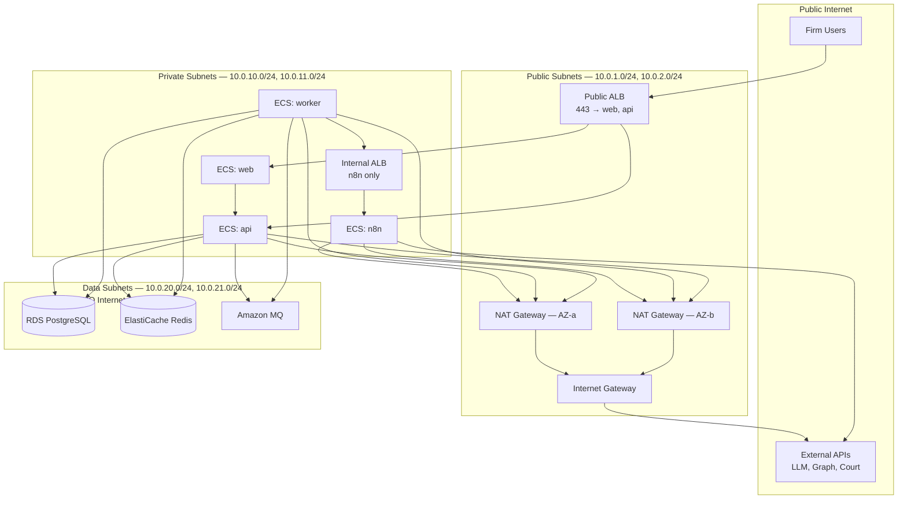
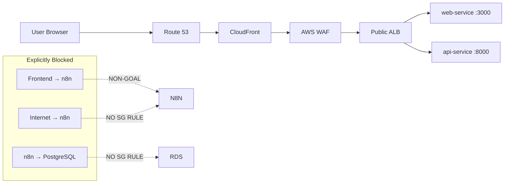
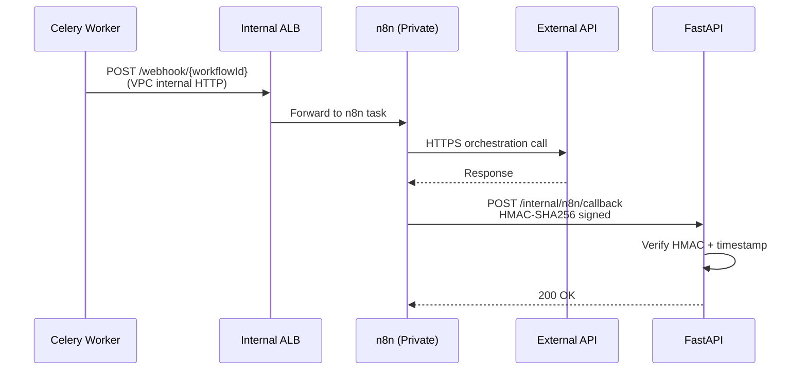
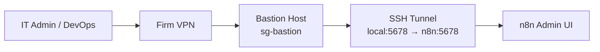
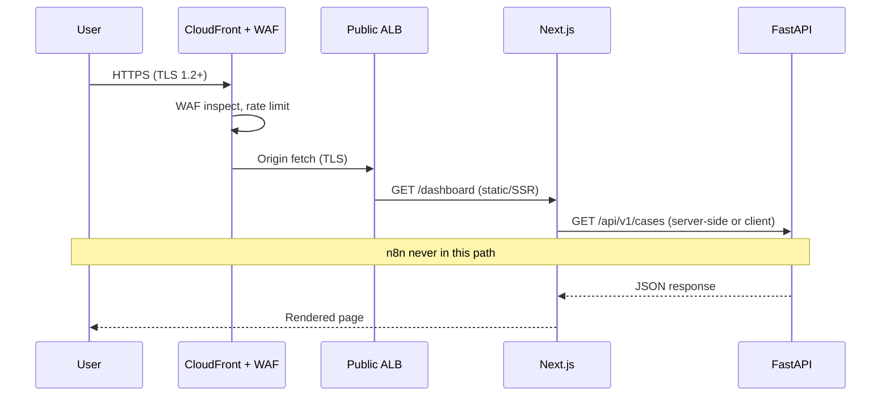
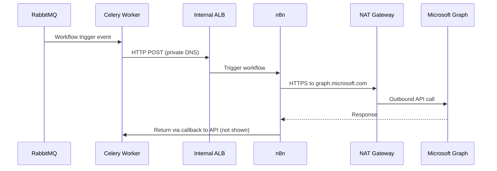

# Network Security

**LexFlow AI** — VPC, Security Groups & n8n Isolation  
**Version:** 1.0  
**Status:** Draft — Pre-Implementation  
**Last Updated:** 2026-07-06

---

## Purpose

Define the **network security architecture** for LexFlow AI deployed on AWS. This document specifies VPC topology, subnet segmentation, security group rules, n8n isolation, edge protection (CloudFront/WAF), and administrative access patterns. Network design enforces the architectural non-goals: no public n8n, no frontend-to-n8n, no n8n-to-database direct access.

---

## Scope

| In Scope | Out of Scope |
|----------|--------------|
| VPC CIDR, subnet layout, Multi-AZ | Firm office network integration |
| Security group ingress/egress rules | On-premise bare-metal deployment (non-goal) |
| n8n private orchestration isolation | n8n workflow node configuration |
| Public ALB, internal ALB, NAT gateway | DNS registrar configuration |
| CloudFront + WAF rules | CDN cache policy tuning |
| VPN/bastion admin access | Firm VPN vendor selection |
| ECS task networking | Container image build |

---

## Responsibilities

| Role | Responsibility |
|------|----------------|
| **DevOps / SRE** | Provision VPC, security groups, ALBs via Terraform |
| **Security Architect** | Approve security group changes; annual network review |
| **Backend Engineer** | Ensure API callbacks use internal endpoints only |
| **IT Administrator** | VPN/bastion access for n8n admin UI |
| **QA** | Verify n8n is unreachable from public internet in staging |

---

## Architecture

### VPC Topology

Each LexFlow deployment (dev, staging, production) runs in an **isolated VPC** within a **dedicated AWS account per firm** (single-firm deployment at launch).

```
VPC: 10.0.0.0/16 (production example)
├── Public Subnets
│   ├── 10.0.1.0/24  (us-east-1a) — ALB, NAT Gateway
│   └── 10.0.2.0/24  (us-east-1b) — ALB, NAT Gateway
├── Private Subnets (Application)
│   ├── 10.0.10.0/24 (us-east-1a) — ECS: web, api, worker, n8n
│   └── 10.0.11.0/24 (us-east-1b) — ECS: web, api, worker, n8n
└── Data Subnets (No Internet Route)
    ├── 10.0.20.0/24 (us-east-1a) — RDS, ElastiCache, Amazon MQ
    └── 10.0.21.0/24 (us-east-1b) — RDS, ElastiCache, Amazon MQ
```



### Edge Layer



**Cross-reference:** [../01-product/non-goals.md](../01-product/non-goals.md) — Public n8n, frontend-to-n8n, n8n direct DB writes are prohibited.

---

## Security Groups

Security groups follow **default deny** — only explicitly listed rules are permitted. Changes require Terraform PR and security review.

### Security Group Matrix

| Security Group | Attached To | Inbound | Outbound |
|----------------|-------------|---------|----------|
| `sg-alb-public` | Public ALB | TCP 443 from `0.0.0.0/0` | TCP to `sg-web`, `sg-api` on app ports |
| `sg-web` | web ECS tasks | TCP 3000 from `sg-alb-public` | TCP 443 to `sg-api`; HTTPS to internet (CDN assets) |
| `sg-api` | api ECS tasks | TCP 8000 from `sg-alb-public`, `sg-web` | TCP 5432 to `sg-rds`; TCP 6379 to `sg-redis`; TCP 5671 to `sg-mq`; HTTPS to AWS APIs, S3 |
| `sg-worker` | worker ECS tasks | **None** | TCP 5432 to `sg-rds`; TCP 6379 to `sg-redis`; TCP 5671 to `sg-mq`; TCP to `sg-alb-internal`; HTTPS to LLM, S3, external APIs |
| `sg-n8n` | n8n ECS tasks | TCP 5678 from `sg-worker`, `sg-api` only | HTTPS to external APIs via NAT |
| `sg-alb-internal` | Internal ALB | TCP 5678 from `sg-worker`, `sg-api` | TCP 5678 to `sg-n8n` |
| `sg-rds` | RDS PostgreSQL | TCP 5432 from `sg-api`, `sg-worker` | **None** |
| `sg-redis` | ElastiCache | TCP 6379 from `sg-api`, `sg-worker` | **None** |
| `sg-mq` | Amazon MQ | TCP 5671 from `sg-api`, `sg-worker` | **None** |
| `sg-bastion` | Bastion host | TCP 22 from firm VPN CIDR only | TCP to `sg-n8n` (admin UI port via SSH tunnel) |

### Control IDs

| ID | Control | Verification |
|----|---------|--------------|
| SEC-NET-001 | No inbound to data subnets from internet | Route table has no IGW route |
| SEC-NET-002 | n8n SG has no 0.0.0.0/0 inbound | Terraform + annual pen test |
| SEC-NET-003 | RDS accepts only api + worker SGs | Security group audit |
| SEC-NET-004 | Workers have no inbound rules | ECS service definition |
| SEC-NET-005 | n8n cannot reach RDS port 5432 | SG egress deny + no rule on sg-rds for sg-n8n |

---

## n8n Isolation

n8n is a **private orchestration tier** — not a security boundary, but a high-value target if exposed. Isolation is enforced at network, identity, and application layers.

### Isolation Controls

| Layer | Control | Rationale |
|-------|---------|-----------|
| **DNS** | No public Route 53 record for n8n | Prevents discovery |
| **Network** | Private subnet only; internal ALB | No internet ingress |
| **Security Group** | Inbound from worker + API SG only | Celery triggers workflows; API receives HMAC callbacks |
| **Frontend** | n8n URL never in client bundle or env | Non-goal: frontend-to-n8n blocked |
| **Database** | n8n SG not in sg-rds inbound | Non-goal: n8n direct DB writes blocked |
| **Credentials** | AWS Secrets Manager injection at runtime | No secrets in workflow JSON repo |
| **Admin UI** | VPN or SSH tunnel via bastion only | Workflow editing restricted to ops |
| **Callbacks** | n8n → API via HMAC-signed HTTP only | See [../04-api/webhooks-internal.md](../04-api/webhooks-internal.md) |



### n8n Admin Access Flow



**Rules:**
- n8n admin credentials stored in Secrets Manager; rotated quarterly
- Admin sessions logged in CloudTrail and bastion audit log
- Production workflow changes via CI/CD import (`deploy-n8n-workflows.yml`), not ad-hoc UI edits when possible

---

## Flow Diagrams

### Public User Request Path



### Worker → n8n → External API Path



---

## WAF Rules (CloudFront)

| Rule Set | Action | Purpose |
|----------|--------|---------|
| AWS Managed Rules — Core Rule Set | Block | OWASP Top 10 |
| AWS Managed Rules — Known Bad Inputs | Block | Common exploit patterns |
| Rate limiting — 2000 req / 5 min / IP | Block | DDoS mitigation |
| SQL injection body inspection | Block | Injection attempts |
| Request size > 10 MB (except `/documents/upload`) | Block | Oversized payload |
| Geo-blocking (optional) | Block | Firm policy — US-only if required |
| Bot control (optional, Phase 3) | Challenge/Block | Automated scraping |

---

## TLS Configuration

| Hop | Minimum Version | Certificate |
|-----|-----------------|-------------|
| Client → CloudFront | TLS 1.2 | ACM certificate |
| CloudFront → ALB | TLS 1.2 | ACM certificate |
| ALB → ECS | TLS 1.2 | Internal ACM or mTLS (Phase 3) |
| ECS → RDS | TLS 1.2 | RDS CA bundle (`verify-full`) |
| ECS → Redis | TLS 1.2 | ElastiCache in-transit encryption |
| ECS → Amazon MQ | TLS 1.2 | AMQPS |
| ECS → S3 | TLS 1.2 | AWS SDK default HTTPS |
| ECS → External APIs | TLS 1.2 | Certificate validation enabled |

See [encryption.md](./encryption.md) for full encryption specification.

---

## Network Monitoring

| Signal | Source | Alert Threshold |
|--------|--------|-----------------|
| Unusual inbound to data subnets | VPC Flow Logs | Any non-SG-matched traffic |
| n8n SG inbound from unknown source | VPC Flow Logs | Immediate P1 |
| WAF block spike | CloudWatch | > 1000 blocks / 5 min |
| NAT gateway anomaly | CloudWatch | Egress > 2× baseline |
| GuardDuty findings | GuardDuty | Critical/High → P1 |
| Security group change | CloudTrail | Any prod change → notify |

---

## Best Practices

1. **Terraform-only network changes** — No manual SG edits in production.
2. **Verify n8n isolation in staging** — `curl` from public internet must fail; from worker task must succeed.
3. **No n8n URL in frontend env** — Build-time check in CI.
4. **Separate ALBs** — Public ALB never routes to n8n target group.
5. **Data subnets have no NAT** — RDS, Redis, MQ cannot initiate outbound internet.
6. **Multi-AZ minimum** — All tiers span 2+ availability zones.
7. **Annual network pen test** — Include n8n exposure and matter wall bypass attempts.

---

## Tradeoffs

| Decision | Benefit | Cost |
|----------|---------|------|
| Internal ALB for n8n | Clean separation from public ALB | Additional ALB cost |
| No NAT on data subnets | Strongest data layer isolation | Manual patch via VPC endpoints if needed |
| Bastion for n8n admin | No public admin surface | VPN dependency for ops |
| Dedicated VPC per environment | Blast radius containment | Terraform duplication |
| Worker-only n8n trigger | API cannot be abused to trigger arbitrary workflows | Worker must be healthy for orchestration |

---

## Future Improvements

| Phase | Enhancement |
|-------|-------------|
| Phase 2 | AWS PrivateLink for LLM providers (Azure OpenAI) |
| Phase 3 | mTLS between ALB and ECS tasks |
| Phase 3 | VPC endpoints for S3, Secrets Manager (reduce NAT egress) |
| Phase 4 | Network Firewall for egress domain allowlisting |
| Year 2 | Zero-trust bastion replacement (AWS SSM Session Manager) |

---

## References

- [../01-product/non-goals.md](../01-product/non-goals.md) — n8n isolation non-goals
- [../03-architecture/container-architecture.md](../03-architecture/container-architecture.md) — Container deployment topology
- [../deployment-architecture.md](../deployment-architecture.md) — ECS services, Terraform structure
- [../04-api/webhooks-internal.md](../04-api/webhooks-internal.md) — n8n HMAC callbacks
- [threat-model.md](./threat-model.md) — T-004 n8n exposure threat
- [encryption.md](./encryption.md) — TLS requirements
- [secrets-management.md](./secrets-management.md) — n8n credential injection
- [ADR-002](../13-decisions/002-n8n-orchestration-only.md) — n8n orchestration boundary
