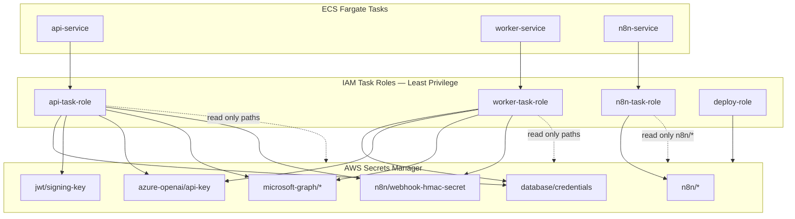
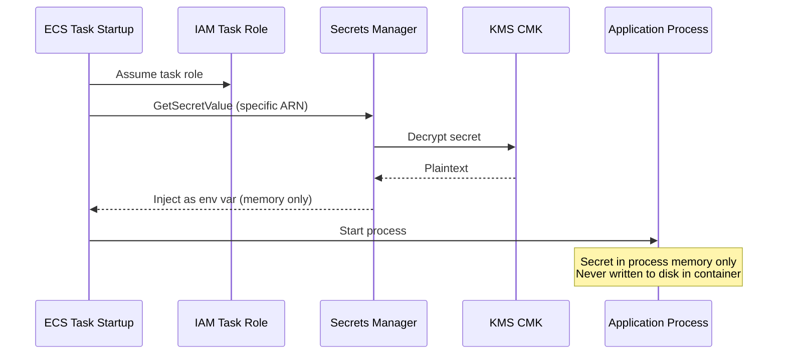
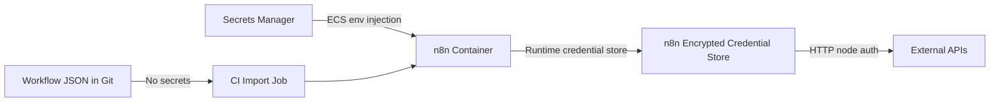
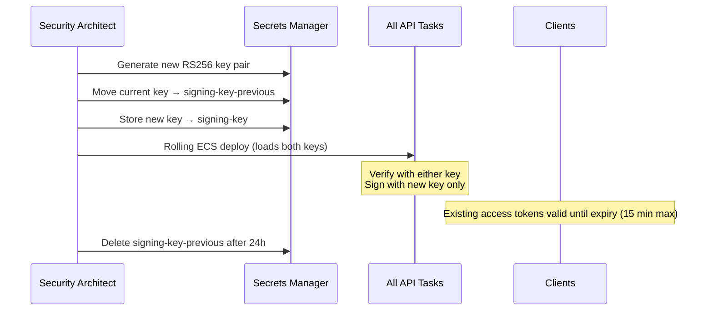
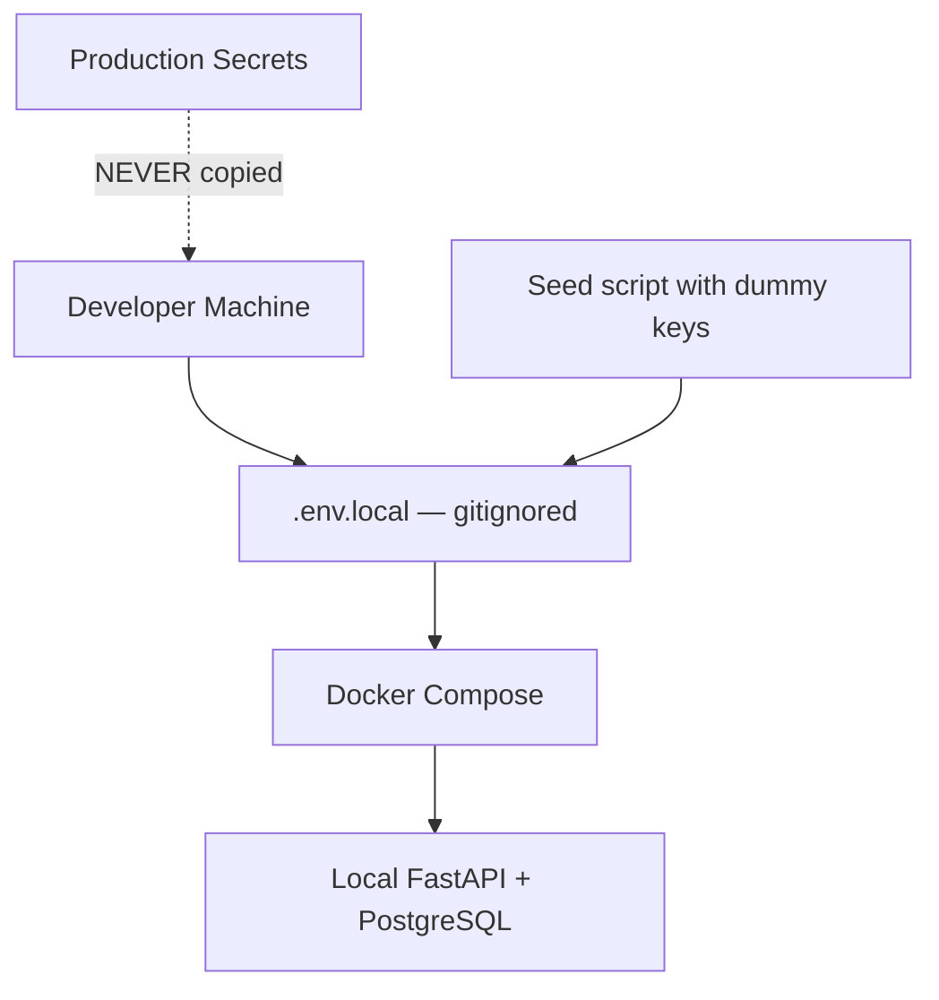
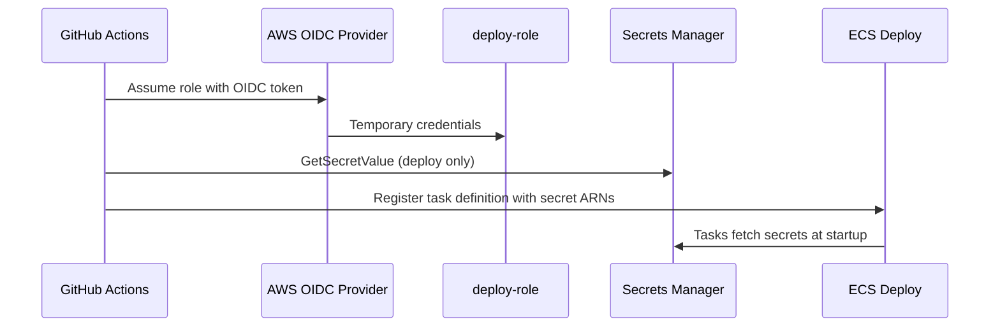

# Secrets Management

**LexFlow AI** — AWS Secrets Manager  
**Version:** 1.0  
**Status:** Draft — Pre-Implementation  
**Last Updated:** 2026-07-06

---

## Purpose

Define how LexFlow AI stores, accesses, rotates, and audits **secrets and credentials** using **AWS Secrets Manager**. LexFlow handles attorney-client privileged data; leaked credentials are a critical breach vector. This document establishes the secrets hierarchy, IAM access model, rotation procedures, and n8n credential injection patterns.

**Golden rule:** No secrets in source code, workflow JSON, environment files committed to git, or application logs.

---

## Scope

| In Scope | Out of Scope |
|----------|--------------|
| AWS Secrets Manager hierarchy and naming | Firm employee password management (Entra ID) |
| ECS task IAM roles for secret access | Developer local `.env` files (local dev only) |
| Rotation schedules and ceremonies | Hardware security module (HSM) — future |
| n8n runtime credential injection | n8n workflow business logic |
| JWT signing keys, DB credentials, API keys | Client-side secret storage |
| Secret access audit (CloudTrail) | Third-party vendor internal secrets |

---

## Responsibilities

| Role | Responsibility |
|------|----------------|
| **DevOps / SRE** | Provision Secrets Manager resources in Terraform |
| **Security Architect** | Approve IAM policies; rotation schedule |
| **Backend Engineer** | Load secrets at startup; never hardcode |
| **IT Administrator** | Execute rotation ceremonies; verify n8n credential sync |
| **All Contributors** | Pre-commit hooks block secret patterns; report leaks immediately |

---

## Architecture

### Secrets Hierarchy

```
AWS Secrets Manager (per environment: dev | staging | production)
├── {env}/database/credentials          # RDS master + app user
├── {env}/redis/auth-token              # ElastiCache AUTH token
├── {env}/rabbitmq/credentials          # Amazon MQ broker credentials
├── {env}/jwt/signing-key               # RS256 private key (PEM)
├── {env}/jwt/signing-key-previous       # Overlap during rotation
├── {env}/jwt/public-key                # RS256 public key (verification)
├── {env}/openai/api-key                # OpenAI fallback
├── {env}/azure-openai/api-key          # Primary LLM (firm Azure)
├── {env}/azure-openai/endpoint         # Azure OpenAI endpoint URL
├── {env}/anthropic/api-key             # Contract review (optional)
├── {env}/n8n/encryption-key            # n8n credential encryption
├── {env}/n8n/admin-credentials         # n8n admin UI login
├── {env}/n8n/webhook-hmac-secret       # API callback HMAC shared secret
├── {env}/microsoft-graph/client-id     # Graph API app registration
├── {env}/microsoft-graph/client-secret # Graph API secret
├── {env}/microsoft-graph/tenant-id     # Firm M365 tenant
├── {env}/email/smtp-credentials        # Transactional email (if not Graph)
└── {env}/clamav/api-key                # Virus scan service (optional)
```



### KMS Integration

All secrets encrypted with CMK `alias/lexflow-secrets`. See [encryption.md](./encryption.md).

---

## Secret Access by Service

| Secret Path | api-service | worker-service | n8n-service | deploy-role |
|-------------|:-----------:|:--------------:|:-----------:|:-----------:|
| `database/credentials` | ✓ | ✓ | ✗ | ✓ |
| `redis/auth-token` | ✓ | ✓ | ✗ | ✓ |
| `rabbitmq/credentials` | ✓ | ✓ | ✗ | ✓ |
| `jwt/signing-key` | ✓ | ✗ | ✗ | ✓ |
| `jwt/public-key` | ✓ | ✗ | ✗ | ✓ |
| `azure-openai/*` | ✓ | ✓ | ✗ | ✓ |
| `openai/api-key` | ✓ | ✓ | ✗ | ✓ |
| `n8n/encryption-key` | ✗ | ✗ | ✓ | ✓ |
| `n8n/admin-credentials` | ✗ | ✗ | ✓ | ✓ |
| `n8n/webhook-hmac-secret` | ✓ | ✓ | ✗ | ✓ |
| `microsoft-graph/*` | ✓ | ✓ | ✗ | ✓ |

**Critical:** n8n service role has **no access** to database credentials — enforces non-goal of n8n direct DB writes. See [../01-product/non-goals.md](../01-product/non-goals.md).

---

## Injection at Runtime

### ECS Task Definition Pattern

Secrets are referenced in ECS task definitions — never baked into Docker images.

```yaml
# Conceptual task definition (Terraform renders this)
secrets:
  - name: DATABASE_URL
    valueFrom: arn:aws:secretsmanager:us-east-1:ACCOUNT:secret:prod/database/credentials:url::
  - name: JWT_PRIVATE_KEY
    valueFrom: arn:aws:secretsmanager:us-east-1:ACCOUNT:secret:prod/jwt/signing-key:private_key::
  - name: AZURE_OPENAI_API_KEY
    valueFrom: arn:aws:secretsmanager:us-east-1:ACCOUNT:secret:prod/azure-openai/api-key:key::
```



### Application Startup Rules

| Rule | Implementation |
|------|----------------|
| Load secrets once at startup | FastAPI lifespan handler |
| Fail fast if secret missing | Exit non-zero; ECS restarts task |
| Never log secret values | Redact in structured logging |
| Cache in memory only | No Redis cache of secrets |
| JWT public key hot-reload | Poll `signing-key-previous` during rotation window |

**Cross-reference:** [../04-api/authentication.md](../04-api/authentication.md) — JWT keys loaded from Secrets Manager.

---

## n8n Credential Injection

n8n workflows must **not** contain secrets in exported JSON. Credentials are injected at deploy time.

### n8n Secret Flow



| Rule | Enforcement |
|------|-------------|
| No API keys in workflow JSON | Pre-commit hook; CI scan |
| n8n credentials reference Secrets Manager env vars | Deploy script maps env → n8n credential |
| Workflow export strips credentials | `deploy-n8n-workflows.yml` sanitizes |
| n8n encryption key in Secrets Manager | Protects n8n internal credential store |

### HMAC Webhook Secret

Shared secret for n8n → API callbacks:

| Property | Value |
|----------|-------|
| Path | `{env}/n8n/webhook-hmac-secret` |
| Algorithm | HMAC-SHA256 |
| Header | `X-LexFlow-Signature: sha256={hex}` |
| Timestamp | `X-LexFlow-Timestamp` — reject if > 5 min skew |
| Consumers | api-service, worker-service (verification) |
| Producers | n8n HTTP Request nodes calling `/internal/*` |

See [../04-api/webhooks-internal.md](../04-api/webhooks-internal.md).

---

## Rotation Policy

### Rotation Schedule

| Secret | Frequency | Method | Downtime |
|--------|-----------|--------|----------|
| Database password | Quarterly + on deploy | Secrets Manager rotation Lambda | Zero — connection pool refresh |
| Redis AUTH token | Quarterly | Manual + rolling ECS deploy | Zero |
| RabbitMQ credentials | Quarterly | Manual + rolling deploy | Zero |
| JWT RS256 key pair | Quarterly | Dual-key overlap (24h window) | Zero |
| LLM API keys | Quarterly | Manual; update SM + redeploy | Zero |
| n8n encryption key | Quarterly | Manual; n8n credential re-encrypt | Brief n8n restart |
| HMAC webhook secret | Quarterly | Dual-secret overlap (48h) | Zero |
| Microsoft Graph client secret | Per Azure policy (max 24 months) | Azure portal + SM update | Zero |
| n8n admin password | Quarterly | Manual | Admin re-login |

### JWT Key Rotation Ceremony



### Emergency Rotation (Compromise)

Trigger: suspected leak, GuardDuty finding, employee termination with access.

| Step | Action | Timeline |
|------|--------|----------|
| 1 | Revoke compromised secret in Secrets Manager (disable version) | Immediate |
| 2 | Generate new secret value | < 15 min |
| 3 | Rolling deploy all affected ECS services | < 30 min |
| 4 | Revoke all user refresh tokens if JWT key compromised | Immediate |
| 5 | Audit CloudTrail for secret access during exposure window | < 4 hours |
| 6 | Document in incident response log | < 24 hours |

See [incident-response.md](./incident-response.md).

---

## Flow Diagrams

### Developer Local Development



**Rules for local dev:**
- `.env.example` contains key names only — no values
- Dummy JWT keys generated locally (`openssl genrsa`)
- Never copy production secrets to developer machines
- Pre-commit hook scans for AWS key patterns, PEM blocks, high-entropy strings

### CI/CD Secret Access



GitHub Actions uses **OIDC federation** — no long-lived AWS access keys in GitHub secrets.

---

## Audit & Monitoring

| Event | Source | Alert |
|-------|--------|-------|
| GetSecretValue | CloudTrail | Unusual IAM principal |
| PutSecretValue | CloudTrail | Any production change → P2 |
| DeleteSecret | CloudTrail | Immediate P1 |
| Failed GetSecretValue (access denied) | CloudTrail | Possible misconfiguration or attack |
| Secret nearing expiration | Secrets Manager | 30-day warning |

CloudTrail logs retained 7 years in S3 (SSE-KMS, Object Lock optional).

---

## Prohibited Patterns

| Anti-Pattern | Why Prohibited | Correct Pattern |
|--------------|----------------|-----------------|
| Secrets in n8n workflow JSON | Leaks via git | Secrets Manager + env injection |
| Secrets in Terraform `.tfvars` committed | Leaks via git | TF Cloud variables or SM data source |
| Secrets in Docker image layers | Image registry exposure | ECS secrets injection |
| Secrets in CloudWatch logs | Log aggregation exposure | Redaction middleware |
| Shared secret across environments | Staging breach → prod compromise | Separate SM paths per env |
| Embedding API keys in frontend | Public exposure | BFF proxy via FastAPI only |

**Cross-reference:** [../01-product/non-goals.md](../01-product/non-goals.md) — Explicit anti-patterns list.

---

## Best Practices

1. **Least privilege IAM** — Task roles access only required secret paths.
2. **Separate secrets per environment** — No shared prod/staging credentials.
3. **Automate rotation where possible** — RDS via Secrets Manager Lambda.
4. **Dual-key overlap for JWT** — Zero-downtime rotation.
5. **Scan CI artifacts** — Trivy secret scanning; gitleaks on every PR.
6. **Never echo secrets in error messages** — Generic "configuration error" only.
7. **Quarterly access review** — Audit IAM policies against this document.

---

## Tradeoffs

| Decision | Benefit | Cost |
|----------|---------|------|
| Secrets Manager vs SSM Parameter Store | Automatic rotation; cross-region replication | Higher cost per secret |
| ECS env injection vs sidecar | Simple; native ECS support | Secret visible in task definition ARN (not value) |
| OIDC for CI vs static keys | No long-lived CI credentials | OIDC setup complexity |
| n8n separate IAM role | Blast radius containment | More IAM policies to maintain |
| Quarterly rotation | Compliance alignment | Rotation ceremony overhead |

---

## Future Improvements

| Phase | Enhancement |
|-------|-------------|
| Phase 2 | Automatic rotation for all database-connected secrets |
| Phase 3 | Secrets Manager cross-region replication for DR |
| Phase 3 | Dynamic secrets (HashiCorp Vault pattern) if multi-cloud |
| Phase 4 | Hardware-backed keys (CloudHSM) for JWT signing |
| Year 2 | Secret access anomaly detection (GuardDuty + custom ML) |

---

## References

- [encryption.md](./encryption.md) — KMS CMK for Secrets Manager
- [network-security.md](./network-security.md) — IAM task roles, network isolation
- [../04-api/authentication.md](../04-api/authentication.md) — JWT signing key usage
- [../04-api/webhooks-internal.md](../04-api/webhooks-internal.md) — HMAC secret
- [../01-product/non-goals.md](../01-product/non-goals.md) — No secrets in n8n JSON
- [incident-response.md](./incident-response.md) — Emergency rotation procedures
- [threat-model.md](./threat-model.md) — T-015 secrets exposure
- [AWS Secrets Manager Best Practices](https://docs.aws.amazon.com/secretsmanager/latest/userguide/best-practices.html)
