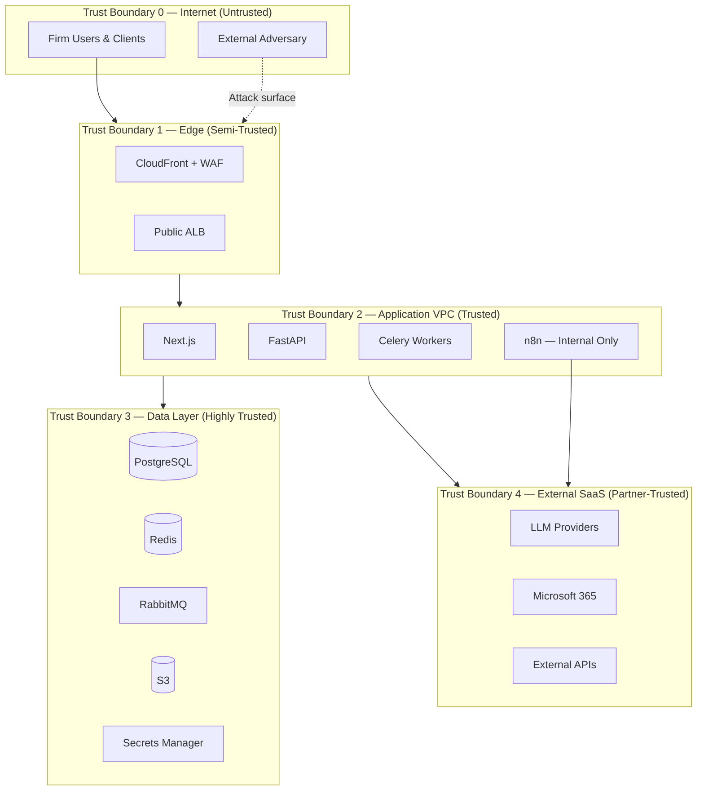
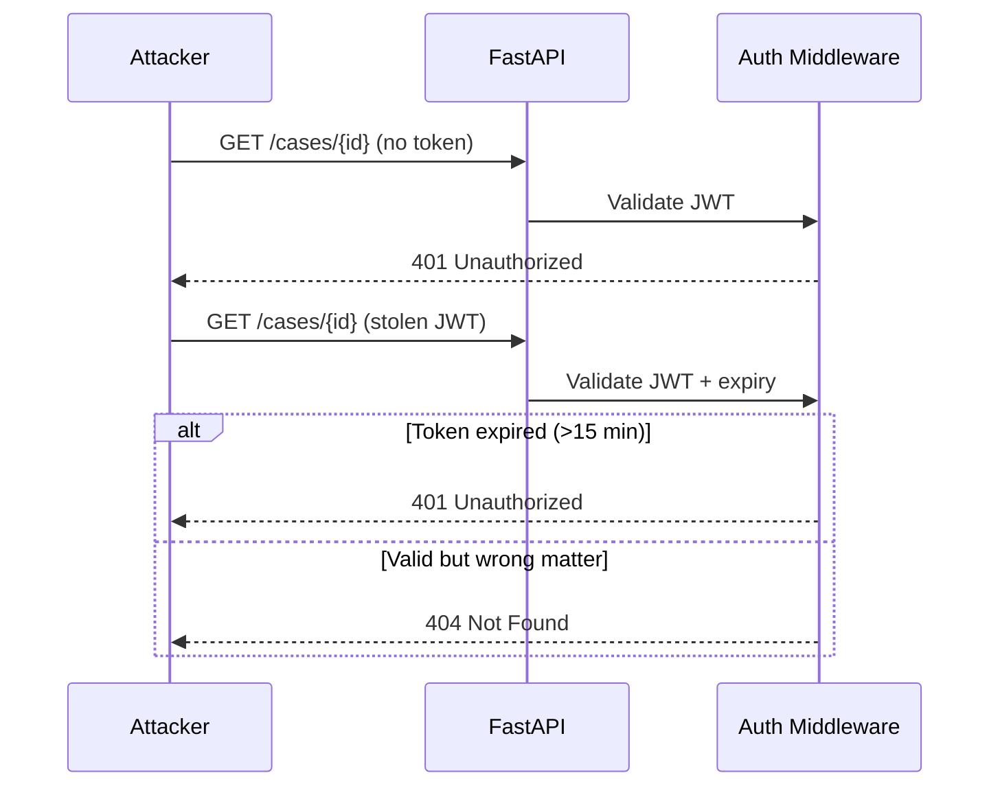
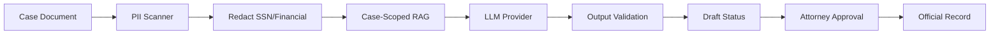
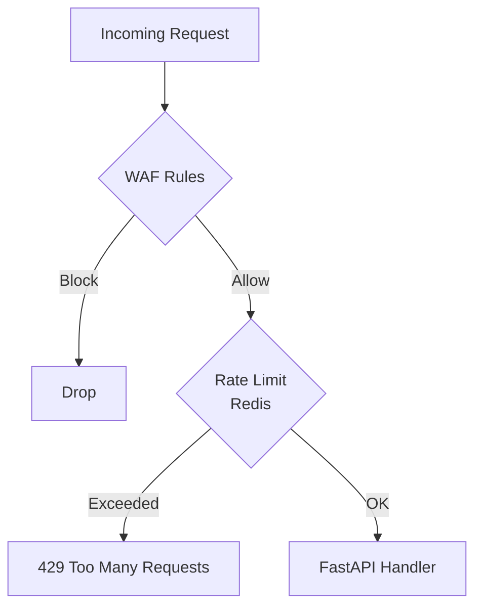
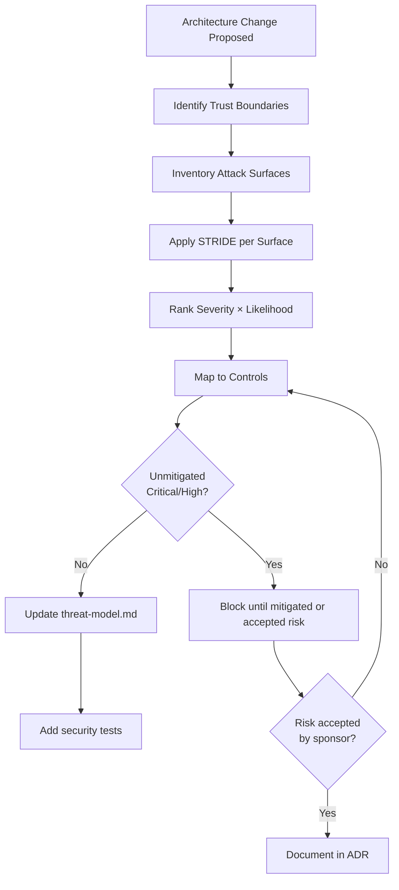
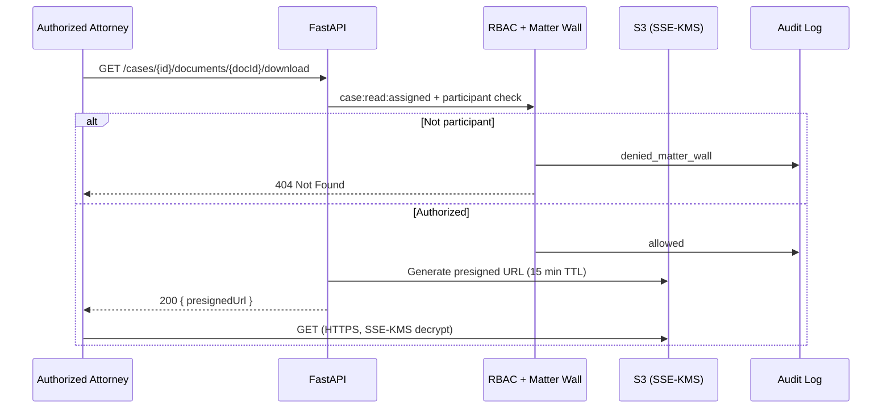

# Threat Model — STRIDE Analysis

**LexFlow AI** — Enterprise Threat Modeling  
**Version:** 1.0  
**Status:** Draft — Pre-Implementation  
**Last Updated:** 2026-07-06

---

## Purpose

Define the **formal threat model** for LexFlow AI using Microsoft's **STRIDE** methodology (Spoofing, Tampering, Repudiation, Information Disclosure, Denial of Service, Elevation of Privilege). LexFlow handles attorney-client privileged information for large US law firms; this document identifies threats, trust boundaries, attack surfaces, and required mitigations.

Threat modeling is a living artifact — update this document when architecture, integrations, or attack surfaces change.

---

## Scope

| In Scope | Out of Scope |
|----------|--------------|
| STRIDE analysis per trust boundary | Penetration test execution |
| Attack surface inventory | Raw vulnerability scan output |
| Threat-to-control mapping | Firm-specific cyber insurance requirements |
| Insider and external adversary scenarios | Physical security of firm offices |
| AI-specific threats (prompt injection, exfiltration) | Consumer mobile app threats (non-goal) |

**Assumed adversaries:** External attackers, malicious insiders, compromised credentials, supply chain compromise, and curious but unauthorized firm employees attempting cross-matter access.

---

## Responsibilities

| Role | Responsibility |
|------|----------------|
| **Security Architect** | Maintain STRIDE matrix; lead threat modeling sessions |
| **Engineering Lead** | Ensure mitigations are implemented and tested |
| **Backend Engineer** | Implement auth, RBAC, matter walls per threat requirements |
| **DevOps / SRE** | Network isolation, WAF, GuardDuty per network threats |
| **Compliance Officer** | Validate ethical/conflict threats are addressed |
| **QA** | Automated matter wall and auth tests in CI |

---

## Architecture

### Trust Boundaries

### Attack Surface Inventory

| Surface | Exposure | Authentication | Primary STRIDE Categories |
|---------|----------|----------------|---------------------------|
| Public REST API (`/api/v1/*`) | Internet via CloudFront | JWT Bearer | S, T, I, D, E |
| Auth endpoints (`/auth/*`) | Internet | Public (login) / Cookie | S, D |
| Internal webhooks (`/internal/*`) | VPC + HMAC | HMAC signature | S, T, I |
| n8n admin UI | VPN/bastion only | n8n credentials | S, E, I |
| n8n workflow triggers | Workers SG only | Internal ALB | S, T |
| PostgreSQL | Data subnet only | TLS + IAM auth | T, I, E |
| S3 document bucket | Presigned URLs only | IAM + presigned | I, T |
| LLM API calls | Outbound HTTPS | API key (Secrets Manager) | I, T |
| CI/CD pipeline | GitHub Actions | OIDC to AWS | T, E |
| Audit log table | API/workers only | Append-only DB role | R, T |

**Explicitly excluded attack surfaces (non-goals):** Public n8n, frontend-to-n8n direct calls, n8n-to-PostgreSQL direct writes. See [../01-product/non-goals.md](../01-product/non-goals.md).

---

## STRIDE Analysis

### Summary Matrix

| ID | Threat | STRIDE | Severity | Likelihood | Mitigation Status |
|----|--------|--------|----------|------------|-------------------|
| T-001 | Stolen JWT access token | S | High | Medium | Designed — short TTL (15 min) |
| T-002 | Stolen refresh token | S | High | Low | Designed — httpOnly, rotation |
| T-003 | Credential stuffing / brute force | S | High | High | Designed — lockout after 5 attempts |
| T-004 | n8n public exposure bypass | S, I | Critical | Low | Designed — private subnet, no DNS |
| T-005 | Cross-matter data access | I, E | Critical | Medium | Designed — matter walls + 404 |
| T-006 | AI prompt injection / exfiltration | T, I | High | Medium | Designed — scoped RAG, PII redaction |
| T-007 | SQL injection | T | High | Low | Designed — SQLAlchemy ORM |
| T-008 | XSS in frontend / AI output | T, I | High | Medium | Designed — CSP, DOMPurify |
| T-009 | CSRF on state-changing forms | T | Medium | Low | Designed — SameSite, CSRF tokens |
| T-010 | Privilege escalation via client | E | Critical | Medium | Designed — server-side RBAC only |
| T-011 | Audit log tampering | R, T | High | Low | Designed — append-only, separate role |
| T-012 | DDoS on public API | D | Medium | Medium | Designed — WAF, rate limits, ALB |
| T-013 | Supply chain / dependency attack | T | High | Medium | Designed — Dependabot, Trivy |
| T-014 | Insider exfiltration | I | Critical | Low | Designed — audit, least privilege |
| T-015 | Secrets in repo / logs | I | Critical | Low | Designed — Secrets Manager, redaction |
| T-016 | HMAC webhook replay | T, S | Medium | Low | Designed — timestamp + nonce |
| T-017 | Case ID enumeration | I | Medium | Medium | Designed — 404 on matter wall deny |
| T-018 | Unreviewed AI to official record | T | High | Medium | Designed — draft status, approval gate |

---

### Spoofing (S)

**Definition:** Pretending to be something or someone else.

| Threat | Scenario | Mitigation | Control ID |
|--------|----------|------------|------------|
| **T-001** Stolen access token | Attacker intercepts JWT from memory/XSS | 15-minute TTL; memory-only storage; CSP | SEC-AUTH-001 |
| **T-002** Stolen refresh token | XSS or physical access to browser | httpOnly Secure SameSite=Strict cookie; rotation on use | SEC-AUTH-002 |
| **T-003** Brute force login | Automated password guessing | 5 attempts → 15 min lockout; bcrypt cost 12 | SEC-AUTH-003 |
| **T-004** n8n impersonation | Attacker triggers n8n without auth | Private subnet; workers-only ingress; no public DNS | SEC-NET-004 |
| **T-016** Webhook spoofing | Fake n8n callback to API | HMAC-SHA256 signature; timestamp window; shared secret in Secrets Manager | SEC-AUTH-016 |

**Cross-reference:** [../04-api/authentication.md](../04-api/authentication.md) — JWT structure, refresh rotation, session policy.

---

### Tampering (T)

**Definition:** Modifying data or code without authorization.

| Threat | Scenario | Mitigation | Control ID |
|--------|----------|------------|------------|
| **T-006** AI prompt injection | Malicious text in document causes LLM to leak data | Input length limits; PII redaction; case-scoped RAG only | SEC-AI-001 |
| **T-007** SQL injection | Crafted query parameters | SQLAlchemy parameterized queries; Pydantic validation | SEC-APP-001 |
| **T-008** XSS | AI-generated HTML executes script | DOMPurify; React auto-escape; strict CSP | SEC-APP-002 |
| **T-009** CSRF | Forged request from malicious site | SameSite=Strict cookies; CSRF token on forms | SEC-APP-003 |
| **T-011** Audit log modification | Attacker alters access history | Append-only table; INSERT-only DB role; no app DELETE | SEC-AUDIT-001 |
| **T-013** Dependency tampering | Compromised npm/PyPI package | Dependabot; pinned versions; Trivy CRITICAL block | SEC-SUPPLY-001 |
| **T-018** Unapproved AI output | AI summary auto-published | Draft status mandatory; attorney approval gate | SEC-AI-002 |

**Cross-reference:** [../01-product/non-goals.md](../01-product/non-goals.md) — No unattended AI to DMS; human-in-the-loop mandatory.

---

### Repudiation (R)

**Definition:** Denying having performed an action.

| Threat | Scenario | Mitigation | Control ID |
|--------|----------|------------|------------|
| **T-011** Audit denial | User claims they didn't access a case | Immutable audit log with actor, timestamp, resource, outcome | SEC-AUDIT-001 |
| **T-011** Log deletion | Admin covers tracks | Separate audit DB role; CloudWatch export; optional S3 Object Lock | SEC-AUDIT-002 |
| Auth event denial | User denies login from unknown location | Login events logged with IP, user agent, correlation ID | SEC-AUDIT-003 |

**Audit events (minimum):**

| Event Category | Logged Fields |
|----------------|---------------|
| Authentication | userId, outcome, IP, userAgent, correlationId |
| Authorization denial | userId, permission, resourceId, outcome (denied_rbac / denied_matter_wall) |
| Document access | userId, documentId, caseId, action (view/download) |
| AI invocation | userId, caseId, promptHash, modelId, tokenCount |
| Admin actions | actorId, action, targetUserId, before/after |
| n8n callback | workflowId, correlationId, HMAC valid/invalid |

---

### Information Disclosure (I)

**Definition:** Exposing information to unauthorized parties.

| Threat | Scenario | Mitigation | Control ID |
|--------|----------|------------|------------|
| **T-005** Cross-matter access | Attorney on Case A reads Case B | Matter walls; participant check; 404 on deny | SEC-ABAC-001 |
| **T-006** AI data exfiltration | Prompt tricks LLM to reveal other cases | Case-scoped retrieval; no cross-matter context | SEC-AI-003 |
| **T-017** Case ID enumeration | Attacker probes UUIDs, learns case existence | 404 (not 403) on matter wall violation | SEC-ABAC-002 |
| **T-004** n8n data leak | Public n8n exposes workflow payloads | Private subnet; no public ALB; VPN admin only | SEC-NET-004 |
| **T-015** Secrets in logs | JWT or API key logged | Structured logging with Authorization redaction | SEC-SEC-001 |
| **T-014** Insider bulk export | Employee downloads all cases | Audit on downloads; rate limits; least privilege | SEC-AUDIT-004 |
| Database breach | RDS snapshot stolen | Encryption at rest (KMS); TLS in transit | SEC-ENC-001 |

**Cross-reference:** [matter-walls.md](./matter-walls.md), [encryption.md](./encryption.md), [../04-api/authorization-rbac.md](../04-api/authorization-rbac.md).

---

### Denial of Service (D)

**Definition:** Degrading or denying service to legitimate users.

| Threat | Scenario | Mitigation | Control ID |
|--------|----------|------------|------------|
| **T-012** API flood | DDoS on public endpoints | CloudFront + WAF; rate limit 2000 req/5min/IP | SEC-NET-012 |
| **T-012** Expensive AI abuse | User triggers unlimited AI jobs | Per-user AI rate limits; token metering; approval gates | SEC-AI-004 |
| Worker queue flood | Malicious workflow triggers | Queue depth alerts; max concurrent jobs per user | SEC-OPS-001 |
| Database connection exhaustion | Connection pool attack | PgBouncer; connection limits; query timeouts | SEC-OPS-002 |

---

### Elevation of Privilege (E)

**Definition:** Gaining capabilities without proper authorization.

| Threat | Scenario | Mitigation | Control ID |
|--------|----------|------------|------------|
| **T-010** Client-side role claim | Frontend sends `roles: ["SystemAdmin"]` | Roles in JWT are UX hints only; server resolves from DB | SEC-AUTH-010 |
| **T-010** Parameter tampering | User changes `firmId` in request | firmId from JWT only; never from request body | SEC-AUTH-011 |
| Participant role escalation | Paralegal adds self as lead | Requires existing lead + case:write:assigned | SEC-ABAC-003 |
| n8n privilege bypass | n8n writes directly to DB | Security groups block n8n → RDS; non-goal enforced | SEC-NET-005 |
| IAM over-permission | ECS task can access all secrets | Task-specific IAM roles; Secrets Manager path scoping | SEC-SEC-002 |

**Cross-reference:** [../04-api/authorization-rbac.md](../04-api/authorization-rbac.md) — Permission matrix, participant roles.

---

## Flow Diagrams

### Threat Modeling Session Workflow

### Data Flow — Privileged Document Access

---

## Risk Acceptance Criteria

| Severity | Acceptance Authority | Required Documentation |
|----------|---------------------|------------------------|
| Critical | Not acceptable in production | Must mitigate before launch |
| High | Security Architect + Managing Partner | ADR with compensating controls |
| Medium | Security Architect | Document in threat-model.md |
| Low | Engineering Lead | Track in backlog |

---

## Best Practices

1. **Re-run STRIDE** when adding external integrations, new API surfaces, or AI capabilities.
2. **Test matter walls in every PR** — automated integration tests per role × case endpoint.
3. **Assume breach** — design for containment (token revocation, secret rotation).
4. **Never trust the client** for roles, firmId, or case access decisions.
5. **Red team n8n isolation** annually — verify no public DNS, no frontend references.
6. **Include AI-specific threats** — prompt injection and cross-matter RAG are in scope.
7. **Link threats to controls** — use Control IDs in implementation tickets.

---

## Tradeoffs

| Decision | Security Benefit | Residual Risk |
|----------|-----------------|---------------|
| 404 on matter wall | Prevents enumeration | Attacker cannot distinguish "no case" vs "no access" |
| Short JWT TTL (15 min) | Limits stolen token window | More refresh traffic |
| Private n8n only | Minimal orchestration attack surface | Ops complexity for workflow editing |
| Case-scoped RAG only | Ethical wall enforcement | Cannot cross-reference firm knowledge base across matters |
| Append-only audit | Tamper evidence | No correction of erroneous log entries |

---

## Future Improvements

| Phase | Enhancement |
|-------|-------------|
| Phase 2 | Automated threat model diff in CI (new routes → STRIDE check) |
| Phase 3 | Entra ID conditional access threat mapping |
| Phase 3 | Bug bounty program (private, firm-approved) |
| Year 2 | Third-party penetration test; update STRIDE from findings |
| Phase 4 | OPA policy engine threat analysis for complex ABAC |

---

## References

- [../04-api/authentication.md](../04-api/authentication.md) — JWT, refresh, brute-force protection
- [../04-api/authorization-rbac.md](../04-api/authorization-rbac.md) — RBAC matrix, matter walls
- [../01-product/non-goals.md](../01-product/non-goals.md) — Forbidden attack surfaces
- [network-security.md](./network-security.md) — VPC, n8n isolation controls
- [matter-walls.md](./matter-walls.md) — ABAC ethical walls
- [encryption.md](./encryption.md) — Data protection controls
- [incident-response.md](./incident-response.md) — Response to realized threats
- [Microsoft STRIDE Threat Modeling](https://learn.microsoft.com/en-us/azure/security/develop/threat-modeling-tool-threats)
