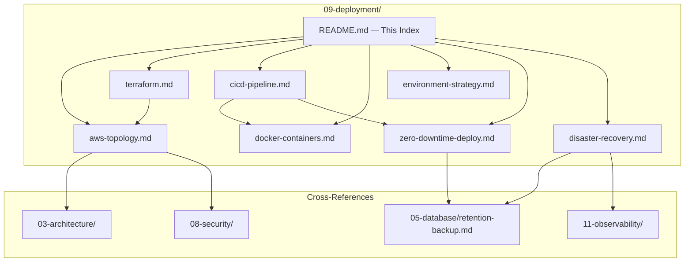
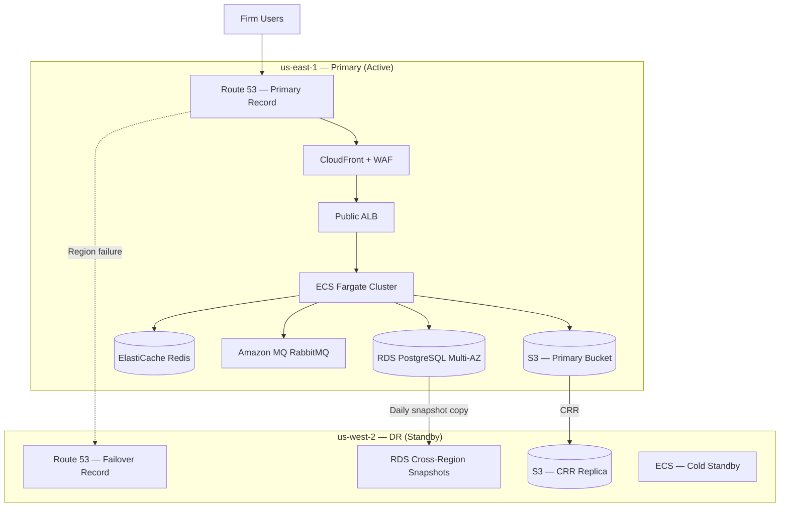
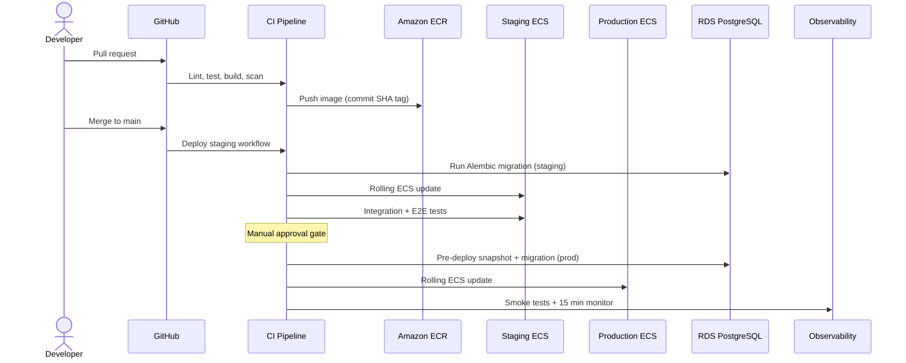

# LexFlow AI — Deployment Documentation

**LexFlow AI** — AWS Infrastructure, CI/CD & Operations Index  
**Version:** 1.0  
**Status:** Draft — Pre-Implementation  
**Last Updated:** 2026-07-06

---

## Purpose

This directory is the **authoritative deployment reference** for LexFlow AI — the enterprise AI automation platform for large US law firms. DevOps engineers, SREs, security reviewers, and solution architects use these documents to provision AWS infrastructure, configure CI/CD pipelines, execute zero-downtime releases, and operate disaster recovery procedures.

Deployment targets **99.9% availability** with **us-east-1** as the primary region and **us-west-2** as the disaster recovery standby.

---

## Scope

| In Scope | Out of Scope |
|----------|--------------|
| AWS topology — VPC, ECS Fargate, RDS, ElastiCache, Amazon MQ, S3, ALB, CloudFront | Application source code |
| Terraform module structure and state management | Firm-specific contract language |
| GitHub Actions CI/CD pipelines and PR gates | Penetration test execution |
| Docker multi-stage builds and local Compose | n8n workflow node configuration |
| Environment strategy — local, dev, staging, production | Cost optimization spreadsheets |
| Zero-downtime deployment and migration coordination | Legal SLA terms |
| HA, DR, RPO/RTO, backup, and failover procedures | Vendor SOC 2 report contents |

---

## Responsibilities

| Role | Responsibility |
|------|----------------|
| **DevOps / SRE** | Maintain Terraform, CI/CD, ECS services, DR runbooks |
| **Backend Engineer** | Ensure migrations are backward-compatible; health check endpoints |
| **Security Architect** | Review WAF rules, security groups, secrets rotation |
| **DBA / SRE** | RDS sizing, backup verification, PITR execution |
| **On-Call Engineer** | Execute deploys, incident response, DR failover |
| **Release Manager** | Approve production deployments; coordinate maintenance windows |

---

## Architecture

### Deployment Documentation Map

### Regional Deployment Overview

---

## Document Index

| Document | Description | Primary Audience |
|----------|-------------|------------------|
| [aws-topology.md](./aws-topology.md) | VPC design, subnet layout, ECS services, data layer, edge stack | DevOps, SRE, Security |
| [terraform.md](./terraform.md) | Module structure, state backends, workspace strategy, IAM | DevOps, SRE |
| [cicd-pipeline.md](./cicd-pipeline.md) | GitHub Actions workflows, PR gates, staging/prod promotion | DevOps, Backend |
| [docker-containers.md](./docker-containers.md) | Multi-stage builds, image tagging, local Compose stack | All Engineers |
| [environment-strategy.md](./environment-strategy.md) | Local, dev, staging, production isolation and promotion | DevOps, QA |
| [zero-downtime-deploy.md](./zero-downtime-deploy.md) | Rolling updates, migration ordering, rollback | DevOps, Backend, DBA |
| [disaster-recovery.md](./disaster-recovery.md) | HA matrix, RPO/RTO, failover runbooks, backup verification | SRE, On-Call |

---

## NFR Summary

| Metric | Target | Primary Document |
|--------|--------|------------------|
| Availability | 99.9% (≤ 8.76 h downtime/year) | [disaster-recovery.md](./disaster-recovery.md) |
| RPO | ≤ 15 minutes | [disaster-recovery.md](./disaster-recovery.md), [../05-database/retention-backup.md](../05-database/retention-backup.md) |
| RTO | ≤ 4 hours (region failure) | [disaster-recovery.md](./disaster-recovery.md) |
| Deployment | Zero-downtime rolling updates | [zero-downtime-deploy.md](./zero-downtime-deploy.md) |
| Concurrent users | 1,000+ | [../03-architecture/nfr-requirements.md](../03-architecture/nfr-requirements.md) |
| Workflow executions | 50,000+ / month | [../03-architecture/nfr-requirements.md](../03-architecture/nfr-requirements.md) |

---

## Quick Start by Task

| Task | Start Here |
|------|------------|
| Provision new environment | [terraform.md](./terraform.md) → [aws-topology.md](./aws-topology.md) |
| First local setup | [docker-containers.md](./docker-containers.md) → [environment-strategy.md](./environment-strategy.md) |
| Deploy to staging | [cicd-pipeline.md](./cicd-pipeline.md) |
| Deploy to production | [zero-downtime-deploy.md](./zero-downtime-deploy.md) → [cicd-pipeline.md](./cicd-pipeline.md) |
| Region failover | [disaster-recovery.md](./disaster-recovery.md) |
| Restore database | [../05-database/retention-backup.md](../05-database/retention-backup.md) |
| Configure alerts | [../11-observability/alerting.md](../11-observability/alerting.md) |

---

## Deployment Flow — End to End

---

## Best Practices

1. **Infrastructure as code only** — All AWS resources provisioned via Terraform; no console drift.
2. **Environment parity** — Staging mirrors production topology at reduced scale; dev uses same module structure.
3. **Immutable artifacts** — Docker images tagged with Git SHA; never rebuild in-place on servers.
4. **Secrets never in repo** — AWS Secrets Manager injected at ECS task startup; see [../08-security/secrets-management.md](../08-security/secrets-management.md).
5. **Deploy database before application** — Alembic migrations run as one-off ECS task before rolling service update.
6. **Monitor every deploy** — 15-minute post-deploy observation window; see [../11-observability/](../11-observability/).
7. **Quarterly DR drills** — Measure actual RTO; update runbooks with findings.
8. **n8n stays private** — No public ingress; internal ALB only; see [../03-architecture/container-architecture.md](../03-architecture/container-architecture.md).

---

## Tradeoffs

| Decision | Benefit | Cost |
|----------|---------|------|
| ECS Fargate over EKS | Lower operational overhead for modular monolith | Less granular orchestration than Kubernetes |
| us-east-1 primary + us-west-2 DR | Meets RPO/RTO without active-active complexity | 4-hour RTO for full region failure |
| Separate Terraform state per environment | Blast radius isolation | More state buckets to manage |
| Manual production approval gate | Prevents accidental prod deploys | Slower release cadence |
| Rolling update over blue/green | Simpler ECS configuration; sufficient for 99.9% | Brief mixed-version window during deploy |

---

## Future Improvements

| Phase | Enhancement |
|-------|-------------|
| Phase 2 | Automated staging deploy on merge; production canary (10% traffic) |
| Phase 3 | Automated DR failover via Route 53 health checks + runbook automation |
| Phase 3 | n8n HA — 2+ tasks behind internal ALB |
| Phase 4 | Multi-region active-passive with < 1 hour RTO |
| Phase 4 | GitOps-style Terraform via Atlantis or Spacelift |

---

## References

| Document | Description |
|----------|-------------|
| [../03-architecture/README.md](../03-architecture/README.md) | Canonical C4 architecture |
| [../03-architecture/container-architecture.md](../03-architecture/container-architecture.md) | ECS services and container specs |
| [../03-architecture/nfr-requirements.md](../03-architecture/nfr-requirements.md) | Availability, scale, DR targets |
| [../05-database/retention-backup.md](../05-database/retention-backup.md) | RDS backup, PITR, retention |
| [../05-database/migrations.md](../05-database/migrations.md) | Alembic migration conventions |
| [../11-observability/](../11-observability/) | Logging, metrics, alerting |
| [../08-security/network-security.md](../08-security/network-security.md) | VPC, security groups, WAF |
| [../08-security/secrets-management.md](../08-security/secrets-management.md) | Secrets Manager patterns |
| [../deployment-architecture.md](../deployment-architecture.md) | Legacy summary — superseded by this folder |
| [../disaster-recovery.md](../disaster-recovery.md) | Legacy summary — superseded by [disaster-recovery.md](./disaster-recovery.md) |
