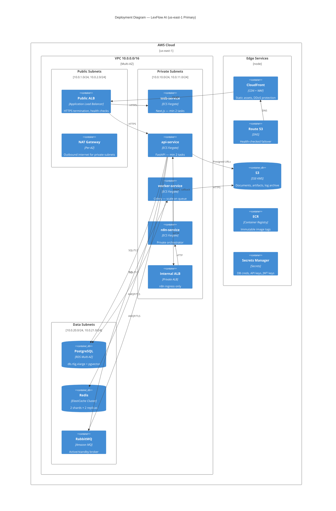
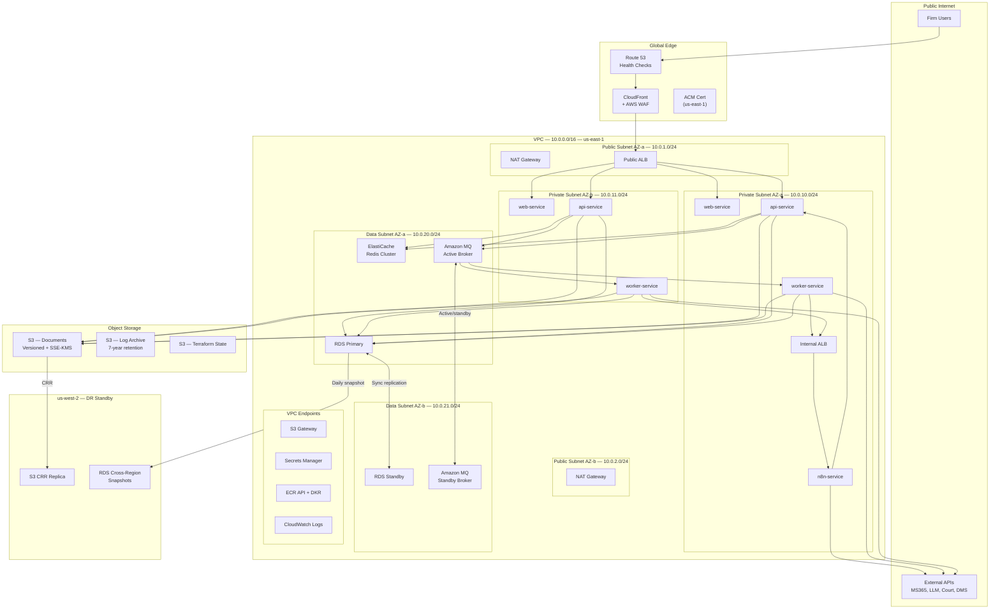
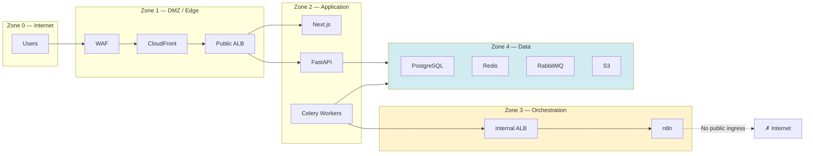
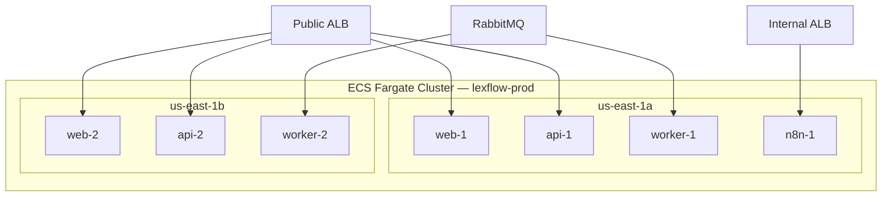
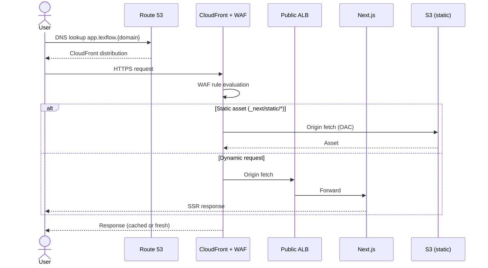

# AWS Topology

**LexFlow AI** — VPC, Compute, Data Layer & Edge Infrastructure  
**Version:** 1.0  
**Status:** Draft — Pre-Implementation  
**Last Updated:** 2026-07-06

---

## Purpose

This document defines the **AWS infrastructure topology** for LexFlow AI — VPC layout, subnet design, ECS Fargate services, managed data stores, edge delivery, and network security zones. It is the infrastructure companion to [../03-architecture/container-architecture.md](../03-architecture/container-architecture.md).

Primary region: **us-east-1**. DR standby: **us-west-2**. Target availability: **99.9%**.

---

## Scope

| In Scope | Out of Scope |
|----------|--------------|
| VPC, subnets, NAT, IGW, VPC endpoints | Terraform module variable definitions (see [terraform.md](./terraform.md)) |
| ECS Fargate cluster and service topology | Application business logic |
| RDS, ElastiCache, Amazon MQ, S3 configuration | Column-level database schema |
| ALB, CloudFront, Route 53, WAF | Firm DNS registrar configuration |
| Security group rules and network zones | Penetration test procedures |
| Multi-AZ and cross-region replication layout | Cost modeling |

---

## Responsibilities

| Role | Responsibility |
|------|----------------|
| **DevOps / SRE** | Provision and maintain all AWS resources via Terraform |
| **Security Architect** | Approve security group rules, WAF policies, VPC endpoint scope |
| **DBA / SRE** | RDS instance sizing, parameter groups, backup windows |
| **Network Engineer** | VPN/bastion access for n8n admin; Route 53 failover |
| **On-Call Engineer** | Respond to CloudWatch alarms; execute AZ/region failover |

---

## Architecture

### C4 Deployment Diagram

### Full AWS Topology

---

## VPC Design

### CIDR Allocation

| Subnet Tier | CIDR | AZ | Purpose |
|-------------|------|-----|---------|
| Public — AZ-a | 10.0.1.0/24 | us-east-1a | ALB, NAT Gateway |
| Public — AZ-b | 10.0.2.0/24 | us-east-1b | NAT Gateway (redundant) |
| Private — AZ-a | 10.0.10.0/24 | us-east-1a | ECS Fargate tasks |
| Private — AZ-b | 10.0.11.0/24 | us-east-1b | ECS Fargate tasks |
| Data — AZ-a | 10.0.20.0/24 | us-east-1a | RDS primary, Redis, MQ active |
| Data — AZ-b | 10.0.21.0/24 | us-east-1b | RDS standby, MQ standby |

### Network Security Zones

See [../08-security/network-security.md](../08-security/network-security.md) for security group rule details.

---

## ECS Fargate Services

### Service Matrix

| Service | Image | Min Tasks | Max Tasks | CPU | Memory | Port | Scale Trigger |
|---------|-------|-----------|-----------|-----|--------|------|---------------|
| `web` | Next.js | 2 | 10 | 512 (0.5 vCPU) | 1024 MB | 3000 | CPU > 70% or requests > 1,000/min |
| `api` | FastAPI | 2 | 20 | 1024 (1 vCPU) | 2048 MB | 8000 | CPU > 70% or p95 > 500ms |
| `worker` | Celery | 2 | 50 | 1024 (1 vCPU) | 2048 MB | — | RabbitMQ queue depth > 100 |
| `n8n` | n8n official | 1 | 2 | 512 (0.5 vCPU) | 1024 MB | 5678 | CPU > 80% |
| `outbox-publisher` | Celery Beat | 1 | 1 | 256 (0.25 vCPU) | 512 MB | — | — |
| `migration` | Alembic (one-off) | 0 | 1 | 512 | 1024 MB | — | Manual / CI trigger |

### ECS Task Placement

**Placement strategy:** `spread` across AZs for web, api, worker. n8n pinned to single AZ (Phase 1); Phase 3 adds HA with 2+ tasks.

### ECS Service Discovery

| Pattern | Implementation |
|---------|----------------|
| Public services | Registered as ALB target groups |
| n8n internal access | Internal ALB DNS name in private hosted zone |
| Inter-service (api ↔ worker) | RabbitMQ broker endpoint from Secrets Manager |
| Database | RDS endpoint via Secrets Manager; PgBouncer sidecar optional |

---

## Data Layer

### RDS PostgreSQL

| Setting | Production Value |
|---------|-----------------|
| Engine | PostgreSQL 16 + pgvector extension |
| Instance class | db.r6g.xlarge (initial) → db.r6g.2xlarge (Phase 2) |
| Storage | gp3, 500 GB initial, autoscaling to 2 TB |
| Multi-AZ | Enabled — synchronous standby |
| Encryption | AES-256 KMS |
| Backup retention | 35 days |
| Performance Insights | Enabled |
| Parameter group | `shared_preload_libraries = pg_stat_statements, vector` |

See [../05-database/retention-backup.md](../05-database/retention-backup.md) for backup and PITR configuration.

### ElastiCache Redis

| Setting | Production Value |
|---------|-----------------|
| Engine | Redis 7.x |
| Node type | cache.r6g.large |
| Topology | Cluster mode — 2 shards × 2 replicas |
| Encryption | At rest + in transit (TLS) |
| Use cases | Permission cache, rate limits, Celery result backend, distributed locks |
| Eviction policy | `allkeys-lru` |

### Amazon MQ (RabbitMQ)

| Setting | Production Value |
|---------|-----------------|
| Broker type | RabbitMQ 3.13 |
| Instance | mq.m5.large |
| Deployment | Active/standby (Multi-AZ) |
| Encryption | TLS in transit |
| Maintenance window | Sunday 04:00–05:00 UTC |
| Backup | Daily automatic, 7-day retention |

**Queue topology:** Domain event queues per bounded context; DLQ per primary queue. See [../03-architecture/event-driven-design.md](../03-architecture/event-driven-design.md).

### S3 Buckets

| Bucket | Purpose | Key Settings |
|--------|---------|--------------|
| `lexflow-{env}-documents` | Document binaries, exports | Versioning, SSE-KMS, CRR to us-west-2 |
| `lexflow-{env}-artifacts` | Build artifacts, n8n exports | Versioning, lifecycle 90 days |
| `lexflow-{env}-logs` | Compliance log archive | Lifecycle → Glacier after 90 days; 7-year retention |
| `lexflow-{env}-terraform-state` | Terraform remote state | Versioning, MFA delete (prod), DynamoDB lock |

---

## Edge Layer

### CloudFront + WAF

| Component | Configuration |
|-----------|--------------|
| CloudFront | HTTP/2 + HTTP/3; compress; cache static assets 1 year |
| WAF | AWS Managed Rules (Core, Known Bad Inputs); rate limit 2,000 req/5 min/IP |
| Origin | ALB (dynamic); S3 (static `_next/static`) |
| Certificate | ACM in us-east-1 (CloudFront requirement) |
| Geo restriction | None (US firm with remote workers) |

### Application Load Balancer

| ALB | Type | Listeners | Target Groups |
|-----|------|-----------|---------------|
| Public ALB | Internet-facing | HTTPS:443 → web:3000, api:8000 | `web-tg`, `api-tg` |
| Internal ALB | Internal | HTTP:5678 → n8n:5678 | `n8n-tg` |

| Health Check | Path | Interval | Healthy Threshold |
|--------------|------|----------|-------------------|
| web | `GET /api/health` | 30s | 2 |
| api | `GET /health` | 15s | 2 |
| n8n | `GET /healthz` | 30s | 2 |

**TLS policy:** `ELBSecurityPolicy-TLS13-1-2-2021-06` (TLS 1.2 minimum).

### Route 53

| Record | Type | Target | Failover |
|--------|------|--------|----------|
| `app.lexflow.{domain}` | A (alias) | CloudFront distribution | Primary: us-east-1 |
| `app-dr.lexflow.{domain}` | A (alias) | CloudFront (DR) | Secondary: us-west-2 |
| `internal.lexflow.{domain}` | Private zone | Internal ALB | VPC-only |

Health checks monitor ALB target group health; secondary record used during region failover. See [disaster-recovery.md](./disaster-recovery.md).

---

## VPC Endpoints

Private subnet tasks reach AWS services without traversing NAT:

| Endpoint | Type | Services |
|----------|------|----------|
| S3 | Gateway | Document upload/download |
| ECR (api + dkr) | Interface | Image pull |
| Secrets Manager | Interface | Secret retrieval at task start |
| CloudWatch Logs | Interface | Log shipping |
| SSM | Interface | ECS Exec (break-glass debugging) |

---

## Cross-Region DR Layout (us-west-2)

| Resource | DR State | Activation |
|----------|----------|------------|
| S3 documents | CRR replica — live | Automatic read during failover |
| RDS snapshots | Daily cross-region copy | Manual promote on failover |
| ECS cluster | Cold — Terraform module ready | `terraform apply` during DR |
| ElastiCache | Not replicated (cache rebuild) | Provision fresh cluster |
| Amazon MQ | Not replicated (durable queues drain) | Provision fresh broker; replay from outbox |
| CloudFront | Secondary distribution | DNS switch |
| ECR | Cross-region replication | Images available |

---

## Environment Sizing

| Resource | Dev | Staging | Production |
|----------|-----|---------|------------|
| ECS web min/max | 1/2 | 1/3 | 2/10 |
| ECS api min/max | 1/3 | 1/5 | 2/20 |
| ECS worker min/max | 1/5 | 1/10 | 2/50 |
| RDS instance | db.t4g.medium | db.r6g.large | db.r6g.xlarge |
| Redis shards | 1 | 1 | 2 |
| MQ instance | mq.t3.micro | mq.m5.large | mq.m5.large |

See [environment-strategy.md](./environment-strategy.md) for environment purpose and data policies.

---

## Monitoring Integration

All AWS resources emit metrics to CloudWatch. Key infrastructure alarms:

| Resource | Metric | Warning | Critical |
|----------|--------|---------|----------|
| ALB | UnHealthyHostCount | > 0 for 5 min | > 1 for 2 min |
| ECS | CPUUtilization | > 70% | > 85% |
| RDS | CPUUtilization | > 70% | > 85% |
| RDS | FreeStorageSpace | < 30% | < 15% |
| ElastiCache | DatabaseMemoryUsagePercentage | > 70% | > 85% |
| Amazon MQ | MessageCount | > 5,000 | > 20,000 |
| NAT Gateway | ErrorPortAllocation | > 0 | > 10/min |

See [../11-observability/alerting.md](../11-observability/alerting.md) for full alerting configuration.

---

## Best Practices

1. **One NAT Gateway per AZ** — Avoid cross-AZ NAT traffic charges and single-NAT SPOF.
2. **Data subnets have no internet route** — RDS, Redis, MQ accessible only from private subnets.
3. **n8n behind internal ALB only** — Security group denies all inbound from 0.0.0.0/0 on n8n tasks.
4. **PgBouncer between app tier and RDS** — Connection pooling; max 100 connections per API task.
5. **VPC endpoints for AWS APIs** — Reduce NAT costs and improve security posture.
6. **Immutable ECR tags** — Image tags are Git SHA; never overwrite `latest` in production.
7. **Separate KMS keys per environment** — Dev/staging/prod encryption key isolation.

---

## Tradeoffs

| Decision | Benefit | Cost |
|----------|---------|------|
| ECS Fargate over EC2 | No host patching; per-task billing | ~15% premium over EC2 reserved |
| Multi-AZ everything | 99.9% availability within region | 2× NAT Gateway, 2× data layer cost |
| Amazon MQ over SQS | Native DLQ, priority, topic routing | Higher cost; broker management |
| CloudFront for dynamic + static | Single edge entry; WAF integration | Cache invalidation on deploy |
| No Redis cross-region replication | Simpler DR; cache rebuild acceptable | Cold-cache latency spike on DR |
| n8n single instance (Phase 1) | Sufficient for 50K workflows/month | Brief automation pause on restart |

---

## Future Improvements

| Phase | Enhancement |
|-------|-------------|
| Phase 2 | RDS read replica for search and dashboard queries |
| Phase 2 | Dedicated worker pools per queue domain |
| Phase 3 | n8n HA — 2+ tasks behind internal ALB |
| Phase 3 | AWS Global Accelerator for edge optimization |
| Phase 4 | Multi-region active-passive with automated DNS failover |

---

## References

| Document | Description |
|----------|-------------|
| [../03-architecture/container-architecture.md](../03-architecture/container-architecture.md) | Container responsibilities and communication |
| [../03-architecture/nfr-requirements.md](../03-architecture/nfr-requirements.md) | Scale and availability targets |
| [terraform.md](./terraform.md) | Module structure provisioning this topology |
| [environment-strategy.md](./environment-strategy.md) | Per-environment sizing and isolation |
| [disaster-recovery.md](./disaster-recovery.md) | Failover and cross-region procedures |
| [../05-database/retention-backup.md](../05-database/retention-backup.md) | RDS backup configuration |
| [../08-security/network-security.md](../08-security/network-security.md) | Security groups and WAF rules |
| [../11-observability/](../11-observability/) | Metrics, logs, traces |
