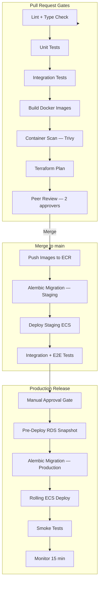
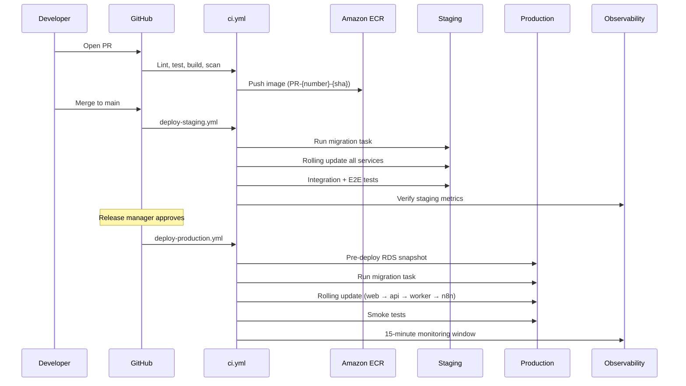
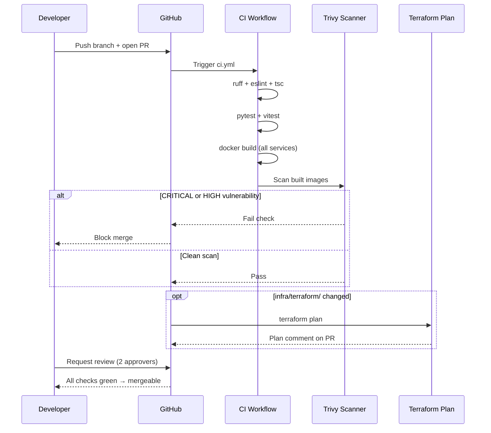
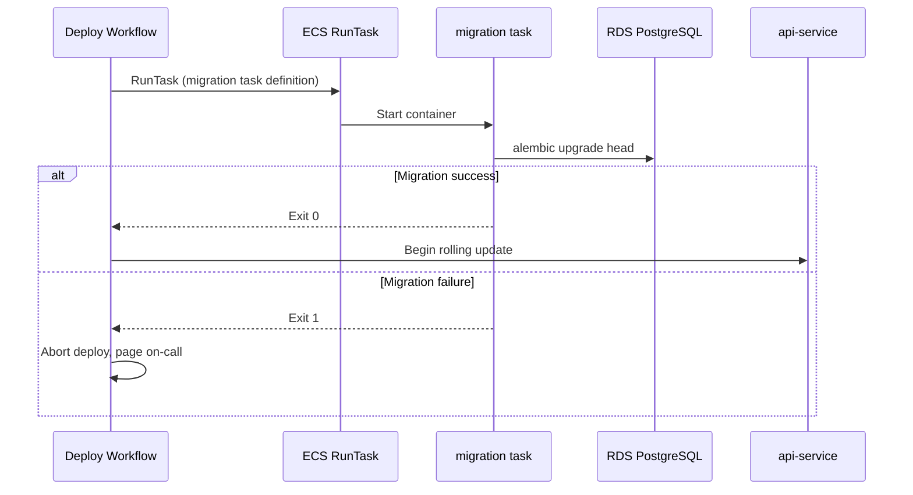

# CI/CD Pipeline

**LexFlow AI** — GitHub Actions, PR Gates & Deployment Promotion  
**Version:** 1.0  
**Status:** Draft — Pre-Implementation  
**Last Updated:** 2026-07-06

---

## Purpose

This document defines the **continuous integration and continuous deployment pipeline** for LexFlow AI — GitHub Actions workflows, pull request quality gates, artifact promotion from staging to production, and deployment safety controls. The pipeline delivers zero-downtime releases to AWS ECS Fargate with full traceability.

---

## Scope

| In Scope | Out of Scope |
|----------|--------------|
| GitHub Actions workflow definitions and triggers | Application unit test implementation |
| PR gates — lint, test, scan, plan | n8n workflow node configuration |
| Staging and production deployment promotion | Firm change advisory board process |
| Container image build, tag, and push to ECR | Load test script authoring |
| Database migration orchestration in CI | Terraform module internals |

---

## Responsibilities

| Role | Responsibility |
|------|----------------|
| **DevOps / SRE** | Maintain workflow YAML; configure GitHub environments and secrets |
| **Backend Engineer** | Ensure tests pass; migrations are backward-compatible |
| **Release Manager** | Approve production deployments via GitHub environment gate |
| **QA Engineer** | Validate staging E2E results before prod approval |
| **Security Team** | Review container scan results; approve WAF/infra changes |

---

## Architecture

### Pipeline Overview

### Deployment Promotion Flow

---

## GitHub Actions Workflows

### Workflow Catalog

| Workflow | File | Trigger | Purpose |
|----------|------|---------|---------|
| CI | `.github/workflows/ci.yml` | PR to `main`, push to `main` | Lint, test, build, scan |
| Deploy Staging | `.github/workflows/deploy-staging.yml` | Merge to `main` | Auto-deploy to staging |
| Deploy Production | `.github/workflows/deploy-production.yml` | Manual `workflow_dispatch` | Deploy to production |
| Deploy n8n Workflows | `.github/workflows/deploy-n8n-workflows.yml` | Manual dispatch | Import n8n workflow JSON |
| Terraform Plan | `.github/workflows/terraform-plan.yml` | PR touching `infra/terraform/` | Plan + comment on PR |
| Terraform Apply (Staging) | `.github/workflows/terraform-apply-staging.yml` | Merge to `main` (infra) | Apply staging infra |
| Terraform Apply (Production) | `.github/workflows/terraform-apply-production.yml` | Manual dispatch + approval | Apply production infra |
| Database Migration | `.github/workflows/db-migrate.yml` | Called by deploy workflows | Run Alembic one-off ECS task |

### GitHub Environments

| Environment | Protection Rules | Secrets |
|-------------|-----------------|---------|
| `staging` | Auto-deploy on merge | AWS OIDC role (staging), ECR registry |
| `production` | Required reviewers (2); 5-min wait timer | AWS OIDC role (production), ECR registry |
| `production-infra` | Required reviewers (2) + SRE | AWS OIDC role (production Terraform) |

---

## Pull Request Gates

### Required Checks (Branch Protection on `main`)

| Gate | Tool | Failure Action | Bypass |
|------|------|----------------|--------|
| Lint — Python | `ruff check` | Block merge | Never |
| Lint — TypeScript | `eslint` + `tsc --noEmit` | Block merge | Never |
| Unit tests — API | `pytest` (≥ 80% coverage) | Block merge | Never |
| Unit tests — Web | `vitest` | Block merge | Never |
| Integration tests | `pytest -m integration` (Testcontainers) | Block merge | Never |
| Container build | Docker multi-stage build | Block merge | Never |
| Container scan | Trivy (CRITICAL/HIGH = fail) | Block merge | Security exception only |
| Terraform plan | `terraform plan` (if infra changed) | Block merge | Never |
| Peer review | 2 approving reviewers | Block merge | Never |
| Signed commits | GPG or SSH commit signing | Block merge | Never |

### PR Gate Sequence

---

## Build & Artifact Strategy

### Docker Image Tagging

| Tag Pattern | When | Immutable |
|-------------|------|-----------|
| `{git-sha}` | Every build | Yes |
| `PR-{number}-{git-sha}` | PR builds | Yes |
| `staging-latest` | Staging deploy | No (pointer) |
| `production-{YYYYMMDD-HHMM}` | Production deploy | Yes |
| `production-latest` | Production deploy | No (pointer) |

### ECR Repositories

| Repository | Service | Scan on Push |
|------------|---------|--------------|
| `lexflow/web` | Next.js frontend | Yes |
| `lexflow/api` | FastAPI backend | Yes |
| `lexflow/worker` | Celery workers | Yes |
| `lexflow/n8n` | n8n (custom config overlay) | Yes |
| `lexflow/migration` | Alembic migration runner | Yes |

Images are replicated to us-west-2 via ECR cross-region replication for DR.

---

## Staging Deployment

Staging deploys **automatically** on every merge to `main`.

### Staging Deploy Sequence

| Step | Action | Rollback Trigger |
|------|--------|------------------|
| 1 | Build and push images tagged with `{git-sha}` | Build failure → stop |
| 2 | Run Alembic migration ECS task (staging RDS) | Migration failure → stop, alert |
| 3 | Rolling update: `migration` verify → `api` → `worker` → `web` → `n8n` | Health check failure → auto-rollback |
| 4 | Run integration test suite against staging | Test failure → alert, block prod promotion |
| 5 | Run Playwright E2E suite | Test failure → alert, block prod promotion |
| 6 | Tag images as `staging-latest` | — |

### Staging Validation Checklist

- [ ] All ECS services report 100% healthy tasks
- [ ] API health check returns `database: ok`, `redis: ok`, `rabbitmq: ok`
- [ ] Integration tests pass (≥ 0 failures)
- [ ] E2E tests pass (critical paths: login, case create, document upload, workflow trigger)
- [ ] No new CRITICAL/HIGH vulnerabilities in container scan
- [ ] CloudWatch error rate < 1% for 10 minutes post-deploy

---

## Production Deployment

Production deploys require **manual workflow dispatch** with GitHub environment approval.

### Production Deploy Sequence

| Step | Action | Duration |
|------|--------|----------|
| 1 | Release manager triggers `deploy-production.yml` | — |
| 2 | GitHub environment approval (2 reviewers) | Variable |
| 3 | Create RDS pre-deploy snapshot | ~5 min |
| 4 | Run Alembic migration ECS task (production RDS) | ~2 min |
| 5 | Rolling update: `api` → `worker` → `web` → `n8n` | ~10 min |
| 6 | CloudFront cache invalidation (`/api/*`, `/_next/*`) | ~2 min |
| 7 | Run smoke test suite | ~5 min |
| 8 | 15-minute monitoring window | 15 min |
| 9 | Tag images as `production-{timestamp}` | — |
| 10 | Post-deploy notification (Slack + email) | — |

See [zero-downtime-deploy.md](./zero-downtime-deploy.md) for rolling update mechanics.

### Production Approval Criteria

The release manager verifies before approving:

1. Staging deploy completed successfully with same `{git-sha}`
2. Staging E2E tests passed
3. No open P1/P2 incidents
4. Database migration reviewed by DBA (if schema change)
5. Rollback plan documented in PR description
6. Change window approved (production deploys: Tue–Thu, 10:00–16:00 ET)

---

## Database Migration in CI

Migration task runs **before** any application service update. See [../05-database/migrations.md](../05-database/migrations.md) for migration authoring rules.

---

## n8n Workflow Deployment

n8n workflow JSON is deployed separately from application containers:

| Workflow | Trigger | Action |
|----------|---------|--------|
| `deploy-n8n-workflows.yml` | Manual dispatch | Import workflow JSON to target n8n instance |

**Promotion path:** Dev n8n → Staging n8n → Production n8n. Workflows are version-controlled in the repository; n8n instances are targets only. See [../06-workflows/n8n-integration.md](../06-workflows/n8n-integration.md).

**Rule:** Never activate manual-trigger smoke workflows (WF-98, WF-99) for scheduled or webhook traffic.

---

## Rollback Procedures

| Scenario | Rollback Action | RTO |
|----------|----------------|-----|
| Failed migration | Do not deploy app; fix migration, re-run | ~15 min |
| Failed health check during rolling update | ECS circuit breaker auto-rollback to previous task definition | ~5 min |
| Post-deploy errors (staging) | Redeploy previous `{git-sha}` image tag | ~10 min |
| Post-deploy errors (production) | Redeploy previous `production-{timestamp}` tag; restore RDS snapshot if data affected | ~30 min |
| Bad n8n workflow | Re-import previous workflow JSON from Git tag | ~5 min |

---

## Security Controls

| Control | Implementation |
|---------|----------------|
| OIDC authentication | No long-lived AWS access keys in GitHub |
| Least-privilege IAM | Deploy role scoped to ECR + ECS update-service |
| Container scanning | Trivy blocks CRITICAL/HIGH on PR |
| Secret scanning | GitHub secret scanning + gitleaks in CI |
| Branch protection | `main` requires 2 reviewers, all checks pass |
| Environment gates | Production requires manual approval |
| Audit trail | GitHub Actions logs retained 400 days; deploy events in audit log |

See [../08-security/secrets-management.md](../08-security/secrets-management.md).

---

## Observability Integration

Post-deploy monitoring uses dashboards and alerts defined in [../11-observability/](../11-observability/):

| Signal | Source | Alert Threshold |
|--------|--------|-----------------|
| Error rate | CloudWatch (ALB 5xx) | > 1% warning, > 5% critical |
| Latency p95 | CloudWatch (ALB TargetResponseTime) | > 500ms warning |
| ECS task health | ECS service events | < 100% healthy |
| Migration duration | CloudWatch Logs (migration task) | > 10 min |
| DLQ depth | RabbitMQ metrics | > 0 messages |

Deploy events are annotated on Grafana/CloudWatch dashboards with `{git-sha}`, deployer, and timestamp.

---

## Best Practices

1. **Deploy the same SHA to staging and production** — Never promote an untested artifact.
2. **Migration before application** — Always run Alembic before rolling service update.
3. **Never skip container scan** — CRITICAL/HIGH vulnerabilities block merge.
4. **Production deploys during business hours** — Tue–Thu, 10:00–16:00 ET with on-call available.
5. **Pre-deploy RDS snapshot mandatory** — Enables fast rollback for schema-related issues.
6. **15-minute monitoring window** — Do not declare deploy success until window completes.
7. **Separate n8n workflow deploy** — Application deploy does not auto-import workflows.
8. **Document rollback plan in every production PR** — Required in PR template.

---

## Tradeoffs

| Decision | Benefit | Cost |
|----------|---------|------|
| Auto-deploy staging on merge | Fast feedback loop | Staging may break briefly on bad merges |
| Manual production approval | Prevents accidental prod deploys | Slower release cadence |
| Rolling update over blue/green | Simpler ECS config; sufficient for 99.9% | Brief mixed-version window |
| Same pipeline for app + infra | Unified audit trail | Infra changes trigger full CI |
| Trivy over Snyk/Dependabot alone | Free, fast, CI-native | Less comprehensive than commercial SCA |

---

## Future Improvements

| Phase | Enhancement |
|-------|-------------|
| Phase 2 | Canary deployment — 10% traffic to new version for 15 min |
| Phase 2 | Automated rollback on error rate spike |
| Phase 3 | GitOps with ArgoCD or Flux for ECS |
| Phase 3 | Progressive delivery with feature flags |
| Phase 4 | Continuous production deployment with automated canary analysis |

---

## References

| Document | Description |
|----------|-------------|
| [zero-downtime-deploy.md](./zero-downtime-deploy.md) | Rolling update mechanics |
| [docker-containers.md](./docker-containers.md) | Multi-stage build definitions |
| [terraform.md](./terraform.md) | Terraform CI/CD workflows |
| [environment-strategy.md](./environment-strategy.md) | Environment promotion path |
| [../05-database/migrations.md](../05-database/migrations.md) | Alembic migration conventions |
| [../06-workflows/n8n-integration.md](../06-workflows/n8n-integration.md) | n8n workflow promotion |
| [../11-observability/](../11-observability/) | Post-deploy monitoring |
| [../testing-strategy.md](../testing-strategy.md) | Test suite definitions |
