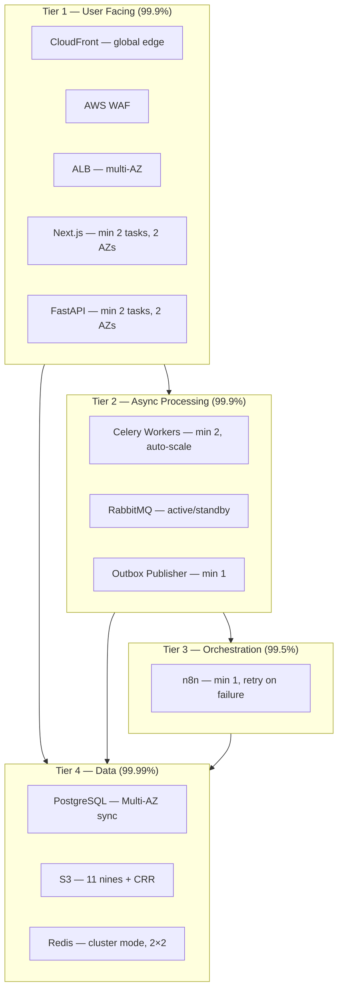
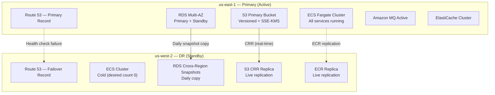
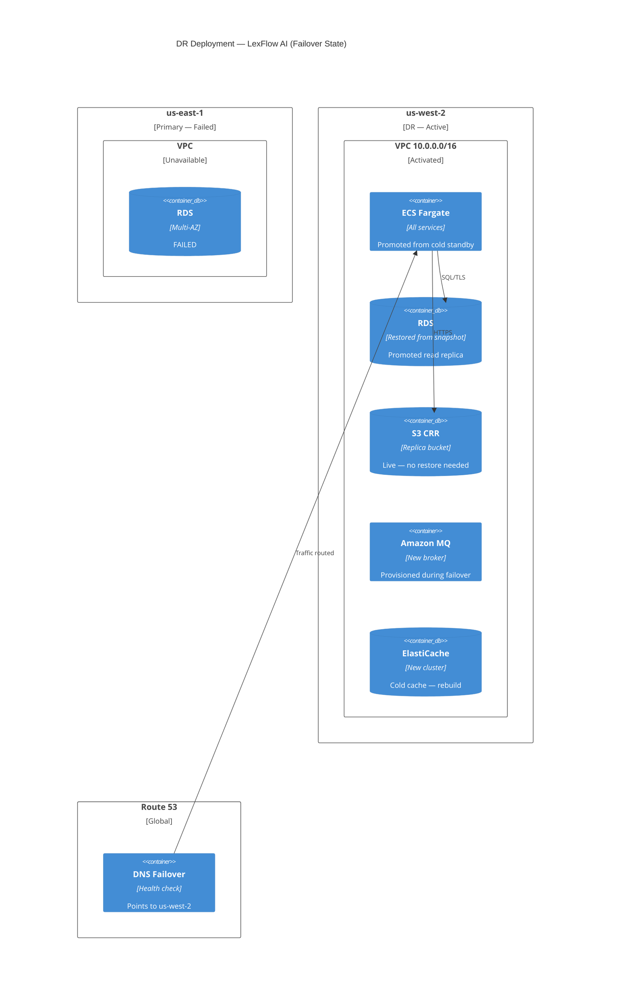
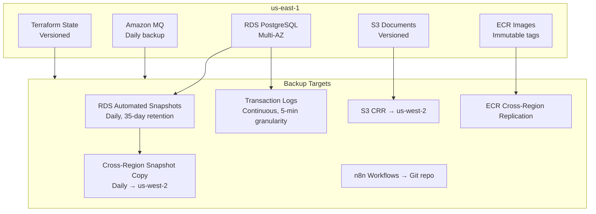
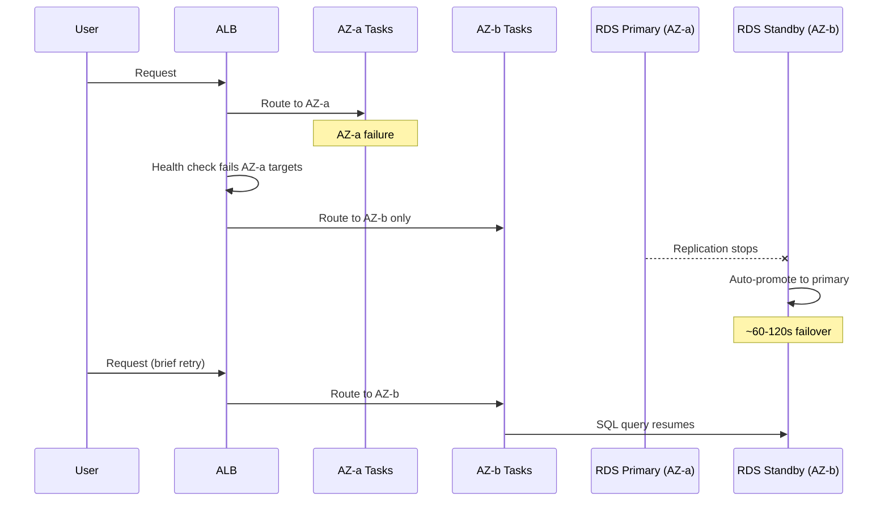
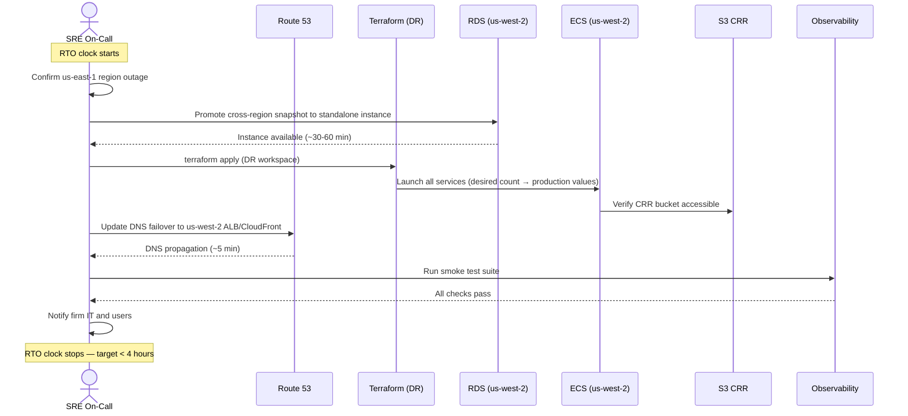

# Disaster Recovery & High Availability

**LexFlow AI** — HA Design, RPO/RTO, Failover & Backup Verification  
**Version:** 1.0  
**Status:** Draft — Pre-Implementation  
**Last Updated:** 2026-07-06

---

## Purpose

This document defines the **disaster recovery and high availability strategy** for LexFlow AI — component HA design, recovery objectives (RPO/RTO), backup procedures, region failover runbooks, and recovery testing requirements. The platform targets **99.9% availability** with **us-east-1** as primary and **us-west-2** as DR standby.

---

## Scope

| In Scope | Out of Scope |
|----------|--------------|
| HA design per AWS component | Insurance and liability terms |
| RPO/RTO targets and measurement | SLA legal language |
| Backup strategy (RDS, S3, MQ) | Application-level retry logic |
| Region failover and failback procedures | Penetration test execution |
| Recovery testing schedule | Firm-specific business continuity policy |
| Zero-downtime deploy interaction with DR | Cost optimization analysis |

---

## Responsibilities

| Role | Responsibility |
|------|----------------|
| **SRE / On-Call** | Execute failover runbooks; lead incident response |
| **DBA / SRE** | RDS backup verification; PITR execution |
| **DevOps** | Maintain DR Terraform workspace; ECR cross-region replication |
| **Security Team** | Breach recovery; secret rotation after incident |
| **Release Manager** | Authorize failback; communicate to firm stakeholders |
| **Compliance Officer** | Validate recovery meets regulatory requirements |

---

## Recovery Objectives

| Metric | Target | Measurement |
|--------|--------|-------------|
| **Availability** | 99.9% (≤ 8.76 hours downtime/year) | Uptime Robot + CloudWatch composite |
| **RPO** (Recovery Point Objective) | ≤ 15 minutes | Max data loss in worst-case failure |
| **RTO** (Recovery Time Objective) | ≤ 4 hours (region failure) | Time from detection to traffic restored |
| **RTO** (AZ failure) | ≤ 2 minutes | Automatic Multi-AZ failover |
| **RTO** (single task failure) | 0 (automatic) | ECS + ALB auto-recovery |
| **Data durability** | 99.999999999% (11 nines) | S3 + RDS combined |

See [../03-architecture/nfr-requirements.md](../03-architecture/nfr-requirements.md) for full NFR context.

---

## Architecture

### HA Tier Model

### Multi-Region DR Layout

### C4 Deployment — DR View

---

## Component HA Matrix

| Component | HA Strategy | Failure Impact | Failover Time | Auto/Manual |
|-----------|-------------|----------------|---------------|-------------|
| CloudFront | Global edge — inherently HA | None | 0 | Automatic |
| AWS WAF | Regional, multi-AZ | None | 0 | Automatic |
| ALB | Multi-AZ, health-checked targets | None for single target loss | 0 | Automatic |
| ECS Fargate (web, api) | Min 2 tasks across 2 AZs | None for single task | ~30s | Automatic |
| ECS Fargate (worker) | Min 2 tasks, auto-scale | Queue backlog ~60s | ~60s | Automatic |
| ECS Fargate (n8n) | Min 1 task, auto-restart | Workflow pause until restart | ~60s | Automatic |
| RDS PostgreSQL | Multi-AZ synchronous replication | Brief connection reset | ~60–120s | Automatic |
| ElastiCache Redis | Cluster mode, 2 shards × 2 replicas | Cache miss storm | ~30s per shard | Automatic |
| Amazon MQ (RabbitMQ) | Active/standby broker | In-flight message delay | ~30s | Automatic |
| S3 | 99.99% availability + CRR | Transparent | 0 | Automatic |
| Secrets Manager | AWS-managed HA across AZs | None | 0 | Automatic |
| NAT Gateway | One per AZ | None if other AZ NAT healthy | 0 | Automatic |
| Route 53 | Global service | None | 0 | Automatic |

### Single Points of Failure — Mitigation

| SPOF | Mitigation | Residual Risk |
|------|------------|---------------|
| Single AZ failure | All services span ≥ 2 AZs | None — automatic |
| RDS primary failure | Multi-AZ automatic failover | ~60–120s connection blip |
| n8n single instance | Acceptable — workflows retry via Celery | Brief automation pause |
| Full region failure | Manual DR failover to us-west-2 | Up to 4-hour RTO |
| Terraform state bucket | S3 versioning + MFA delete + cross-region copy | Manual recovery if corrupted |

---

## Backup Strategy

### Backup Architecture

### RDS PostgreSQL Backups

| Backup Type | Frequency | Retention | Recovery Method |
|-------------|-----------|-----------|-----------------|
| Automated snapshots | Daily (03:00–04:00 UTC) | 35 days | Restore to new instance |
| Transaction logs (WAL) | Continuous | 35 days | Point-in-time recovery (5-min granularity) |
| Manual pre-deploy snapshot | Before each production deploy | 7 days | Rollback reference |
| Cross-region snapshot copy | Daily (after automated) | 35 days | DR region restore |

See [../05-database/retention-backup.md](../05-database/retention-backup.md) for detailed RDS configuration and PITR procedures.

### S3 Backups

| Control | Setting |
|---------|---------|
| Versioning | Enabled on all production buckets |
| Cross-region replication | us-east-1 → us-west-2 (real-time) |
| MFA Delete | Enabled on production document bucket |
| Lifecycle — current versions | Indefinite |
| Lifecycle — non-current versions | Standard-IA after 90 days; Glacier after 365 days |

### Other Asset Backups

| Asset | Backup Method | Retention | Recovery |
|-------|--------------|-----------|----------|
| RabbitMQ | Amazon MQ automatic daily backup | 7 days | Restore broker from backup |
| Terraform state | S3 versioning + DynamoDB lock | Indefinite (versioned) | Restore previous state version |
| Docker images | ECR immutable tags + cross-region replication | 50 tags per repo | Pull from DR region ECR |
| n8n workflows | Git repository (source of truth) | Indefinite (Git history) | Re-import from Git tag |
| Secrets | Secrets Manager with automatic rotation | Previous version retained | Restore previous secret version |

---

## Failure Scenarios & Response

### Scenario Response Matrix

| Scenario | Detection | RTO | RPO | Procedure |
|----------|-----------|-----|-----|-----------|
| Single ECS task failure | ALB health check | 0 (automatic) | 0 | ECS launches replacement; ALB routes away |
| Single AZ failure | CloudWatch AZ metrics | ~2 min | 0 | Remaining AZ serves traffic; ECS scales in surviving AZ |
| RDS primary failure | RDS event notification | ~2 min | 0 | Multi-AZ automatic failover to standby |
| Redis shard failure | ElastiCache event | ~30s | 0 | Automatic replica promotion |
| RabbitMQ active broker failure | Amazon MQ event | ~30s | 0 | Standby promotion; durable queues preserved |
| n8n task crash | ECS service event | ~60s | 0 | ECS restarts task; Celery retries in-flight workflows |
| Data corruption (recent) | Application error / audit anomaly | ~1 hour | ≤ 15 min | PITR to point before corruption |
| Accidental table DROP | Application error | ~1 hour | ≤ 15 min | PITR or pre-deploy snapshot restore |
| Full region failure (us-east-1) | Route 53 health check | ~4 hours | ≤ 15 min | Manual DR failover to us-west-2 |
| Ransomware / security breach | GuardDuty / manual detection | ~4 hours | ≤ 15 min | Restore from clean cross-region snapshot; rotate all secrets |

---

## Failover Procedures

### AZ Failover (Automatic)

No manual intervention required. On-call notified via CloudWatch alarm.

### Region Failover (Manual — us-east-1 → us-west-2)

**Trigger:** Route 53 health checks fail for > 5 minutes; confirmed region-wide outage.

#### Region Failover Runbook

| Step | Action | Owner | Duration |
|------|--------|-------|----------|
| 1 | Confirm primary region unavailable (Route 53 + AWS Health Dashboard) | On-Call SRE | 5 min |
| 2 | Declare incident; start RTO clock; notify stakeholders | Incident Commander | 5 min |
| 3 | Promote latest cross-region RDS snapshot to standalone instance in us-west-2 | DBA/SRE | 30–60 min |
| 4 | Update Secrets Manager with new RDS endpoint | SRE | 5 min |
| 5 | Provision ElastiCache cluster in us-west-2 (cold cache) | SRE | 15 min |
| 6 | Provision Amazon MQ broker in us-west-2 | SRE | 15 min |
| 7 | `terraform apply` DR workspace — ECS services to production desired count | SRE | 20 min |
| 8 | Update Route 53 failover record to us-west-2 CloudFront/ALB | SRE | 5 min |
| 9 | Run smoke test suite | SRE | 10 min |
| 10 | Verify observability dashboards receiving data | SRE | 5 min |
| 11 | Notify firm IT and users via status page | Release Manager | 5 min |
| 12 | Monitor for 24 hours before considering failback | On-Call | Ongoing |

**Message broker note:** RabbitMQ messages in-flight at time of failure are lost (non-durable routing). Recovery relies on transactional outbox pattern — unpublished events remain in PostgreSQL and are re-published by outbox-publisher after recovery. See [../03-architecture/event-driven-design.md](../03-architecture/event-driven-design.md).

### Failback Procedure (us-west-2 → us-east-1)

| Step | Action | Duration |
|------|--------|----------|
| 1 | Confirm us-east-1 region fully restored (AWS Health Dashboard) | Variable |
| 2 | Restore primary region infrastructure via Terraform | ~1 hour |
| 3 | Create RDS instance in us-east-1 from latest cross-region snapshot | ~30–60 min |
| 4 | Re-establish RDS replication (west → east) or restore from snapshot + delta sync | ~1–2 hours |
| 5 | Sync any delta data created during DR period | Variable |
| 6 | Schedule maintenance window; notify firm users | — |
| 7 | Switch Route 53 DNS back to us-east-1 | ~5 min |
| 8 | Re-establish S3 CRR (east → west) | Automatic |
| 9 | Scale down us-west-2 ECS to cold standby (desired count 0) | ~10 min |
| 10 | Monitor for 24 hours; declare failback complete | Ongoing |

---

## Data Corruption Recovery

### PITR Recovery Flow

```mermaid
flowchart LR
    DETECT["Corruption Detected"] --> STOP["Scale API + Worker to 0"]
    STOP --> IDENTIFY["Identify last known-good timestamp T"]
    IDENTIFY --> PITR["PITR restore to T - 5 min"]
    PITR --> NEW["New RDS Instance"]
    NEW --> VERIFY["Verify data integrity<br/>(smoke tests)"]
    VERIFY --> SWAP["Update Secrets Manager<br/>RDS endpoint"]
    SWAP --> RESUME["Scale ECS tasks back up"]
    RESUME --> POST["Post-incident review"]
```

See [../05-database/retention-backup.md](../05-database/retention-backup.md) for detailed PITR CLI commands and verification steps.

---

## Recovery Testing

### Test Schedule

| Test | Frequency | Scope | Success Criteria |
|------|-----------|-------|------------------|
| RDS PITR restore | Quarterly | Restore to ephemeral staging instance; verify data integrity | Data matches expected state; smoke tests pass |
| ECS task kill (chaos) | Monthly (automated) | Kill random ECS task during business hours | ALB failover < 30s; no user-visible error |
| AZ failure simulation | Semi-annually | Terminate all tasks in one AZ | Traffic served from remaining AZ within 2 min |
| Full region DR failover | Annually | Complete region failover in staging environment | RTO < 4 hours; smoke tests pass |
| Backup integrity check | Monthly | Verify S3 object checksums; RDS snapshot restore | Checksums match; restore completes |
| n8n workflow recovery | Quarterly | Kill n8n task mid-execution | Celery retry completes workflow |
| Secret rotation recovery | Semi-annually | Rotate all secrets; verify services reconnect | All health checks pass within 5 min |
| Cross-region S3 access | Monthly | Read objects from us-west-2 CRR bucket | All objects accessible; checksums match |

### DR Drill Documentation

Every DR test produces:
1. **Test report** — Actual RTO/RPO measured vs. targets
2. **Gap analysis** — Steps that took longer than expected
3. **Runbook updates** — Corrections to procedures based on findings
4. **Stakeholder notification** — Summary to firm IT and compliance

---

## Observability During Incidents

| Signal | Source | Use During DR |
|--------|--------|---------------|
| Route 53 health check status | Route 53 | Trigger failover decision |
| RDS event notifications | SNS → PagerDuty | Detect database failures |
| ECS service events | CloudWatch Events | Track task recovery |
| ALB target health | CloudWatch | Verify traffic routing |
| Application error rate | CloudWatch + X-Ray | Detect post-failover issues |
| Outbox unpublished count | Custom metric | Verify event replay after MQ recovery |

See [../11-observability/](../11-observability/) for full alerting configuration and dashboard definitions.

---

## Interaction with Zero-Downtime Deployments

Deployments and DR are independent but share backup infrastructure:

| Concern | Deploy Impact | DR Impact |
|---------|--------------|-----------|
| Pre-deploy RDS snapshot | Created before every prod deploy | Also serves as recent recovery point |
| Rolling update | No downtime; old tasks drain gracefully | Not affected by AZ/region failure |
| Migration failure | Deploy aborted; no app update | Database unchanged — no DR impact |
| Circuit breaker rollback | Reverts to previous task definition | No data impact |

See [zero-downtime-deploy.md](./zero-downtime-deploy.md).

---

## Best Practices

1. **Test recovery, don't just backup** — Quarterly PITR restore validates backup integrity.
2. **Measure actual RTO** — DR drills must clock real recovery time, not estimated.
3. **Outbox pattern for message durability** — RabbitMQ failure doesn't lose domain events.
4. **Cross-region snapshots daily** — 15-minute RPO depends on WAL + daily snapshot copy.
5. **Cold standby over hot standby for DR ECS** — Cost-effective; 4-hour RTO acceptable.
6. **Document every real incident** — Post-incident report updates runbooks.
7. **Rotate secrets after breach recovery** — All Secrets Manager values replaced during ransomware recovery.
8. **Never failback under pressure** — Wait 24 hours of stable primary region before failback.

---

## Tradeoffs

| Decision | Benefit | Cost |
|----------|---------|------|
| 99.9% vs 99.99% availability | Achievable with managed AWS services | ~8.76h downtime budget; n8n is weakest link |
| Multi-AZ vs multi-region active-active | Simpler, lower cost | 4-hour RTO for region failure |
| Cold DR ECS vs warm standby | ~70% cost savings on DR region | Longer ECS startup during failover |
| Daily cross-region snapshot vs continuous replication | Lower cost; sufficient for 15-min RPO | Snapshot restore takes 30–60 min |
| Manual region failover vs automated | Controlled, verified recovery | Requires on-call availability |
| No Redis cross-region replication | Simpler DR; cache rebuild acceptable | Cold-cache latency spike post-failover |

---

## Future Improvements

| Phase | Enhancement |
|-------|-------------|
| Phase 2 | Automated PITR test in CI (monthly restore to ephemeral instance) |
| Phase 3 | Automated DR failover — Route 53 health check triggers runbook automation |
| Phase 3 | n8n HA — 2+ instances behind internal ALB (99.9% orchestration tier) |
| Phase 3 | AWS Backup Vault Lock for immutable ransomware protection |
| Phase 4 | Multi-region active-passive with < 1 hour RTO |
| Phase 4 | Continuous RDS cross-region read replica (near-zero RPO) |

---

## References

| Document | Description |
|----------|-------------|
| [aws-topology.md](./aws-topology.md) | AWS resource HA configuration |
| [terraform.md](./terraform.md) | DR Terraform workspace |
| [zero-downtime-deploy.md](./zero-downtime-deploy.md) | Deploy rollback procedures |
| [environment-strategy.md](./environment-strategy.md) | Production environment configuration |
| [../03-architecture/nfr-requirements.md](../03-architecture/nfr-requirements.md) | RPO/RTO and availability targets |
| [../03-architecture/container-architecture.md](../03-architecture/container-architecture.md) | Container HA topology |
| [../03-architecture/event-driven-design.md](../03-architecture/event-driven-design.md) | Outbox pattern for message durability |
| [../05-database/retention-backup.md](../05-database/retention-backup.md) | RDS backup, PITR, retention policies |
| [../08-security/incident-response.md](../08-security/incident-response.md) | Security incident procedures |
| [../11-observability/](../11-observability/) | Monitoring and alerting during incidents |
| [../compliance-data-governance.md](../compliance-data-governance.md) | Data retention and regulatory requirements |
