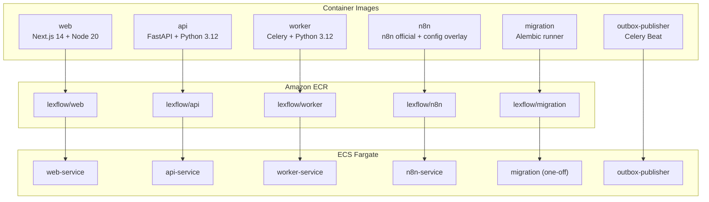
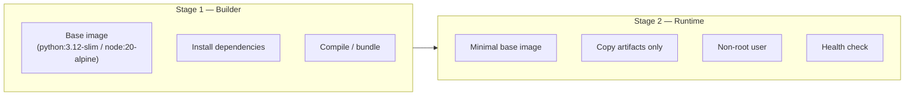
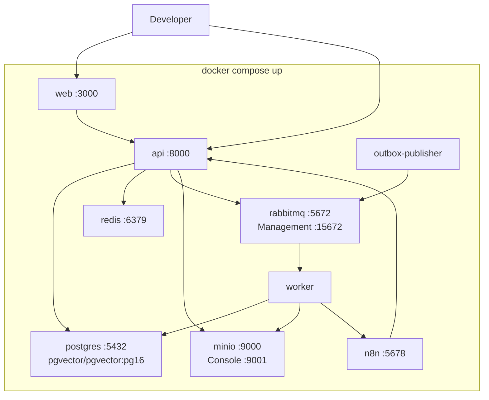
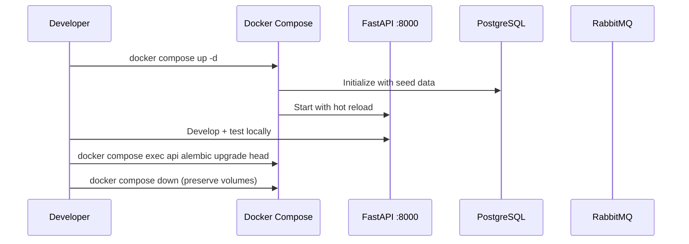
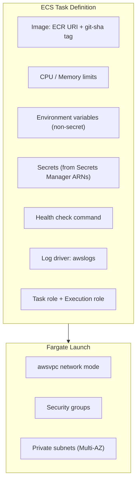
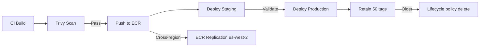

# Docker Containers

**LexFlow AI** — Multi-Stage Builds, Image Strategy & Local Compose  
**Version:** 1.0  
**Status:** Draft — Pre-Implementation  
**Last Updated:** 2026-07-06

---

## Purpose

This document defines the **containerization strategy** for LexFlow AI — multi-stage Docker builds, image composition, local development stack via Docker Compose, and container runtime configuration for ECS Fargate deployment. Containers are the deployable unit for all application services.

---

## Scope

| In Scope | Out of Scope |
|----------|--------------|
| Multi-stage build patterns per service | Application business logic |
| Local Docker Compose stack | ECS task definition Terraform |
| Image tagging and registry strategy | Kubernetes manifests |
| Container runtime configuration (env, secrets, health) | n8n workflow node configuration |
| Non-root user and security hardening | Production WAF rules |

---

## Responsibilities

| Role | Responsibility |
|------|----------------|
| **Backend Engineer** | Maintain API and worker Dockerfiles |
| **Frontend Engineer** | Maintain web Dockerfile |
| **DevOps / SRE** | ECR repositories, base image updates, CVE patching |
| **All Engineers** | Local Compose for development; no secrets in images |

---

## Architecture

### Container Inventory

### Multi-Stage Build Pattern

All application images follow a **builder → runtime** two-stage pattern to minimize image size and exclude build tooling from production.

---

## Service Build Specifications

### web (Next.js)

| Property | Value |
|----------|-------|
| Base image | `node:20-alpine` |
| Stages | `deps` → `builder` → `runner` |
| Output | Standalone Next.js server |
| User | `nextjs` (UID 1001) |
| Port | 3000 |
| Health check | `GET /api/health` |
| Image size target | < 200 MB |

**Build stages:**
1. **deps** — Install `node_modules` from lockfile
2. **builder** — `next build` with standalone output
3. **runner** — Copy `.next/standalone`, static assets; no dev dependencies

### api (FastAPI)

| Property | Value |
|----------|-------|
| Base image | `python:3.12-slim` |
| Stages | `builder` → `runtime` |
| Package manager | `pip` with `pyproject.toml` |
| User | `appuser` (UID 1000) |
| Port | 8000 |
| Health check | `GET /health` |
| Image size target | < 300 MB |

**Build stages:**
1. **builder** — Install Python dependencies into virtual env
2. **runtime** — Copy venv + source; run `uvicorn` as non-root

### worker (Celery)

| Property | Value |
|----------|-------|
| Base image | `python:3.12-slim` (shared with api builder) |
| Stages | `builder` → `runtime` |
| Entrypoint | `celery -A src.worker worker --loglevel=info` |
| User | `appuser` (UID 1000) |
| Health check | Celery inspect ping |
| Image size target | < 300 MB |

Worker shares the api codebase and builder stage; only the entrypoint CMD differs.

### n8n

| Property | Value |
|----------|-------|
| Base image | `n8nio/n8n:latest` (pinned to digest in production) |
| Overlay | Custom config, credential templates, startup script |
| User | `node` (n8n default) |
| Port | 5678 |
| Health check | `GET /healthz` |
| Image size target | < 500 MB |

**Rule:** n8n image adds configuration overlay only — no business logic in n8n nodes beyond orchestration.

### migration (Alembic)

| Property | Value |
|----------|-------|
| Base image | `python:3.12-slim` (shared with api) |
| Entrypoint | `alembic upgrade head` |
| Run mode | ECS RunTask (one-off, not a service) |
| Timeout | 10 minutes |

---

## Local Development — Docker Compose

### Compose Stack Topology

### Compose Services

| Service | Image / Build | Ports | Purpose |
|---------|--------------|-------|---------|
| `web` | Build: `apps/web/Dockerfile` (dev target) | 3000 | Next.js with hot reload |
| `api` | Build: `apps/api/Dockerfile` (dev target) | 8000 | FastAPI with `--reload` |
| `worker` | Build: `apps/api/Dockerfile` (worker target) | — | Celery worker |
| `outbox-publisher` | Build: `apps/api/Dockerfile` (beat target) | — | Celery beat scheduler |
| `n8n` | `n8nio/n8n` | 5678 | Workflow orchestrator |
| `postgres` | `pgvector/pgvector:pg16` | 5432 | PostgreSQL with pgvector |
| `redis` | `redis:7-alpine` | 6379 | Cache and Celery backend |
| `rabbitmq` | `rabbitmq:3.13-management` | 5672, 15672 | Message broker |
| `minio` | `minio/minio` | 9000, 9001 | S3-compatible local storage |

### Local vs. Cloud Mapping

| Local (Compose) | Cloud (AWS) |
|-----------------|-------------|
| `postgres` | RDS PostgreSQL Multi-AZ |
| `redis` | ElastiCache Redis Cluster |
| `rabbitmq` | Amazon MQ (RabbitMQ) |
| `minio` | S3 (SSE-KMS) |
| `n8n` | ECS Fargate n8n-service (internal ALB) |
| Docker bridge network | VPC private subnets + security groups |

### Developer Workflow

**Volumes:** `postgres_data`, `redis_data`, `rabbitmq_data`, `minio_data` persist across restarts. Use `docker compose down -v` to reset.

---

## Container Runtime Configuration

### Environment Variables

| Variable | Services | Source | Example |
|----------|----------|--------|---------|
| `DATABASE_URL` | api, worker, migration | Secrets Manager | `postgresql+asyncpg://...` |
| `REDIS_URL` | api, worker | Secrets Manager | `rediss://...` |
| `RABBITMQ_URL` | api, worker | Secrets Manager | `amqps://...` |
| `S3_BUCKET` | api, worker | Terraform output | `lexflow-prod-documents` |
| `JWT_PUBLIC_KEY` | api | Secrets Manager | PEM-encoded RS256 public key |
| `N8N_WEBHOOK_URL` | worker | Terraform output | `http://internal-alb.../webhook/` |
| `LOG_LEVEL` | all | Task definition env | `INFO` |
| `ENVIRONMENT` | all | Task definition env | `production` |
| `OTEL_EXPORTER_ENDPOINT` | all | Task definition env | CloudWatch/X-Ray endpoint |

**Rule:** No secrets in environment variables directly — all sensitive values injected from Secrets Manager at task startup via ECS `secrets` block.

### ECS Task Definition Structure

---

## Security Hardening

| Control | Implementation |
|---------|----------------|
| Non-root user | All containers run as dedicated non-root UID |
| Read-only root filesystem | Enabled where compatible (web, api); `/tmp` as writable tmpfs |
| No secrets in image | `.dockerignore` excludes `.env`, credentials, keys |
| Minimal base images | `slim` / `alpine` variants; no build tools in runtime |
| Image scanning | Trivy in CI — CRITICAL/HIGH blocks merge |
| Pin base image digests | Production Dockerfiles pin digest, not floating tags |
| No SSH/shell access | ECS Exec enabled for break-glass only; audit logged |

See [../08-security/secrets-management.md](../08-security/secrets-management.md).

---

## Health Checks

| Service | Probe | Interval | Timeout | Retries | Start Period |
|---------|-------|----------|---------|---------|--------------|
| web | `GET /api/health` | 30s | 5s | 3 | 60s |
| api | `GET /health` | 15s | 5s | 3 | 30s |
| worker | `celery inspect ping` | 60s | 10s | 3 | 60s |
| n8n | `GET /healthz` | 30s | 5s | 3 | 60s |
| outbox-publisher | Process check | 60s | 5s | 3 | 30s |

Health endpoint response schema:

| Field | Type | Description |
|-------|------|-------------|
| `status` | string | `healthy` or `degraded` |
| `version` | string | Git SHA or semver |
| `checks.database` | string | `ok` / `error` |
| `checks.redis` | string | `ok` / `error` |
| `checks.rabbitmq` | string | `ok` / `error` |

---

## Image Lifecycle

| Policy | Setting |
|--------|---------|
| ECR lifecycle | Keep last 50 tagged images; delete untagged after 7 days |
| Cross-region replication | us-east-1 → us-west-2 (all repositories) |
| Base image update cadence | Monthly CVE review; critical patches within 72 hours |

---

## Best Practices

1. **Shared builder for api/worker/migration** — Single Dockerfile with build targets reduces drift.
2. **`.dockerignore` mandatory** — Exclude `node_modules`, `.git`, tests, docs from build context.
3. **Standalone Next.js output** — Smallest production web image; no `node_modules` in runtime.
4. **Local Compose mirrors cloud topology** — Same service names, same env var keys (different values).
5. **MinIO for local S3** — Presigned URL flows testable without AWS credentials.
6. **Never commit `.env` files** — Use `.env.example` with placeholder values.
7. **Pin n8n to digest in production** — Floating `latest` tag acceptable in local dev only.

---

## Tradeoffs

| Decision | Benefit | Cost |
|----------|---------|------|
| Multi-stage builds | 60–70% smaller images; faster deploys | More complex Dockerfiles |
| Shared api/worker image | Single build artifact; guaranteed code parity | Slightly larger worker image (unused API deps) |
| Docker Compose for local dev | Full stack on laptop; no AWS needed | Resource-intensive (~4 GB RAM minimum) |
| MinIO over LocalStack S3 | Lightweight; sufficient for document flows | Not 100% S3 API compatible |
| Alpine for web, slim for Python | Smallest images per ecosystem | musl vs glibc compatibility checks needed |

---

## Future Improvements

| Phase | Enhancement |
|-------|-------------|
| Phase 2 | Dev container (`.devcontainer/`) for consistent onboarding |
| Phase 2 | Dedicated worker image with only worker dependencies |
| Phase 3 | Distroless runtime images for api/worker |
| Phase 4 | GPU-enabled worker image for local AI model testing |

---

## References

| Document | Description |
|----------|-------------|
| [aws-topology.md](./aws-topology.md) | ECS Fargate service specifications |
| [cicd-pipeline.md](./cicd-pipeline.md) | Build, scan, push pipeline |
| [environment-strategy.md](./environment-strategy.md) | Local vs. cloud environment mapping |
| [zero-downtime-deploy.md](./zero-downtime-deploy.md) | Rolling update during deploy |
| [../03-architecture/container-architecture.md](../03-architecture/container-architecture.md) | Container responsibilities |
| [../08-security/secrets-management.md](../08-security/secrets-management.md) | Secret injection at runtime |
| [../folder-structure.md](../folder-structure.md) | Monorepo layout for Dockerfile paths |
