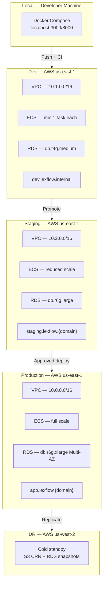
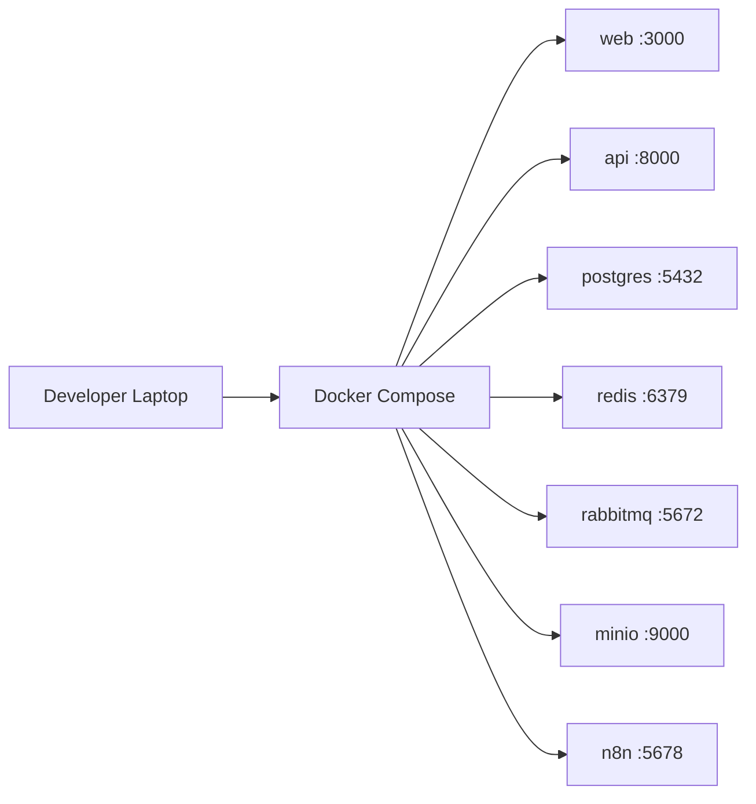
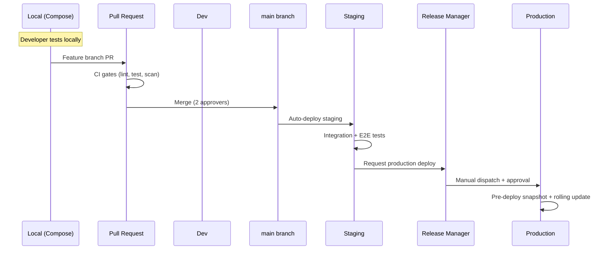
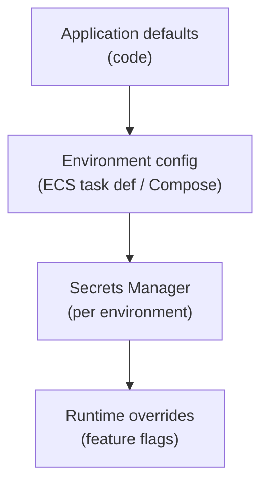
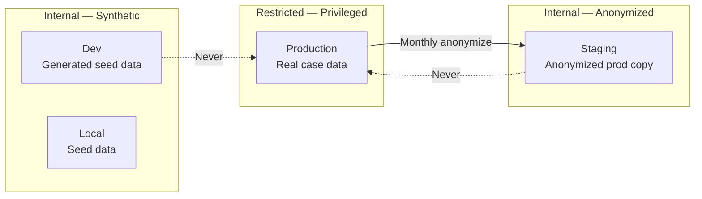

# Environment Strategy

**LexFlow AI** — Local, Dev, Staging & Production Isolation  
**Version:** 1.0  
**Status:** Draft — Pre-Implementation  
**Last Updated:** 2026-07-06

---

## Purpose

This document defines the **environment strategy** for LexFlow AI — the four deployment environments, their purpose, isolation boundaries, data policies, promotion path, and configuration differences. Each environment is fully isolated with its own AWS resources (except shared global DNS and ECR).

---

## Scope

| In Scope | Out of Scope |
|----------|--------------|
| Environment purpose, URL patterns, and access control | AWS account creation and billing |
| Resource isolation per environment | Firm-specific compliance certifications |
| Data classification and seeding policies | Application feature flag implementation |
| Promotion path from local → production | Cost optimization analysis |
| Configuration matrix across environments | Legal contract terms |

---

## Responsibilities

| Role | Responsibility |
|------|----------------|
| **DevOps / SRE** | Provision and maintain environment infrastructure |
| **Backend Engineer** | Seed data scripts; environment-aware configuration |
| **QA Engineer** | Validate staging before production promotion |
| **Security Team** | Approve production data handling; audit access controls |
| **Release Manager** | Authorize production deployments |

---

## Architecture

### Environment Topology

### Environment Comparison Matrix

| Property | Local | Dev | Staging | Production |
|----------|-------|-----|---------|------------|
| **Purpose** | Developer productivity | Integration testing | Pre-production validation | Live firm deployment |
| **URL** | `localhost:3000/8000` | `dev.lexflow.internal` | `staging.lexflow.{domain}` | `app.lexflow.{domain}` |
| **Infrastructure** | Docker Compose | AWS (minimal) | AWS (reduced scale) | AWS (full scale) |
| **VPC CIDR** | N/A (bridge) | 10.1.0.0/16 | 10.2.0.0/16 | 10.0.0.0/16 |
| **AWS Account** | N/A | Dev account | Staging account | Production account |
| **Data** | Seed/synthetic | Synthetic | Anonymized prod copy | Real firm data |
| **Access** | Developer only | Engineering team | Engineering + QA + PM | All firm users |
| **Deploy trigger** | Manual (`compose up`) | Merge to `develop` | Merge to `main` | Manual approval |
| **Multi-AZ** | No | No | Yes | Yes |
| **WAF** | No | No | Yes (monitor mode) | Yes (block mode) |
| **Backup retention** | None | 7 days | 14 days | 35 days |
| **Monitoring** | Console logs | Basic CloudWatch | Full observability stack | Full + paging |
| **DR replication** | No | No | No | Yes (us-west-2) |

---

## Environment Details

### Local

**Purpose:** Fast feedback loop for individual developers. No AWS credentials required.

| Aspect | Policy |
|--------|--------|
| Data | Synthetic seed data only; no real firm or client data |
| Secrets | `.env.local` (gitignored); placeholder values from `.env.example` |
| External APIs | Mocked or sandbox credentials (OpenAI test key, MS365 dev tenant) |
| n8n | Local instance; workflows imported manually |
| Persistence | Docker volumes; reset with `docker compose down -v` |

See [docker-containers.md](./docker-containers.md) for Compose configuration.

### Dev

**Purpose:** Shared integration environment for feature branch testing and cross-team validation.

| Aspect | Policy |
|--------|--------|
| Data | Synthetic data generated by seed scripts; refreshed weekly |
| Access | VPN or SSO required; engineering team only |
| Deploy | Auto-deploy on merge to `develop` branch |
| External APIs | Sandbox/dev tenant credentials |
| LLM | Rate-limited test API keys; no production models |
| Scale | Minimum viable — 1 task per service |
| Cost controls | Auto-stop ECS services outside business hours (optional) |

### Staging

**Purpose:** Production-like environment for QA validation, E2E testing, and stakeholder demos before production release.

| Aspect | Policy |
|--------|--------|
| Data | Anonymized copy of production data (monthly refresh); no real PII |
| Access | Engineering, QA, product, and selected firm stakeholders |
| Deploy | Auto-deploy on merge to `main` |
| External APIs | Staging/sandbox tenant credentials |
| Topology | Mirrors production at reduced scale (same modules, smaller instances) |
| WAF | Enabled in monitor/count mode (not blocking) |
| Testing | Full integration + E2E + load test suite runs here |

**Staging data refresh procedure:**
1. Restore production RDS snapshot to staging instance
2. Run anonymization script (replace PII with synthetic values)
3. Verify no real names, SSNs, or privileged content remain
4. Update staging S3 bucket with anonymized document set

### Production

**Purpose:** Live deployment serving the law firm with real case data, privileged documents, and attorney-client communications.

| Aspect | Policy |
|--------|--------|
| Data | Real firm data — Restricted/Privileged classification |
| Access | All authorized firm users via Entra ID SSO |
| Deploy | Manual workflow dispatch with 2-approver gate |
| External APIs | Production tenant credentials |
| Topology | Full scale per [aws-topology.md](./aws-topology.md) |
| WAF | Block mode — managed rules + rate limiting |
| DR | Cross-region replication to us-west-2 |
| Change window | Tue–Thu, 10:00–16:00 ET |

---

## Promotion Path

### Promotion Rules

| Rule | Description |
|------|-------------|
| Same artifact | Production deploys the exact `{git-sha}` validated in staging |
| No skip-staging | Production deploy blocked if staging deploy of same SHA failed |
| Migration gate | Alembic migration must succeed in staging before production |
| Rollback plan | Every production PR includes documented rollback steps |
| n8n separate | Workflow JSON promoted independently via dedicated pipeline |

---

## Configuration Management

### Configuration Hierarchy

| Config Type | Local | Dev | Staging | Production |
|-------------|-------|-----|---------|------------|
| Non-secret env vars | `.env.local` | ECS task definition | ECS task definition | ECS task definition |
| Secrets | `.env.local` (gitignored) | Secrets Manager | Secrets Manager | Secrets Manager |
| Infrastructure | Docker Compose | Terraform (dev) | Terraform (staging) | Terraform (production) |
| Feature flags | Local override | Dev defaults | Staging = prod defaults | Production values |

### Key Configuration Differences

| Setting | Local | Dev | Staging | Production |
|---------|-------|-----|---------|------------|
| `LOG_LEVEL` | DEBUG | INFO | INFO | INFO |
| `JWT_ACCESS_TOKEN_TTL` | 60 min | 30 min | 15 min | 15 min |
| `RATE_LIMIT_REQUESTS_PER_MIN` | Unlimited | 1000 | 500 | 200 |
| `OTEL_TRACE_SAMPLE_RATE` | 1.0 | 0.5 | 0.1 | 0.1 |
| `CORS_ALLOWED_ORIGINS` | `localhost:*` | `dev.lexflow.internal` | `staging.lexflow.{domain}` | `app.lexflow.{domain}` |
| `S3_BUCKET` | `minio://local` | `lexflow-dev-documents` | `lexflow-staging-documents` | `lexflow-prod-documents` |
| `ENABLE_AI_INFERENCE` | true | true | true | true |
| `LLM_PROVIDER` | mock/openai-test | openai-test | azure-openai-staging | azure-openai-prod |

---

## Data Isolation

### Data Classification by Environment

| Rule | Enforcement |
|------|-------------|
| No production data in local/dev | Pre-commit hooks; data classification tags |
| Staging data anonymized | Automated anonymization script; manual verification |
| Separate AWS accounts | Production in dedicated account with SCP guardrails |
| Separate KMS keys | Each environment has unique encryption keys |
| Separate Secrets Manager namespaces | No shared secrets across environments |

See [../compliance-data-governance.md](../compliance-data-governance.md) for data classification details.

---

## Access Control

| Environment | Authentication | Authorization | Network |
|-------------|-----------------|---------------|---------|
| Local | None (dev mode) | None | localhost only |
| Dev | SSO (engineering group) | Engineering RBAC | VPN required |
| Staging | SSO (extended group) | Staging RBAC (mirrors prod roles) | VPN or IP allowlist |
| Production | Entra ID SSO (firm users) | Production RBAC + matter walls | Public via CloudFront + WAF |
| n8n (all cloud) | Basic auth + VPN | Admin only | Internal ALB — no public access |

---

## Observability by Environment

| Capability | Local | Dev | Staging | Production |
|------------|-------|-----|---------|------------|
| Structured logging | Console | CloudWatch (7 days) | CloudWatch (30 days) | CloudWatch (90 days) + S3 archive |
| Distributed tracing | Optional (Jaeger) | X-Ray (50% sample) | X-Ray (10% sample) | X-Ray (10% sample) |
| Metrics & dashboards | None | Basic | Full dashboards | Full + SLA dashboards |
| Alerting | None | Slack (info) | Slack (warning) | PagerDuty (critical) |
| Log compliance archive | None | None | None | S3 (7 years) |

See [../11-observability/](../11-observability/) for full observability configuration.

---

## Best Practices

1. **Never use production credentials locally** — Separate API keys, database URLs, and JWT keys per environment.
2. **Staging mirrors production topology** — Same Terraform modules, different tfvars; catches infra issues early.
3. **Anonymize before staging refresh** — Automated script + manual spot-check for PII leakage.
4. **Separate AWS accounts for production** — SCP prevents accidental cross-environment access.
5. **Feature flags default to off in production** — Explicit opt-in for new features.
6. **Weekly dev data refresh** — Prevents stale integration issues from old seed data.
7. **Document environment-specific quirks** — Known differences between staging and production documented in runbooks.

---

## Tradeoffs

| Decision | Benefit | Cost |
|----------|---------|------|
| 4 environments vs. 3 | Dev sandbox prevents staging pollution | Additional AWS cost for dev account |
| Separate AWS accounts | Strong isolation; SCP guardrails | Cross-account ECR pull setup |
| Anonymized prod copy for staging | Realistic test data | Monthly refresh effort; anonymization risk |
| Auto-deploy staging | Fast feedback | Staging may break on bad merges |
| Local Compose vs. dev ECS | Zero AWS cost for daily dev | Local ≠ cloud behavior for some services |

---

## Future Improvements

| Phase | Enhancement |
|-------|-------------|
| Phase 2 | Preview environments — ephemeral ECS per PR (auto-destroy after 24h) |
| Phase 2 | Automated staging data anonymization pipeline |
| Phase 3 | Production shadow traffic for canary validation |
| Phase 4 | Multi-firm tenancy — per-firm environment isolation |

---

## References

| Document | Description |
|----------|-------------|
| [aws-topology.md](./aws-topology.md) | Per-environment resource sizing |
| [terraform.md](./terraform.md) | Environment-specific Terraform workspaces |
| [cicd-pipeline.md](./cicd-pipeline.md) | Deploy triggers per environment |
| [docker-containers.md](./docker-containers.md) | Local Compose stack |
| [disaster-recovery.md](./disaster-recovery.md) | Production DR to us-west-2 |
| [../03-architecture/nfr-requirements.md](../03-architecture/nfr-requirements.md) | Availability and scale targets |
| [../compliance-data-governance.md](../compliance-data-governance.md) | Data classification |
| [../11-observability/](../11-observability/) | Per-environment monitoring |
