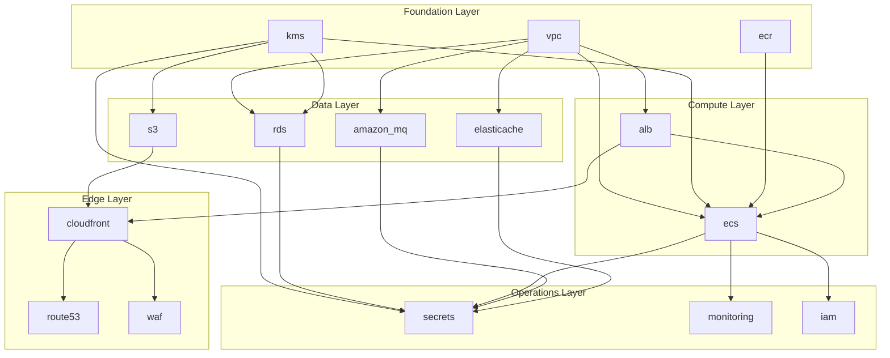
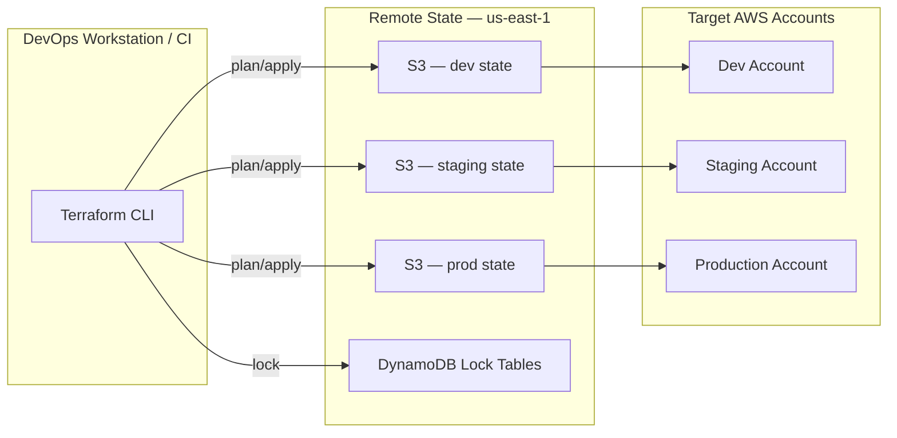
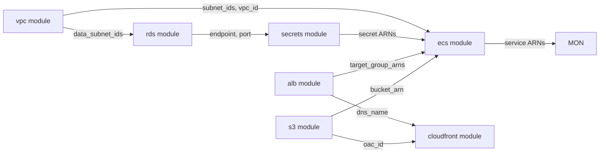
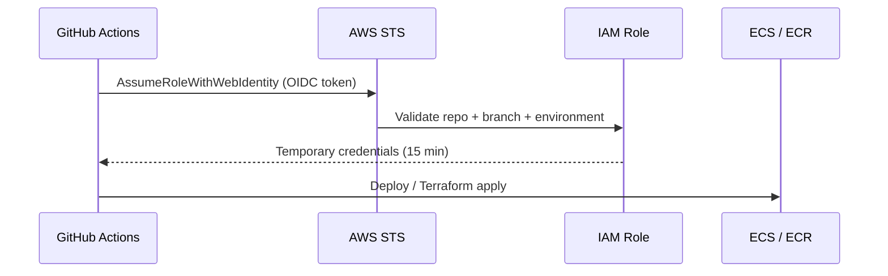
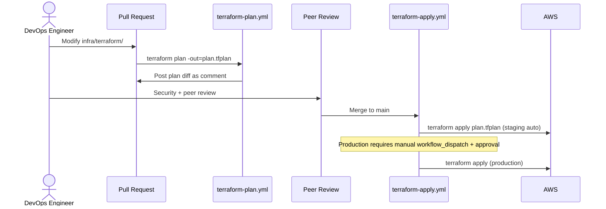

# Terraform Infrastructure as Code

**LexFlow AI** — Module Structure, State Management & Provisioning  
**Version:** 1.0  
**Status:** Draft — Pre-Implementation  
**Last Updated:** 2026-07-06

---

## Purpose

This document defines the **Terraform infrastructure-as-code** structure for LexFlow AI — module organization, environment workspaces, remote state management, IAM boundaries, and provisioning workflows. All AWS resources described in [aws-topology.md](./aws-topology.md) are provisioned exclusively through Terraform.

---

## Scope

| In Scope | Out of Scope |
|----------|--------------|
| Module directory structure and dependencies | Application Dockerfile definitions |
| Remote state backends and locking | GitHub Actions workflow YAML |
| Environment-specific variable strategy | AWS account creation |
| IAM roles for ECS tasks and CI/CD | Firm billing and cost allocation |
| Terraform plan/apply workflow | CloudFormation or CDK alternatives |

---

## Responsibilities

| Role | Responsibility |
|------|----------------|
| **DevOps / SRE** | Author and maintain Terraform modules; execute applies |
| **Security Architect** | Review IAM policies, KMS key policies, security group modules |
| **Backend Engineer** | Provide ECS task definition requirements (env vars, secrets) |
| **Release Manager** | Approve production Terraform applies |

---

## Architecture

### Module Dependency Graph



### Repository Structure

```
infra/terraform/
├── modules/
│   ├── vpc/                    # VPC, subnets, NAT, IGW, VPC endpoints
│   │   ├── main.tf
│   │   ├── variables.tf
│   │   ├── outputs.tf
│   │   └── README.md
│   ├── kms/                    # Environment encryption keys
│   ├── ecr/                    # Container registries (web, api, worker, n8n)
│   ├── rds/                    # PostgreSQL Multi-AZ, parameter groups
│   ├── elasticache/            # Redis cluster mode
│   ├── amazon_mq/              # RabbitMQ active/standby broker
│   ├── s3/                     # Document, artifact, log, state buckets
│   ├── alb/                    # Public + internal ALBs, target groups
│   ├── ecs/                    # Cluster, services, task definitions, auto-scaling
│   ├── cloudfront/             # CDN distribution, OAC, cache behaviors
│   ├── route53/                # Hosted zones, health checks, failover records
│   ├── waf/                    # WAF Web ACL, managed rule groups
│   ├── secrets/                # Secrets Manager resources and rotation
│   ├── monitoring/             # CloudWatch dashboards, alarms, SNS topics
│   └── iam/                    # ECS task roles, CI/CD deploy roles
├── environments/
│   ├── dev/
│   │   ├── main.tf             # Module composition
│   │   ├── variables.tf
│   │   ├── terraform.tfvars
│   │   ├── backend.tf          # Remote state config
│   │   └── outputs.tf
│   ├── staging/
│   └── production/
├── global/                     # Cross-account/cross-region resources
│   ├── ecr-replication/        # ECR cross-region replication
│   └── route53/                # Shared DNS zones
└── README.md
```

---

## State Management

### Remote Backend Configuration

Each environment maintains **isolated Terraform state** to prevent cross-environment blast radius.

| Environment | S3 State Bucket | DynamoDB Lock Table | Encryption | MFA Delete |
|-------------|-----------------|---------------------|------------|------------|
| Dev | `lexflow-terraform-state-dev` | `lexflow-tf-lock-dev` | KMS (dev key) | No |
| Staging | `lexflow-terraform-state-staging` | `lexflow-tf-lock-staging` | KMS (staging key) | No |
| Production | `lexflow-terraform-state-prod` | `lexflow-tf-lock-prod` | KMS (prod key) | Yes |
| Global | `lexflow-terraform-state-global` | `lexflow-tf-lock-global` | KMS (global key) | Yes |

### State Architecture



### State File Segmentation

Production state is further segmented by **module tier** to reduce plan/apply scope:

| State Key | Contents | Apply Frequency |
|-----------|----------|-----------------|
| `production/foundation/` | VPC, KMS, IAM | Rare (quarterly review) |
| `production/data/` | RDS, Redis, MQ, S3 | Monthly (sizing changes) |
| `production/compute/` | ECS, ALB | Weekly (task definition updates) |
| `production/edge/` | CloudFront, Route 53, WAF | Monthly |
| `production/monitoring/` | CloudWatch, SNS | As needed |

**Rule:** Never combine data-layer and compute-layer changes in a single apply unless coordinated with a maintenance window.

---

## Module Design Principles

### Module Interface Contract

Every module exposes a consistent interface:

| File | Purpose |
|------|---------|
| `variables.tf` | Input variables with descriptions and validation blocks |
| `outputs.tf` | Values consumed by dependent modules |
| `main.tf` | Resource definitions |
| `versions.tf` | Provider version constraints |
| `README.md` | Usage example and input/output table |

### Key Module Outputs



---

## Environment Configuration

### Variable Hierarchy

```
modules/{module}/variables.tf     ← Defaults and validation
environments/{env}/variables.tf   ← Environment-specific declarations
environments/{env}/terraform.tfvars ← Concrete values (not committed for prod secrets)
CI/CD injected vars               ← Image tags, deploy timestamps
```

### Production tfvars (Non-Secret)

| Variable | Production Value |
|----------|-----------------|
| `aws_region` | `us-east-1` |
| `environment` | `production` |
| `vpc_cidr` | `10.0.0.0/16` |
| `rds_instance_class` | `db.r6g.xlarge` |
| `rds_multi_az` | `true` |
| `redis_node_type` | `cache.r6g.large` |
| `redis_num_shards` | `2` |
| `mq_instance_type` | `mq.m5.large` |
| `ecs_web_min_count` | `2` |
| `ecs_api_min_count` | `2` |
| `ecs_worker_min_count` | `2` |
| `dr_region` | `us-west-2` |
| `enable_cross_region_snapshots` | `true` |

Secrets (database passwords, JWT keys, API keys) are **never** in tfvars — provisioned via Secrets Manager module and populated out-of-band.

---

## IAM Model

### IAM Role Matrix

| Role | Trust | Permissions |
|------|-------|-------------|
| `ecs-task-execution-role` | `ecs-tasks.amazonaws.com` | ECR pull, CloudWatch Logs, Secrets Manager read |
| `ecs-api-task-role` | `ecs-tasks.amazonaws.com` | S3 read/write (documents bucket), RDS via Secrets Manager |
| `ecs-worker-task-role` | `ecs-tasks.amazonaws.com` | S3, RDS, invoke n8n internal ALB, LLM API keys |
| `ecs-web-task-role` | `ecs-tasks.amazonaws.com` | Minimal — no direct AWS resource access |
| `github-actions-deploy-role` | OIDC (`token.actions.githubusercontent.com`) | ECR push, ECS update-service, Terraform state |
| `github-actions-terraform-role` | OIDC | Terraform plan/apply scoped per environment |

### GitHub OIDC Trust Policy



**Condition keys:** `repo:org/lexflow-ai`, `ref:refs/heads/main`, `environment:production` (for prod role).

---

## Provisioning Workflow

### Terraform Plan/Apply Sequence



### Apply Order (New Environment Bootstrap)

| Step | Module | Dependency |
|------|--------|------------|
| 1 | `kms` | None |
| 2 | `vpc` | None |
| 3 | `ecr` | None |
| 4 | `s3` | kms |
| 5 | `secrets` | kms |
| 6 | `rds` | vpc, kms |
| 7 | `elasticache` | vpc, kms |
| 8 | `amazon_mq` | vpc, kms, secrets |
| 9 | `alb` | vpc |
| 10 | `ecs` | vpc, ecr, alb, rds, redis, mq, secrets, s3 |
| 11 | `cloudfront` | alb, s3, waf |
| 12 | `route53` | cloudfront |
| 13 | `monitoring` | ecs, rds, alb, mq |

---

## CI/CD Integration

| Workflow | Trigger | Terraform Action |
|----------|---------|-----------------|
| `terraform-plan.yml` | PR touching `infra/terraform/` | Plan all affected environments; comment on PR |
| `terraform-apply-staging.yml` | Merge to main (infra changes) | Apply to staging |
| `terraform-apply-production.yml` | Manual dispatch + approval | Apply to production |

See [cicd-pipeline.md](./cicd-pipeline.md) for full pipeline details.

---

## Drift Detection

| Control | Frequency | Action |
|---------|-----------|--------|
| Scheduled `terraform plan` | Daily (production) | Alert on drift via SNS |
| AWS Config rules | Continuous | Flag resources not managed by Terraform |
| Manual audit | Quarterly | Reconcile state with AWS console |

---

## DR Region Provisioning

The us-west-2 DR environment uses a **separate Terraform workspace** with reduced resource footprint:

| Resource | DR Configuration |
|----------|-----------------|
| VPC | Same CIDR (isolated account/region — no peering conflict) |
| RDS | Restored from cross-region snapshot (not live replica) |
| S3 | CRR destination bucket (auto-provisioned by primary) |
| ECS | Cluster + task definitions ready; services at desired count 0 |
| ElastiCache | Not pre-provisioned — created during failover |
| Amazon MQ | Not pre-provisioned — created during failover |

See [disaster-recovery.md](./disaster-recovery.md) for activation procedure.

---

## Best Practices

1. **Pin provider versions** — `aws` provider locked to minor version; upgrade in dedicated PR.
2. **Use `terraform validate` and `tflint` in CI** — Catch syntax and lint issues before plan.
3. **Never `-target` in production** — Full plan ensures dependency integrity.
4. **Tag all resources** — `Environment`, `Project=lexflow`, `ManagedBy=terraform`, `CostCenter`.
5. **Separate state per environment** — No shared state files across dev/staging/prod.
6. **MFA delete on production state bucket** — Prevents accidental or malicious state deletion.
7. **Module README required** — Every module documents inputs, outputs, and example usage.
8. **Import existing resources** — Use `terraform import` rather than manual console creation.

---

## Tradeoffs

| Decision | Benefit | Cost |
|----------|---------|------|
| Monorepo Terraform vs. separate infra repo | Single PR for app + infra changes | Larger repo; broader CI scope |
| Segmented production state | Faster, safer partial applies | More backend configurations |
| OIDC over long-lived AWS keys | No static credentials in GitHub | Initial OIDC setup complexity |
| Module-per-service vs. monolithic | Reusable, testable modules | Inter-module dependency management |
| tfvars in repo (non-secret) | Transparent configuration | Prod secrets need out-of-band injection |

---

## Future Improvements

| Phase | Enhancement |
|-------|-------------|
| Phase 2 | Terraform Cloud or Spacelift for remote runs and policy-as-code (Sentinel/OPA) |
| Phase 2 | Automated drift remediation for tagged resources |
| Phase 3 | Terragrunt wrapper for DRY environment configs |
| Phase 4 | Multi-account AWS Organizations with SCP guardrails |

---

## References

| Document | Description |
|----------|-------------|
| [aws-topology.md](./aws-topology.md) | AWS resources provisioned by these modules |
| [cicd-pipeline.md](./cicd-pipeline.md) | GitHub Actions Terraform workflows |
| [environment-strategy.md](./environment-strategy.md) | Per-environment configuration |
| [disaster-recovery.md](./disaster-recovery.md) | DR region Terraform workspace |
| [../08-security/secrets-management.md](../08-security/secrets-management.md) | Secrets Manager module patterns |
| [../08-security/network-security.md](../08-security/network-security.md) | Security group module rules |
| [../11-observability/](../11-observability/) | Monitoring module alarms |
