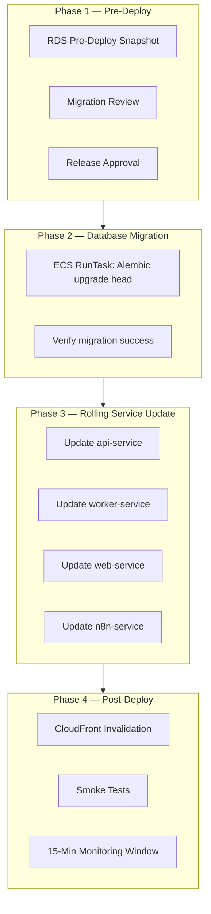
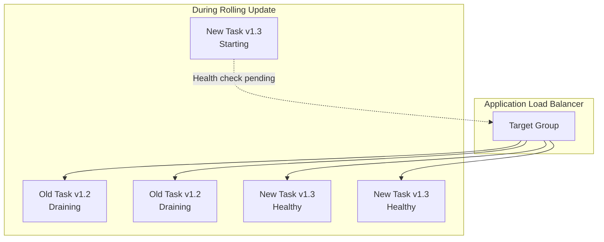
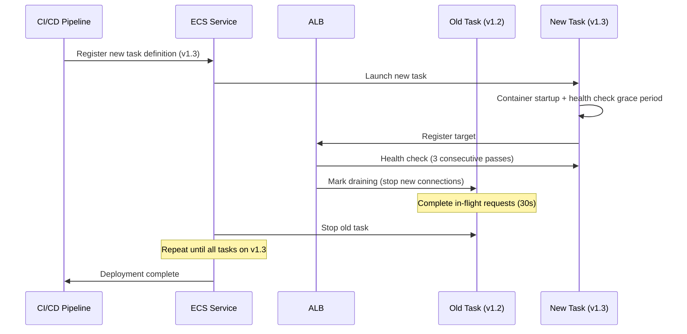
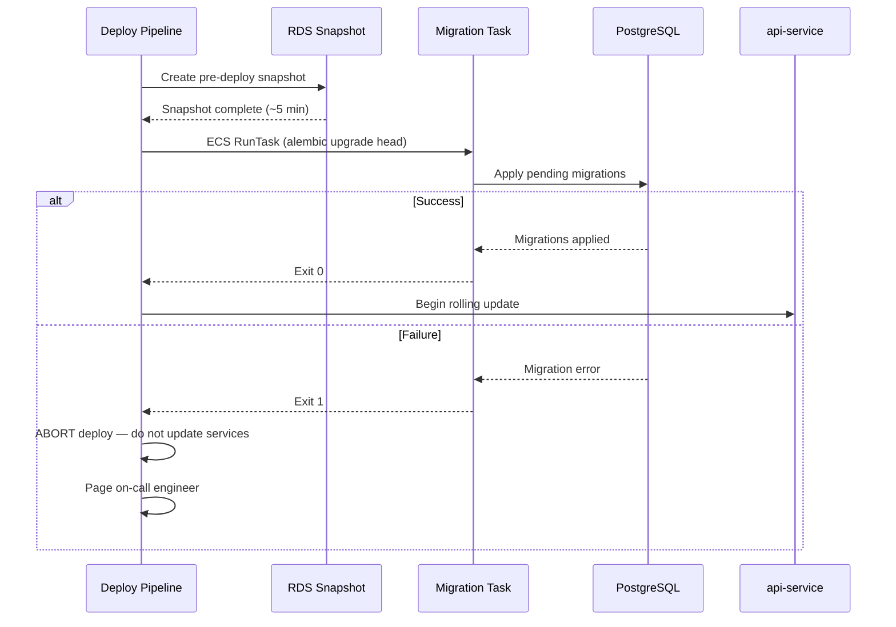
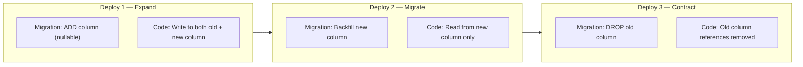
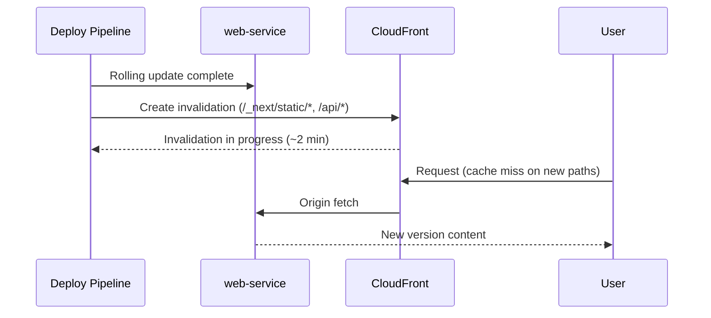
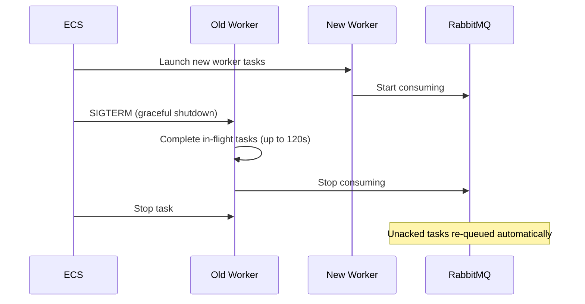
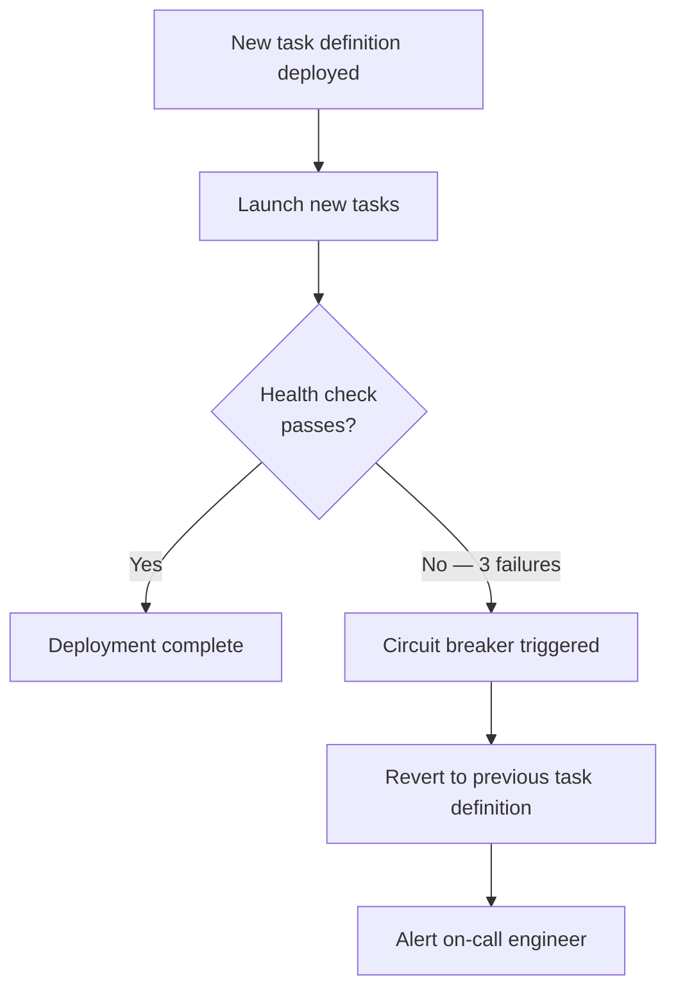

# Zero-Downtime Deployment

**LexFlow AI** — Rolling Updates, Migration Strategy & Rollback  
**Version:** 1.0  
**Status:** Draft — Pre-Implementation  
**Last Updated:** 2026-07-06

---

## Purpose

This document defines the **zero-downtime deployment strategy** for LexFlow AI — ECS rolling update mechanics, database migration ordering, service deployment sequence, CloudFront cache invalidation, and rollback procedures. All production deployments must complete without user-visible downtime or data loss.

Target: **99.9% availability** — deployments are never a cause of planned downtime.

---

## Scope

| In Scope | Out of Scope |
|----------|--------------|
| ECS rolling update configuration | Application feature flag implementation |
| Database migration ordering and compatibility rules | Alembic migration authoring (see migrations doc) |
| Service deployment sequence | n8n workflow node changes |
| Rollback procedures for app and database | Load test script implementation |
| CloudFront cache invalidation strategy | Firm change management process |

---

## Responsibilities

| Role | Responsibility |
|------|----------------|
| **DevOps / SRE** | Configure ECS deployment settings; execute deploys |
| **Backend Engineer** | Ensure migrations are backward-compatible |
| **DBA / SRE** | Review destructive migrations; execute PITR if needed |
| **Release Manager** | Approve production deploy; authorize rollback |
| **On-Call Engineer** | Monitor 15-minute post-deploy window |

---

## Architecture

### Deployment Phases

### Rolling Update Topology

---

## ECS Rolling Update Configuration

### Deployment Settings

| Setting | Production Value | Rationale |
|---------|-----------------|-----------|
| `minimumHealthyPercent` | 100 | Never drop below current capacity |
| `maximumPercent` | 200 | Allow double capacity during rollout |
| `deploymentCircuitBreaker.enable` | true | Auto-rollback on repeated health check failure |
| `deploymentCircuitBreaker.rollback` | true | Revert to previous task definition |
| `healthCheckGracePeriodSeconds` | 60 (web), 30 (api) | Allow startup time before health checks |
| `deregistrationDelay` | 30 seconds | Drain in-flight requests before stop |

### Rolling Update Sequence

### Service Deployment Order

Services are updated in dependency order to prevent version mismatch errors:

| Order | Service | Reason |
|-------|---------|--------|
| 1 | `migration` (one-off) | Schema must be ready before new code |
| 2 | `api` | Backend must accept new schema before workers |
| 3 | `worker` | Workers process jobs using new schema + API contract |
| 4 | `web` | Frontend may depend on new API response shapes |
| 5 | `n8n` | Orchestrator last — callbacks must reach updated API |
| 6 | `outbox-publisher` | Beat scheduler — lowest risk, update last |

**Parallel exception:** `api` tasks roll independently per task — no need to wait for all api tasks before starting worker update. Wait for **at least 50%** of api tasks healthy before starting worker update.

---

## Database Migration Strategy

### Migration Ordering in Deploy Pipeline

### Backward-Compatibility Rules

All migrations must be **backward-compatible** with the currently running application version. This enables rolling updates where old and new code coexist briefly.

| Operation | Zero-Downtime Safe? | Pattern |
|-----------|--------------------|---------|
| Add nullable column | Yes | Direct migration |
| Add non-null column with default | Yes | `DEFAULT` value in migration |
| Add new table | Yes | Direct migration |
| Add index (concurrently) | Yes | `CREATE INDEX CONCURRENTLY` |
| Rename column | No | Expand-contract: add new → deploy code → drop old |
| Drop column | No | Expand-contract: deploy code ignoring column → drop |
| Change column type | No | Add new column → migrate data → drop old |
| Add NOT NULL to existing column | No | Backfill → add constraint in separate migration |

See [../05-database/migrations.md](../05-database/migrations.md) for full migration authoring conventions.

### Expand-Contract Pattern

**Rule:** Destructive schema changes require **three separate deploys** across at least two days.

---

## CloudFront Cache Invalidation

After web and api services are healthy, invalidate cached content:

| Path Pattern | Reason |
|--------------|--------|
| `/_next/static/*` | New frontend bundle hashes |
| `/api/*` | API response shape changes |
| `/` | SSR page updates |

**Invalidation timing:** After ECS rolling update completes, not before — ensures origin serves new content.

**Cost control:** Batch invalidations per deploy; use wildcard paths sparingly (max 3 paths per deploy).

---

## Worker Deployment Considerations

Workers require special handling because they process in-flight jobs during deploy:

| Concern | Mitigation |
|---------|------------|
| In-flight Celery tasks | `task_acks_late=True` — task re-queued if worker killed |
| Long-running AI jobs (30–120s) | `worker_shutdown_timeout=120s`; graceful shutdown |
| Outbox publisher | Single instance — brief pause acceptable (< 30s) |
| Queue depth spike during rollout | Auto-scaling maintains min 2 workers throughout |

---

## Rollback Procedures

### Automatic Rollback (ECS Circuit Breaker)

If new tasks fail health checks repeatedly, ECS deployment circuit breaker automatically reverts:

### Manual Rollback — Application Only

| Step | Action | Duration |
|------|--------|----------|
| 1 | Identify last known-good image tag (`production-{timestamp}`) | ~1 min |
| 2 | Update ECS task definitions to previous tag | ~1 min |
| 3 | Force new deployment (rolling update to old version) | ~10 min |
| 4 | Invalidate CloudFront cache | ~2 min |
| 5 | Run smoke tests | ~5 min |
| 6 | Verify metrics return to baseline | ~15 min |

**Total RTO:** ~30 minutes for application-only rollback.

### Manual Rollback — Database Required

If a migration caused data issues:

| Step | Action | Duration |
|------|--------|----------|
| 1 | Scale API and worker tasks to 0 | ~2 min |
| 2 | Restore RDS from pre-deploy snapshot (or PITR) | ~15–30 min |
| 3 | Update Secrets Manager with restored RDS endpoint | ~1 min |
| 4 | Deploy previous application version | ~10 min |
| 5 | Run smoke tests against restored database | ~5 min |
| 6 | Resume traffic | — |

**Total RTO:** ~1 hour for database rollback.

See [../05-database/retention-backup.md](../05-database/retention-backup.md) for PITR procedures.

---

## Deployment Validation

### Smoke Test Checklist

Executed automatically after every production deploy:

| Test | Endpoint / Action | Expected |
|------|-------------------|----------|
| Health check | `GET /health` | 200, all checks `ok` |
| Authentication | Login with test service account | JWT returned |
| Case list | `GET /api/v1/cases?limit=1` | 200, paginated response |
| Document upload | Presigned URL generation | 200, URL returned |
| Workflow trigger | Trigger test workflow | 202, correlationId returned |
| Worker processing | Verify test job completes | Job status `completed` within 60s |
| n8n callback | Verify n8n health via internal ALB | 200 |

### 15-Minute Monitoring Window

| Metric | Baseline | Alert If |
|--------|----------|----------|
| ALB 5xx rate | < 0.1% | > 1% |
| API p95 latency | < 300ms | > 500ms |
| ECS task health | 100% | < 100% |
| RabbitMQ queue depth | Stable | Spike > 3× pre-deploy |
| DLQ message count | 0 | > 0 |
| Error log rate | Baseline | > 2× baseline |

See [../11-observability/alerting.md](../11-observability/alerting.md) for alert configuration.

---

## n8n Workflow Deploy Coordination

n8n workflow JSON is deployed separately from application containers:

| Scenario | Action |
|----------|--------|
| App deploy with no workflow changes | No n8n action needed |
| Workflow changes only | Import via `deploy-n8n-workflows.yml` — no app deploy |
| App + workflow changes | App deploy first → then workflow import |
| Workflow rollback | Re-import previous JSON from Git tag |

**Rule:** Never import workflows that reference API endpoints not yet deployed.

---

## Best Practices

1. **Migration before application — always** — Never deploy code that requires a schema not yet migrated.
2. **Backward-compatible migrations only** — Old code must work with new schema during rolling update.
3. **Pre-deploy snapshot mandatory** — 7-day retention enables fast database rollback.
4. **Deploy during business hours** — Tue–Thu 10:00–16:00 ET with on-call available.
5. **One logical change per deploy** — Avoid combining schema change + major feature + infra change.
6. **Monitor, don't assume success** — 15-minute window before declaring deploy complete.
7. **Document rollback plan in PR** — Required for every production-bound change.
8. **Expand-contract for destructive changes** — Three deploys minimum; never drop columns in same deploy as code change.

---

## Tradeoffs

| Decision | Benefit | Cost |
|----------|---------|------|
| Rolling update over blue/green | Simpler ECS config; no duplicate infra | Brief mixed-version window (~5 min) |
| 100% minimumHealthyPercent | Zero capacity drop during deploy | Requires 200% maxPercent (2× tasks briefly) |
| Migration as separate ECS task | Clean separation; abortable | ~2 min added to deploy duration |
| Expand-contract for schema changes | True zero-downtime for all changes | Slower schema evolution (3 deploys) |
| 15-minute monitoring window | Catches slow-burn issues | Delays deploy completion declaration |

---

## Future Improvements

| Phase | Enhancement |
|-------|-------------|
| Phase 2 | Canary deployment — 10% traffic to new version for 15 min before full rollout |
| Phase 2 | Automated rollback on error rate spike (no manual intervention) |
| Phase 3 | Blue/green with AWS CodeDeploy for instant rollback |
| Phase 4 | Database migration auto-rollback on failure (downgrade migration) |

---

## References

| Document | Description |
|----------|-------------|
| [cicd-pipeline.md](./cicd-pipeline.md) | Deploy pipeline and approval gates |
| [aws-topology.md](./aws-topology.md) | ECS service configuration |
| [docker-containers.md](./docker-containers.md) | Container health checks |
| [../05-database/migrations.md](../05-database/migrations.md) | Alembic migration conventions |
| [../05-database/retention-backup.md](../05-database/retention-backup.md) | Pre-deploy snapshots and PITR |
| [../03-architecture/nfr-requirements.md](../03-architecture/nfr-requirements.md) | 99.9% availability target |
| [../11-observability/](../11-observability/) | Post-deploy monitoring |
| [disaster-recovery.md](./disaster-recovery.md) | Full DR rollback procedures |
