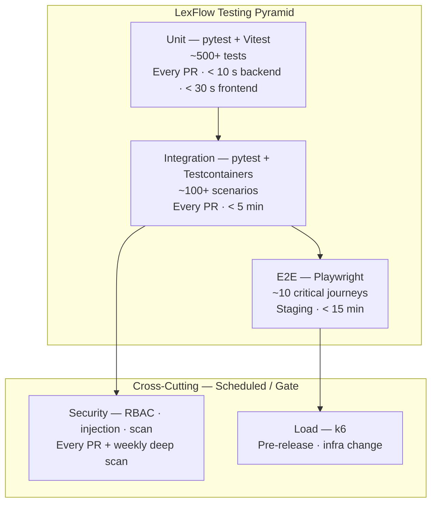
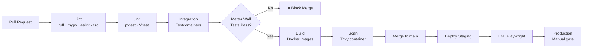
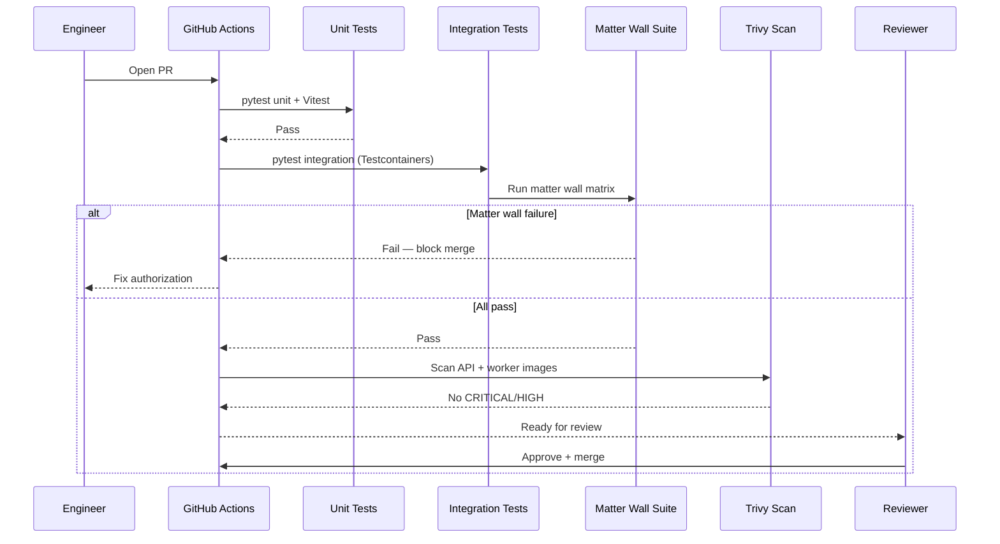
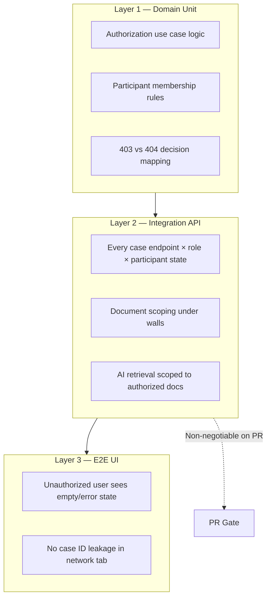

# LexFlow AI — Testing Documentation

**LexFlow AI** — Quality Assurance & Test Strategy Index  
**Version:** 1.0  
**Status:** Draft — Pre-Implementation  
**Last Updated:** 2026-07-06

---

## Purpose

This directory is the **authoritative testing reference** for LexFlow AI — the enterprise AI automation platform for large US law firms. Engineers, QA, security reviewers, and SRE teams use these documents to design, implement, and gate tests across the full quality pyramid.

Testing is not an afterthought. LexFlow handles **attorney-client privileged data** under **matter walls** and **RBAC**. Authorization regressions are compliance incidents, not cosmetic bugs. **Matter wall tests are non-negotiable on every PR.**

---

## Core Principles

| Principle | Enforcement |
|-----------|-------------|
| **Testing pyramid** | Many fast unit tests; fewer integration; minimal E2E; load and security on schedule |
| **Matter walls on every PR** | Authorization integration tests must pass before merge — no exceptions |
| **FastAPI is the security boundary** | Test authorization at API layer; frontend tests never substitute for backend auth |
| **Real infrastructure in integration** | Testcontainers for PostgreSQL, Redis, RabbitMQ — no in-memory DB shortcuts |
| **No real client data in non-prod** | Factories, seeds, and anonymization only — see [test-data.md](./test-data.md) |
| **Docs updated with behavior changes** | Test documentation updated in the same PR as new endpoints or auth rules |

---

## Scope

| In Scope | Out of Scope |
|----------|--------------|
| Unit, integration, E2E, load, and security testing strategy | Application source code and test implementations |
| CI pipeline gates and PR requirements | Terraform and infrastructure module tests |
| Test data management and anonymization policy | Penetration test raw findings |
| Matter wall and RBAC test matrices | Vendor SOC 2 report contents |
| Tooling choices (pytest, Vitest, Playwright, k6, Trivy) | n8n workflow JSON node configuration |
| Cross-references to API, security, and operational playbooks | Firm-specific ethics committee policies |

---

## Responsibilities

| Role | Responsibility |
|------|----------------|
| **Backend Engineer** | Domain unit tests (pytest); API integration tests; matter wall coverage |
| **Frontend Engineer** | Component and hook tests (Vitest); E2E spec maintenance (Playwright) |
| **QA / Test Engineer** | Test matrix ownership; E2E journey design; load test scenarios |
| **Security Reviewer** | RBAC matrix validation; injection test scope; container scan policy |
| **DevOps / SRE** | CI pipeline configuration; Testcontainers in GitHub Actions; k6 infrastructure |
| **All Contributors** | No PR merges with failing matter wall tests; no decrease in domain coverage |

---

## Architecture

### LexFlow Testing Pyramid

The pyramid reflects cost, speed, and confidence. Most defects are caught at the base; the apex validates critical user journeys under real browser and network conditions.

### Test Layer Summary

| Layer | Tooling | When | Target Duration | Coverage Goal |
|-------|---------|------|-----------------|---------------|
| **Unit (backend)** | pytest | Every PR | < 10 s total | 90% line coverage — domain + application layers |
| **Unit (frontend)** | Vitest + Testing Library | Every PR | < 30 s total | Critical components, hooks, API client |
| **Integration** | pytest + Testcontainers | Every PR | < 5 min total | All public API endpoints; all event handlers |
| **E2E** | Playwright | Post-deploy to staging | < 15 min total | Critical user journeys (see [e2e-testing.md](./e2e-testing.md)) |
| **Load** | k6 | Pre-release; infra change | On demand | 1,000 concurrent users; 50K workflows/month |
| **Security** | pytest + Trivy + ZAP | Every PR (automated); weekly (deep) | PR: < 2 min scan | All auth paths; all RBAC × matter wall combinations |

### CI Pipeline — Test Stages

**PR merge blockers (non-negotiable):**

1. All unit and integration tests pass
2. **Matter wall test suite passes** — see [integration-testing.md](./integration-testing.md)
3. No CRITICAL or HIGH container vulnerabilities (Trivy)
4. Domain + application line coverage does not decrease
5. No secrets detected in diff (TruffleHog / git-secrets)

---

## Document Map

| Document | Description |
|----------|-------------|
| [unit-testing.md](./unit-testing.md) | pytest domain and application tests; Vitest frontend component tests |
| [integration-testing.md](./integration-testing.md) | Testcontainers setup; API tests; **matter wall test matrix** |
| [e2e-testing.md](./e2e-testing.md) | Playwright critical journeys; staging environment; flake mitigation |
| [load-testing.md](./load-testing.md) | k6 scenarios; thresholds aligned with NFRs |
| [security-testing.md](./security-testing.md) | RBAC matrix tests; injection; container and dependency scanning |
| [test-data.md](./test-data.md) | Factories; seed scripts; anonymization; environment data policy |

---

## Flow Diagrams

### PR Test Execution Flow

### Authorization Test Ownership

Authorization is tested at **three layers**. Matter wall logic is never tested only in the frontend.

---

## Matter Wall Tests — Non-Negotiable

Matter walls enforce ethical boundaries and need-to-know access. A regression allows unauthorized access to privileged case data — a **compliance and ethics violation**, not a functional bug.

| Rule | Test Requirement |
|------|------------------|
| **Every PR** | Full matter wall integration suite must pass |
| **Auth-touching PRs** | RBAC parameterized matrix + matter wall matrix both required |
| **New case-scoped endpoint** | Matter wall tests added before merge — no deferral |
| **404 on GET deny** | Assert 404 (not 403) for non-participant case reads |
| **Audit on deny** | Assert audit log entry for denied_matter_wall |

See [integration-testing.md](./integration-testing.md) for the full test matrix and [../08-security/matter-walls.md](../08-security/matter-walls.md) for authorization rules.

---

## Best Practices

1. **Write the failing test first** for authorization and matter wall changes — TDD is mandatory for auth.
2. **Test behavior, not implementation** — especially in Vitest component tests.
3. **Use factories, not fixtures with hardcoded UUIDs** — see [test-data.md](./test-data.md).
4. **Keep unit tests free of I/O** — domain tests have zero framework and zero database imports.
5. **Run integration tests locally before push** — `make test-integration` spins Testcontainers.
6. **Do not skip flaky E2E** — fix root cause or quarantine with ticket and owner.
7. **Cross-check API contracts** — integration tests validate against [../04-api/](../04-api/) specs.
8. **Update this directory** when adding endpoints, roles, or matter wall rules.

---

## Tradeoffs

| Decision | Benefit | Cost |
|----------|---------|------|
| Testcontainers over mocks for DB | Catches real SQL, constraints, pgvector behavior | Slower CI; requires Docker |
| Matter wall on every PR | Prevents ethics/compliance regressions | CI time; must maintain matrix |
| 404 assertion in tests | Validates anti-enumeration contract | Harder to debug test failures |
| Minimal E2E (~10 journeys) | Fast, stable staging pipeline | Some UI paths covered only by integration |
| k6 on demand, not every PR | Avoids staging load test noise | Performance regressions caught later |
| Coverage gate on domain only | Focuses quality on business logic | Infrastructure layer coverage advisory |

---

## Future Improvements

| Phase | Enhancement |
|-------|-------------|
| Phase 2 | Contract tests — OpenAPI response schema validation in integration |
| Phase 2 | Visual regression (Playwright screenshots) for case hub UI |
| Phase 3 | Chaos testing — RabbitMQ partition, Redis failover |
| Phase 3 | Property-based testing (Hypothesis) for domain invariants |
| Phase 4 | OPA/Cedar policy test fixtures if ABAC rules exceed matrix |
| Year 2 | Production synthetic monitoring (canary journeys) |

---

## References

### Within This Directory

| Document | Path |
|----------|------|
| Unit testing | [unit-testing.md](./unit-testing.md) |
| Integration testing | [integration-testing.md](./integration-testing.md) |
| E2E testing | [e2e-testing.md](./e2e-testing.md) |
| Load testing | [load-testing.md](./load-testing.md) |
| Security testing | [security-testing.md](./security-testing.md) |
| Test data | [test-data.md](./test-data.md) |

### API & Authorization

| Document | Path |
|----------|------|
| REST API index | [../04-api/README.md](../04-api/README.md) |
| Authentication (JWT, refresh) | [../04-api/authentication.md](../04-api/authentication.md) |
| Authorization & RBAC matrix | [../04-api/authorization-rbac.md](../04-api/authorization-rbac.md) |
| Case endpoints | [../04-api/endpoints-cases.md](../04-api/endpoints-cases.md) |
| Document endpoints | [../04-api/endpoints-documents.md](../04-api/endpoints-documents.md) |
| AI endpoints | [../04-api/endpoints-ai.md](../04-api/endpoints-ai.md) |
| Error handling (403 vs 404) | [../04-api/error-handling.md](../04-api/error-handling.md) |

### Security

| Document | Path |
|----------|------|
| Security documentation index | [../08-security/README.md](../08-security/README.md) |
| Matter walls (ABAC rules) | [../08-security/matter-walls.md](../08-security/matter-walls.md) |
| Threat model | [../08-security/threat-model.md](../08-security/threat-model.md) |
| Compliance mapping | [../08-security/compliance-mapping.md](../08-security/compliance-mapping.md) |

### Operational Playbooks

| Document | Path |
|----------|------|
| CI failure triage | [../14-playbooks/ci-failure-triage.md](../14-playbooks/ci-failure-triage.md) |
| Release gate checklist | [../14-playbooks/release-gate-checklist.md](../14-playbooks/release-gate-checklist.md) |
| Staging verification | [../14-playbooks/staging-verification.md](../14-playbooks/staging-verification.md) |
| Incident response (test failures in prod) | [../08-security/incident-response.md](../08-security/incident-response.md) |

### Architecture & Standards

| Document | Path |
|----------|------|
| NFR requirements (latency, scale) | [../03-architecture/nfr-requirements.md](../03-architecture/nfr-requirements.md) |
| Development standards (PR process) | [../development-standards.md](../development-standards.md) |
| Legacy testing strategy (superseded) | [../testing-strategy.md](../testing-strategy.md) |

---

## Conventions

- All documents use Markdown with Mermaid diagrams.
- Version and last-updated date appear in each document header.
- Test IDs follow `TEST-{layer}-{number}` (e.g., `TEST-INT-MW-001`).
- Breaking test infrastructure changes require notification in `#lexflow-engineering`.
- Documentation is updated in the same PR as test-relevant code changes (once development begins).
