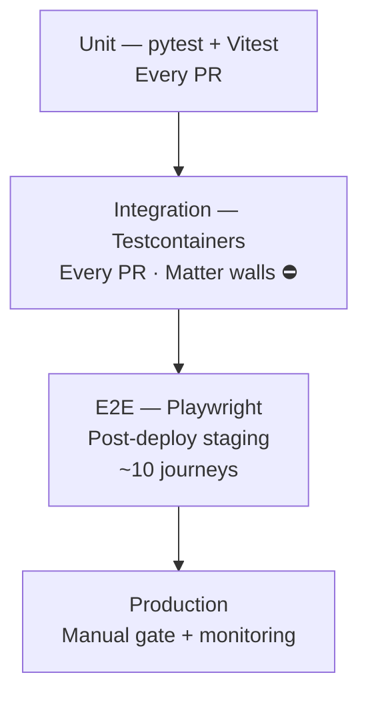
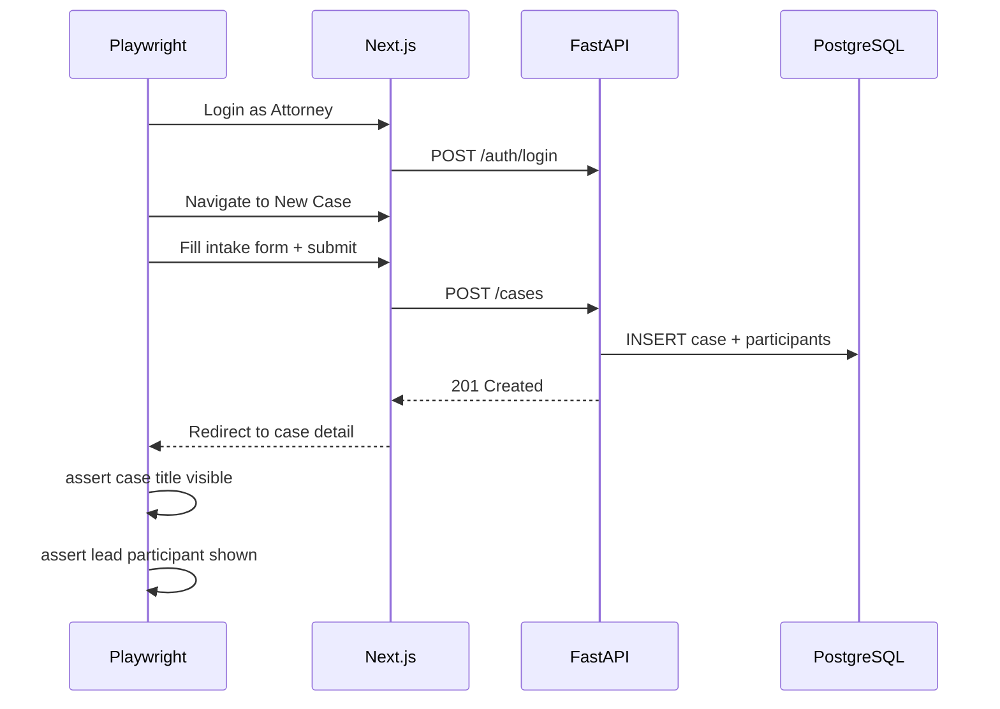
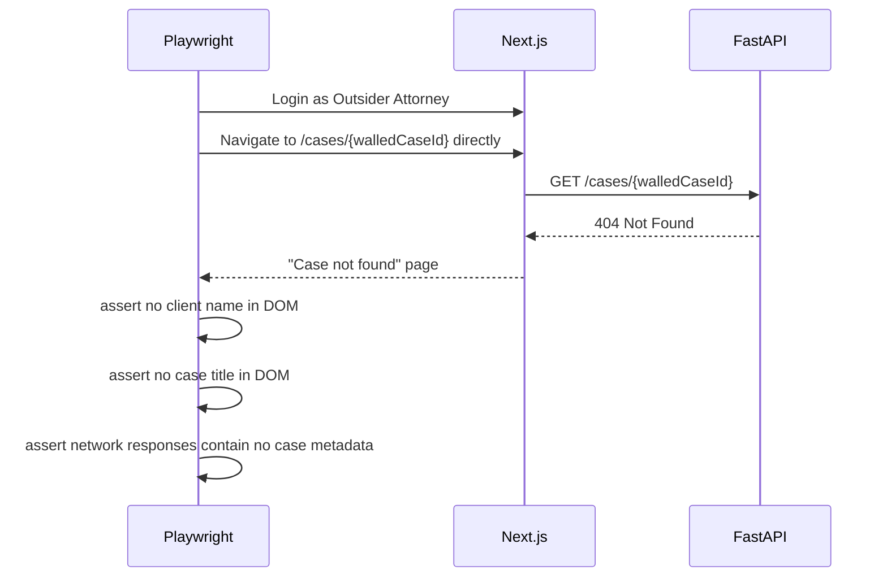
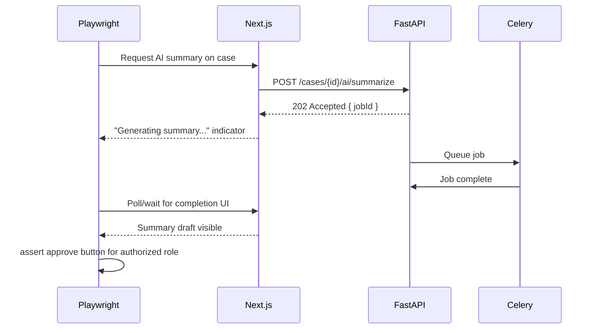
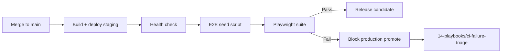

# End-to-End Testing

**LexFlow AI** — Playwright Critical User Journeys  
**Version:** 1.0  
**Status:** Draft — Pre-Implementation  
**Last Updated:** 2026-07-06

---

## Purpose

Define **end-to-end (E2E) testing standards** for LexFlow AI using **Playwright**. E2E tests validate critical user journeys in a real browser against the **staging environment** — proving that frontend, API, database, queue, and worker paths work together for attorney-facing workflows.

E2E tests sit at the top of the testing pyramid. They are **few, slow, and high-value**. They complement — but never replace — matter wall integration tests on every PR.

---

## Scope

| In Scope | Out of Scope |
|----------|--------------|
| Playwright test architecture and conventions | Unit tests (Vitest, pytest) |
| Critical journey catalog (~10 specs) | Full UI coverage of every screen |
| Staging environment and test user setup | Production testing |
| Flake mitigation and quarantine policy | Load testing (see [load-testing.md](./load-testing.md)) |
| Matter wall UI verification (UX layer) | Authorization enforcement (integration layer) |
| Accessibility smoke checks in E2E | Visual regression (Phase 2) |
| Application source code | |

**Cross-reference:** API behavior [../04-api/](../04-api/). Matter wall UX expectations [../08-security/matter-walls.md](../08-security/matter-walls.md). Staging verification [../14-playbooks/staging-verification.md](../14-playbooks/staging-verification.md).

---

## Responsibilities

| Role | Responsibility |
|------|----------------|
| **Frontend Engineer** | Maintain Playwright specs for owned UI flows |
| **QA Engineer** | Own critical journey catalog; flake triage |
| **DevOps / SRE** | Staging deploy gate; E2E job in post-deploy pipeline |
| **Security Champion** | Review matter-wall E2E spec for no information leakage |
| **Product Owner** | Prioritize which journeys are release blockers |

---

## Architecture

### E2E Position in Pyramid



### E2E Test Environment

```mermaid
flowchart LR
    subgraph CI["GitHub Actions — Post-Deploy"]
        PW[Playwright Runner]
    end

    subgraph Staging["Staging Environment"]
        WEB[Next.js — staging.lexflow.{firm}]
        API[FastAPI — api-staging.lexflow.{firm}]
        PG[(PostgreSQL)]
        S3[(S3 — staging bucket)]
        WORK[Celery Workers]
    end

    subgraph Data["Test Data"]
        FIRM[Dedicated test firm]
        USERS[Known users by role]
        CASES[Seeded cases — walled + unwalled]
    end

    PW -->|Browser| WEB
    WEB --> API
    API --> PG & S3
    API --> WORK
    Data --> PG
```

| Environment Variable | Purpose |
|---------------------|---------|
| `E2E_BASE_URL` | Staging frontend URL |
| `E2E_API_URL` | Staging API (for direct setup/teardown) |
| `E2E_FIRM_ID` | Dedicated test firm UUID |
| `E2E_ATTORNEY_EMAIL` / `E2E_ATTORNEY_PASSWORD` | Participant user |
| `E2E_OUTSIDER_EMAIL` / `E2E_OUTSIDER_PASSWORD` | Non-participant attorney |
| `E2E_ADMIN_EMAIL` / `E2E_ADMIN_PASSWORD` | SystemAdministrator |

Credentials stored in GitHub Actions secrets — never in repository.

### Directory Layout (Conceptual)

```
tests/e2e/
├── playwright.config.ts
├── fixtures/
│   ├── auth.fixture.ts              # Login helpers by role
│   └── test-data.fixture.ts           # Case IDs from staging seed
├── pages/                             # Page Object Model
│   ├── login.page.ts
│   ├── case-hub.page.ts
│   ├── case-detail.page.ts
│   ├── document-upload.page.ts
│   └── approval.page.ts
├── specs/
│   ├── auth.spec.ts
│   ├── case-intake.spec.ts
│   ├── document-upload.spec.ts
│   ├── ai-summary.spec.ts
│   ├── workflow-trigger.spec.ts
│   ├── approval-flow.spec.ts
│   ├── matter-wall.spec.ts            # UI verification — not security gate alone
│   └── admin-user-management.spec.ts
└── global-setup.ts                    # Verify staging health before suite
```

---

## Critical Journey Catalog

Approximately **ten E2E specs** cover release-blocking paths. Each spec maps to product capabilities in [../01-product/capabilities.md](../01-product/capabilities.md).

| Spec | Journey | Release Blocker | Test ID |
|------|---------|-----------------|---------|
| `auth.spec.ts` | Login → dashboard → logout → session expired redirect | Yes | `TEST-E2E-001` |
| `case-intake.spec.ts` | Create case → assign participants → verify case hub | Yes | `TEST-E2E-002` |
| `document-upload.spec.ts` | Upload PDF → processing indicator → view document | Yes | `TEST-E2E-003` |
| `ai-summary.spec.ts` | Request summary → poll status → review draft | Yes | `TEST-E2E-004` |
| `approval-flow.spec.ts` | Submit for approval → partner approves → audit visible | Yes | `TEST-E2E-005` |
| `workflow-trigger.spec.ts` | Trigger workflow → monitor status → completion badge | Yes | `TEST-E2E-006` |
| `matter-wall.spec.ts` | Outsider navigates to walled case URL → not-found UX | Yes | `TEST-E2E-007` |
| `admin-user-management.spec.ts` | Admin creates user → assigns role → user logs in | No | `TEST-E2E-008` |
| `case-search.spec.ts` | Search cases → filter → open detail | No | `TEST-E2E-009` |
| `notification.spec.ts` | Trigger event → notification appears in inbox | No | `TEST-E2E-010` |

### Journey Priority Rationale

| Priority | Journeys | Why |
|----------|----------|-----|
| P0 — Block release | auth, case-intake, document-upload, ai-summary, approval, matter-wall | Core attorney workflow + ethics boundary |
| P1 — Block if touched | workflow-trigger | Integration-heavy; E2E catches UI polling bugs |
| P2 — Informational | admin, search, notification | Important but covered partially by integration |

---

## Journey Flow Diagrams

### Case Intake — Full Journey



### Matter Wall — UI Verification

E2E validates **user experience** for unauthorized access. Security enforcement is proven in [integration-testing.md](./integration-testing.md).



### AI Summary — Async UX



---

## Playwright Conventions

### Page Object Model

| Rule | Detail |
|------|--------|
| One page object per major screen | Encapsulate selectors and actions |
| Selectors | `getByRole`, `getByLabel` — avoid CSS class selectors |
| No assertions in page objects | Assertions live in spec files |
| Shared auth fixture | `test.use({ storageState })` after login setup |

### Timing and Stability

| Technique | Usage |
|-----------|-------|
| `expect(locator).toBeVisible()` | Auto-wait — preferred over `waitForTimeout` |
| `waitForResponse` | Assert API call completed before UI check |
| `test.slow()` | Mark AI/workflow specs that exceed 30 s |
| Retry | CI: 1 retry on failure; local: 0 retries |
| Trace | `trace: 'on-first-retry'` in CI config |

### Anti-Flake Policy

| Rule | Enforcement |
|------|-------------|
| No `waitForTimeout` except with ticket | Reviewer reject |
| Quarantine flaky spec | `@pytest.mark.quarantine` equivalent: tag `@quarantine` + issue |
| Max quarantine duration | 5 business days — fix or delete |
| Root cause categories | Staging data drift, async timeout, selector brittleness |

---

## Staging Data Requirements

E2E relies on **deterministic staging seed** — see [test-data.md](./test-data.md).

| Entity | Requirement |
|--------|-------------|
| Test firm | Isolated firm ID; never shared with manual QA |
| Users | One user per system role; passwords in secrets |
| Walled case | Case A — participant: `E2E_ATTORNEY`; outsider blocked |
| Unwalled case | Case B — for negative matter-wall tests |
| Document | Pre-uploaded PDF on Case A — for view/download tests |
| Workflow template | Active template bound to test firm |

Seed refreshed on every staging deploy via `scripts/seed/e2e_seed.py`.

---

## CI Pipeline Integration



| Setting | Value |
|---------|-------|
| Trigger | Post-deploy to staging on `main` |
| Browsers | Chromium only in CI (Firefox optional locally) |
| Parallelism | 2 workers — avoid staging rate limits |
| Timeout | 15 minutes total suite |
| Artifacts | Trace, screenshot, video on failure |

---

## Accessibility in E2E

Minimal a11y smoke — not a replacement for axe-core in unit tests.

| Check | Tool | Spec |
|-------|------|------|
| Login page | `@axe-core/playwright` | `auth.spec.ts` |
| Case intake form | `@axe-core/playwright` | `case-intake.spec.ts` |
| Document viewer | `@axe-core/playwright` | `document-upload.spec.ts` |

Violations of **critical** or **serious** impact block release.

---

## Best Practices

1. **Never test security only in E2E** — matter wall integration tests are the PR gate.
2. **Use Page Object Model** — specs read as user journeys, not selector lists.
3. **Setup via API when possible** — create case via API fixture; test UI path separately.
4. **Assert network responses in matter-wall spec** — no case data in 404 body.
5. **Keep suite under 15 minutes** — split new journeys only if P0 justified.
6. **Run locally against staging** — `E2E_BASE_URL=... pnpm exec playwright test`.
7. **Update specs when UX changes** — E2E failures are expected after intentional UI changes.

---

## Tradeoffs

| Decision | Benefit | Cost |
|----------|---------|------|
| ~10 specs vs full coverage | Stable, fast staging pipeline | Some screens untested in browser |
| Staging-only (not PR) | Real infra; no Testcontainers browser cost | Feedback loop slower than unit/integration |
| Chromium-only in CI | Faster, deterministic | Miss browser-specific bugs |
| API setup + UI assert | Faster, less flaky | Split setup from UI under test |
| 1 retry in CI | Reduces infra flake noise | Masks intermittent real bugs — monitor retry rate |

---

## References

| Document | Path |
|----------|------|
| Integration testing (matter wall gate) | [integration-testing.md](./integration-testing.md) |
| Test data (E2E seed) | [test-data.md](./test-data.md) |
| Unit testing (Vitest) | [unit-testing.md](./unit-testing.md) |
| Authentication | [../04-api/authentication.md](../04-api/authentication.md) |
| Matter walls | [../08-security/matter-walls.md](../08-security/matter-walls.md) |
| Staging verification playbook | [../14-playbooks/staging-verification.md](../14-playbooks/staging-verification.md) |
| CI failure triage | [../14-playbooks/ci-failure-triage.md](../14-playbooks/ci-failure-triage.md) |
| Release gate checklist | [../14-playbooks/release-gate-checklist.md](../14-playbooks/release-gate-checklist.md) |
| NFR performance targets | [../03-architecture/nfr-requirements.md](../03-architecture/nfr-requirements.md) |
| Testing index | [README.md](./README.md) |

---

## Conventions

- Test IDs: `TEST-E2E-{number}`
- Spec files: `*.spec.ts` in `tests/e2e/specs/`
- Tag blockers: `@release-blocker` in spec describe block
- Quarantine tag: `@quarantine` + linked GitHub issue required
