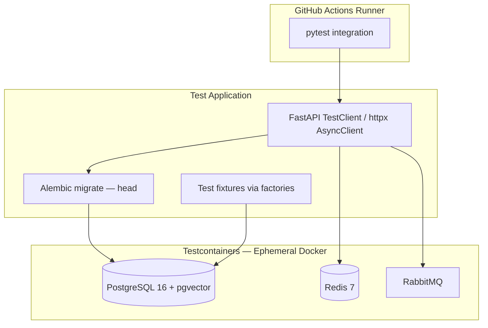
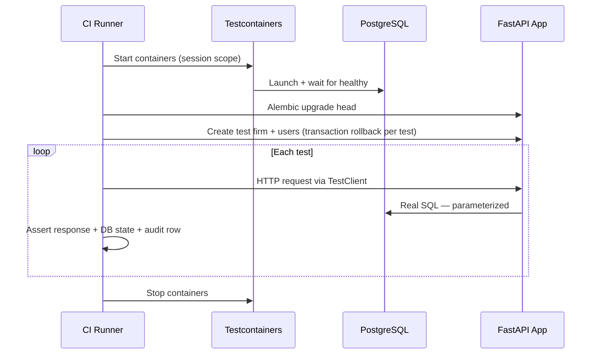
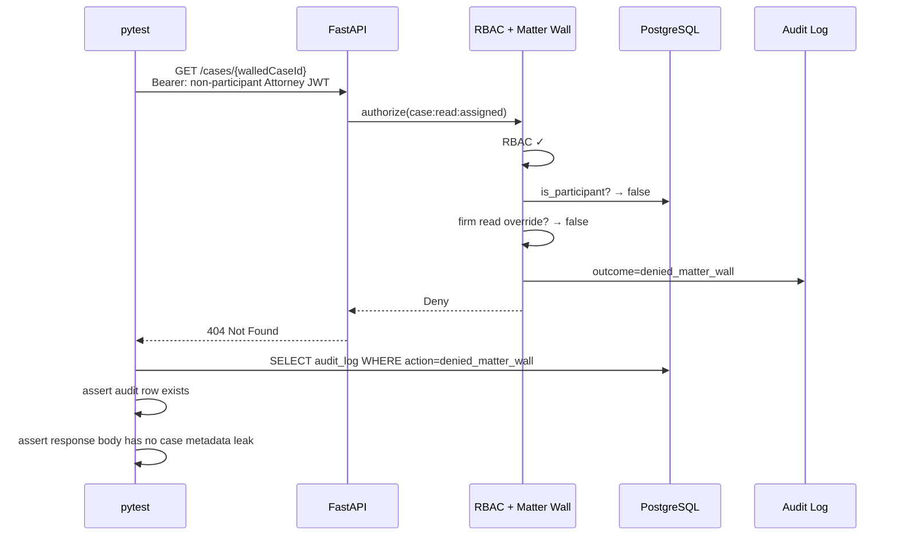
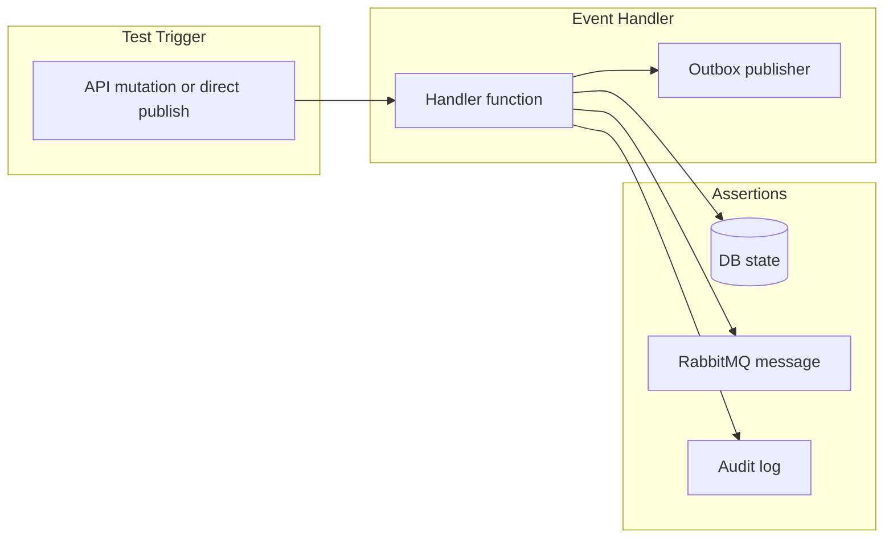

# Integration Testing

**LexFlow AI** — API, Database & Matter Wall Integration Tests  
**Version:** 1.0  
**Status:** Draft — Pre-Implementation  
**Last Updated:** 2026-07-06

---

## Purpose

Define **integration testing standards** for LexFlow AI using pytest with **Testcontainers**. Integration tests validate API endpoints, database persistence, queue publishing, event handlers, and — critically — **matter wall enforcement** at the HTTP boundary.

**Matter wall tests are non-negotiable on every PR.** No pull request that touches authorization, case endpoints, documents, AI, or workflows may merge without the full matter wall suite passing.

---

## Scope

| In Scope | Out of Scope |
|----------|--------------|
| Testcontainers infrastructure (PostgreSQL, Redis, RabbitMQ) | Unit tests (see [unit-testing.md](./unit-testing.md)) |
| API endpoint integration tests | E2E browser tests |
| Matter wall test matrix — every PR | Load testing |
| Event handler and outbox tests | OWASP ZAP full scan (see [security-testing.md](./security-testing.md)) |
| n8n callback simulation (HMAC) | Real n8n instance in CI |
| Optimistic concurrency and idempotency tests | Application source code |

**Cross-reference:** Endpoint specs [../04-api/](../04-api/). Matter wall rules [../08-security/matter-walls.md](../08-security/matter-walls.md). Internal webhooks [../04-api/webhooks-internal.md](../04-api/webhooks-internal.md).

---

## Responsibilities

| Role | Responsibility |
|------|----------------|
| **Backend Engineer** | Write and maintain API integration tests for owned bounded context |
| **Security Champion** | Review matter wall matrix updates when roles or endpoints change |
| **QA Engineer** | Maintain cross-context scenario tests (document → AI → approval) |
| **DevOps / SRE** | Testcontainers in GitHub Actions; Docker layer caching |
| **Reviewer** | Block merge if matter wall tests missing for new case-scoped routes |

---

## Architecture

### Integration Test Infrastructure



### Test Suite Structure (Conceptual)

```
tests/integration/
├── conftest.py                       # Testcontainers lifecycle, app fixture, auth helpers
├── factories/                        # Re-exports from shared test-data factories
├── helpers/
│   ├── auth.py                       # JWT minting for test users by role
│   ├── matter_wall.py                # Participant setup utilities
│   └── hmac.py                       # n8n callback signature helper
├── api/
│   ├── test_auth_api.py
│   ├── test_case_api.py
│   ├── test_document_api.py
│   ├── test_ai_api.py
│   ├── test_workflow_api.py
│   └── test_audit_api.py
├── matter_wall/
│   ├── test_matter_wall_cases.py     # ⛔ PR gate — non-negotiable
│   ├── test_matter_wall_documents.py
│   ├── test_matter_wall_ai.py
│   └── test_matter_wall_workflows.py
├── events/
│   ├── test_case_created_handler.py
│   ├── test_document_processed_handler.py
│   ├── test_workflow_completed_handler.py
│   └── test_outbox_publisher.py
├── scenarios/
│   ├── test_case_intake_audit_trail.py
│   ├── test_document_upload_pipeline.py
│   ├── test_ai_summary_approval_flow.py
│   └── test_workflow_trigger_callback.py
└── concurrency/
    ├── test_optimistic_locking.py
    └── test_idempotency_keys.py
```

---

## Testcontainers Configuration

### Container Images

| Service | Image | Extensions / Notes |
|---------|-------|-------------------|
| PostgreSQL | `pgvector/pgvector:pg16` | Schemas: identity, cases, documents, ai, workflows, audit |
| Redis | `redis:7-alpine` | Session cache, rate limit, permission cache |
| RabbitMQ | `rabbitmq:3-management-alpine` | Celery broker; management API for queue assertions |

### Lifecycle



### conftest.py Responsibilities

| Fixture | Scope | Purpose |
|---------|-------|---------|
| `postgres_container` | session | Start/stop PostgreSQL Testcontainer |
| `redis_container` | session | Start/stop Redis |
| `rabbitmq_container` | session | Start/stop RabbitMQ |
| `app` | session | FastAPI app wired to container URLs |
| `db_session` | function | Transaction rollback after each test |
| `client` | function | Authenticated httpx AsyncClient |
| `firm` | function | Test law firm tenant |
| `auth_headers` | function | Factory: role → JWT Bearer headers |

---

## API Integration Tests

### Endpoint Coverage Requirements

Every public endpoint documented in [../04-api/](../04-api/) must have integration coverage before the endpoint ships.

| Endpoint Group | Doc Reference | Minimum Tests |
|----------------|---------------|---------------|
| Authentication | [authentication.md](../04-api/authentication.md) | Login, refresh, logout, expired token, invalid credentials |
| Cases | [endpoints-cases.md](../04-api/endpoints-cases.md) | CRUD, participants, tasks, pagination, 404 on wall deny |
| Documents | [endpoints-documents.md](../04-api/endpoints-documents.md) | Presigned upload, confirm, download, search scoped to case |
| AI | [endpoints-ai.md](../04-api/endpoints-ai.md) | 202 async pattern, job poll, approval, wall-scoped retrieval |
| Workflows | [endpoints-workflows.md](../04-api/endpoints-workflows.md) | Trigger, status, cancel, HMAC callback |
| Errors | [error-handling.md](../04-api/error-handling.md) | RFC 7807 shape, status code mapping |

### Standard API Test Pattern

Each endpoint test validates:

1. **Happy path** — authorized user, expected 200/201/202 and response envelope
2. **RBAC deny** — user lacks permission → 403 Forbidden
3. **Matter wall deny** — user has permission but not participant → 404 Not Found (GET) or 403/404 per [error-handling.md](../04-api/error-handling.md)
4. **Validation error** — malformed input → 422 with Problem Details
5. **Audit log** — mutating operations write audit entry with actor and correlation ID

### Response Envelope Assertions

Per [../04-api/rest-standards.md](../04-api/rest-standards.md):

| Field | Assertion |
|-------|-----------|
| `data` | Present on success; shape matches OpenAPI schema |
| `meta.requestId` | Non-empty UUID |
| `meta.timestamp` | Valid ISO 8601 UTC |
| Error body | RFC 7807 `type`, `title`, `status`, `detail` |

---

## Matter Wall Tests — Non-Negotiable

### Why Every PR

Matter wall regressions expose **privileged case data** to unauthorized attorneys — an ethical wall breach. Integration tests are the authoritative proof that FastAPI enforces ABAC at the HTTP layer.

| Policy | Detail |
|--------|--------|
| **PR gate** | `tests/integration/matter_wall/` must pass — CI hard fail |
| **No skip** | `@pytest.mark.skip` forbidden without Security Champion approval + ticket |
| **New endpoint** | Matter wall tests added in same PR as route |
| **Auth refactor** | Full matrix re-run; parameterized count must not decrease |

### Matter Wall Test Matrix

Test every combination of **system role × participant state × HTTP method × resource**.

#### Roles Under Test

From [../04-api/authorization-rbac.md](../04-api/authorization-rbac.md):

| System Role | Firm Read Override | Expected Wall Behavior |
|-------------|-------------------|------------------------|
| `Attorney` | No | Participant required for case-scoped access |
| `Paralegal` | No | Participant required |
| `ManagingPartner` | `case:read:firm` | Read all cases; write only if participant |
| `ComplianceOfficer` | `case:read:firm` | Read all cases |
| `OperationsTeam` | No | Participant required — no bypass |
| `SystemAdministrator` | Admin endpoints only | No document/AI content access |
| `Client` | Portal scope | Own cases only; no internal notes |

#### Participant States

| State | Description |
|-------|-------------|
| `lead` | Full case management |
| `associate` | Read/write case data |
| `paralegal` | Tasks, documents — no AI approval |
| `observer` | Read-only |
| `non_participant` | Not in `case_participants` table |
| `removed_participant` | Previously participant, now removed |

#### Resource Endpoints Under Test

| Resource | Methods | Wall Rule Reference |
|----------|---------|---------------------|
| `GET /cases/{id}` | GET | MW-004 → 404 |
| `PATCH /cases/{id}` | PATCH | 403 or 404 per method policy |
| `GET /cases/{id}/documents` | GET | MW-001, MW-006 |
| `POST /cases/{id}/documents/upload-url` | POST | MW-001 |
| `GET /cases/{id}/ai/summaries` | GET | MW-006, MW-007 |
| `POST /cases/{id}/ai/summarize` | POST | MW-001 |
| `POST /cases/{id}/workflows/trigger` | POST | MW-001 |
| `GET /cases/{id}/participants` | GET | MW-001 |

### Matter Wall Test ID Convention

| ID | Scenario |
|----|----------|
| `TEST-INT-MW-001` | Non-participant GET case → 404 |
| `TEST-INT-MW-002` | Non-participant PATCH case → 403 |
| `TEST-INT-MW-003` | ManagingPartner non-participant GET → 200 |
| `TEST-INT-MW-004` | ManagingPartner non-participant PATCH → 403 |
| `TEST-INT-MW-005` | SystemAdministrator GET document content → 403 |
| `TEST-INT-MW-006` | Client GET other client's case → 404 |
| `TEST-INT-MW-007` | Client GET internal notes → 404 or empty |
| `TEST-INT-MW-008` | AI search excludes unwalled case documents |
| `TEST-INT-MW-009` | Denied access writes audit `denied_matter_wall` |
| `TEST-INT-MW-010` | Removed participant loses access immediately |

### Matter Wall Flow — Integration Assertion



---

## Cross-Context Scenario Tests

End-to-end business flows validated at integration layer (no browser).

| Scenario | Steps Validated | Test ID |
|----------|-----------------|---------|
| Case intake audit trail | Create case → audit row → timeline event | `TEST-INT-SC-001` |
| Document upload pipeline | Presigned URL → confirm → `DocumentProcessed` event → embedding job queued | `TEST-INT-SC-002` |
| AI summary approval | Request → 202 → worker completes → approve → visible on case | `TEST-INT-SC-003` |
| Workflow trigger + callback | Trigger → 202 → mock n8n HMAC callback → case updated | `TEST-INT-SC-004` |
| Concurrent case update | Two PATCH with same version → second returns 409 | `TEST-INT-SC-005` |
| Idempotency key replay | Duplicate POST with same key → same response, one side effect | `TEST-INT-SC-006` |

### n8n Callback Simulation

Internal webhooks use HMAC — not JWT. Integration tests use `helpers/hmac.py` to sign payloads per [../04-api/webhooks-internal.md](../04-api/webhooks-internal.md).

| Test | Validates |
|------|-----------|
| Valid HMAC signature | 200 + state update |
| Invalid signature | 401 Unauthorized |
| Replay with old timestamp | 401 — timestamp window |
| Callback for unwalled case job | 404 — matter wall on internal routes |

---

## Event Handler Tests



| Handler | Validates |
|---------|-----------|
| `CaseCreatedHandler` | Welcome notification queued; audit entry |
| `DocumentProcessedHandler` | Embedding job enqueued; case timeline updated |
| `WorkflowCompletedHandler` | Case status transition; audit |
| `OutboxPublisher` | At-least-once delivery; idempotent publish |

---

## CI Integration

```yaml
# Conceptual — integration job
integration:
  runs-on: ubuntu-latest
  services: {}  # Testcontainers manages containers
  steps:
    - run: docker info
    - run: pytest tests/integration -m integration --timeout=300
    - run: pytest tests/integration/matter_wall --timeout=120  # explicit gate
```

| Metric | Target |
|--------|--------|
| Total integration suite | < 5 minutes |
| Matter wall suite alone | < 2 minutes |
| Flake rate | < 0.5% — quarantine with owner if exceeded |

---

## Best Practices

1. **Transaction rollback per test** — no shared mutable state between tests.
2. **Use auth helper factories** — never hardcode JWT strings in test files.
3. **Assert audit log on every deny** — compliance evidence in tests.
4. **Test 404 body does not leak** — no case title, client name, or participant hints.
5. **Run matter wall suite locally before auth PRs** — `pytest tests/integration/matter_wall`.
6. **Align with OpenAPI** — schemathesis or manual schema assert on response shape.
7. **Do not mock the database** — integration means real PostgreSQL.

---

## Tradeoffs

| Decision | Benefit | Cost |
|----------|---------|------|
| Testcontainers vs shared staging DB | Isolation, reproducibility, parallel CI | Docker required; ~30 s startup |
| Full matter wall matrix on every PR | Catches all auth regressions | CI time grows with endpoints |
| 404 assertion | Validates anti-enumeration | Tests harder to debug |
| HMAC simulation vs real n8n | Fast, deterministic | Does not test n8n workflow logic |
| Session-scoped containers | Amortize startup cost | Test pollution risk — mitigated by rollback |

---

## References

| Document | Path |
|----------|------|
| Unit testing | [unit-testing.md](./unit-testing.md) |
| Test data factories | [test-data.md](./test-data.md) |
| Security testing | [security-testing.md](./security-testing.md) |
| Matter walls | [../08-security/matter-walls.md](../08-security/matter-walls.md) |
| Authorization RBAC | [../04-api/authorization-rbac.md](../04-api/authorization-rbac.md) |
| Error handling | [../04-api/error-handling.md](../04-api/error-handling.md) |
| Internal webhooks | [../04-api/webhooks-internal.md](../04-api/webhooks-internal.md) |
| Release gate playbook | [../14-playbooks/release-gate-checklist.md](../14-playbooks/release-gate-checklist.md) |
| Testing index | [README.md](./README.md) |

---

## Conventions

- Marker: `@pytest.mark.integration` — all files in `tests/integration/`
- Matter wall marker: `@pytest.mark.matter_wall` — subset for explicit CI gate
- Test IDs: `TEST-INT-{MW\|API\|SC\|EV}-{number}`
- Every new case-scoped route requires at least 3 matter wall tests: participant allow, non-participant deny, firm-read override (if applicable)
