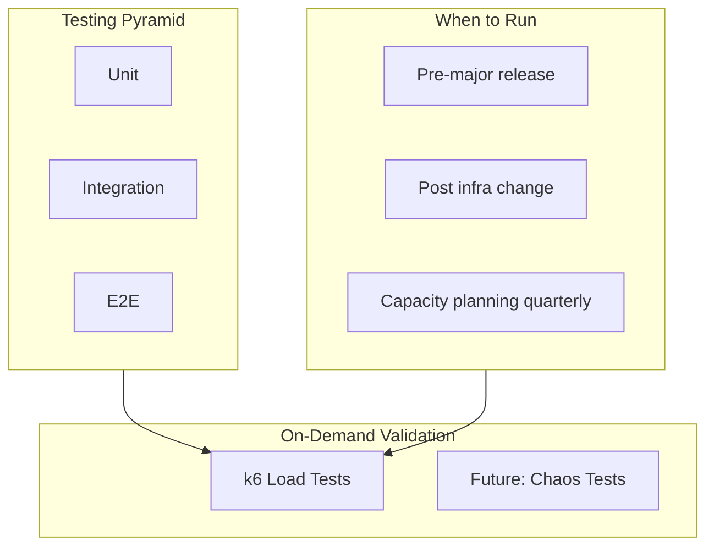
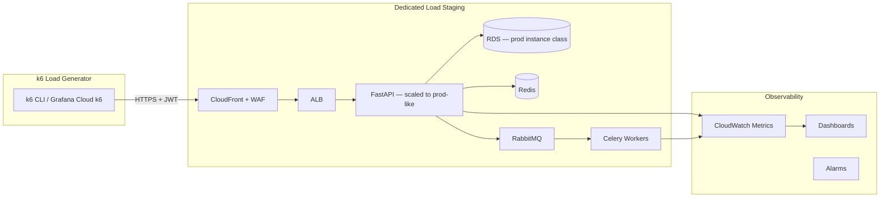
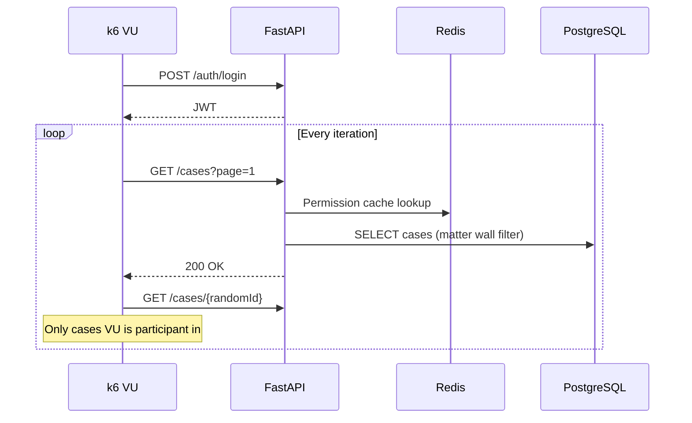
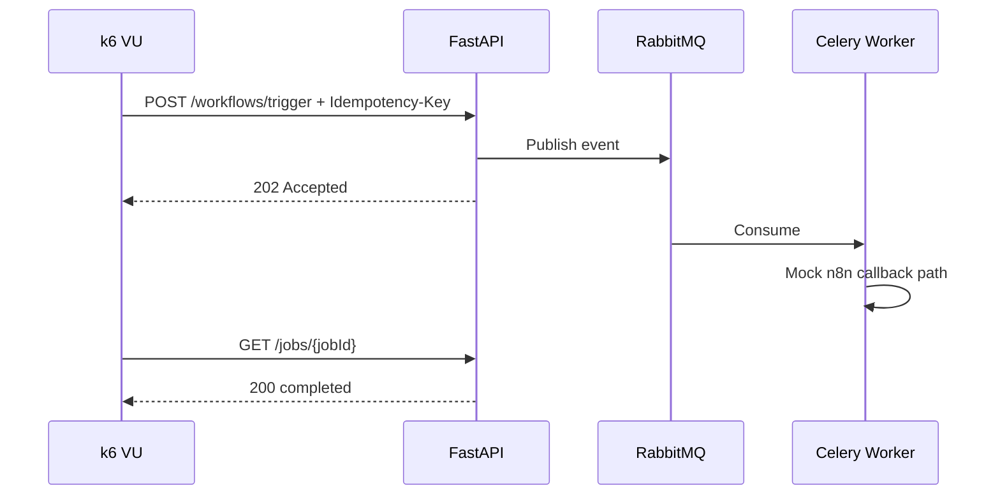
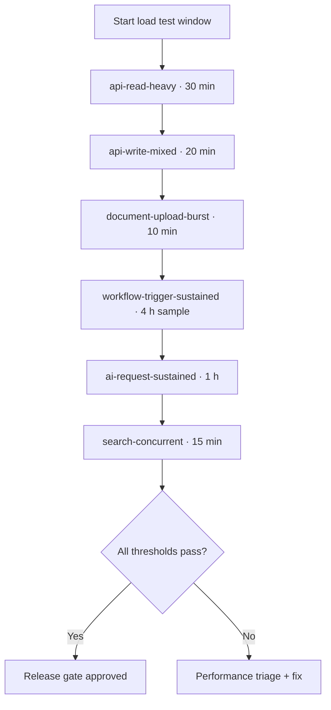

# Load Testing

**LexFlow AI** — k6 Performance & Capacity Validation  
**Version:** 1.0  
**Status:** Draft — Pre-Implementation  
**Last Updated:** 2026-07-06

---

## Purpose

Define **load testing standards** for LexFlow AI using **Grafana k6**. Load tests validate that the platform meets non-functional capacity and latency targets under expected and peak production load — before major releases and after infrastructure changes.

Load tests run **on demand**, not on every PR. They complement the testing pyramid base (unit/integration) by proving scale characteristics that Testcontainers cannot simulate.

---

## Scope

| In Scope | Out of Scope |
|----------|--------------|
| k6 scenario design and directory layout | Unit and integration tests |
| Threshold definitions aligned with NFRs | E2E Playwright journeys |
| Staging load test environment setup | Production load testing without approval |
| Capacity targets (users, workflows, documents) | Cost optimization analysis |
| AI and async path load patterns | Application source code |
| Result interpretation and regression triage | |

**Cross-reference:** NFR targets [../03-architecture/nfr-requirements.md](../03-architecture/nfr-requirements.md). API tiers [../04-api/rest-standards.md](../04-api/rest-standards.md). Release gate [../14-playbooks/release-gate-checklist.md](../14-playbooks/release-gate-checklist.md).

---

## Responsibilities

| Role | Responsibility |
|------|----------------|
| **QA / Performance Engineer** | Author and maintain k6 scenarios; analyze results |
| **DevOps / SRE** | Provision load generator infra; staging isolation during tests |
| **Backend Engineer** | Fix performance regressions identified by load tests |
| **Solution Architect** | Approve threshold changes against NFR document |
| **Product Owner** | Sign off on capacity targets for release |

---

## Architecture

### Load Test Position in Quality Strategy



### Load Test Infrastructure



| Rule | Detail |
|------|--------|
| **Never load test production** without executive + SRE approval |
| **Dedicated window** | Staging load tests run in scheduled maintenance window |
| **Notify** | `#lexflow-engineering` + SRE on-call 24 h before run |
| **Data** | Generated via k6 scripts — not real client data |
| **Isolation** | No E2E or manual QA on load staging during run |

### Directory Layout (Conceptual)

```
tests/load/
├── README.md
├── config/
│   ├── staging.env.json              # Base URL, think times
│   └── thresholds/
│       ├── default.json              # Standard thresholds
│       ├── production-gate.json      # Pre-release strict gate
│       └── ai-relaxed.json           # AI endpoints — relaxed latency
├── lib/
│   ├── auth.js                       # JWT acquisition helper
│   ├── cases.js                      # Case CRUD helpers
│   └── documents.js                  # Upload flow helpers
├── scenarios/
│   ├── api-read-heavy.js             # Browse cases — 1000 VUs
│   ├── api-write-mixed.js            # Create/update cases — 200 VUs
│   ├── document-upload-burst.js      # 100 simultaneous uploads
│   ├── workflow-trigger-sustained.js # 50K workflows / 24 h
│   ├── ai-request-sustained.js       # AI job submission rate
│   ├── search-concurrent.js          # Full-text + vector search
│   └── auth-token-refresh.js         # Session churn
└── results/                          # Gitignored — CI artifacts only
```

---

## Capacity Targets

From [../03-architecture/nfr-requirements.md](../03-architecture/nfr-requirements.md):

| Metric | Year 1 Target | Load Test Validation |
|--------|---------------|---------------------|
| Concurrent users | 1,000+ | `api-read-heavy.js` — 1000 VUs |
| Workflow executions | 50,000 / month | `workflow-trigger-sustained.js` — sustained rate |
| Documents | Millions (metadata) | `document-upload-burst.js` — burst 100 |
| AI inferences | 10,000 / month | `ai-request-sustained.js` — peak rate × 2 |
| Audit writes | Millions / year | Included in write-mixed scenario |

---

## k6 Scenarios

### Scenario Catalog

| Scenario | Purpose | VUs / Duration | Key Endpoints |
|----------|---------|----------------|---------------|
| `api-read-heavy.js` | Case hub browsing | 1000 VUs · 10 min ramp · 20 min steady | `GET /cases`, `GET /cases/{id}`, `GET /cases/{id}/timeline` |
| `api-write-mixed.js` | Case mutations | 200 VUs · 5 min ramp · 15 min steady | `POST /cases`, `PATCH /cases/{id}`, `POST /tasks` |
| `document-upload-burst.js` | Upload storm | 100 VUs · 0→100 in 30 s · 5 min | Presigned URL + confirm flow |
| `workflow-trigger-sustained.js` | Monthly workflow volume | 50 VUs · 24 h | `POST /cases/{id}/workflows/trigger` |
| `ai-request-sustained.js` | AI job queue pressure | 30 VUs · 2 h | `POST /cases/{id}/ai/summarize`, poll job |
| `search-concurrent.js` | Search latency | 200 VUs · 10 min | `GET /cases?q=`, document search |
| `auth-token-refresh.js` | Session churn | 500 VUs · 15 min | Login + refresh rotation |

### Scenario Flow — Read Heavy



### Scenario Flow — Workflow Sustained



---

## Thresholds

### Default Thresholds (`thresholds/default.json`)

Aligned with NFR latency budgets:

| Metric | Threshold | NFR Reference |
|--------|-----------|---------------|
| `http_req_duration` p(95) | < 500 ms | Sync API p95 < 300 ms + test overhead |
| `http_req_duration{type:async_accept}` p(95) | < 150 ms | 202 Accepted < 100 ms + overhead |
| `http_req_failed` rate | < 1% | Error budget |
| `http_reqs` rate | > 100/s | Minimum throughput baseline |
| `iteration_duration` p(95) | < 3 s | Includes think time |

### Production Gate Thresholds (`thresholds/production-gate.json`)

Stricter — required before major release:

| Metric | Threshold |
|--------|-----------|
| `http_req_duration` p(95) | < 400 ms |
| `http_req_duration` p(99) | < 800 ms |
| `http_req_failed` rate | < 0.5% |
| `http_429` count | 0 — rate limit should not trigger under target load |
| `workflow_job_completion_time` p(95) | < 60 s (mock n8n) |

### AI Relaxed Thresholds (`thresholds/ai-relaxed.json`)

AI endpoints accept 202 quickly; completion is async:

| Metric | Threshold |
|--------|-----------|
| `http_req_duration{type:ai_submit}` p(95) | < 200 ms |
| `ai_job_queue_time` p(95) | < 30 s |
| `ai_job_total_time` p(95) | < 120 s (mock LLM) |
| `http_req_failed` rate | < 2% — queue backpressure acceptable |

### Custom Metrics

| Metric | Type | Description |
|--------|------|-------------|
| `case_list_latency` | Trend | `GET /cases` only |
| `matter_wall_overhead_ms` | Trend | Delta vs firm-read user |
| `workflow_job_completion_time` | Trend | Trigger to completed |
| `ai_job_queue_time` | Trend | 202 to worker pickup |
| `upload_confirm_latency` | Trend | Presigned confirm POST |
| `db_connection_wait` | Trend | From API metrics export |

---

## Execution Profiles

### Pre-Release Full Suite



| Phase | Duration | Gate |
|-------|----------|------|
| Read heavy | 30 min | production-gate thresholds |
| Write mixed | 20 min | production-gate thresholds |
| Upload burst | 10 min | default thresholds |
| Workflow sample | 4 h (not full 24 h) | queue depth < 1000 |
| AI sustained | 1 h | ai-relaxed thresholds |
| Search | 15 min | p95 < 2 s |

### Infra Change Smoke

After RDS resize, ECS task count change, or Redis cluster change:

| Scenario | Duration | Pass Criteria |
|----------|----------|---------------|
| `api-read-heavy.js` | 10 min · 200 VUs | default thresholds |
| `document-upload-burst.js` | 5 min · 50 VUs | p95 upload < 1 s |

---

## Authentication in Load Tests

Load tests authenticate like real users — per [../04-api/authentication.md](../04-api/authentication.md).

| Pattern | Detail |
|---------|--------|
| Setup phase | `setup()` creates pool of test users with known roles |
| Per-VU JWT | Each VU logs in once; refreshes token on 401 |
| Matter wall aware | VUs only access cases they are participants in |
| Rate limits | Staging WAF limits raised during load window |

**Security note:** Load test credentials are dedicated service accounts — never production attorney accounts.

---

## Result Analysis

### Key Dashboards

| Dashboard | Metrics |
|-----------|---------|
| API latency | p50, p95, p99 by endpoint |
| ECS scaling | Task count, CPU, memory |
| RDS | Connections, IOPS, read/write latency |
| RabbitMQ | Queue depth, publish/consume rate |
| Redis | Hit rate, memory, evictions |
| Error breakdown | 4xx vs 5xx by route |

### Regression Triage

| Symptom | Likely Cause | Action |
|---------|--------------|--------|
| p95 spike on `GET /cases` | Missing index, N+1 query | EXPLAIN ANALYZE; check [indexing strategy](../05-database/indexing-strategy.md) |
| 429 rate increase | Rate limit config too aggressive | Adjust Redis rate limit for staging |
| Queue depth sustained > 1000 | Worker under-provisioned | Scale worker ECS tasks |
| AI queue time spike | LLM mock latency or worker starvation | Scale AI worker pool |
| Error rate at ramp start | Connection pool exhaustion | Increase SQLAlchemy pool size |

See [../14-playbooks/ci-failure-triage.md](../14-playbooks/ci-failure-triage.md) for escalation path.

---

## Best Practices

1. **Baseline before change** — run smoke load before infra change; compare after.
2. **Ramp gradually** — sudden 1000 VU spike causes misleading failures.
3. **Use think time** — 1–3 s between requests simulates real attorney behavior.
4. **Tag requests** — `X-Load-Test: true` header for log filtering.
5. **Never share load staging with E2E** — data and rate limit conflicts.
6. **Archive results** — S3 artifact bucket; 90-day retention.
7. **Review matter wall overhead** — ABAC must not add > 20 ms p95 vs cached firm-read.

---

## Tradeoffs

| Decision | Benefit | Cost |
|----------|---------|------|
| k6 on demand vs every PR | No CI noise; real infra metrics | Late discovery of perf regressions |
| Staging prod-like instance class | Accurate results | Higher AWS cost during windows |
| Mock n8n in load tests | Deterministic workflow completion | Does not test real n8n latency |
| 24 h workflow test sampled to 4 h | Practical pre-release gate | May miss long-horizon queue issues |
| Relaxed AI thresholds | Acknowledges async nature | May hide worker scaling gaps |

---

## References

| Document | Path |
|----------|------|
| Integration testing | [integration-testing.md](./integration-testing.md) |
| E2E testing | [e2e-testing.md](./e2e-testing.md) |
| Test data (load generators) | [test-data.md](./test-data.md) |
| NFR requirements | [../03-architecture/nfr-requirements.md](../03-architecture/nfr-requirements.md) |
| REST standards | [../04-api/rest-standards.md](../04-api/rest-standards.md) |
| Database indexing | [../05-database/indexing-strategy.md](../05-database/indexing-strategy.md) |
| Observability | [../observability.md](../observability.md) |
| Release gate playbook | [../14-playbooks/release-gate-checklist.md](../14-playbooks/release-gate-checklist.md) |
| Testing index | [README.md](./README.md) |

---

## Conventions

- Scenario files: `tests/load/scenarios/*.js`
- Threshold files: JSON in `tests/load/config/thresholds/`
- Test IDs: `TEST-LOAD-{number}` documented in scenario header comment
- Results never committed — CI uploads to artifacts / S3
