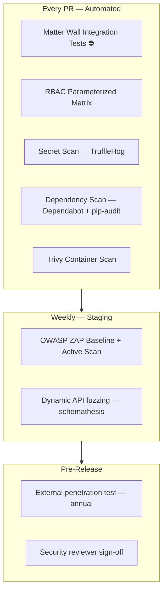
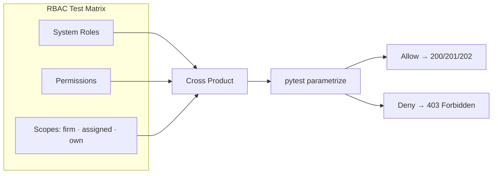
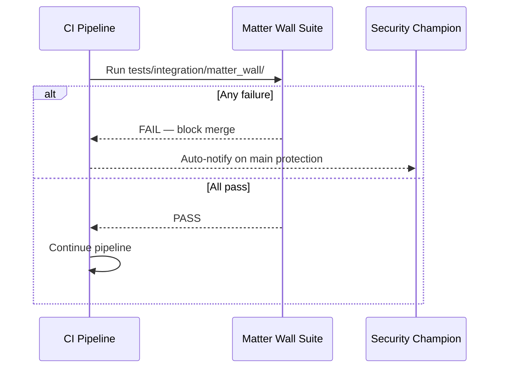
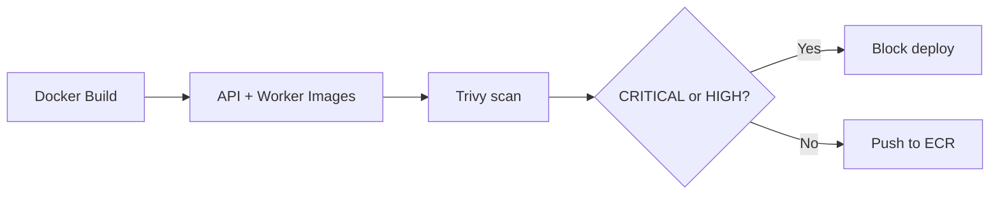
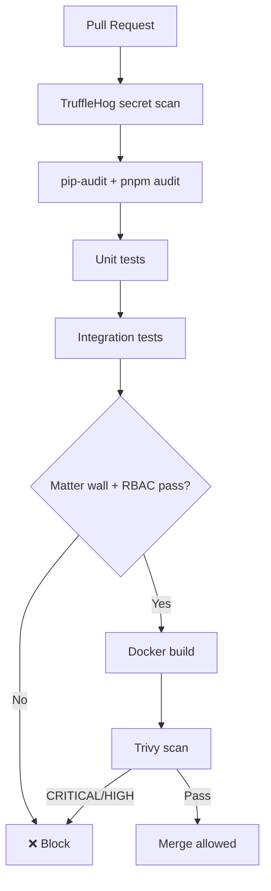

# Security Testing

**LexFlow AI** — RBAC, Injection & Supply Chain Validation  
**Version:** 1.0  
**Status:** Draft — Pre-Implementation  
**Last Updated:** 2026-07-06

---

## Purpose

Define **security testing standards** for LexFlow AI — automated and scheduled tests that validate authorization, input handling, dependency integrity, and container hygiene. Security testing protects **attorney-client privileged data** under matter walls and firm RBAC.

**Matter wall and RBAC integration tests run on every PR** — they are the primary automated security gate. This document covers those tests plus injection scanning, dependency auditing, and container image analysis.

---

## Scope

| In Scope | Out of Scope |
|----------|--------------|
| RBAC parameterized test matrix | Manual penetration test execution |
| Matter wall integration tests (PR gate) | Raw pen test findings storage |
| SQL injection and XSS test scope | Firm ethics committee policy interpretation |
| Container scanning (Trivy) | SOC 2 audit evidence collection |
| Dependency vulnerability scanning | WAF rule configuration |
| Secret scanning in CI | Application source code |
| OWASP ZAP staging scans (weekly) | |

**Cross-reference:** Security architecture [../08-security/README.md](../08-security/README.md). RBAC matrix [../04-api/authorization-rbac.md](../04-api/authorization-rbac.md). Matter walls [../08-security/matter-walls.md](../08-security/matter-walls.md). Threat model [../08-security/threat-model.md](../08-security/threat-model.md).

---

## Responsibilities

| Role | Responsibility |
|------|----------------|
| **Security Champion** | Maintain RBAC matrix tests; approve scan policy exceptions |
| **Backend Engineer** | Fix injection findings; implement RBAC tests for new endpoints |
| **DevOps / SRE** | Trivy in CI; ZAP schedule; Dependabot configuration |
| **All Contributors** | No secrets in commits; no `@pytest.mark.skip` on matter wall tests |
| **Compliance Officer** | Review audit test coverage annually |

---

## Architecture

### Security Test Layers

### STRIDE Test Mapping

From [../08-security/threat-model.md](../08-security/threat-model.md):

| STRIDE Category | Automated Test | Frequency |
|-----------------|----------------|-----------|
| **Spoofing** | JWT validation tests — expired, tampered, wrong issuer | Every PR |
| **Tampering** | Optimistic concurrency 409; HMAC callback validation | Every PR |
| **Repudiation** | Audit log assertions on all mutating operations | Every PR |
| **Information Disclosure** | Matter wall 404; no case metadata in error body | Every PR |
| **Denial of Service** | Rate limit integration tests; k6 (on demand) | PR + load |
| **Elevation of Privilege** | RBAC matrix; SystemAdmin content bypass denied | Every PR |

---

## RBAC Testing

### Parameterized Permission Matrix

Every `{role × permission × scope}` combination in [../04-api/authorization-rbac.md](../04-api/authorization-rbac.md) must have an integration test asserting allow or deny.

#### System Roles Under Test

| Role | Test Focus |
|------|------------|
| `ManagingPartner` | Firm-wide read; write only on assigned |
| `Attorney` | Assigned case operations |
| `Paralegal` | Document/task; no AI approval |
| `ComplianceOfficer` | Audit read; firm case read |
| `OperationsTeam` | No firm-wide bypass |
| `SystemAdministrator` | Admin endpoints only — no case content |
| `Client` | Portal-scoped; own cases only |

#### Permission Categories

| Resource | Actions Tested | Doc Reference |
|----------|---------------|---------------|
| `case` | create, read, update, delete, manage_participants | [endpoints-cases.md](../04-api/endpoints-cases.md) |
| `document` | upload, read, download, delete | [endpoints-documents.md](../04-api/endpoints-documents.md) |
| `ai` | request, read, approve | [endpoints-ai.md](../04-api/endpoints-ai.md) |
| `workflow` | trigger, read, cancel | [endpoints-workflows.md](../04-api/endpoints-workflows.md) |
| `audit` | read | [../05-database/audit-schema.md](../05-database/audit-schema.md) |
| `admin` | user management, firm settings | [authorization-rbac.md](../04-api/authorization-rbac.md) |

### RBAC Test IDs

| ID | Scenario |
|----|----------|
| `TEST-SEC-RBAC-001` | Paralegal lacks `ai:approve:assigned` → 403 |
| `TEST-SEC-RBAC-002` | Attorney has `case:read:assigned` → 200 on assigned case |
| `TEST-SEC-RBAC-003` | Client lacks `case:create:firm` → 403 |
| `TEST-SEC-RBAC-004` | SystemAdmin has `admin:users:write` → 200 |
| `TEST-SEC-RBAC-005` | SystemAdmin GET document content → 403 |
| `TEST-SEC-RBAC-006` | OperationsTeam lacks `case:read:firm` → 404 on unwalled case |

---

## Matter Wall Testing (PR Gate)

Matter wall tests are documented in detail in [integration-testing.md](./integration-testing.md). Security testing treats them as **non-negotiable security controls**, not functional tests.

| Control | Test Requirement |
|---------|------------------|
| MW-004 — 404 on GET deny | Assert status 404; body has no case metadata |
| MW-008 — Audit on deny | Assert `denied_matter_wall` audit entry |
| MW-006 — AI scoping | AI retrieval excludes unwalled documents |
| MW-007 — Client isolation | Client cannot access internal notes |
| MW-003 — Admin no content | SystemAdmin blocked from document/AI content |

**Policy:** No PR merges with skipped or disabled matter wall tests. Security Champion approval required for any temporary exception with compensating controls and expiry date.

---

## Injection Testing

### SQL Injection

| Vector | Test Approach | Expected |
|--------|---------------|----------|
| Case search `q` parameter | `' OR 1=1 --` | 200 with empty/filtered results — no leak |
| Case ID path parameter | UUID format bypass attempts | 422 or 404 — never 500 |
| Document filename metadata | SQL in filename field | Parameterized query — no DB error |
| Sort/order parameters | `; DROP TABLE cases;--` | 422 validation error |
| Pagination `pageSize` | `-1`, `999999` | 422 — bounded validation |

All database access uses **SQLAlchemy parameterized queries** — integration tests prove no raw string interpolation.

### Cross-Site Scripting (XSS)

| Vector | Layer | Test Approach |
|--------|-------|---------------|
| Case title input | API | Store `` → response HTML-escaped |
| Case notes | API + E2E | Rendered as text — Playwright asserts no script execution |
| Document filename display | E2E | Filename XSS payload does not execute in DOM |
| AI summary output | API | Sanitized before storage and render |

### Command & Path Injection

| Vector | Test |
|--------|------|
| S3 key path traversal | `../../etc/passwd` in upload key → rejected |
| Webhook callback URL (if configurable) | SSRF blocked — internal IP rejected |
| n8n HMAC payload | Oversized/malformed JSON → 400 |

### OWASP ZAP — Weekly Staging Scan

| Scan Type | Scope | Schedule |
|-----------|-------|----------|
| Baseline | Staging frontend — passive | Weekly Sunday 02:00 UTC |
| Active | Staging API — authenticated scan | Weekly Sunday 03:00 UTC |
| Report | Uploaded to security artifact bucket | Retained 1 year |

Findings triaged per [../08-security/incident-response.md](../08-security/incident-response.md) severity table.

---

## Container Scanning

### Trivy — Every Build

| Policy | Detail |
|--------|--------|
| Scan target | `api-service`, `worker-service`, `web-service` images |
| Block on | CRITICAL or HIGH CVE with fix available |
| Exception process | Security Champion + ticket + 30-day remediation deadline |
| SBOM | Trivy generates SBOM — archived per release |

### Scan Categories

| Category | Tool | PR Gate |
|----------|------|---------|
| OS packages | Trivy | Yes |
| Python dependencies | Trivy + pip-audit | Yes |
| Node dependencies | Trivy + npm audit | Yes |
| Misconfigurations | Trivy config scan on Dockerfile | Advisory |
| Secrets in image layers | Trivy secret scanner | Yes |

---

## Dependency & Secret Scanning

### Dependency Vulnerabilities

| Ecosystem | Tool | Frequency |
|-----------|------|-----------|
| Python | Dependabot + `pip-audit` in CI | Every PR |
| Node.js | Dependabot + `pnpm audit` | Every PR |
| Terraform | Dependabot (if modules use semver) | Weekly |

| Severity | Action |
|----------|--------|
| CRITICAL | Block merge; fix or pin within 24 h |
| HIGH | Block merge unless exception approved |
| MEDIUM | Fix within 30 days |
| LOW | Backlog |

### Secret Scanning

| Tool | Scope | PR Gate |
|------|-------|---------|
| TruffleHog | Git diff — new commits | Yes — hard fail |
| git-secrets | Pre-commit hook (local) | Developer workstation |
| GitHub secret scanning | Push to remote | Enabled on org |

**Prohibited in repository:** API keys, JWT signing keys, database passwords, AWS credentials, LLM API keys. See [../08-security/secrets-management.md](../08-security/secrets-management.md).

---

## Authentication Security Tests

Per [../04-api/authentication.md](../04-api/authentication.md):

| Test ID | Scenario | Expected |
|---------|----------|----------|
| `TEST-SEC-AUTH-001` | Expired access token | 401 Unauthorized |
| `TEST-SEC-AUTH-002` | Tampered JWT signature | 401 Unauthorized |
| `TEST-SEC-AUTH-003` | Refresh token reuse after rotation | 401 — all sessions revoked |
| `TEST-SEC-AUTH-004` | Missing Bearer header | 401 Unauthorized |
| `TEST-SEC-AUTH-005` | Valid token — wrong firm tenant | 403 Forbidden |
| `TEST-SEC-AUTH-006` | Brute force login — 10 failures | 429 Rate limited |
| `TEST-SEC-AUTH-007` | Internal webhook without HMAC | 401 Unauthorized |
| `TEST-SEC-AUTH-008` | Internal webhook — replayed timestamp | 401 Unauthorized |

---

## Internal Webhook Security Tests

n8n callbacks per [../04-api/webhooks-internal.md](../04-api/webhooks-internal.md):

| Test | Validates |
|------|-----------|
| Valid HMAC-SHA256 signature | 200 + state update |
| Wrong secret | 401 |
| Missing `X-Webhook-Timestamp` | 401 |
| Timestamp > 5 min old | 401 — replay protection |
| Payload for case user cannot access | 404 — matter wall on internal routes |

---

## CI Security Pipeline

---

## Best Practices

1. **Treat matter wall failures as security incidents** — not flaky tests.
2. **Add RBAC test before shipping new endpoint** — same PR as route.
3. **Never disable Trivy gate** without Security Champion written approval.
4. **Review ZAP findings within 48 h** of weekly scan.
5. **Assert audit log on deny** — repudiation control validation.
6. **Test 404 body for enumeration** — no hints about case existence.
7. **Cross-check threat model** when adding new attack surface — update [../08-security/threat-model.md](../08-security/threat-model.md).

---

## Tradeoffs

| Decision | Benefit | Cost |
|----------|---------|------|
| Matter wall on every PR | Prevents ethics/compliance breach | CI time |
| 404 vs 403 in tests | Validates anti-enumeration | Harder debugging |
| Block on HIGH CVE | Strong supply chain hygiene | May block urgent fixes — exception process |
| Weekly ZAP not daily | Reduced staging noise | Slower discovery of regressions |
| Schemathesis fuzzing weekly | Finds edge cases | May generate noise — tune schemas |

---

## References

| Document | Path |
|----------|------|
| Integration testing (matter walls) | [integration-testing.md](./integration-testing.md) |
| Unit testing (auth use cases) | [unit-testing.md](./unit-testing.md) |
| Security index | [../08-security/README.md](../08-security/README.md) |
| Matter walls | [../08-security/matter-walls.md](../08-security/matter-walls.md) |
| Threat model | [../08-security/threat-model.md](../08-security/threat-model.md) |
| Secrets management | [../08-security/secrets-management.md](../08-security/secrets-management.md) |
| Incident response | [../08-security/incident-response.md](../08-security/incident-response.md) |
| Compliance mapping | [../08-security/compliance-mapping.md](../08-security/compliance-mapping.md) |
| Authorization RBAC | [../04-api/authorization-rbac.md](../04-api/authorization-rbac.md) |
| Authentication | [../04-api/authentication.md](../04-api/authentication.md) |
| Internal webhooks | [../04-api/webhooks-internal.md](../04-api/webhooks-internal.md) |
| Release gate playbook | [../14-playbooks/release-gate-checklist.md](../14-playbooks/release-gate-checklist.md) |
| Testing index | [README.md](./README.md) |

---

## Conventions

- Test IDs: `TEST-SEC-{RBAC\|AUTH\|INJ\|SCAN}-{number}`
- Security test files live in `tests/integration/security/` and `tests/integration/matter_wall/`
- CVE exceptions documented in `security/exceptions/` with expiry date
- ZAP reports stored in S3 — never committed to repository
