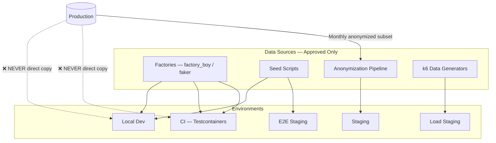
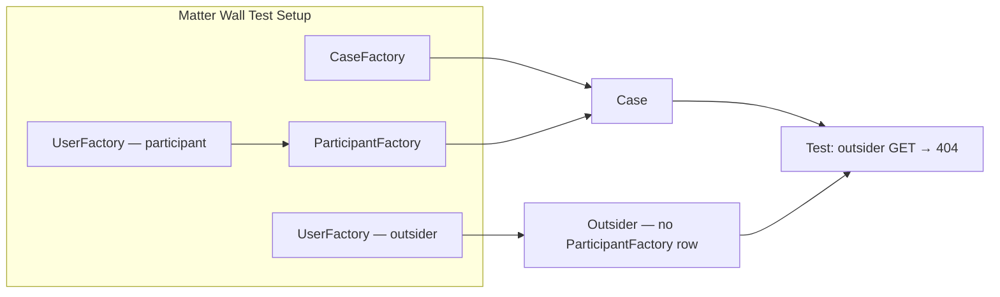
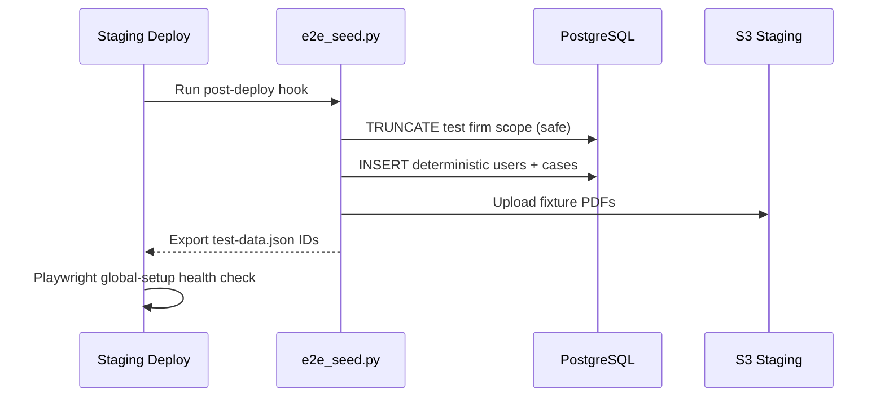
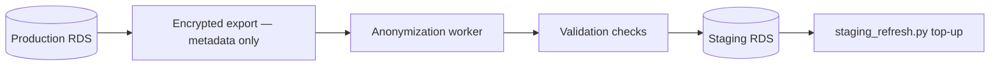
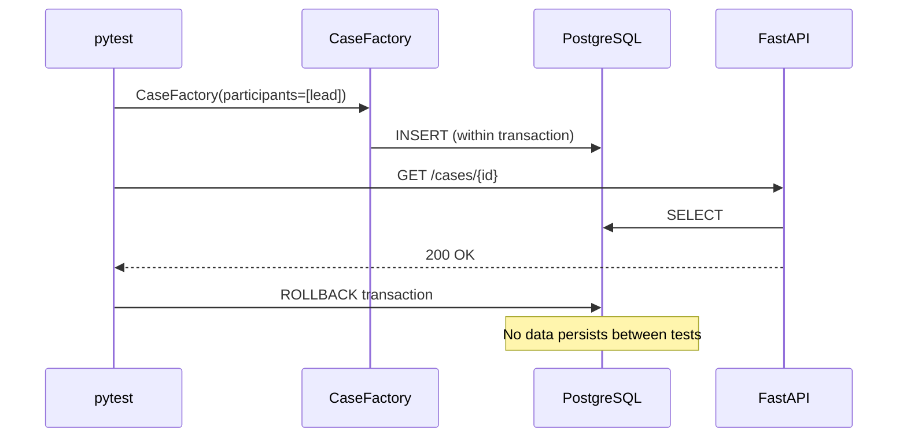
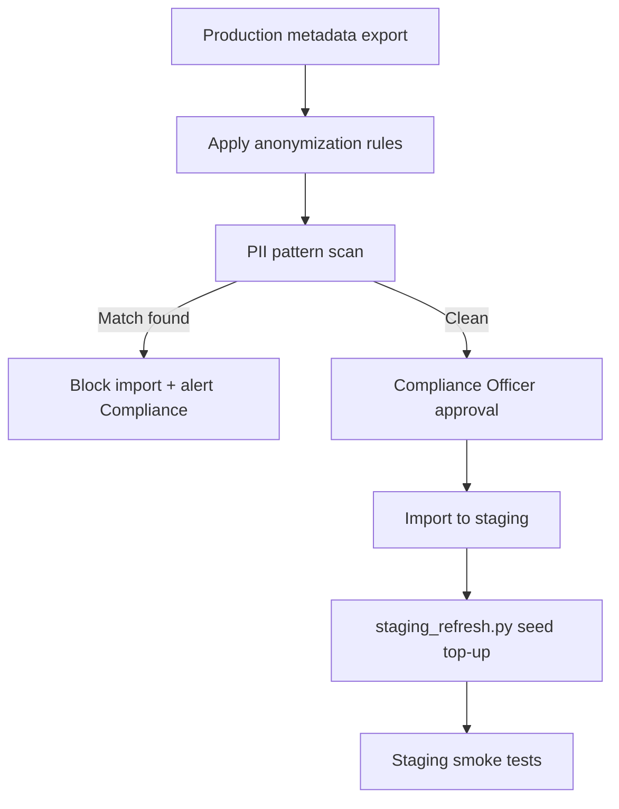

# Test Data Management

**LexFlow AI** — Factories, Seeds & Anonymization  
**Version:** 1.0  
**Status:** Draft — Pre-Implementation  
**Last Updated:** 2026-07-06

---

## Purpose

Define **test data standards** for LexFlow AI — how factories, seed scripts, fixtures, and anonymization pipelines create realistic, deterministic, and **safe** data for unit, integration, E2E, and load tests.

LexFlow handles **attorney-client privileged information**. Real client data must **never** appear in non-production environments. Violations are compliance incidents.

---

## Scope

| In Scope | Out of Scope |
|----------|--------------|
| Factory patterns (factory_boy, TypeScript fixtures) | Application source code |
| Seed scripts per environment | Production data export tooling |
| Anonymization pipeline for staging refresh | Legal hold procedures |
| Environment data policy matrix | Backup restoration runbooks |
| PII and privileged content rules | Firm-specific retention policies |
| Test user and firm conventions | |

**Cross-reference:** Database schemas [../05-database/](../05-database/). Matter walls [../08-security/matter-walls.md](../08-security/matter-walls.md). Compliance [../08-security/compliance-mapping.md](../08-security/compliance-mapping.md). API auth [../04-api/authentication.md](../04-api/authentication.md).

---

## Responsibilities

| Role | Responsibility |
|------|----------------|
| **Backend Engineer** | Maintain factory_boy factories for owned bounded context |
| **Frontend Engineer** | Maintain TypeScript mock fixtures aligned with OpenAPI |
| **DevOps / SRE** | Staging anonymization pipeline; E2E seed on deploy |
| **Compliance Officer** | Approve anonymization rules; audit staging refresh |
| **All Contributors** | Never copy production data manually to local machines |

---

## Architecture

### Test Data Flow by Environment



### Data Policy Matrix

| Environment | Data Source | Real Client Data | Refresh Cadence |
|-------------|-------------|------------------|-----------------|
| Unit tests | Factories — in-memory | ❌ Never | Per test (rollback) |
| Integration (CI) | Factories + Testcontainers | ❌ Never | Per test (rollback) |
| Local dev | `dev_seed.py` | ❌ Never | On demand |
| Staging | Anonymized prod subset + seed | ❌ Only anonymized | Monthly |
| E2E staging | `e2e_seed.py` — deterministic | ❌ Never | Every deploy |
| Load staging | k6 generators at scale | ❌ Never | Before each run |
| Production | Live | ✅ Real | N/A |

---

## Factories (factory_boy)

### Factory Principles

| Rule | Rationale |
|------|-----------|
| One factory per aggregate root | Case, Client, Document, User, Firm |
| Sub-factories for related entities | CaseFactory creates lead participant |
| `faker` with fixed seed in CI | Reproducible failures |
| No real names, firms, or addresses | Use `@example.com`, `@test.lexflow.ai` |
| Explicit traits for edge cases | `:closed`, `:walled`, `:with_documents` |

### Directory Layout (Conceptual)

```
tests/factories/
├── __init__.py
├── firm_factory.py
├── user_factory.py
├── case_factory.py
├── participant_factory.py
├── client_factory.py
├── document_factory.py
├── ai_job_factory.py
├── workflow_execution_factory.py
└── audit_entry_factory.py
```

### Core Factories

| Factory | Builds | Key Traits |
|---------|--------|------------|
| `FirmFactory` | Law firm tenant | `:solo`, `:am_law_100` |
| `UserFactory` | System user with role | `:attorney`, `:managing_partner`, `:client`, `:sysadmin` |
| `CaseFactory` | Case aggregate + status | `:active`, `:closed`, `:confidential` |
| `ParticipantFactory` | Case participant row | `:lead`, `:associate`, `:observer`, `:removed` |
| `ClientFactory` | Client entity (party) | `:individual`, `:corporate` |
| `DocumentFactory` | Document metadata | `:pdf`, `:processing`, `:embedded` |
| `AiJobFactory` | AI async job | `:queued`, `:completed`, `:pending_approval` |
| `WorkflowExecutionFactory` | Workflow run | `:running`, `:completed`, `:failed` |
| `AuditEntryFactory` | Audit log row | `:allowed`, `:denied_matter_wall` |

### Matter Wall Factory Patterns

Matter wall tests require precise participant setup — use dedicated factory traits:



| Trait | Purpose |
|-------|---------|
| `:walled` | Case with single lead participant only |
| `:multi_participant` | Lead + associate + paralegal |
| `:firm_readable` | Case exists; ManagingPartner not participant — for override tests |
| `:client_portal` | Client participant; internal notes excluded |
| `:conflict_flagged` | Case marked sensitive — restricted participant list |

See [integration-testing.md](./integration-testing.md) for matter wall test matrix.

### Factory Usage by Layer

| Layer | Factory Usage |
|-------|---------------|
| Unit (application) | Build domain entities; mock repos return factory objects |
| Integration | Factory → persist via SQLAlchemy session → HTTP test |
| E2E setup (API) | Factory data via staging seed script — not inline in specs |

---

## Seed Scripts

### Script Catalog

| Script | Environment | Purpose |
|--------|-------------|---------|
| `scripts/seed/dev_seed.py` | Local dev | Realistic firm with 10 cases, 5 users, sample documents |
| `scripts/seed/e2e_seed.py` | E2E staging | Deterministic IDs for Playwright fixtures |
| `scripts/seed/load_seed.py` | Load staging | Bulk cases/users for k6 participant pools |
| `scripts/seed/staging_refresh.py` | Staging | Orchestrates anonymization import + seed top-up |

### Dev Seed Contents

| Entity | Count | Notes |
|--------|-------|-------|
| Firm | 1 | "LexFlow Demo Firm" |
| Users | 5 | One per key role |
| Cases | 10 | Mix of active, closed, confidential |
| Clients | 8 | Faker-generated |
| Documents | 20 | Placeholder PDFs in local MinIO |
| Workflow templates | 3 | Intake, discovery, billing |

Run: `make seed-dev` or `python scripts/seed/dev_seed.py`

### E2E Seed — Deterministic IDs

E2E tests reference **stable UUIDs** exported in `tests/e2e/fixtures/test-data.json`:

| Entity | Stable ID Purpose |
|--------|-------------------|
| Test firm | `E2E_FIRM_ID` env var |
| Walled case | Outsider blocked — matter-wall.spec.ts |
| Open case | Participant access — document-upload.spec.ts |
| Attorney user | Login credentials in GitHub secrets |
| Outsider user | Non-participant — matter-wall.spec.ts |
| Pre-uploaded document | Skips upload wait in view tests |

Seed runs on every staging deploy — see [e2e-testing.md](./e2e-testing.md).

### Seed Flow



---

## Anonymization

### Staging Refresh Pipeline

Monthly staging receives an **anonymized subset** of production metadata — never full production copy.



| Step | Detail |
|------|--------|
| Export scope | Case metadata, document metadata, audit samples — **no document binaries** |
| Export exclusion | Passwords, tokens, API keys, LLM prompts with client content |
| Anonymization | Replace names, emails, addresses, matter numbers |
| Validation | Automated scan for PII patterns before import |
| Approval | Compliance Officer sign-off on monthly refresh |
| Rollback | Previous staging snapshot retained 7 days |

### Anonymization Rules

| Field | Transformation |
|-------|----------------|
| Person name | Faker name — consistent per original ID (deterministic hash) |
| Email | `{hash}@anonymized.lexflow.test` |
| Phone | `+1-555-0100` – `+1-555-0199` range |
| Address | Faker address — US format |
| Matter number | `ANON-{sequential}` |
| SSN / Tax ID | Removed — replaced with null |
| Document filename | Generic `document-{id}.pdf` |
| Document body/content | **Not exported** — staging uses placeholder PDFs |
| AI summary text | Removed — regenerated in staging if needed |
| Free-text notes | Lorem ipsum replacement |

### PII Detection Validation

Post-anonymization scans must pass before staging import:

| Pattern | Tool | Action on Match |
|---------|------|-----------------|
| SSN `\d{3}-\d{2}-\d{4}` | Custom regex scanner | Block import |
| Email (non-anonymized domain) | Regex + allowlist | Block import |
| Phone (non-555 range) | Regex | Block import |
| Credit card | Luhn + regex | Block import |
| Real firm names (config list) | Dictionary match | Block import |

---

## Frontend Test Fixtures

TypeScript mock data for Vitest — aligned with OpenAPI generated types.

| Fixture File | Purpose |
|--------------|---------|
| `fixtures/cases.ts` | Case list and detail mock responses |
| `fixtures/users.ts` | `/users/me` with permission sets by role |
| `fixtures/documents.ts` | Document list, upload URL response |
| `fixtures/ai-jobs.ts` | Job status polling states |

| Rule | Detail |
|------|--------|
| Generate from OpenAPI | `pnpm generate:api-types` — fixtures implement typed interfaces |
| Permission variants | Export `attorneyMe`, `paralegalMe`, `clientMe` |
| No real PII | Same faker conventions as backend |

---

## Load Test Data Generators

k6 scripts generate data at scale — see [load-testing.md](./load-testing.md).

| Generator | Output |
|-----------|--------|
| `load/gen_users.js` | Pool of 1000 test users with JWT |
| `load/gen_cases.js` | 10K cases with participant assignments |
| `load/gen_documents.js` | Document metadata references |

| Rule | Detail |
|------|--------|
| Isolated firm | Load data in dedicated load-test firm ID |
| Cleanup | `load/cleanup.js` removes load firm scope after run |
| No overlap with E2E | Different firm ID prevents cross-contamination |

---

## Sensitive Content Rules

### Prohibited in All Non-Production

| Content | Policy |
|---------|--------|
| Real client names | Never |
| Real matter descriptions | Never |
| Production document binaries | Never |
| Production audit log full export | Never — sample only |
| Attorney work product | Never |
| JWT signing keys / DB passwords | Secrets Manager only |

### Approved Synthetic Indicators

| Indicator | Usage |
|-----------|--------|
| `@test.lexflow.ai` | Test user email domain |
| `@anonymized.lexflow.test` | Anonymized staging emails |
| `[TEST]` prefix | Case titles in dev/E2E |
| `LexFlow Demo Firm` | Default dev firm name |
| Faker seed `12345` | CI reproducibility |

---

## Flow Diagrams

### Integration Test Data Lifecycle



### Anonymization Validation Gate



---

## Best Practices

1. **Factories over inline dicts** — reusable, trait-driven, consistent.
2. **Fixed faker seed in CI** — `Faker.seed(12345)` in conftest.py.
3. **Never commit real data** — pre-commit hook scans for PII patterns.
4. **Transaction rollback in integration** — clean slate per test.
5. **Deterministic E2E IDs** — no random UUIDs in Playwright fixtures file.
6. **Document new factory traits** when adding domain states.
7. **Validate anonymization** before every staging import — no exceptions.

---

## Tradeoffs

| Decision | Benefit | Cost |
|----------|---------|------|
| Factories vs SQL fixtures | Maintainable, trait-composable | Learning curve for factory_boy |
| Anonymized prod subset in staging | Realistic volume and edge cases | Monthly pipeline maintenance |
| No prod documents in staging | Eliminates privilege leak risk | Staging UI uses placeholder PDFs |
| Deterministic E2E seed | Stable Playwright selectors/IDs | Seed script must update with schema |
| Transaction rollback vs truncate | Fast per-test isolation | Cannot test cross-transaction behavior |

---

## References

| Document | Path |
|----------|------|
| Unit testing | [unit-testing.md](./unit-testing.md) |
| Integration testing | [integration-testing.md](./integration-testing.md) |
| E2E testing | [e2e-testing.md](./e2e-testing.md) |
| Load testing | [load-testing.md](./load-testing.md) |
| Case schema | [../05-database/cases-schema.md](../05-database/cases-schema.md) |
| Identity schema | [../05-database/identity-schema.md](../05-database/identity-schema.md) |
| Audit schema | [../05-database/audit-schema.md](../05-database/audit-schema.md) |
| Matter walls | [../08-security/matter-walls.md](../08-security/matter-walls.md) |
| Compliance mapping | [../08-security/compliance-mapping.md](../08-security/compliance-mapping.md) |
| Authentication | [../04-api/authentication.md](../04-api/authentication.md) |
| Staging verification playbook | [../14-playbooks/staging-verification.md](../14-playbooks/staging-verification.md) |
| Testing index | [README.md](./README.md) |

---

## Conventions

- Backend factories: `tests/factories/` — imported in unit and integration conftest
- Seed scripts: `scripts/seed/` — idempotent; safe to re-run
- E2E fixture IDs: `tests/e2e/fixtures/test-data.json` — generated by seed, not hand-edited
- Anonymization config: `scripts/anonymization/rules.yaml` — Compliance Officer owned
- Test email domain: `@test.lexflow.ai` (dev/E2E); `@anonymized.lexflow.test` (staging)
