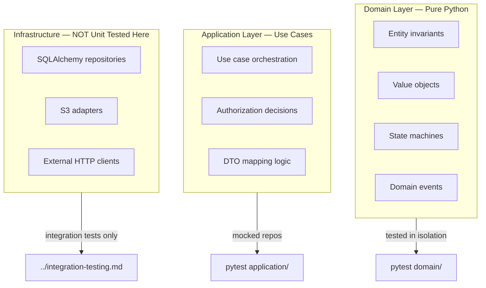
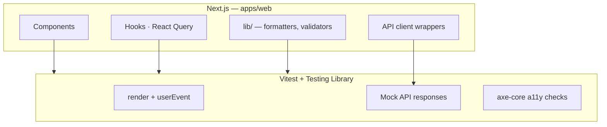
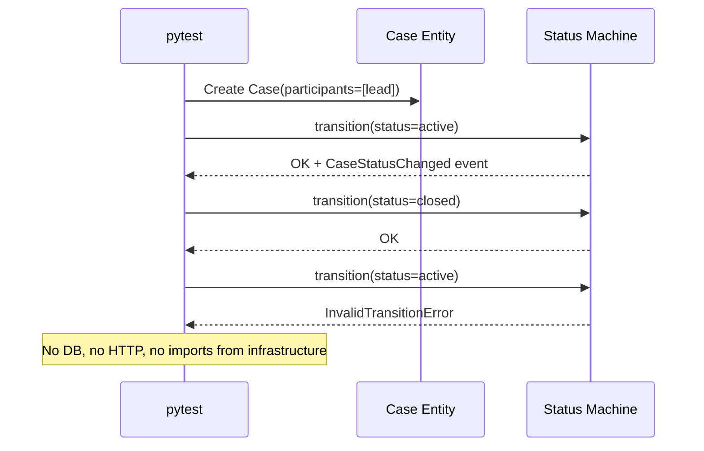
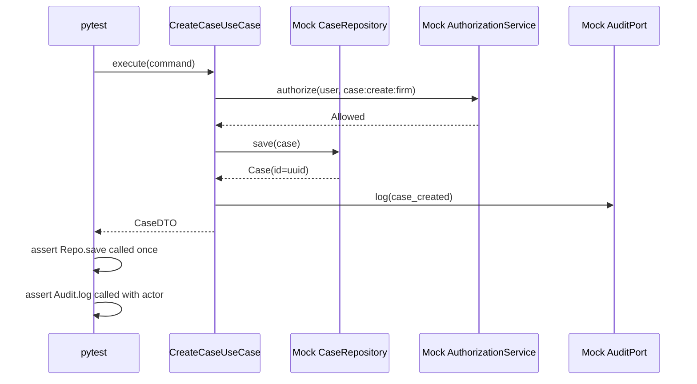
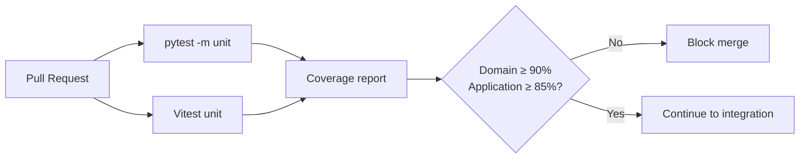

# Unit Testing

**LexFlow AI** — Domain & Frontend Unit Test Strategy  
**Version:** 1.0  
**Status:** Draft — Pre-Implementation  
**Last Updated:** 2026-07-06

---

## Purpose

Define **unit testing standards** for LexFlow AI across the backend (Python pytest) and frontend (TypeScript Vitest). Unit tests form the base of the testing pyramid — fast, isolated, and run on every PR. They validate domain invariants, use case orchestration, and UI behavior without external I/O.

Unit tests complement but **never replace** matter wall integration tests. Authorization logic is unit-tested for correctness; integration tests prove enforcement at the API boundary.

---

## Scope

| In Scope | Out of Scope |
|----------|--------------|
| pytest structure for domain and application layers | Integration tests with Testcontainers |
| Vitest structure for Next.js components and hooks | E2E Playwright journeys |
| Coverage targets and CI gates | Load and performance testing |
| Authorization use case unit tests | Container and dependency scanning |
| Factory usage at unit layer | Real database or network calls |
| Mocking conventions | Application source code |

**Cross-reference:** API contracts in [../04-api/](../04-api/). Matter wall rules in [../08-security/matter-walls.md](../08-security/matter-walls.md).

---

## Responsibilities

| Role | Responsibility |
|------|----------------|
| **Backend Engineer** | Domain invariant tests; application use case tests with mocked repos |
| **Frontend Engineer** | Component behavior tests; hook tests; API client mock tests |
| **Domain Owner** | Approve invariant coverage for aggregate state machines |
| **Reviewer** | Reject PRs with business logic untested or domain tests importing SQLAlchemy |

---

## Architecture

### Backend Unit Test Layers

LexFlow follows **hexagonal architecture**. Unit tests respect layer boundaries.



### Frontend Unit Test Layers



### Directory Layout (Conceptual)

```
services/{context}/tests/
├── domain/
│   ├── test_case_entity.py
│   ├── test_case_status_machine.py
│   ├── test_participant_rules.py
│   └── test_value_objects.py
├── application/
│   ├── test_create_case.py
│   ├── test_add_participant.py
│   ├── test_authorization.py          # RBAC + matter wall decision logic
│   ├── test_ai_summary_approval.py
│   └── test_document_upload_use_case.py
└── conftest.py                        # Shared fixtures — no DB

apps/web/src/
├── components/cases/__tests__/
├── components/documents/__tests__/
├── hooks/__tests__/
└── lib/__tests__/
```

---

## Backend Unit Testing (pytest)

### Domain Layer Rules

Domain tests validate **business rules without any framework dependency**.

| Rule | Rationale |
|------|-----------|
| No SQLAlchemy, FastAPI, or Redis imports | Keeps tests fast and pure |
| No network or filesystem I/O | Deterministic, parallel-safe |
| Test all state transitions | Case status, approval states, workflow states |
| Test invalid transitions raise domain exceptions | Fail fast on invariant violations |
| Parameterize edge cases | Empty strings, boundary dates, duplicate participants |

#### Domain Test Categories

| Category | Examples | Test ID Prefix |
|----------|----------|----------------|
| Entity invariants | Case cannot transition from `closed` to `active` | `TEST-UNIT-DOM-` |
| Value object validation | Matter number format, email normalization | `TEST-UNIT-VO-` |
| State machines | Approval: `pending` → `approved` \| `rejected` | `TEST-UNIT-SM-` |
| Domain events | `CaseCreated` emitted with correct payload | `TEST-UNIT-EV-` |
| Participant rules | Lead cannot be removed if sole lead | `TEST-UNIT-PART-` |

### Application Layer Rules

Application tests orchestrate use cases with **mocked repository and adapter interfaces**.

| Rule | Rationale |
|------|-----------|
| Mock via domain interfaces (ports) | Tests use case logic, not SQL |
| One use case per test file | Clear ownership and failure isolation |
| Assert domain events published | Outbox pattern correctness |
| Assert authorization called before mutation | Defense-in-depth at use case level |

#### Authorization Use Case Tests

Authorization decision logic is unit-tested separately from HTTP middleware. These tests validate the **decision function** — integration tests prove HTTP status codes.

| Scenario | Expected Decision |
|----------|-------------------|
| User has permission + is participant | Allow |
| User has permission + not participant + no firm read | Deny (matter wall) |
| User has permission + not participant + `case:read:firm` | Allow (read only) |
| User lacks RBAC permission | Deny (RBAC — 403 mapping) |
| SystemAdministrator + document content | Deny (no content bypass — MW-003) |

See [../04-api/authorization-rbac.md](../04-api/authorization-rbac.md) for the permission matrix and [../08-security/matter-walls.md](../08-security/matter-walls.md) for MW-001 through MW-008.

### pytest Conventions

| Convention | Detail |
|------------|--------|
| Test discovery | `tests/` under each bounded context; `test_*.py` files |
| Fixtures | `conftest.py` per layer; session-scoped only for pure data |
| Markers | `@pytest.mark.unit` — excluded from integration runs |
| Parameterization | `@pytest.mark.parametrize` for RBAC role × permission matrix |
| Assertions | Plain `assert`; use `pytest.raises` for domain exceptions |
| Parallel execution | `pytest-xdist -n auto` for unit suite only |

### Coverage Targets

| Layer | Line Coverage Target | CI Gate |
|-------|---------------------|---------|
| `domain/` | 95% | Hard fail below 90% |
| `application/` | 90% | Hard fail below 85% |
| `infrastructure/` | Advisory | No gate — covered by integration |
| `api/routes/` | Advisory | Covered by integration + E2E |

Coverage is measured with `pytest-cov`. Reports uploaded to CI artifacts on every PR.

---

## Frontend Unit Testing (Vitest)

### Component Test Rules

| Rule | Rationale |
|------|-----------|
| Test user-visible behavior, not internal state | Resilient to refactors |
| Use `@testing-library/react` queries | Accessibility-aligned selectors |
| Mock API via MSW or vi.mock on client | Never hit real backend |
| Include axe-core check on form components | WCAG compliance baseline |
| Do not test authorization enforcement | Backend owns security — test UI reflects permissions |

### Hook and Utility Tests

| Target | Focus |
|--------|-------|
| `useCase`, `useDocuments` hooks | Loading, error, and success states with mocked React Query |
| `lib/formatters` | Date, currency, case number display |
| `lib/validators` | Client-side validation mirrors API rules (UX only) |
| API client | Request shape, error parsing, correlation ID header |

### Vitest Conventions

| Convention | Detail |
|------------|--------|
| Config | `vitest.config.ts` in `apps/web/` |
| Environment | `jsdom` for components; `node` for pure utilities |
| File naming | `*.test.ts` / `*.test.tsx` colocated or in `__tests__/` |
| Coverage | `@vitest/coverage-v8`; 80% line target for `components/` and `hooks/` |
| CI command | `pnpm --filter web test:unit` |

### Permission-Aware UI Tests

Frontend tests verify **UX reflection** of permissions from `/users/me` — not security enforcement.

| Scenario | UI Assertion |
|----------|--------------|
| User lacks `case:write:assigned` | "Edit case" button not rendered |
| User lacks `ai:approve:assigned` | Approve action hidden |
| User lacks `document:upload:assigned` | Upload dropzone disabled with tooltip |
| 404 from API on case detail | Generic "Case not found" — no existence leak |

---

## Flow Diagrams

### Domain Test Execution (Isolated)



### Application Use Case Test (Mocked Ports)



---

## Test Categories Matrix

| Bounded Context | Domain Tests | Application Tests | Priority |
|-----------------|-------------|-------------------|----------|
| Case Management | Status machine, participant invariants | Create, update, add participant | P0 |
| Identity & Access | Role value objects | Authorization decision function | P0 |
| Document Management | Document state, version rules | Upload confirm, presigned flow logic | P1 |
| AI & Knowledge | Summary status, approval states | Request summary, approve/reject | P1 |
| Workflow Orchestration | Execution state machine | Trigger, cancel, callback handling | P1 |
| Audit & Compliance | Audit entry immutability rules | Log access decision | P0 |
| Notifications | Notification preference rules | Dispatch logic (mocked channel) | P2 |

---

## CI Integration



| Stage | Command | Timeout |
|-------|---------|---------|
| Backend unit | `pytest -m unit --cov=services --cov-fail-under=90` | 60 s |
| Frontend unit | `pnpm --filter web test:unit --coverage` | 120 s |

---

## Best Practices

1. **Name tests after behavior** — `test_closed_case_cannot_reopen` not `test_transition_3`.
2. **One assertion concept per test** — multiple asserts OK if same behavior.
3. **Use factories from [test-data.md](./test-data.md)** — `CaseFactory.build()` not inline dicts.
4. **Never import infrastructure in domain tests** — reviewer hard reject.
5. **Parameterize RBAC matrix** — one test function, all role × permission combinations.
6. **Keep frontend mocks aligned with OpenAPI** — regenerate types when API changes.
7. **Run locally before push** — `make test-unit` (< 15 s total).

---

## Tradeoffs

| Decision | Benefit | Cost |
|----------|---------|------|
| Strict domain purity | Fast, reliable, parallel tests | Cannot catch SQL bugs at unit layer |
| Mock repos in application | Tests use case orchestration | Mock drift if interface changes |
| Frontend does not test auth enforcement | Clear security boundary | UI permission bugs need E2E catch |
| High domain coverage gate | Confidence in business rules | Effort maintaining coverage on refactors |
| axe-core in component tests | Early a11y regression detection | Slightly slower test runs |

---

## Anti-Patterns

| Anti-Pattern | Why It Fails | Correct Approach |
|--------------|--------------|------------------|
| Testing SQLAlchemy queries in unit tests | Couples to infrastructure | Integration test with Testcontainers |
| Skipping authorization use case tests | Logic bugs reach integration | Parameterized decision tests |
| Snapshot testing entire pages | Brittle, low signal | Test behavior and accessible labels |
| `@pytest.mark.skip` on failing domain test | Hides invariant regression | Fix or revert feature |
| Frontend test asserting 403 vs 404 | Wrong layer for security | Integration matter wall tests |

---

## References

| Document | Path |
|----------|------|
| Integration testing (API + matter walls) | [integration-testing.md](./integration-testing.md) |
| Test data factories | [test-data.md](./test-data.md) |
| Authorization RBAC matrix | [../04-api/authorization-rbac.md](../04-api/authorization-rbac.md) |
| Matter wall rules | [../08-security/matter-walls.md](../08-security/matter-walls.md) |
| Development standards | [../development-standards.md](../development-standards.md) |
| CI failure triage playbook | [../14-playbooks/ci-failure-triage.md](../14-playbooks/ci-failure-triage.md) |
| Testing index | [README.md](./README.md) |

---

## Conventions

- Test IDs: `TEST-UNIT-{DOM\|APP\|UI}-{number}`
- All domain test files live under `services/{context}/tests/domain/`
- All application test files live under `services/{context}/tests/application/`
- Frontend tests colocate with components or use `__tests__/` — team picks one per folder, not both
