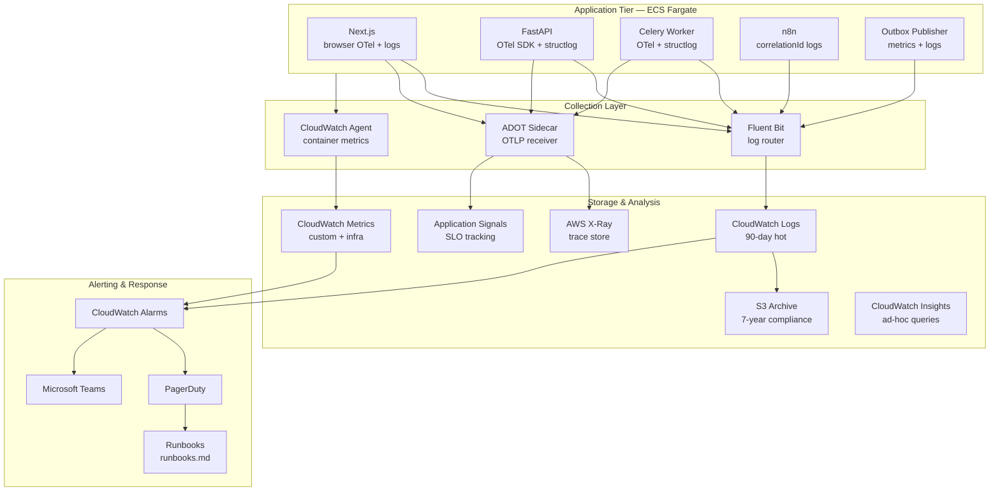
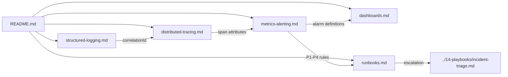
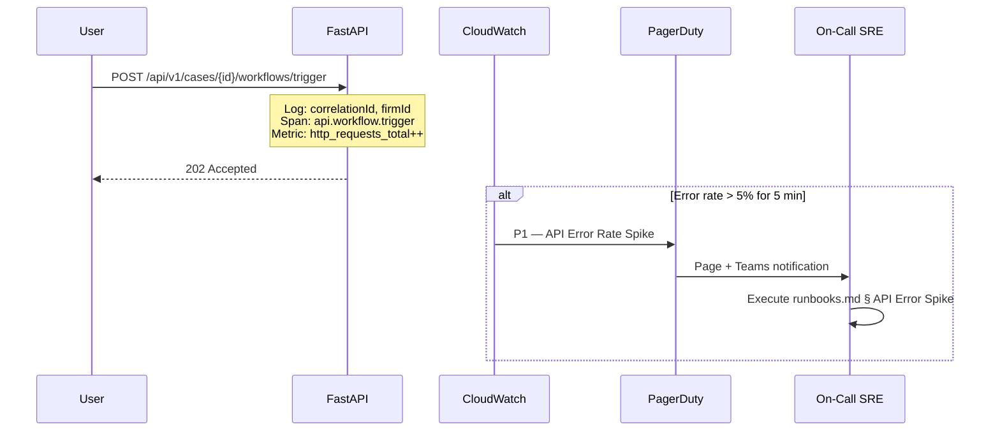
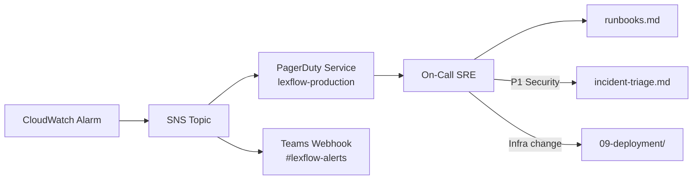

# Observability Documentation — LexFlow AI

**LexFlow AI** — Logging, Tracing, Metrics, Alerting & Runbooks  
**Version:** 1.0  
**Status:** Draft — Pre-Implementation  
**Last Updated:** 2026-07-06

---

## Purpose

This folder is the **canonical observability reference** for LexFlow AI — the enterprise AI automation platform for large US law firms. It defines how engineers and SRE teams instrument, monitor, alert on, and respond to operational signals across the full request lifecycle: frontend → API → queue → worker → n8n → external systems.

Observability is a **first-class platform concern**, not an afterthought. All containers emit structured logs, propagate trace context, export metrics, and surface actionable alerts aligned with NFR availability targets (99.9% uptime, RPO ≤ 15 min, RTO ≤ 4 hours).

---

## Core Principles

| Principle | Enforcement |
|-----------|-------------|
| **Three pillars** | Logs, metrics, and traces are mandatory for every deployable container |
| **Correlation everywhere** | Every log line and span carries `correlationId`; traces link via W3C `traceparent` |
| **PII-safe by default** | Structured logging processor redacts privileged content before emission |
| **Actionable alerts** | Every P1–P4 alert has a runbook; no alert without an owner |
| **Tenant-aware signals** | `firmId`, `caseId`, and `userId` labels enable firm-scoped drill-down |
| **Error-biased sampling** | 10% trace sampling in production; 100% on errors and staging |

See [cross-cutting concerns](../03-architecture/cross-cutting-concerns.md) for platform-wide tracing, logging, and correlation patterns.

---

## Scope

| In Scope | Out of Scope |
|----------|--------------|
| Structured JSON logging format and PII redaction rules | Application logging library implementation |
| OpenTelemetry instrumentation and X-Ray export | ADOT sidecar Terraform module internals |
| CloudWatch metrics, alarms, and severity model (P1–P4) | Vendor pricing for observability tools |
| Operational, business, and security dashboards | Dashboard JSON export files |
| SRE runbooks for alert response | Security incident legal notification (see [incident-response](../08-security/incident-response.md)) |
| Log retention and compliance archive routing | SIEM vendor selection |

---

## Responsibilities

| Audience | Use This Folder To |
|----------|-------------------|
| **Backend Engineers** | Emit compliant logs, propagate trace context, export application metrics |
| **Frontend Engineers** | Initialize browser trace context; forward `traceparent` and `X-Correlation-Id` |
| **DevOps / SRE** | Provision CloudWatch alarms, dashboards, PagerDuty routing, log subscriptions |
| **Security Reviewers** | Validate PII redaction, audit log separation, security dashboard coverage |
| **On-Call Engineers** | Execute runbooks; escalate per severity matrix |
| **Solution Architects** | Confirm observability meets NFR and cross-cutting concern contracts |

---

## Architecture

### Observability Stack

### Document Map

### Signal Flow — Request to Alert

---

## Document Index

| Document | Description |
|----------|-------------|
| [structured-logging.md](./structured-logging.md) | JSON log schema, field catalog, PII redaction rules, `correlationId` lifecycle |
| [distributed-tracing.md](./distributed-tracing.md) | OpenTelemetry SDK, ADOT sidecar, X-Ray export, W3C trace propagation |
| [metrics-alerting.md](./metrics-alerting.md) | Application and infrastructure metrics, CloudWatch alarms, P1–P4 severity model |
| [dashboards.md](./dashboards.md) | Operational, business, and security dashboard specifications |
| [runbooks.md](./runbooks.md) | Step-by-step alert response procedures for on-call engineers |

---

## Quick Reference

### Severity Model

| Severity | Response SLA | Channel | Example |
|----------|-------------|---------|---------|
| **P1 — Critical** | 15 minutes | PagerDuty + Teams | API down, database unreachable |
| **P2 — High** | 1 hour | Teams + Email | DLQ depth > 0, workflow failure spike |
| **P3 — Medium** | 4 hours | Email | p99 latency > 3s sustained |
| **P4 — Low** | Next business day | Dashboard annotation | Certificate expiry in 30 days |

Full rules: [metrics-alerting.md](./metrics-alerting.md).

### Required Log Fields (All Services)

| Field | Required | Description |
|-------|----------|-------------|
| `timestamp` | Yes | ISO 8601 UTC |
| `level` | Yes | DEBUG / INFO / WARNING / ERROR / CRITICAL |
| `service` | Yes | `web`, `api`, `worker`, `n8n`, `outbox-publisher` |
| `message` | Yes | Human-readable event description |
| `correlationId` | Yes | Business correlation UUID |
| `firmId` | When known | Tenant isolation |
| `traceId` | When traced | W3C trace ID (32 hex chars) |

Full schema: [structured-logging.md](./structured-logging.md).

### Trace Propagation Headers

| Header | Standard | Set By |
|--------|----------|--------|
| `traceparent` | W3C Trace Context | Frontend, propagated by all services |
| `tracestate` | W3C Trace Context | Optional vendor state |
| `X-Correlation-Id` | LexFlow convention | API middleware (generated if absent) |
| `X-Amzn-Trace-Id` | AWS X-Ray | ALB (added automatically) |

Full propagation map: [distributed-tracing.md](./distributed-tracing.md).

---

## Environment Conventions

| Environment | Log Level | Trace Sampling | Metric Retention | Alert Routing |
|-------------|-----------|----------------|------------------|---------------|
| **Local** | DEBUG | 100% | N/A (stdout) | None |
| **Dev** | INFO | 100% | 14 days | Email only |
| **Staging** | INFO | 100% | 30 days | Teams (no PagerDuty) |
| **Production** | INFO | 10% (100% errors) | 15 months | Full P1–P4 routing |

Infrastructure provisioning: [../09-deployment/](../09-deployment/) (planned) and [../deployment-architecture.md](../deployment-architecture.md).

---

## Compliance & Retention

| Signal Type | Hot Retention | Archive | Purpose |
|-------------|--------------|---------|---------|
| Application logs | 90 days (CloudWatch) | 7 years (S3 SSE-KMS) | Operational debug + compliance |
| Audit logs | PostgreSQL partitioned | 7 years | Immutable legal audit trail |
| Traces | 30 days (X-Ray) | — | Performance investigation |
| Metrics | 15 months (CloudWatch) | — | Capacity planning, SLO tracking |

PII and privileged content **never** appear in logs or traces. See [structured-logging.md § PII Redaction](./structured-logging.md#pii-redaction).

---

## On-Call Integration

| Escalation Path | Trigger | Next Step |
|-----------------|---------|-----------|
| Operational P1 | PagerDuty page | [runbooks.md](./runbooks.md) → escalate to Security Architect if data exposure suspected |
| Security P1 | GuardDuty + audit anomaly | [../14-playbooks/incident-triage.md](../14-playbooks/incident-triage.md) |
| Sustained P2 (4+ hours) | Auto-escalate to P1 | Incident commander assigned |

---

## Best Practices

1. **Never log privileged content** — Log entity IDs, hashes, and token counts only.
2. **Generate `correlationId` at the edge** — API middleware creates if absent; propagate to all downstream systems.
3. **Link logs to traces** — Include `traceId` and `spanId` in every log line when a span is active.
4. **One alert, one runbook** — No alarm ships without a corresponding section in [runbooks.md](./runbooks.md).
5. **Test alerts in staging** — Synthetic failure injection validates PagerDuty routing before production.
6. **Dashboards before launch** — Operational dashboard must exist before any new service goes live.
7. **Update docs with infra changes** — Alarm threshold changes require a PR updating [metrics-alerting.md](./metrics-alerting.md).

---

## Tradeoffs

| Decision | Benefit | Cost |
|----------|---------|------|
| CloudWatch-native stack | Single AWS bill, IAM integration, ECS-native | Less flexible than Datadog/New Relic for cross-cloud |
| 10% trace sampling | Lower X-Ray cost and overhead | May miss rare intermittent latency — mitigated by 100% error sampling |
| Fluent Bit log routing | Decouples app from log destination | Additional sidecar resource per task |
| `correlationId` separate from `traceId` | Support-friendly business queries | Two identifiers to propagate and document |
| S3 compliance archive | 7-year retention without CloudWatch cost | Query latency for historical logs (Athena required) |

---

## References

| Document | Description |
|----------|-------------|
| [../03-architecture/cross-cutting-concerns.md](../03-architecture/cross-cutting-concerns.md) | Platform-wide tracing, logging, correlation patterns |
| [../03-architecture/nfr-requirements.md](../03-architecture/nfr-requirements.md) | Availability, latency, and scale targets |
| [../03-architecture/container-architecture.md](../03-architecture/container-architecture.md) | Deployable containers and responsibilities |
| [../09-deployment/](../09-deployment/) | ECS, Terraform, CI/CD observability provisioning (planned) |
| [../deployment-architecture.md](../deployment-architecture.md) | AWS infrastructure and monitoring module |
| [../14-playbooks/incident-triage.md](../14-playbooks/incident-triage.md) | Security and multi-team incident triage (planned) |
| [../08-security/incident-response.md](../08-security/incident-response.md) | Security incident lifecycle and notification |
| [../observability.md](../observability.md) | Executive summary — see this folder for operational detail |
| [../disaster-recovery.md](../disaster-recovery.md) | DR failover observability gaps |
| [../compliance-data-governance.md](../compliance-data-governance.md) | Data classification and retention policy |
