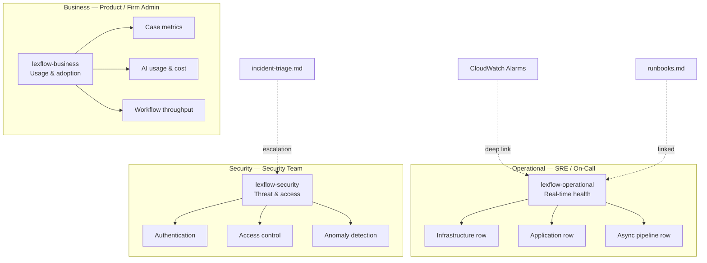
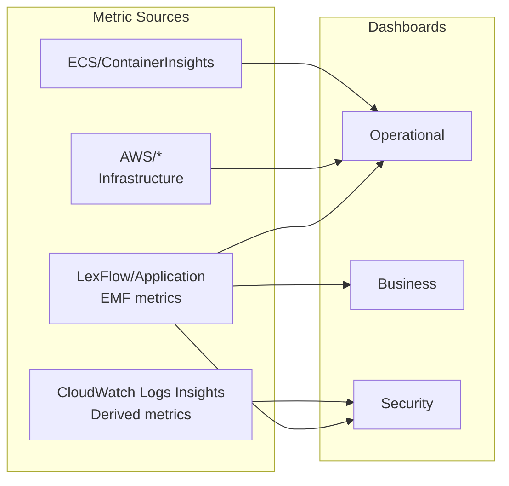
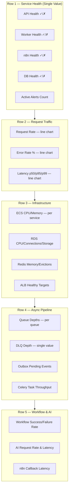
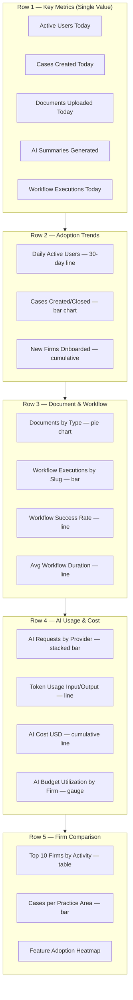
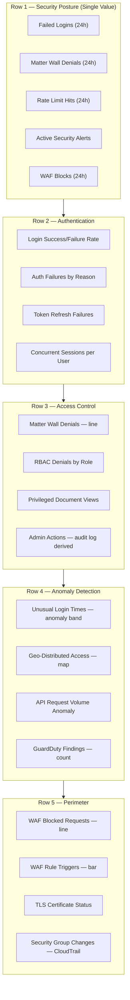
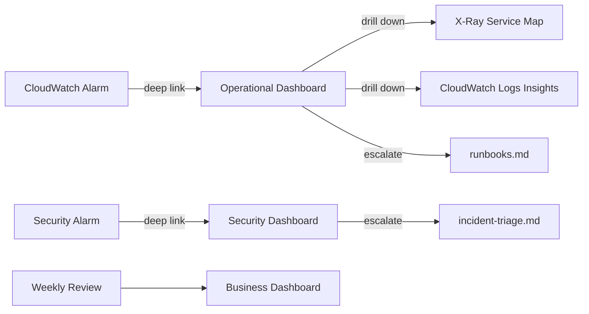

# Dashboards

**LexFlow AI** — Operational, Business & Security Dashboards  
**Version:** 1.0  
**Status:** Draft — Pre-Implementation  
**Last Updated:** 2026-07-06

---

## Purpose

Define the **CloudWatch dashboard specifications** for LexFlow AI. Three dashboard tiers — operational, business, and security — provide role-specific visibility into platform health, firm usage patterns, and security posture. Every dashboard widget maps to metrics defined in [metrics-alerting.md](./metrics-alerting.md) and is linked from corresponding alarms and runbooks.

Dashboards are provisioned via the Terraform `monitoring` module. See [../09-deployment/](../09-deployment/) and [../deployment-architecture.md](../deployment-architecture.md).

---

## Scope

| In Scope | Out of Scope |
|----------|--------------|
| Dashboard layout, widgets, and metric queries | CloudWatch dashboard JSON export files |
| Role-based access and audience mapping | Custom Grafana or third-party BI |
| Widget refresh intervals and time ranges | Terraform HCL for dashboard resources |
| Cross-dashboard navigation links | Firm-facing analytics portal |

---

## Responsibilities

| Role | Dashboard Ownership |
|------|-------------------|
| **SRE / DevOps** | Operational dashboard — infrastructure and application health |
| **Product / Legal Ops** | Business dashboard — usage, adoption, workflow metrics |
| **Security Team** | Security dashboard — auth failures, matter walls, access anomalies |
| **Engineering Manager** | Reviews all dashboards in weekly ops meeting |
| **On-Call SRE** | Uses operational dashboard as first triage screen |

---

## Architecture

### Dashboard Hierarchy

### Data Sources per Dashboard

---

## Dashboard Catalog

| Dashboard | CloudWatch Name | Audience | Refresh | Default Range |
|-----------|----------------|----------|---------|---------------|
| Operational | `lexflow-operational` | SRE, On-Call, Backend Engineers | 1 min | 3 hours |
| Business | `lexflow-business` | Product, Legal Ops, Firm Admins | 5 min | 7 days |
| Security | `lexflow-security` | Security Team, Compliance | 1 min | 24 hours |
| Deployment | `lexflow-deployment` | DevOps, Release Manager | 1 min | 1 hour (during deploys) |

---

## Operational Dashboard

**Purpose:** Real-time platform health for on-call engineers. First screen during alert triage.

**URL:** `https://console.aws.amazon.com/cloudwatch/home?dashboard=lexflow-operational`

### Layout

### Widget Specifications

#### Row 1 — Service Health

| Widget | Type | Metric / Query | Alarm Link |
|--------|------|----------------|------------|
| API Health | Single value (green/red) | Custom: `http_requests_total{service=api}` rate > 0 in last 2 min | `api-health-check-failing` |
| Worker Health | Single value | Custom: `celery_task` consume rate > 0 in last 5 min | `ecs-zero-running-tasks` |
| n8n Health | Single value | Custom: n8n health endpoint probe | — |
| DB Health | Single value | `AWS/RDS DatabaseConnections` > 0 | `database-connection-failure` |
| Active Alerts | Single value | CloudWatch alarm count in ALARM state | All P1/P2 |

#### Row 2 — Request Traffic

| Widget | Type | Metric | Period |
|--------|------|--------|--------|
| Request Rate | Line chart | `SUM(http_requests_total)` by `service` | 1 min |
| Error Rate % | Line chart | `SUM(http_requests_total{status=5xx}) / SUM(http_requests_total) * 100` | 1 min |
| Latency Percentiles | Line chart | `http_request_duration_seconds` p50, p95, p99 by `service` | 1 min |

**Annotations:** Overlay P1/P2 alarm periods as vertical shaded regions.

#### Row 3 — Infrastructure

| Widget | Type | Metric | Threshold Line |
|--------|------|--------|----------------|
| ECS CPU | Stacked area | `ECS/ContainerInsights CpuUtilized` per service | 80% |
| ECS Memory | Stacked area | `ECS/ContainerInsights MemoryUtilized` per service | 85% |
| RDS CPU | Line | `AWS/RDS CPUUtilization` | 80% |
| RDS Connections | Line | `AWS/RDS DatabaseConnections` | 80% of max |
| RDS Free Storage | Gauge | `AWS/RDS FreeStorageSpace` / allocated | 20% |
| Redis Memory | Gauge | `AWS/ElastiCache DatabaseMemoryUsagePercentage` | 80% |
| Redis Evictions | Line | `AWS/ElastiCache Evictions` | 100/min |
| ALB Healthy Targets | Single value | `AWS/ApplicationELB HealthyHostCount` | min = desired |

#### Row 4 — Async Pipeline

| Widget | Type | Metric | Alarm Link |
|--------|------|--------|------------|
| Queue Depths | Line chart | `queue_depth` by `queue_name` | `mq-queue-depth-high` |
| DLQ Depth | Single value (red if > 0) | `SUM(dlq_depth)` | `dlq-messages-present` |
| Outbox Pending | Single value | `outbox_pending_events` | `outbox-lag` |
| Outbox Lag | Line | `outbox_publish_lag_seconds` | `outbox-lag` |
| Celery Throughput | Line | `SUM(queue_messages_consumed_total)` rate | — |
| Celery Failures | Line | `SUM(celery_task_failures_total)` rate | — |

#### Row 5 — Workflow & AI

| Widget | Type | Metric | Alarm Link |
|--------|------|--------|------------|
| Workflow Success Rate | Line | `workflow_executions_total{status=completed}` / total | `workflow-failure-rate` |
| Workflow Duration p95 | Line | `workflow_execution_duration_seconds` p95 | — |
| AI Request Rate | Line | `SUM(ai_requests_total)` by `provider` | — |
| AI Latency p95 | Line | `ai_request_duration_seconds` p95 | `ai-latency-high` |
| AI Token Usage | Stacked bar | `SUM(ai_tokens_total)` by `direction` | `ai-budget-threshold` |
| n8n Callback Latency | Line | `n8n_callback_latency_seconds` p95 | — |

---

## Business Dashboard

**Purpose:** Firm usage patterns, adoption metrics, and AI cost tracking for product and legal operations teams.

**URL:** `https://console.aws.amazon.com/cloudwatch/home?dashboard=lexflow-business`

### Layout

### Widget Specifications

#### Row 1 — Daily Key Metrics

| Widget | Type | Metric | Period |
|--------|------|--------|--------|
| Active Users Today | Single value | `MAX(active_users)` | 24 hours |
| Cases Created Today | Single value | `SUM(cases_created_total)` | 24 hours |
| Documents Uploaded Today | Single value | `SUM(documents_uploaded_total)` | 24 hours |
| AI Summaries Generated | Single value | `SUM(ai_requests_total{summary_type=*})` | 24 hours |
| Workflow Executions Today | Single value | `SUM(workflow_executions_total)` | 24 hours |

#### Row 2 — Adoption Trends

| Widget | Type | Metric | Period |
|--------|------|--------|--------|
| Daily Active Users | Line | `MAX(active_users)` per day | 30 days |
| Cases Created vs Closed | Bar (grouped) | `cases_created_total` vs `cases_closed_total` | 30 days |
| Firm Onboarding | Line (cumulative) | `firms_onboarded_total` | 90 days |

#### Row 3 — Document & Workflow

| Widget | Type | Metric | Period |
|--------|------|--------|--------|
| Documents by Type | Pie | `SUM(documents_uploaded_total)` by `document_type` | 7 days |
| Workflow by Slug | Bar | `SUM(workflow_executions_total)` by `workflow_slug` | 7 days |
| Workflow Success Rate | Line | completed / total by day | 30 days |
| Avg Workflow Duration | Line | `workflow_execution_duration_seconds` mean | 30 days |

#### Row 4 — AI Usage & Cost

| Widget | Type | Metric | Period |
|--------|------|--------|--------|
| AI Requests by Provider | Stacked bar | `SUM(ai_requests_total)` by `provider` | 7 days |
| Token Usage | Line (dual axis) | `ai_tokens_total{direction=input}` and `{direction=output}` | 30 days |
| AI Cost USD | Line (cumulative) | `SUM(ai_cost_usd_total)` | 30 days |
| AI Budget by Firm | Gauge (per firm) | `ai_budget_utilization_ratio` by `firm_id` | Current month |

#### Row 5 — Firm Comparison

| Widget | Type | Query | Period |
|--------|------|-------|--------|
| Top 10 Firms | Table | Top 10 by `SUM(cases_created_total + documents_uploaded_total + workflow_executions_total)` | 30 days |
| Cases by Practice Area | Bar | `SUM(cases_created_total)` by `practice_area` | 30 days |
| Feature Adoption | Heatmap | Matrix: firms × features (cases, docs, AI, workflows) | 30 days |

### Firm-Scoped Dashboard Variables

Business dashboard supports **dashboard variables** for firm-scoped views:

| Variable | Type | Values | Effect |
|----------|------|--------|--------|
| `firmId` | Dropdown | All active firm IDs | Filters all widgets to selected firm |
| `period` | Dropdown | 7d, 30d, 90d | Changes time range for all widgets |

---

## Security Dashboard

**Purpose:** Authentication health, access control violations, and anomaly detection for the security team.

**URL:** `https://console.aws.amazon.com/cloudwatch/home?dashboard=lexflow-security`

Cross-reference: [../08-security/incident-response.md](../08-security/incident-response.md) and [../14-playbooks/incident-triage.md](../14-playbooks/incident-triage.md).

### Layout

### Widget Specifications

#### Row 1 — Security Posture

| Widget | Type | Metric / Source | Alert Link |
|--------|------|---------------|------------|
| Failed Logins (24h) | Single value | `SUM(auth_failures_total)` | `auth-failure-spike` |
| Matter Wall Denials (24h) | Single value | `SUM(matter_wall_denials_total)` | `matter-wall-anomaly` |
| Rate Limit Hits (24h) | Single value | `SUM(rate_limit_hits_total)` | — |
| Active Security Alerts | Single value | Alarms in `lexflow-alerts-security` topic | — |
| WAF Blocks (24h) | Single value | `AWS/WAFV2 BlockedRequests` | `waf-block-spike` |

#### Row 2 — Authentication

| Widget | Type | Metric | Period |
|--------|------|--------|--------|
| Login Success/Failure | Stacked area | `auth_success_total` vs `auth_failures_total` | 24 hours |
| Auth Failures by Reason | Bar | `SUM(auth_failures_total)` by `reason` | 24 hours |
| Token Refresh Failures | Line | `auth_token_refresh_failures_total` | 7 days |
| Concurrent Sessions | Line | `active_sessions` p95 by `user_id` | 24 hours |

#### Row 3 — Access Control

| Widget | Type | Metric / Source | Period |
|--------|------|---------------|--------|
| Matter Wall Denials | Line | `SUM(matter_wall_denials_total)` by `firm_id` | 7 days |
| RBAC Denials | Bar | `SUM(rbac_denials_total)` by `required_role` | 7 days |
| Privileged Doc Views | Line | CloudWatch Logs Insights: `audit.action = 'document.viewed'` filtered by privilege level | 7 days |
| Admin Actions | Table | CloudWatch Logs Insights: `audit.actor_type = 'user'` AND admin actions | 24 hours |

#### Row 4 — Anomaly Detection

| Widget | Type | Source | Period |
|--------|------|--------|--------|
| Unusual Login Times | Anomaly band | CloudWatch Anomaly Detection on `auth_success_total` by hour | 7 days |
| Geo-Distributed Access | Custom | CloudWatch Logs Insights: `http.client_ip` geolocation aggregation | 24 hours |
| API Volume Anomaly | Anomaly band | CloudWatch Anomaly Detection on `http_requests_total` | 7 days |
| GuardDuty Findings | Single value + table | AWS GuardDuty API | 7 days |

#### Row 5 — Perimeter

| Widget | Type | Metric / Source | Period |
|--------|------|---------------|--------|
| WAF Blocked Requests | Line | `AWS/WAFV2 BlockedRequests` | 24 hours |
| WAF Rule Triggers | Bar | `AWS/WAFV2 CountedRequests` by rule | 24 hours |
| TLS Certificate Status | Single value | Days until expiry | Static |
| SG Changes | Log table | CloudTrail: `AuthorizeSecurityGroupIngress` events | 7 days |

### Security Alert Thresholds

| Widget Threshold | Condition | Severity | Action |
|------------------|-----------|----------|--------|
| Failed logins > 50/hour per firm | Brute force indicator | P2 | [runbooks.md § Auth Failure](./runbooks.md#auth-system-failure) |
| Matter wall denials > 10/hour per user | Potential unauthorized access | P2 | [incident-triage.md](../14-playbooks/incident-triage.md) |
| GuardDuty findings > 0 (HIGH/CRITICAL) | AWS threat detection | P1 | [incident-response.md](../08-security/incident-response.md) |
| WAF blocks > 5x baseline | Potential attack | P2 | Security team review |

---

## Deployment Dashboard

**Purpose:** Real-time deploy monitoring. Activated during CI/CD pipeline execution.

**URL:** `https://console.aws.amazon.com/cloudwatch/home?dashboard=lexflow-deployment`

| Widget | Type | Metric | When to Watch |
|--------|------|--------|---------------|
| ECS Deployment Status | Single value per service | Deployment IN_PROGRESS / COMPLETED | During deploy |
| Running vs Desired Tasks | Line | `RunningTaskCount` vs desired | During deploy |
| Error Rate During Deploy | Line | 5xx rate | Canary validation |
| Latency During Deploy | Line | p95 latency | Canary validation |
| Rollback Trigger | Single value | Circuit breaker status | Auto-rollback |

---

## Access Control

| Dashboard | Viewers | Editors |
|-----------|---------|---------|
| Operational | SRE, Backend Engineers, On-Call | SRE Lead |
| Business | Product, Legal Ops, Firm Admins (read-only) | Product Manager |
| Security | Security Team, Compliance Officer | Security Architect |
| Deployment | DevOps, Release Manager | SRE Lead |

IAM policy: `lexflow-cloudwatch-dashboard-read` (viewers), `lexflow-cloudwatch-dashboard-edit` (editors).

---

## Dashboard Navigation

### Cross-Links

| From | To | Link Type |
|------|----|-----------|
| Operational → X-Ray | Service Map | CloudWatch embedded link |
| Operational → Logs | Logs Insights saved query | Pre-built query with `correlationId` filter |
| Security → Incident | incident-triage.md | Alarm description URL |
| All dashboards → Runbooks | runbooks.md | Alarm annotation link |
| Business → AI Budget | metrics-alerting.md § AI Budget | Widget footer link |

---

## Maintenance

| Task | Frequency | Owner |
|------|-----------|-------|
| Review widget relevance | Monthly | SRE Lead |
| Update thresholds on widgets | Per alarm change | SRE |
| Add widgets for new services | Per service launch | Backend + SRE |
| Validate data accuracy | Weekly (ops meeting) | Engineering Manager |
| Archive stale widgets | Quarterly | SRE Lead |

---

## Best Practices

1. **Single pane for on-call** — Operational dashboard must answer "is the system healthy?" in 10 seconds.
2. **Alarm annotations on charts** — Vertical shaded regions when alarms fire; links to runbooks.
3. **Consistent time ranges** — Operational: 3h default; Business: 7d; Security: 24h.
4. **No PII in dashboard widgets** — Firm IDs and user IDs only; never names or content.
5. **Dashboard variables for tenant scope** — Business dashboard supports `firmId` filter.
6. **Test dashboards after deploy** — Verify widgets populate during staging deploy.
7. **Version dashboard changes** — Terraform PR for any layout change.

---

## Tradeoffs

| Decision | Benefit | Cost |
|----------|---------|------|
| CloudWatch dashboards (not Grafana) | Native AWS, IAM, alarm integration | Less customizable than Grafana |
| Three separate dashboards | Role-appropriate signal density | Context switching between dashboards |
| Logs Insights for security widgets | Rich query without metric pre-aggregation | Higher query cost; slower refresh |
| Anomaly detection bands | Adaptive baselines without manual tuning | Cold-start period after launch |
| Firm-scoped variables | Per-firm views for admins | Dashboard variable limits (max 50 firms visible) |

---

## References

| Document | Description |
|----------|-------------|
| [README.md](./README.md) | Observability folder index |
| [metrics-alerting.md](./metrics-alerting.md) | Metric definitions and alarm thresholds |
| [runbooks.md](./runbooks.md) | Alert response linked from dashboard annotations |
| [structured-logging.md](./structured-logging.md) | Logs Insights query patterns |
| [distributed-tracing.md](./distributed-tracing.md) | X-Ray Service Map drill-down |
| [../03-architecture/cross-cutting-concerns.md](../03-architecture/cross-cutting-concerns.md) | Rate limiting, matter wall metrics |
| [../08-security/incident-response.md](../08-security/incident-response.md) | Security incident escalation |
| [../14-playbooks/incident-triage.md](../14-playbooks/incident-triage.md) | Multi-team triage procedures (planned) |
| [../09-deployment/](../09-deployment/) | Terraform monitoring module (planned) |
| [../01-product/success-metrics.md](../01-product/success-metrics.md) | Business KPI definitions |
