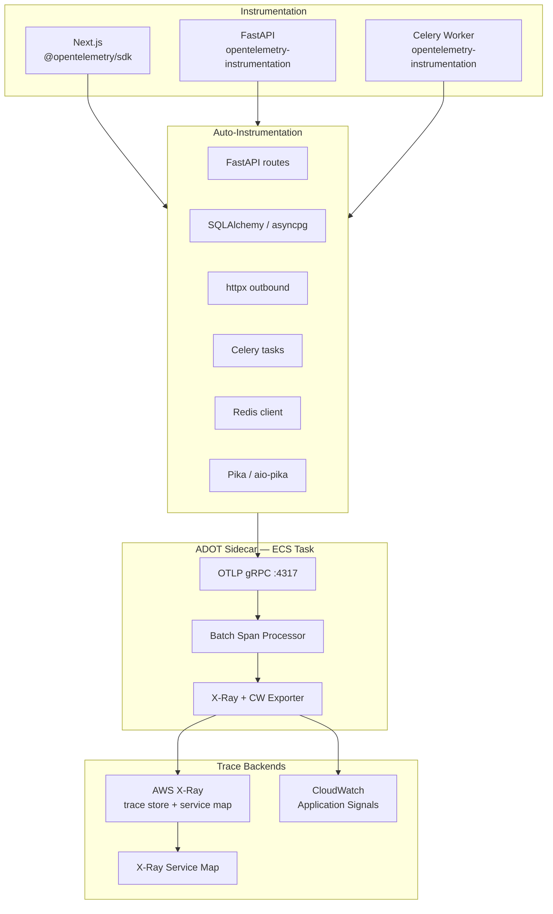
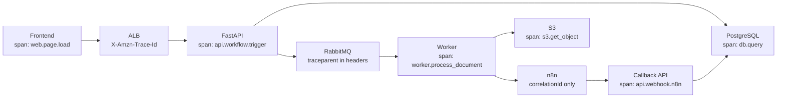
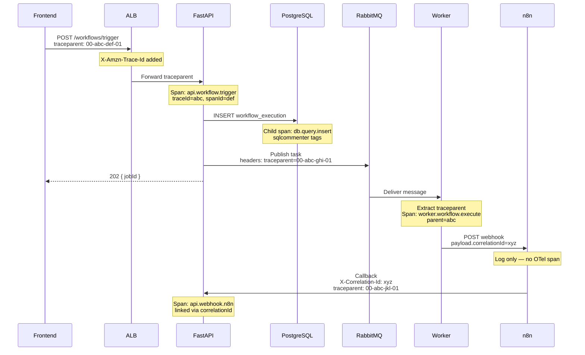
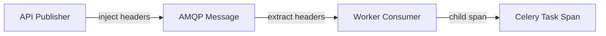
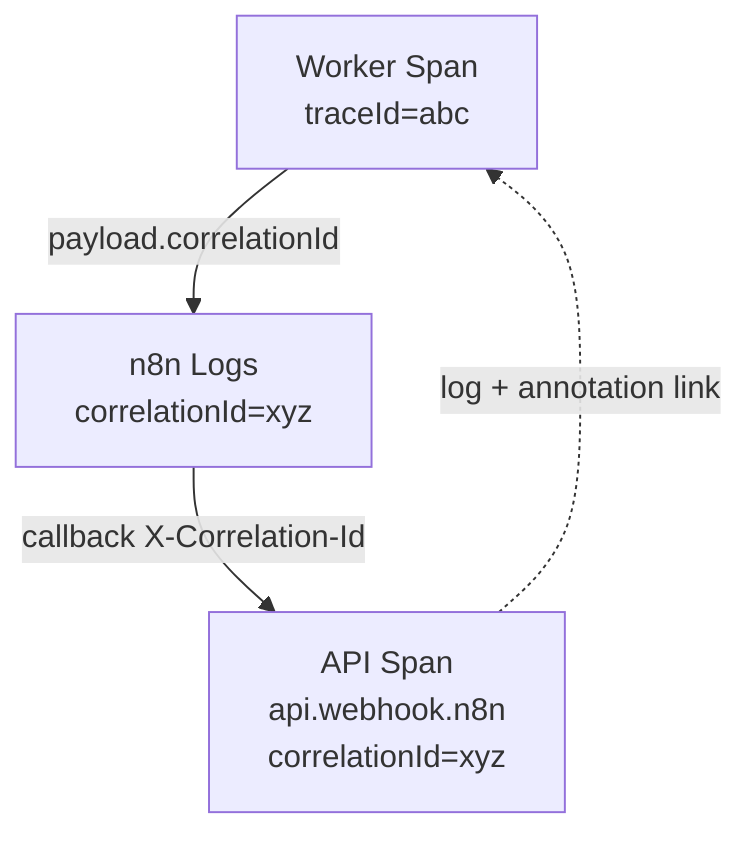
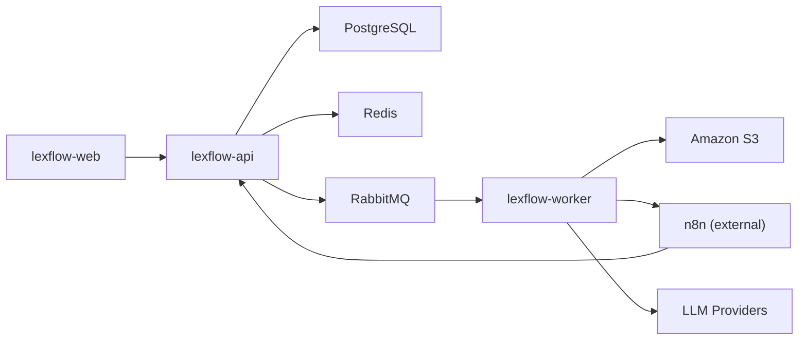
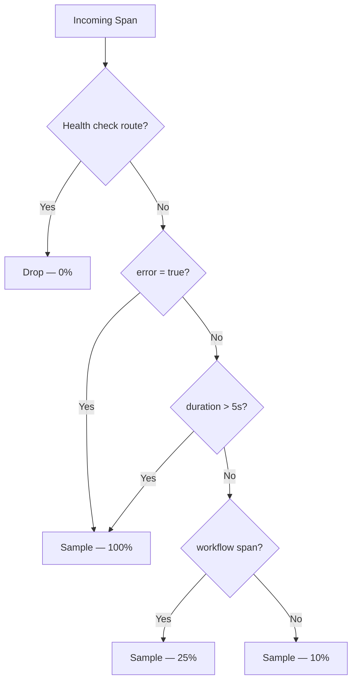

# Distributed Tracing

**LexFlow AI** — OpenTelemetry, AWS X-Ray & Trace Propagation  
**Version:** 1.0  
**Status:** Draft — Pre-Implementation  
**Last Updated:** 2026-07-06

---

## Purpose

Define the **distributed tracing architecture** for LexFlow AI. Traces follow user-initiated operations across the frontend, API, message queues, Celery workers, n8n orchestrator, and callback paths — enabling latency diagnosis, dependency mapping, and error root-cause analysis.

LexFlow uses **OpenTelemetry (OTel)** for instrumentation, **AWS Distro for OpenTelemetry (ADOT)** as the collector sidecar, and **AWS X-Ray** plus **CloudWatch Application Signals** as backends. Trace propagation follows W3C Trace Context (`traceparent`) with LexFlow-specific attributes for tenant and matter context.

Platform patterns: [../03-architecture/cross-cutting-concerns.md](../03-architecture/cross-cutting-concerns.md).

---

## Scope

| In Scope | Out of Scope |
|----------|--------------|
| OTel SDK configuration per container | ADOT sidecar Dockerfile |
| W3C trace context propagation (HTTP, AMQP) | X-Ray Terraform resource definitions |
| Span naming conventions and attributes | Custom trace UI development |
| Sampling strategy (10% prod, 100% errors) | eBPF network tracing (Phase 3) |
| X-Ray and Application Signals integration | Third-party APM (Datadog, New Relic) |
| n8n correlation (log-linked, not full OTel) | |

---

## Responsibilities

| Role | Responsibility |
|------|----------------|
| **Platform Engineer** | Maintain OTel SDK bootstrap, ADOT sidecar config, sampling rules |
| **Backend Engineer** | Add custom spans for domain operations; set span attributes |
| **Frontend Engineer** | Initialize browser OTel tracer; inject `traceparent` on API calls |
| **DevOps / SRE** | Provision X-Ray groups, ServiceLens, Application Signals SLOs |
| **Integration Engineer** | Ensure n8n payloads carry `correlationId` for trace linking |

---

## Architecture

### Tracing Stack



### End-to-End Trace Topology



### Full Request Trace — Sequence



---

## OpenTelemetry Configuration

### Service Names

| Container | `service.name` | `service.namespace` |
|-----------|---------------|---------------------|
| Next.js Frontend | `lexflow-web` | `lexflow` |
| FastAPI API | `lexflow-api` | `lexflow` |
| Celery Worker | `lexflow-worker` | `lexflow` |
| Outbox Publisher | `lexflow-outbox` | `lexflow` |

### SDK Bootstrap (Per Container)

| Setting | Value | Notes |
|---------|-------|-------|
| OTLP endpoint | `http://localhost:4317` | ADOT sidecar on same ECS task |
| Protocol | gRPC | Preferred over HTTP for batch efficiency |
| Resource attributes | `service.name`, `service.version`, `deployment.environment` | Set from env vars |
| Propagators | `TraceContext` (W3C), `Baggage` | AWS X-Ray propagator for ALB compatibility |
| Id generator | AWS X-Ray compatible | 32-char trace ID |

### Auto-Instrumentation Libraries

| Library | Container | Spans Created |
|---------|-----------|---------------|
| `opentelemetry-instrumentation-fastapi` | API | HTTP server spans per route |
| `opentelemetry-instrumentation-sqlalchemy` | API, Worker | DB query spans with statement type |
| `opentelemetry-instrumentation-httpx` | API, Worker | Outbound HTTP spans |
| `opentelemetry-instrumentation-celery` | Worker | Task execution spans |
| `opentelemetry-instrumentation-redis` | API, Worker | Cache operation spans |
| `opentelemetry-instrumentation-aio-pika` | API, Worker | AMQP publish/consume spans |
| `@opentelemetry/instrumentation-http` | Web | Browser fetch spans |

---

## Span Conventions

### Naming Pattern

```
{service}.{domain}.{operation}
```

| Span Name | Container | Trigger |
|-----------|-----------|---------|
| `api.case.create` | API | POST /api/v1/cases |
| `api.workflow.trigger` | API | POST /api/v1/cases/{id}/workflows/trigger |
| `api.webhook.n8n` | API | POST /api/v1/internal/webhooks/n8n |
| `api.ai.submit` | API | POST /api/v1/ai/summarize |
| `worker.document.process` | Worker | Celery: `process_document` |
| `worker.workflow.execute` | Worker | Celery: `execute_workflow` |
| `worker.ai.inference` | Worker | Celery: `run_ai_inference` |
| `worker.outbox.publish` | Worker | Celery Beat: outbox publisher |
| `web.page.navigation` | Web | Client-side route change |

### Required Span Attributes

| Attribute | Type | Set On | Purpose |
|-----------|------|--------|---------|
| `service.name` | string | All spans | Container identification |
| `correlationId` | string | All spans | Business correlation (links to logs) |
| `firmId` | string | All spans (when known) | Tenant-scoped trace queries |
| `userId` | string | API, Worker spans | User attribution |
| `caseId` | string | When applicable | Matter-level drill-down |
| `workflow.slug` | string | Workflow spans | Automation identification |
| `workflow.executionId` | string | Workflow spans | Execution tracking |
| `http.route` | string | HTTP spans | Route template |
| `http.status_code` | int | HTTP spans | Response status |
| `db.system` | string | DB spans | `postgresql` |
| `db.operation` | string | DB spans | `SELECT`, `INSERT`, etc. |
| `messaging.system` | string | AMQP spans | `rabbitmq` |
| `messaging.destination` | string | AMQP spans | Queue name |
| `error.type` | string | Failed spans | Exception class name |

### Optional Span Attributes

| Attribute | When to Set |
|-----------|-------------|
| `ai.provider` | AI inference spans |
| `ai.model` | AI inference spans |
| `ai.input_tokens` | AI inference spans (count only) |
| `document.id` | Document processing spans |
| `celery.task_name` | Worker task spans |
| `celery.retry_count` | Worker retry spans |

---

## Trace Propagation

### HTTP Propagation

| Header | Standard | Direction | Notes |
|--------|----------|-----------|-------|
| `traceparent` | W3C Trace Context | Client → Server | `00-{traceId}-{spanId}-{flags}` |
| `tracestate` | W3C Trace Context | Client → Server | Vendor-specific state (optional) |
| `X-Correlation-Id` | LexFlow | Bidirectional | Business ID — not a trace ID |
| `X-Amzn-Trace-Id` | AWS X-Ray | ALB adds | `Root=...;Parent=...;Sampled=...` |
| `X-Request-Id` | LexFlow | Server → Client | Per-request ID |

### AMQP Propagation

Trace context is injected into **message headers**, not the JSON payload body.

| Header Key | Value | Set By |
|------------|-------|--------|
| `traceparent` | W3C traceparent string | API on publish |
| `tracestate` | W3C tracestate string | API on publish (optional) |
| `X-Correlation-Id` | UUID v4 | API on publish |

Worker extracts context on consume and creates a child span linked to the parent trace.



### n8n Propagation (Correlation-Linked)

n8n does **not** run the OTel SDK. Trace continuity is maintained via:

1. **Worker** sets `correlationId` in the n8n webhook payload.
2. **n8n** logs `correlationId` at each step (see [structured-logging.md](./structured-logging.md)).
3. **n8n callback** includes `X-Correlation-Id` header.
4. **API callback handler** creates a new span with `correlationId` attribute, linked to the original trace via X-Ray trace annotations or log correlation.



### Frontend Propagation

The Next.js app initializes a browser OTel tracer that:

1. Creates a span for each page navigation and API fetch.
2. Injects `traceparent` into fetch requests to the FastAPI backend.
3. Forwards `X-Correlation-Id` from API responses to subsequent requests in the same user flow.

---

## AWS X-Ray Integration

### ADOT Sidecar Configuration

Each ECS task (API, Worker, Web) runs an ADOT collector sidecar:

| Setting | Value |
|---------|-------|
| Receiver | OTLP gRPC on `0.0.0.0:4317` |
| Processor | Batch (timeout: 5s, batch size: 256) |
| Exporter | `awsxray` + `awsemf` (CloudWatch EMF for Application Signals) |
| Sampling | Parent-based; respects upstream `traceparent` sampled flag |

### X-Ray Trace Groups

| Group Name | Filter | Purpose |
|------------|--------|---------|
| `lexflow-api-errors` | `service("lexflow-api") { error = true }` | API error traces |
| `lexflow-worker-slow` | `service("lexflow-worker") { duration > 30s }` | Slow worker tasks |
| `lexflow-workflow` | `annotation.workflow_slug EXISTS` | All workflow traces |
| `lexflow-ai` | `annotation.ai_provider EXISTS` | AI inference traces |

### X-Ray Annotations vs Metadata

| Type | Indexable | Use For |
|------|-----------|---------|
| **Annotations** | Yes — searchable in X-Ray console | `correlationId`, `firmId`, `caseId`, `workflow_slug` |
| **Metadata** | No — display only | `http.user_agent`, `celery.task_name` |

### Service Map

X-Ray Service Map auto-generates from trace data:



---

## Sampling Strategy

### Production

| Rule | Rate | Rationale |
|------|------|-----------|
| Default (head-based) | 10% | Cost and overhead control |
| Error spans (`error = true`) | 100% | Never miss failure diagnosis |
| Latency > 5 seconds | 100% | Capture slow operations |
| `workflow.trigger` spans | 25% | Higher fidelity for automation debugging |
| Health check routes | 0% | Exclude `/health`, `/ready` |

### Non-Production

| Environment | Sampling Rate |
|-------------|---------------|
| Local | 100% |
| Dev | 100% |
| Staging | 100% |

### Sampling Decision Flow



---

## CloudWatch Application Signals

Application Signals provides SLO tracking atop X-Ray traces.

### Service Level Objectives (SLOs)

| SLO | Target | Measurement Window | Burn Rate Alert |
|-----|--------|-------------------|-----------------|
| API availability | 99.9% | 30 days | P1 if burn rate > 10x |
| API latency (p95) | < 300ms | 7 days | P3 if p95 > 500ms for 10 min |
| Workflow completion | 99% | 7 days | P2 if success < 95% for 15 min |
| AI inference latency (p95) | < 30s | 7 days | P3 if p95 > 60s for 10 min |

SLO alerts defined in [metrics-alerting.md](./metrics-alerting.md).

---

## Database Query Tracing

PostgreSQL queries are traced via SQLAlchemy instrumentation with **sqlcommenter** tags injected into SQL statements:

| Tag | Example | Purpose |
|-----|---------|---------|
| `action` | `api.workflow.trigger` | Span name reference |
| `correlationId` | `550e8400-...` | Log-to-DB correlation |
| `db.driver` | `asyncpg` | Driver identification |

Query text is **never** included in span attributes (may contain PII in WHERE clauses). Only `db.operation` and `db.sql.table` are recorded.

---

## Trace Investigation Workflow

### Step 1 — Identify Trace

| Entry Point | Method |
|-------------|--------|
| Support ticket with `correlationId` | CloudWatch Logs → find `traceId` → X-Ray search |
| PagerDuty alert | Dashboard link → X-Ray error group |
| Slow request report | Application Signals latency SLO → drill into trace |

### Step 2 — Analyze Service Map

Check for red nodes (errors) or yellow nodes (high latency) in the X-Ray Service Map.

### Step 3 — Drill Into Spans

Examine span waterfall: identify the slowest child span, check `error.type` attributes, correlate with logs via `correlationId`.

### Step 4 — Escalate

| Finding | Action |
|---------|--------|
| Infrastructure failure | [runbooks.md](./runbooks.md) |
| Security anomaly | [../14-playbooks/incident-triage.md](../14-playbooks/incident-triage.md) |
| Application bug | Create Jira ticket with trace ID and correlationId |

---

## Best Practices

1. **Propagate via headers, not payload** — AMQP trace context in message headers; `correlationId` in both headers and payload.
2. **Set annotations for searchability** — `correlationId`, `firmId`, `caseId` as X-Ray annotations.
3. **Custom spans for domain operations** — Auto-instrumentation covers HTTP/DB; add manual spans for business logic.
4. **Never include PII in span attributes** — IDs only; no names, content, or prompts.
5. **End spans in finally blocks** — Ensure spans close even on exception (OTel context manager).
6. **Exclude health checks from sampling** — Prevents trace noise and cost inflation.
7. **Test propagation in staging** — End-to-end trace verification before production deploy.

---

## Tradeoffs

| Decision | Benefit | Cost |
|----------|---------|------|
| ADOT sidecar per task | Standardized collection; no app-level exporter config | +256 MB memory per task |
| 10% head sampling | 90% cost reduction vs 100% | May miss rare race conditions — mitigated by error/latency rules |
| n8n log-linked (not OTel) | No OTel SDK in n8n; simpler ops | Gap in n8n step-level waterfall — mitigated by step logs |
| X-Ray over third-party APM | Native AWS integration, IAM, no extra vendor | Less feature-rich than Datadog for custom dashboards |
| sqlcommenter without query text | DB-level correlation without PII risk | Cannot see exact SQL in trace UI |

---

## References

| Document | Description |
|----------|-------------|
| [README.md](./README.md) | Observability folder index |
| [structured-logging.md](./structured-logging.md) | `correlationId`, `traceId` in log schema |
| [metrics-alerting.md](./metrics-alerting.md) | SLO burn rate alerts |
| [../03-architecture/cross-cutting-concerns.md](../03-architecture/cross-cutting-concerns.md) | Trace propagation topology |
| [../03-architecture/nfr-requirements.md](../03-architecture/nfr-requirements.md) | Latency budgets (p95 < 300ms) |
| [../03-architecture/data-flow.md](../03-architecture/data-flow.md) | Sync/async paths traced |
| [../06-workflows/n8n-integration.md](../06-workflows/n8n-integration.md) | n8n webhook and callback contracts |
| [../09-deployment/](../09-deployment/) | ADOT sidecar ECS task definition (planned) |
| [../deployment-architecture.md](../deployment-architecture.md) | ECS Fargate service layout |
